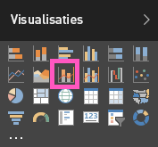

# Combinatiegrafieken in Power BI (zelfstudie)
Een combinatiegrafiek in Power BI is een visualisatie waarin een lijndiagram wordt gecombineerd met een kolomdiagram. Als u deze twee diagrammen combineert, kunt u de gegevens sneller vergelijken.

Combinatiegrafieken kunnen één of twee Y-assen bevatten.

## Wanneer gebruikt u een combinatiegrafiek?
In de volgende gevallen komen combinatiegrafieken goed van pas:

* Als u hebt een lijndiagram en een kolomdiagram met dezelfde X-as hebt.
* Als u meerdere metingen met verschillende waardebereiken wilt vergelijken.
* Als u het verband tussen twee metingen wilt illustreren in één visualisatie.
* Als u wilt controleren of één meting voldoet aan het doel dat is gedefinieerd door een andere meting.
* Als u ruimte op het canvas wilt besparen.

### Vereisten
Combinatiegrafieken zijn beschikbaar in de Power BI-service en Power BI Desktop. Deze zelfstudie maakt gebruik van Power BI-service om een combinatiegrafiek te maken. Als u deze wilt volgen, opent u Power BI-service en maakt u verbinding met de [onderstaande instructies](#create) voor het voorbeeld van een retailanalyse).

## Een eenvoudige combinatiegrafiek met één as maken
Kijk hoe Will een combinatiegrafiek maakt op basis van het voorbeeld van verkoop en marketing.

<iframe width="560" height="315" src="https://www.youtube.com/embed/lnv66cTZ5ho?list=PL1N57mwBHtN0JFoKSR0n-tBkUJHeMP2cP" frameborder="0" allowfullscreen></iframe>

Als u uw eigen combinatiegrafiek wilt maken, meldt u zich aan bij Power BI-service en selecteert u **Gegevens ophalen \> Voorbeelden \> Voorbeeld van een retailanalyse > Verbinding maken > Naar dashboard gaan**. 

1. Selecteer op het dashboard Voorbeeld van een retailanalyse de tegel **Totaal aantal winkels** om het rapport Voorbeeld van een retailanalyse te openen.
2. Selecteer **Rapport bewerken** om het rapport in de bewerkingsweergave te openen.
3. [Voeg een nieuwe rapportpagina toe](power-bi-report-add-page.md).
4. Maak een kolomdiagram waarin de omzet voor dit jaar en de brutomarge marge per maand wordt weergegeven.
   
    a.  Selecteer in het deelvenster Velden achtereenvolgens **Verkoop** \> **Omzet dit jaar** > **Waarde**.
   
    b.  Sleep **Verkoop** \> **Brutomarge dit jaar** naar de bron **Waarde**.
   
    c.  Selecteer **Tijd** \> **FiscalMonth** om deze waarde toe te voegen aan de bron **As**. 
   
    
5. Selecteer de weglatingstekens (...) in de rechterbovenhoek van de visualisatie en selecteer **Sorteren op FiscalMonth**. U moet deze misschien twee keer selecteren om deze oplopend of aflopend te sorteren.

6. Converteer de kolomdiagram naar een combinatiegrafiek. Selecteer de kolomdiagram en selecteer vervolgens in het deelvenster **Visualisaties** de optie **Lijndiagram en gegroepeerd kolomdiagram**.
   
    
7. Ga naar het deelvenster **Velden** en sleep **Verkoop** \> **Omzet van afgelopen jaar** naar de bucket **Regelwaarden**.
   
   
   
   Uw combinatiegrafiek moet er ongeveer als volgt uitzien:
   
   

## Een combinatiegrafiek met twee assen maken
In deze taak vergelijken we de brutomarge en de omzet.

1. Maak een nieuw lijndiagram waarin de **procentuele brutomarge van het vorige jaar** per **maand wordt bijgehouden**.  In januari was de brutomarge 35%, in april nemen we een piek (45%) waar, in juli daalde het brutomargepercentage en in augustus was er opnieuw een daling. Krijgen we een soortgelijk patroon voor afgelopen jaar en dit jaar te zien?
   
   
2. Voeg **Omzet van dit jaar > Waarde** en **Omzet van afgelopen jaar** aan het lijndiagram toe. De schaal van de **procentuele brutomarge vorig jaar** is veel kleiner is dan de schaal van **Verkoop**, waardoor het lastig is om de waarden te vergelijken.      
   
   
3. Converteer het lijndiagram naar een Lijndiagram en gestapeld kolomdiagram, zodat de visualisatie eenvoudiger te lezen en te interpreteren is.
   
   
4. Sleep **Brutomarge% vorig jaar** van **Kolomwaarden** naar **Lijnwaarden**. In Power BI worden twee assen gemaakt, zodat de gegevenssets verschillend kunnen worden geschaald. Aan de linkerkant verkopen in dollars en aan de rechterkant in percentages.
   
       

## Titels toevoegen aan de assen
1. Selecteer het pictogram met de verfroller  om het opmaakvenster te openen.
2. Selecteer de pijl-omlaag om de **Y-as** uit te breiden.
3. Stel voor de **Y-as (kolom)** de **Positie** in op **Links**, stel **Titel** in op **Aan**, stel **Stijl** in op **Alleen titel weergeven** en stel voor **Weergeven** de optie **Miljoenen** in.
   
   
4. Schuif bij **Y-as (kolom)** omlaag en zorg ervoor dat **Secundaire weergeven** is ingesteld op **Aan**. Hiermee geeft u de opties weer om het regeldiagramgedeelte van de combinatiegrafiek op te maken.
   
   
5. Voor **Y-as (regel)** laat u **Positie** ingesteld staan op **Rechts**, stelt u **Titel** in op **Aan** en stelt u voor **Stijl** de optie **Alleen titel weergeven** in.
   
   Uw combinatiegrafiek bevat nu twee assen, beide met titels.
   
   

6. Wijzig desgewenst het lettertype, grootte en kleur en stel de overige opmaakopties zo in dat de weergave en leesbaarheid van de grafiek wordt verbeterd.

U kunt nu het volgende doen:

* [De combinatiegrafiek toevoegen als dashboardtegel](service-dashboard-tiles.md).
* [Sla het rapport op](service-report-save.md).

## Kruislings markeren en kruislings filteren

Wanneer u een kolom of regel in een combinatiegrafiek markeert, worden de andere visualisaties op de rapportpagina kruislings gemarkeerd en gefilterd, en omgekeerd. U kunt deze standaardwerking wijzigen met behulp van het besturingselement [Visuele interactie](visual-interactions.md).

## Volgende stappen

[Overzicht van visualisaties in Power BI-rapporten](power-bi-report-visualizations.md)

[Visualization types in Power BI](power-bi-visualization-types-for-reports-and-q-and-a.md) (Typen visualisaties in Power BI)

[Power BI - basisconcepten](service-basic-concepts.md)

Hebt u nog vragen? [Misschien dat de Power BI-community het antwoord weet](http://community.powerbi.com/)

