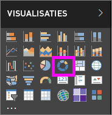
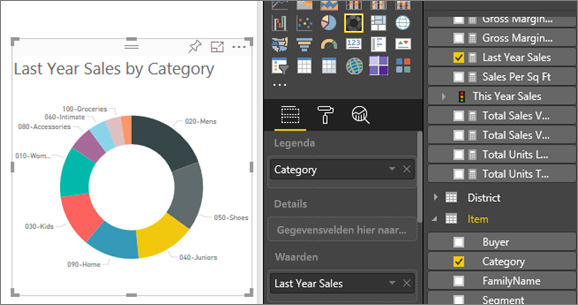

# Ringdiagrammen in Power BI (zelfstudie)
Een ringdiagram lijkt sterk op een cirkeldiagram omdat ook hierin de relatie van de delen ten opzichte van het geheel wordt getoond. Het enige verschil is dat het midden leeg is, waardoor er ruimte is voor een label of pictogram.

## Een ringdiagram maken
In deze instructies wordt het Voorbeeld van een retailanalyse gebruikt om een ringdiagram te maken waarin de verkoop van dit jaar op categorie wordt weergegeven. Om mee te lezen kunt u het [voorbeeld downloaden](sample-datasets.md) voor de Power BI-service (app.powerbi.com) of voor Power BI Desktop.

1. Start op een [lege rapportpagina ](power-bi-report-add-page.md) en selecteer het veld **Verkoopfase** \> **Verkoopfase**. Als u de Power BI-service gebruikt, moet u het rapport openen in de [bewerkweergave](service-interact-with-a-report-in-editing-view.md).

2. Selecteer **Verkoop** \> **Omzet van afgelopen jaar** in het deelvenster Velden.  
   
3. Selecteer in het deelvenster Visualisaties het pictogram voor het ringdiagram  om uw staafdiagram te converteren naar een ringdiagram. Als **Omzet van afgelopen jaar** niet voorkomt in het gebied **Waarden**, sleept u het erheen.
     
   

4. Selecteer **Artikel** \> **Categorie** om deze toe te voegen aan het gebied **Legenda**. 
     
    

5. U kunt desgewenst [de grootte en de kleur van de tekst van de grafiek aanpassen](power-bi-visualization-customize-title-background-and-legend.md). 

## Aandachtspunten en probleemoplossing
* De som van de waarden in het ringdiagram moet 100% zijn.
* Te veel categorieën zorgen er voor dat het diagram moeilijk te interpreteren is.
* Ringdiagrammen kunnen het best worden gebruikt om een bepaalde sectie met het totaal te vergelijken en niet om de afzonderlijke secties onderling te vergelijken. 

## Volgende stappen
[Rapporten in Power BI](service-reports.md)

[Visualization types in Power BI](power-bi-visualization-types-for-reports-and-q-and-a.md) (Typen visualisaties in Power BI)

[Visualisaties in Power BI-rapporten](power-bi-report-visualizations.md)

[Power BI - basisconcepten](service-basic-concepts.md)

Hebt u nog vragen? [Misschien dat de Power BI-community het antwoord weet](http://community.powerbi.com/)

