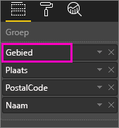
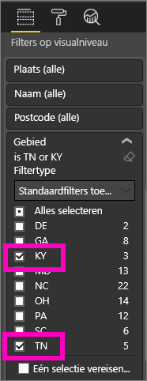
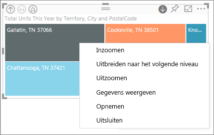
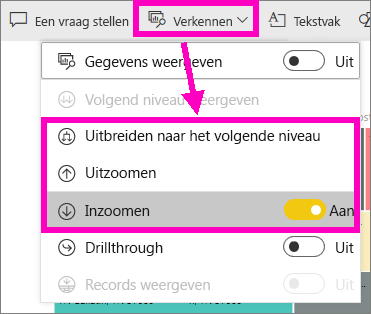
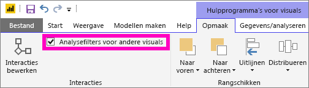
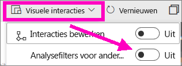
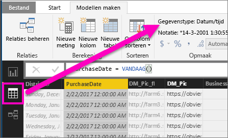

# Zoommodus voor een visualisatie in Power BI

## Voor zoomen is een hiërarchie vereist
Wanneer een visueel element een hiërarchie heeft, kunt u inzoomen om extra details te onthullen. U kunt bijvoorbeeld een visualisatie hebben die kijkt naar het aantal Olympische medailles door een hiërarchie bestaande uit sport, discipline en gebeurtenis. Standaard zou de visualisatie het aantal medailles weergeven per sport (gymnastiek, skiën, watersport, enzovoort). Maar omdat deze een hiërarchie bevat, zou het selecteren van één van de visuele elementen (zoals een balk, lijn of bel) een steeds gedetailleerder beeld weergeven. Selecteer het element **Watersport** om de gegevens voor zwemmen, duiken en waterpolo te bekijken.  Selecteer het element **Duiken** om de details voor duikplank, platform en gesynchroniseerde duikgebeurtenissen te bekijken.

U kunt hiërarchieën toevoegen aan rapporten die u bezit, maar niet aan rapporten die met u worden gedeeld.
Weet u niet zeker welke Power BI-visualisaties een hiërarchie bevatten?  Beweeg met de muisaanwijzer over een visualisatie en als u deze besturingselementen voor inzoomen in de bovenhoeken ziet, heeft uw visualisatie een hiërarchie.

    
   

Data zijn een uniek type hiërarchie. Wanneer u een datumveld aan een visualisatie toevoegt, voegt Power BI automatisch een tijdshiërarchie met jaar, kwartaal, maand en dag. Zie voor meer informatie [Visuele hiërarchieën en inzoomen](guided-learning/visualizations.yml?tutorial-step=18) of bekijk de onderstaande video.

  <iframe width="560" height="315" src="https://www.youtube.com/embed/MNAaHw4PxzE?list=PL1N57mwBHtN0JFoKSR0n-tBkUJHeMP2cP" frameborder="0" allowfullscreen></iframe>

> [!NOTE]
> Bekijk de video [Hiërarchieën maken en toevoegen](https://youtu.be/q8WDUAiTGeU) voor meer informatie over het maken van hiërarchieën met Power BI Desktop
> 

## Vereisten

1. Voor zoomen in Power BI-service of Desktop is een visualisatie met een hiërarchie vereist. 
   
2. Open hiervoor het [Voorbeeld van een retailanalyse](sample-datasets.md) en maak een treemap op basis van **Totaal aantal eenheden dit jaar** (waarden) per **Gebied**, **Plaats**, **Postcode**en **Naam** (Groep).  De treemap heeft een hiërarchie die bestaat uit gebied, plaats, postcode en plaatsnaam. Elk gebied heeft één of meer plaatsen, elke plaats heeft één of meer postcodes, enzovoort. Standaard geeft de visualisatie alleen de gebiedsgegevens weer, omdat *Gebied* als eerste in de lijst voorkomt.
   
   

2. Leren hoe de verschillende zoompictogrammen in combinatie met elkaar werken, kan verwarrend zijn. We gaan daarom een filter op de treemap toepassen zodat alleen twee van de kleinere territoria worden weergegeven: **KY** en **TN**. Selecteer de treemap en vouw onder  **Filters op niveau van visuele elementen** de optie **Territorium** uit. Selecteer vervolgens **KY** en **TN**.

        

   Nu worden alleen deze twee territoria in de treemap weergegeven.

   

## Drie manieren om toegang te krijgen tot de zoomfuncties
U hebt verschillende opties voor toegang tot functies voor inzoomen, uitzoomen en uitvouwen voor visualisaties met hiërarchieën. In dit artikel leest u hoe de eerste optie hieronder kunt gebruiken. Zodra u de basisbeginselen over inzoomen en uitvouwen begrijpt, kunt u met deze drie methoden dezelfde taken uitvoeren. Probeer ze en kies de methode die u het prettigst vindt.

- Beweeg de muisaanwijzer over een visualisatie om de pictogrammen te zien en te gebruiken.  

    

- Klik met de rechtermuisknop op een visualisatie om het menu weer te geven en te gebruiken.
    
    

- Vanaf de Power BI-menubalk selecteert u de knop **Verkennen**.

   

## Paden voor inzoomen
### Inzoomen
U hebt verschillende manieren om op uw visualisatie in te zoomen. Met ***Inzoomen*** gaat u naar het volgende niveau in de hiërarchie, dus als u naar het niveau **Territorium** kijkt, kunt u inzoomen op stadsniveau, vervolgens op postcodeniveau en tenslotte op naamniveau. Elke stap in het pad toont u nieuwe informatie.

### Uitvouwen

Met ***Uitvouwen*** voegt u een extra hiërarchieniveau toe aan de huidige weergave. Dus als u naar het niveau **Territorium** kijkt, kunt u dit uitvouwen en informatie over stad, postcode en naam aan uw treemap toevoegen. Elke stap in het pad toont u dezelfde informatie en voegt één niveau aan nieuwe informatie toe.

U kunt ook kiezen of u wilt inzoomen of uitvouwen op één veld per keer of op alle velden tegelijk. 

## Inzoomen op alle velden tegelijk

1. Begin op het hoogste niveau van de treemap, waarin gegevens voor KY en TN worden weergegeven. Verbreed uw treemap door een van de grepen te selecteren en sleep deze greep naar rechts. 

     .

2. Als u op ***alle velden tegelijk*** wilt inzoomen, selecteert u de dubbele pijl in de linkerbovenhoek van de visualisatie . Uw treemap toont nu stadsgegevens voor Kentucky en Tennessee. 

    
   
5. Zoom nog één keer in op het postcodeniveau van de hiërarchie.

    

3. Als u weer wilt uitzoomen, selecteert u de pijl omhoog in de linkerbovenhoek van de visualisatie .

## Inzoomen op één veld tegelijk
Deze methode maakt gebruik van het inzoompictogram dat in de rechterbovenhoek van de visualisatie zelf verschijnt. 

1. Selecteer het inzoompictogram om dit in te stellen op . Nu hebt u de optie om op ***één veld tegelijk*** in te zoomen. 
   
   

   Als u inzoomen niet inschakelt, zal het selecteren van een visueel element (zoals een balk, bel of blad) niet uitzoomen maar in plaats daarvan de andere grafieken op de rapportagepagina kruislings filteren.

2. Selecteer het *bladknooppunt* voor **TN**. Uw treemap laat nu alle steden in Tennessee zien waarin een winkel is gevestigd. 

    

2. Op dit punt kunt u doorgaan met inzoomen op Tennesee of inzoomen op een specifieke stad in Tennesee, of het niveau uitvouwen (zie **Alle velden tegelijk uitvouwen**, hieronder). We blijven voor dit moment inzoomen op één veld tegelijk.  Selecteer **Knoxville, TN**. Uw treemap geeft nu de postcode voor uw winkel in Knoxville weer. 

   

    U ziet dat de titel wordt gewijzigd tijdens het in- en uitzoomen.  

## Alle velden tegelijk en één veld tegelijk uitvouwen
Het gebruik van een treemap die ons alleen een postcode toont, is niet erg informatief.  Laten we dus één niveau in de hiërarchie omlaag uitvouwen.  

1. Maak de treemap actief en selecteer het pictogram *omlaag uitvouwen* . Uw treemap toont nu twee niveaus van onze hiërarchie: postcode en winkelnaam. 

    

2. Als u alle vier hiërarchieniveaus met gegevens voor Tennesee wilt zien, selecteert u de pijl voor uitzoomen totdat u het tweede niveau van uw treemap bereikt, **Totaal aantal eenheden dit jaar per territorium en stad**. 

    

3. Zorg ervoor dat inzoomen nog steeds is ingeschakeld  en selecteer het pictogram *omlaag uitvouwen* . Uw treemap toont nu extra informatie; in plaats van alleen stad en staat wordt nu ook de postcode getoond. 

    

4. Selecteer het pictogram *omlaag uitvouwen* nog één keer om alle vier hiërarchieniveaus met details voor Tennesee op uw treemap weer te geven. Beweeg de muisaanwijzer over een bladknooppunt voor nog meer informatie.

   

## Analysefilters voor andere visuals
As u in de zoommodus werkt, kunt u bepalen hoe inzoomen en uitvouwen invloed heeft op de andere visualisaties op de pagina. 

Standaard wordt met zoomen niet op andere visuals in een rapport gefilterd. U kunt deze functie echter inschakelen in Power BI Desktop en Power BI-service. 

1. In Desktop selecteert u het tabblad **Indeling** en schakelt u het selectievakje voor **Analysefilters voor andere visuals** in.

    

2. Wanneer u nu wilt inzoomen (of uitzoomen of uitvouwen) in een visual met een hiërarchie, activeert u hiermee filters voor de andere visuals op de pagina. 

    

    

> [!NOTE]
> Als u dit in Power BI-service wilt inschakelen, selecteert u **Interacties met visuals > Analysefilters voor andere visuals** in de bovenste menubalk.
>
> 

## Informatie over de hiërarchie-as en de hiërarchiegroep
De hiërarchie-as en de hiërarchiegroep kunt u zien als mechanismen voor het verhogen en verlagen van de granulatie van de gegevens die u wilt weergeven. Alle gegevens die kunnen worden ingedeeld in categorieën en subcategorieën, worden gezien als gegevens met een hiërarchie. Ook datums en tijden vallen hieronder.

U kunt in Power BI aangeven dat een visualisatie over een hiërarchie moet beschikken. Hiervoor selecteert u een of meer gegevensvelden die u aan de bron **As** of aan de bron **Groep** wilt toevoegen, samen met de gegevens die u als gegevensvelden wilt onderzoeken in de bron **Waarden**. Gegevens zijn hiërarchisch als in de linker- en rechterbovenhoek van uw visualisatie de pictogrammen voor de *inzoommodus* worden weergegeven. 

Er zijn in feite twee typen hiërarchische gegevens:
- Datum- en tijdgegevens: Als u een gegevensveld met gegevenstype Datum/tijd hebt, hebt u al hiërarchische gegevens. Voor elk gegevensveld waarvan de waarden kunnen worden geparseerd in een [datum-/tijd](https://msdn.microsoft.com/library/system.datetime.aspx) structuur, wordt in Power BI automatisch een hiërarchie gemaakt. U hoeft hiervoor alleen een datum-/tijdveld aan de bron **As** of **Groep** toe te voegen.
- Categorische gegevens: Als uw gegevens zijn afgeleid van verzamelingen die subverzamelingen bevatten, of op een andere manier rijen met gegevens bevatten die gemeenschappelijke waarden delen, hebt u hiërarchische gegevens.

In Power BI kunt u de gegevens uitvouwen op basis van een of alle subsets. U kunt inzoomen op uw gegevens om op elk niveau één subset weer te geven, of om op elk niveau alle subsets tegelijkertijd weer te geven. U kunt bijvoorbeeld inzoomen op een bepaald jaar of alle resultaten voor elk jaar weergeven wanneer u inzoomt op de hiërarchie. Op dezelfde manier kunt u ook uitzoomen.

In de volgende secties wordt beschreven hoe u kunt inzoomen vanuit de weergave op het hoogste niveau, de weergave op het middelste niveau en de weergave op het laagste niveau.

### Hiërarchische gegevens en tijdsgegevens
Voor dit voorbeeld volgen we het [voorbeeld van een retailanayse](sample-datasets.md) en maakt u een visualisatie van een gestapeld kolomdiagram waarmee wordt gekeken naar **Maand** (as) op basis van **Totaalomzet** (waarden).  

Hoewel **Maand** het gegevensveld voor de as is, wordt ook de categorie **Jaar** in de bron **As** gemaakt. Dit komt doordat Power BI de volledige structuur datum-/tijdstructuur biedt voor alle waarden die worden gelezen. Boven in de hiërarchie worden gegevens voor het jaar weergegeven.

Klik in de inzoommodus op de balk in het diagram om één niveau omlaag te gaan in de hiërarchie. U ziet drie balken voor de gegevens van de beschikbare kwartalen. Kies in de pictogrammen in de linkerbovenhoek **Alles één niveau in de hiërarchie omlaag uitvouwen**. Voer deze actie nogmaals uit om naar het laagste niveau van de hiërarchie te gaan, waarin de resultaten voor elke maand worden weergegeven.

Naast de visualisatie ziet u de hiërarchie in de gegevens die voor elk rapport worden weergegeven. In de volgende tabel ziet u de resultaten van **Gegevens weergeven** in een rapport waarin u inzoomt vanuit één maand of vanuit alle maanden. 

U ziet dat de gegevens voor de kwartaal- en jaarrapporten identiek zijn. Wanneer u inzoomt op het detailniveau dat voor **Waarden** is opgegeven, ziet u hoe het rapport voor één maand minder en specifiekere gegevens bevat en het rapport voor alle maanden meer gegevens bevat.

|Modus voor uitgevouwen gegevens|Jaar|Kwartaal|Maand|Dag|
| ---|:---:|:---:|:---:|---|
|Enkel|||||
|Alles|||||

### Hiërarchische categoriegegevens
Gegevens die zijn gemodelleerd op basis van verzamelingen en subverzamelingen, noemen we hiërarchische gegevens. Een goed voorbeeld hiervan zijn locatiegegevens. Stel dat u een tabel hebt in een gegevensbron met de kolommen Land, Provincie, Plaats en Postcode. Gegevens die hetzelfde land, dezelfde provincie en dezelfde plaats delen, zijn hiërarchische gegevens.

Voor dit voorbeeld volgen we het [voorbeeld van een retailanalyse](sample-datasets.md). Maak een visualisatie van een gestapeld kolomdiagram waarin wordt gekeken naar **Totale eenheden dit jaar** (waarden) op basis van **Gebied**, **Plaats**, **Postcode** en **Naam** (groep).  

Kies in de linkerbovenhoek van de inzoommodus drie keer het pictogram **Alles één niveau in de hiërarchie omlaag uitvouwen**.
U moet zich op het laagste niveau van de hiërarchie bevinden, waarin de resultaten voor Gebied, Plaats en Postcode worden weergegeven.

Naast de visualisatie ziet u de hiërarchie in de gegevens die voor elk rapport worden weergegeven. In de volgende tabel ziet u de resultaten van **Gegevens weergeven** in een rapport waarin u inzoomt voor één gebied of voor alle gebieden. Tijdens het inzoomen ziet u hoe het rapport voor één gebied minder en specifiekere gegevens bevat en het rapport voor alle gebieden meer gegevens bevat.

| Modus voor uitgevouwen gegevens|Gebied|Plaats|Postcode|Naam|
| ---|:---:|:---:|:---:|---|
|Enkel|||||
|Alles|||||

## Overwegingen en beperkingen
* Als door het toevoegen van een datumveld aan een visualisatie geen hiërarchie wordt gecreëerd, kan het zijn dat het veld Datum niet daadwerkelijk als datum is opgeslagen. Als het uw eigen gegevensset is, opent u het in de weergave *Gegevens* in Power BI Desktop, selecteert u de kolom met de datum en wijzigt u het **gegevenstype** in **Datum** of **Datum/tijd** op het tabblad Model maken. Als het rapport met u is gedeeld, neem dan contact op met de eigenaar om de wijziging aan te vragen.  
  
  

## Volgende stappen
[Visualisaties in Power BI-rapporten](power-bi-report-visualizations.md)

[Power BI-rapporten](service-reports.md)

[Power BI - basisconcepten](service-basic-concepts.md)

Hebt u nog vragen? [Misschien dat de Power BI-community het antwoord weet](http://community.powerbi.com/)

