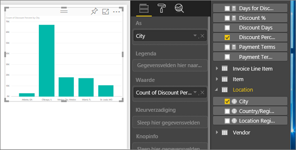
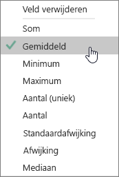
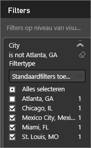
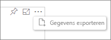
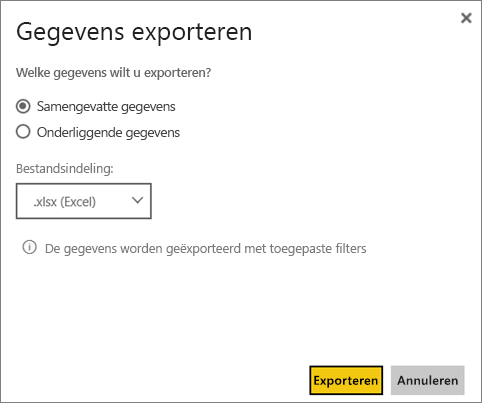

# Gegevens uit visualisaties exporteren
Als u de gegevens wilt zien die gebruikt worden om een visualisatie te maken, kunt u die [gegevens weergeven in Power BI](service-reports-show-data.md) of exporteren naar Excel als .xlsx- of .csv-bestand.   

Kijk hoe Will de gegevens van een van de visualisaties in zijn rapport exporteert, opslaat als .xlsx-bestand en opent in Excel. Volg vervolgens de stapsgewijze instructies onder de video om het zelf te proberen.

<iframe width="560" height="315" src="https://www.youtube.com/embed/KjheMTGjDXw" frameborder="0" allowfullscreen></iframe>

## Vanuit een visualisatie in een Power BI-dashboard
1. Selecteer het beletselteken in de rechterbovenhoek van de visualisatie.
   
    
2. Kies het pictogram **Gegevens exporteren**.
   
    
3. De gegevens worden geëxporteerd naar een .csv-bestand. Als de visualisatie is gefilterd, worden de gedownloade gegevens ook gefilterd.
4. U wordt gevraagd het bestand op te slaan.  Nadat het is opgeslagen, opent u het .csv-bestand in Excel.
   
    

## Vanuit een visualisatie in een rapport
Als u mee wit doen, opent u het rapport [Procurement analysis sample](sample-procurement.md) (Voorbeeld van een inkoopanalyse) in de [Bewerkingsweergave](service-reading-view-and-editing-view.md). [Voeg een nieuwe, lege rapportpagina toe](power-bi-report-add-page.md). Volg vervolgens onderstaande stappen om een aggregatie en een filter op visualisatieniveau toe te voegen.

1. Maak een nieuw kolomdiagram.  Selecteer in het deelvenster Velden **Locatie > Plaats** en **Factuur > Kortingspercentage**.   
   
    
2. Wijzig de aggregatie voor **Kortingspercentage** van **Aantal** in **Gemiddelde**. Selecteer in de Waarde-put de pijl rechts van **Kortingspercentage** (er staat mogelijk **Aantal kortingspercentage**) en kies **Gemiddelde**.
   
    
3. Voeg een filter toe aan **Plaats** om **Atlanta** te verwijderen.
   
   
   
   Nu zijn we klaar om beide opties voor het exporteren van gegevens uit te proberen.
4. Selecteer het beletselteken in de rechterbovenhoek van de visualisatie. Kies **Gegevens exporteren**.
   
   
5. Als uw visualisatie een statistische functie heeft (een voorbeeld zou zijn als u **Aantal** wijzigt in *Gemiddelde*, **Som** of *Minimum*), hebt u twee opties: **Samengevatte gegevens** en **Onderliggende gegevens**. Zie voor hulp bij statistische functies [Statistische functies in Power BI](service-aggregates.md).
   
    
6. Selecteer **Samengevatte gegevens** > **Exporteren** en kies .xlsx- of .csv. Power BI exporteert de gegevens.  Als u filters op de visualisatie hebt toegepast, worden de geëxporteerde gegevens geëxporteerd als gefilterd. Wanneer u **Exporteren** selecteert, wordt u gevraagd het bestand op te slaan. Nadat het is opgeslagen, opent u het bestand in Excel.
   
   **Samengevatte gegevens**: selecteer deze optie als u geen statistische functie hebt of als u wel een statistische functie hebt, maar niet de volledige uitsplitsing wilt zien. Als u bijvoorbeeld een staafdiagram met 4 balken hebt, krijgt u 4 rijen gegevens. Samengevatte gegevens zijn beschikbaar als .xlsx en .csv.
   
   In dit voorbeeld bevat onze Excel-export één totaal voor elke plaats. Omdat we Atlanta uitgefilterd hebben, is deze plaats niet opgenomen in de resultaten.  In de eerste rij van onze werkblad ziet u de filters die zijn gebruikt bij het extraheren van de gegevens uit Power BI.
   
   
7. Selecteer nu  **Onderliggende gegevens** > **Export** en kies .xlsx. Power BI exporteert de gegevens. Als u filters op de visualisatie had toegepast, worden de geëxporteerde gegevens geëxporteerd als gefilterd. Wanneer u **Exporteren** selecteert, wordt u gevraagd het bestand op te slaan. Nadat het is opgeslagen, opent u het bestand in Excel.
   
   >[!WARNING]
   >Door onderliggende gegevens te exporteren, kunnen gebruikers alle gedetailleerde gegevens zien: elke kolom in de gegevens. Power BI-servicebeheerders kunnen dit uitschakelen voor hun organisatie. Als u de eigenaar van een gegevensset bent, kunt u eigen kolommen instellen als ‘verborgen’, zodat ze niet worden weergegeven in de veldenlijst in Desktop of Power BI-service.
   > 
   > 
   
   **Onderliggende gegevens**: selecteer deze optie als uw visualisatie een statistische functie heeft en u de onderliggende details wilt zien. Het komt erop neer dat u door *Onderliggende gegevens* te selecteren de aggregatie verwijdert. Wanneer u **Exporteren** selecteert, worden de gegevens geëxporteerd naar een .xlsx-bestand en wordt u gevraagd het bestand op te slaan. Nadat het is opgeslagen, opent u het bestand in Excel.
   
   In dit voorbeeld toont onze Excel-export één rij voor elke Plaats-rij in onze gegevensset, en het kortingspercentage voor dat ene item. Met andere woorden, de gegevens worden afgevlakt en niet geaggregeerd. In de eerste rij van onze werkblad ziet u de filters die zijn gebruikt bij het extraheren van de gegevens uit Power BI.  
   
   

## Beperkingen en overwegingen
* Het maximum aantal rijen dat uit **Power BI Desktop** en de **Power BI-service** naar .csv kan worden geëxporteerd, is 30.000.
* Het maximum aantal rijen dat naar .xlsx geëxporteerd kan worden in de **Power BI-service** bedraagt 150.000 voor Pro-gebruikers en 30.000 voor gratis gebruikers.
* Bij gebruik van DirectQuery is de maximale hoeveelheid gegevens die geëxporteerd kan worden 16 MB. Dit kan ertoe leiden dat minder dan het maximum aantal rijen wordt geëxporteerd, vooral als er veel kolommen zijn, gegevens die moeilijk te comprimeren zijn en andere factoren die de bestandsgrootte vergroten en het aantal geëxporteerde rijen verminderen.
* Power BI ondersteunt exporteren alleen in visualisaties waarin basisaggregaten worden gebruikt. Exporteren is niet beschikbaar voor visualisaties met model- of rapportmetingen.
* Aangepaste visualisaties en R-visualisaties worden momenteel niet ondersteund.
* Het exporteren van gegevens is niet beschikbaar voor gebruikers buiten uw organisatie die een dashboard gebruiken dat met ze is gedeeld. 
* Als er unicode-tekens in het .csv-bestand staan, wordt de tekst in Excel mogelijk niet correct weergegeven. Het werkt wel goed als u het bestand opent in Kladblok. Voorbeelden van unicode-tekens zijn valutasymbolen en woorden in vreemde talen. U kunt dit probleem vermijden door het .csv-bestand in Excel te importeren in plaats van het rechtstreeks te openen. Ga als volgt te werk:
  
  1. Open Excel
  2. Selecteer op het tabblad **Gegevens** **Externe gegevens ophalen** > **Uit tekst**.
* Power BI-beheerders hebben de mogelijkheid het exporteren van gegevens uit te schakelen.

## Volgende stappen
[Dashboards in Power BI](service-dashboards.md)  
[Rapporten in Power BI](service-reports.md)  
[Power BI - basisconcepten](service-basic-concepts.md)

Nog vragen? [Misschien dat de Power BI-community het antwoord weet](http://community.powerbi.com/)

