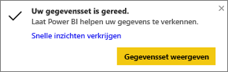
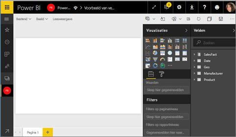
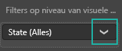
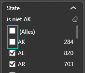
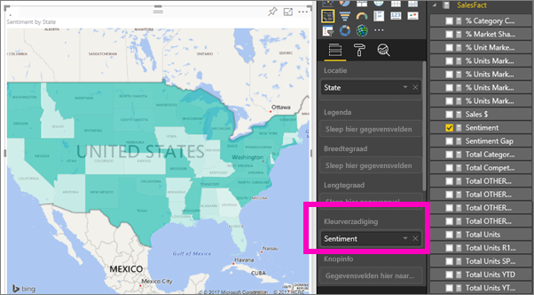
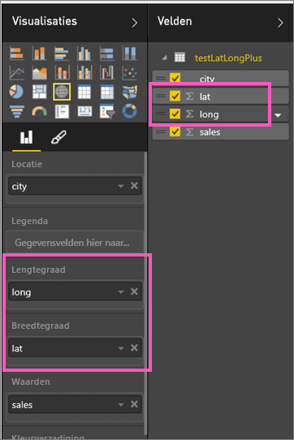

# Choropletenkaarten in Power BI (zelfstudie)
In een choropletenkaart worden arcering, tinten of patronen gebruikt om aan te geven hoe een waarde in verhouding verschilt voor een geografisch gebied of regio.  U kunt zo snel deze relatieve verschillen laten zien met behulp van arcering die varieert van licht (minder frequent/lager) tot donker (meer-frequent/hoger).    

## Welke gegevens worden naar Bing verzonden?
Power BI is geïntegreerd met Bing om standaardkaartcoördinaten te bieden (een proces dat geocodering wordt genoemd). Wanneer u een visualisatie van een kaart maakt in de Power BI-service of Power BI Desktop, worden de gegevens in de buckets **Locatie**, **Breedtegraad** en **Lengtegraad** naar Bing verzonden. Deze buckets worden trouwens gebruikt om de visualisatie te maken.

U of uw beheerder moet mogelijk uw firewall bijwerken om toegang te krijgen tot de URL’s die Bing gebruikt voor geocodering.  Deze URL's zijn:
* https://dev.virtualearth.net/REST/V1/Locations
* https://platform.bing.com/geo/spatial/v1/public/Geodata
* https://www.bing.com/api/maps/mapcontrol

Meer informatie over de gegevens die naar Bing worden verzonden en tips voor het verbeteren van de geocodering leest u in [Tips and tricks for map visualizations](power-bi-map-tips-and-tricks.md) (Tips en trucs voor kaartvisualisaties).

## Wanneer gebruikt u een choropletenkaart
In de volgende gevallen zijn choropletenkaarten een goede keuze:

* om kwantitatieve gegevens op een kaart weer te geven.
* om ruimtelijke patronen en relaties weer te geven.
* wanneer uw gegevens zijn gestandaardiseerd.
* als u werkt met sociaaleconomische gegevens.
* als gedefinieerde regio's belangrijk zijn.
* om een overzicht te krijgen van de verdeling over verschillende geografische locaties.

### Vereisten
- Power BI-service of Power BI Desktop
- Voorbeeld van verkoop en marketing

In deze zelfstudie wordt de Power BI-service gebruikt, niet Power BI Desktop.

## Een eenvoudige choropletenkaart maken
In deze video maakt Kim een eenvoudige kaart en zet deze om in een choropletenkaart.

<iframe width="560" height="315" src="https://www.youtube.com/embed/ajTPGNpthcg" frameborder="0" allowfullscreen></iframe>

1. Als u zelf een choropletenkaart wilt maken, [downloadt u het voorbeeld van verkoop en marketing](sample-datasets.md) door u aan te melden bij Power BI en **Gegevens ophalen \> Voorbeelden \> Voorbeeld van verkoop en marketing \> Verbinden** te selecteren.
2. Wanneer het bericht verschijnt dat het downloaden is voltooid, selecteert u **Gegevensset weergeven**.

   
3. Power BI opent een leeg rapportcanvas in de [bewerkingsweergave](service-interact-with-a-report-in-editing-view.md).

    
4. Selecteer in het deelvenster Velden het veld **Geo** \> **State**.    

   
5. [Converteer de kaart](power-bi-report-change-visualization-type.md) naar een choropletenkaart. U ziet dat **State** nu ook wordt vermeld onder **Locatie**. Bing Kaarten gebruikt het veld onder **Locatie** om de kaart te maken.  Het deelvenster Locatie kan een aantal geldige locaties bevatten: landen, staten, provincies, steden, postcodes, enzovoort. Bing Kaarten kan choropletenkaarten maken voor locaties over de hele wereld. Hiervoor is wel een geldige vermelding in het deelvenster Locatie vereist.  

   
6. Filter de kaart om alleen het vasteland van de Verenigde Staten weer te geven.

   a.  Onder aan het deelvenster Visualisaties ziet u het gebied **Filters**.

   b.  Beweeg de muisaanwijzer over **State** en klik op de pijl-omlaag.  
   

   c.  Zet een vinkje naast **Alles selecteren** en verwijder het vinkje bij **AK**.

   
7. Selecteer **SalesFact** \> **Sentiment** om dit veld toe te voegen aan het vak **Kleurverzadiging**. Het veld in het vak **Kleurverzadiging** bepaalt de kaartarcering.  
   
8. De choropletenkaart is groen gearceerd, met lichtgroen voor lagere gevoelscijfers en donkergroen voor een hoger, positiever gevoel.  Hier heb ik echter de staat Wyoming (WY) geselecteerd en daar valt op dat het gevoel zeer goed is, namelijk 74.  
   
9. [Sla het rapport op](service-report-save.md).

## Markeren en kruislings filteren
Zie [Een filter aan een rapport toevoegen](power-bi-report-add-filter.md) voor meer informatie over het gebruik van het deelvenster Filters.

Als u een locatie op een choropletenkaart markeert, worden de andere visualisaties op de rapportpagina ook gefilterd en omgekeerd.

Als u de stappen wilt volgen, kopieert en plakt u de kaart naar de pagina **Sentiment** van het rapport *Sales and Marketing*.

1. Selecteer een staat op de choropletenkaart.  Hiermee worden de andere visualisaties op de pagina gemarkeerd. Als u bijvoorbeeld **Texas** selecteert, ziet u dat de gevoelswaarde 74 is, dat Texas zich bevindt in het Central District \#23 en dat de meeste omzet afkomstig is uit de segmenten Moderation en Convenience.   
   
2. Schakel op het lijndiagram tussen **No** en **Yes**. Hierdoor wordt de choropletenkaart gefilterd op gevoel voor VanArsdel en op concurrentie voor VanArsdel.  
   

## Overwegingen en probleemoplossing
Kaartgegevens kunnen dubbelzinnig zijn.  Er is bijvoorbeeld een Parijs in Frankrijk, maar ook in Texas. Uw geografische gegevens worden waarschijnlijk opgeslagen in afzonderlijke kolommen (een kolom voor plaatsnamen, een kolom voor namen van staten of provincies, enzovoort), zodat Bing onmogelijk kan vaststellen of het om de Franse versie of Texaanse versie van Parijs gaat. Als uw gegevensset al de breedtegraad- en lengtegraadgegevens bevat, zijn er in Power BI speciale velden beschikbaar om de kaartgegevens uniek te maken. Sleep hiervoor het veld met de breedtegraadgegevens naar het gebied Visualisaties \> Breedtegraad.  Doe hetzelfde voor de lengtegraadgegevens.  

Als u gemachtigd bent om de gegevensset te bewerken in Power BI Desktop, bekijkt u deze video voor het oplossen van problemen met dubbelzinnigheid in kaarten.

<iframe width="560" height="315" src="https://www.youtube.com/embed/Co2z9b-s_yM" frameborder="0" allowfullscreen></iframe>

Als u geen toegang hebt tot gegevens voor breedtegraad en lengtegraad, [volgt u deze instructies voor het bijwerken van uw gegevensset](https://support.office.com/article/Maps-in-Power-View-8A9B2AF3-A055-4131-A327-85CC835271F7).

Zie [Tips and tricks for map visualizations](power-bi-map-tips-and-tricks.md) (Tips en trucs voor kaartvisualisaties) voor meer hulp bij kaartvisualisaties.

## Volgende stappen
[Choropletenkaart toevoegen als een dashboardtegel (visualisatie vastmaken)](service-dashboard-tiles.md)    
 [Een visualisatie toevoegen aan een rapport](power-bi-report-add-visualizations-i.md)  
 [Typen visualisaties in Power BI](power-bi-visualization-types-for-reports-and-q-and-a.md)    
 [Het gebruikte type visualisatie wijzigen](power-bi-report-change-visualization-type.md)      
Nog vragen? [Misschien dat de Power BI-community het antwoord weet](http://community.powerbi.com/)
