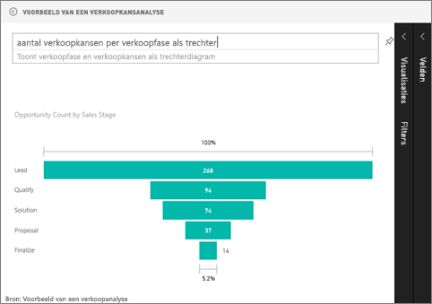

# Trechterdiagrammen (zelfstudie)
Een trechterdiagram helpt u om een lineaire proces dat bestaat uit opeenvolgende verbonden fasen te visualiseren. Bijvoorbeeld een verkooptrechter waarmee klanten in verschillende fasen worden bijgehouden: Lead \> Gekwalificeerde lead \> Prospect \> Contract \> Voltooid.  De vorm van de trechter brengt de status van het proces dat u bijhoudt in één oogopslag over.

Elke fase van de trechter vertegenwoordigt een percentage van het totaal. In de meeste gevallen heeft een trechterdiagram dus de vorm een trechter. De eerste fase is het grootst en elke latere fase is kleiner dan de vorige.  Een trechter in de vorm van een peer is ook nuttig. Hiermee kunt u een probleem in het proces identificeren.  Maar normaal gesproken is de eerste fase (de startfase) het grootst.

## Wanneer u een trechterdiagram gebruikt
In de volgende gevallen komen trechterdiagrammen goed van pas:

* wanneer de gegevens sequentieel zijn en ten minste 4 fasen doorlopen.
* wanneer het aantal 'items' in de eerste fase naar verwachting groter is dan het aantal in de laatste fase.
* om potentieel (inkomsten/verkoop/deals/enz) te berekenen fasen.
* om conversie- en retentiepercentages te berekenen en bij te houden.
* om knelpunten in een lineair proces te identificeren.
* om de werkstroom van een winkelwagen bij te houden.
* om de voortgang en het succes van reclame-/marketingcampagnes met doorklikken bij te houden.

## Werken met trechterdiagrammen
Trechterdiagrammen:

* Kunnen worden vastgemaakt in rapporten en Q&A.
* Kunnen worden gesorteerd.
* Bieden ondersteuning voor veelvouden.
* Kunnen worden gemarkeerd en gefilterd door andere visualisaties op dezelfde rapportpagina.
* Kunnen worden gebruikt om andere visualisaties op dezelfde rapportpagina te markeren en filteren.

## Een basistrechterdiagram maken
Bekijk deze video om te zien hoe Will een trechterdiagram maakt op basis van het voorbeeld van verkoop en marketing.

<iframe width="560" height="315" src="https://www.youtube.com/embed/maTzOJSRB3g" frameborder="0" allowfullscreen></iframe>

Maak nu uw eigen trechterdiagram dat het aantal mogelijkheden weergeeft dat we hebben in elk van onze verkoopfasen.

In deze instructies wordt het voorbeeld van een verkoopkansanalyse gebruikt. Als u alles op de voet wilt volgen, kunt u het [voorbeeld downloaden](sample-datasets.md), zich aanmelden bij Power BI en achtereenvolgens **Gegevens ophalen \> Voorbeelden \> Voorbeeld van een verkoopkansanalyse \> Verbinding maken** selecteren.

1. Start op een [lege rapportpagina ](power-bi-report-add-page.md)in de [bewerkweergave](service-interact-with-a-report-in-editing-view.md) en selecteer het veld **Verkoopfase** \> **Verkoopfase**.  
   
    
2. [Converteer de grafiek](power-bi-report-change-visualization-type.md) naar een trechter. U ziet dat **Verkoopfase** zich bevindt in het veld **Groep**. 
3. Selecteer vanuit het deelvenster **Velden** de optie **Feit** \> **Aantal kansen**.
   
    
4. Als u de muisaanwijzer boven een balk houdt, wordt een schat aan informatie weergegeven.
   
   * De naam van de fase
   * Aantal verkoopkansen in deze fase
   * Algemene conversieverhouding (% van Lead) 
   * Fase-naar-fase (oftewel Drop Rate) is het percentage van de vorige fase (in dit geval Voorstelfase/Oplossingsfase)
     
     
5. [Voeg de trechter toe als een dashboardtegel](service-dashboard-tiles.md). 
6. [Sla het rapport op](service-report-save.md).

## Markeren en kruislings filteren
Zie [Een filter aan een rapport toevoegen](power-bi-report-add-filter.md) voor meer informatie over het gebruik van het deelvenster Filters.

Als u een balk in een trechter markeert, worden de andere visualisaties op de rapportpagina ook gefilterd en omgekeerd. Als u op de voet wilt volgen, voegt u nog enkele visuele elementen toe op de rapportpagina met de trechtergrafiek.

1. Selecteer op de trechter de balk **Voorstel**. Hiermee worden de andere visualisaties op de pagina kruislings gemarkeerd. Gebruik CTRL voor meervoudige selectie.
   
   
2. Zie [Interacties tussen visuele elementen in Power BI](service-reports-visual-interactions.md) als u voorkeuren wilt instellen voor hoe visuele elementen elkaar kruislings markeren en filteren

## Een trechterdiagram maken in Q&A
Markeer het dashboard waaraan ten minste één visualisatie is vastgemaakt vanuit de gegevensset 'Kansen bijhouden'.  Wanneer u een vraag invoert in Q&A, zoekt Power BI antwoorden in alle gegevenssets die zijn gekoppeld aan het geselecteerde dashboard (waaraan tegels zijn vastgemaakt). Zie [Power BI - basisconcepten](service-basic-concepts.md) voor meer informatie.

1. Markeer een dashboard waaraan ten minste één tegel is vastgemaakt vanuit de gegevensset 'Kansen bijhouden'.
2. Beginnen met het typen van uw vraag in het vak van Q&A.
   
   
   
   Zorg ervoor dat u ‘als trechter’ toevoegt zodat Power BI weet welk type visualisatie u wilt gebruiken.

## Volgende stappen
[Typen visualisaties in Power BI](power-bi-visualization-types-for-reports-and-q-and-a.md)

[Een visualisatie vastmaken aan een dasboard](service-dashboard-pin-tile-from-report.md)

[Power BI - basisconcepten](service-basic-concepts.md)

Hebt u nog vragen? [Misschien dat de Power BI-community het antwoord weet](http://community.powerbi.com/)

