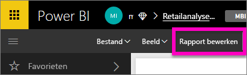
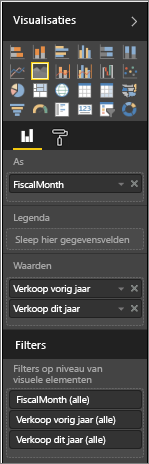
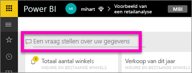
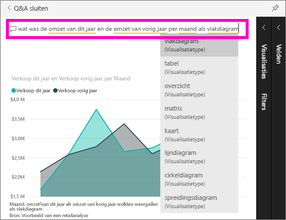

# Aan de slag met Power BI Q&A

Soms krijgt u het snelst een antwoord uit uw gegevens wanneer u een vraag stelt in natuurlijke taal.  In deze snelstartgids bekijken we twee verschillende manieren om dezelfde visualisatie te maken: ten eerste samenstellen in een rapport, en ten tweede een vraag stellen met Q&A. We doen dit met behulp van Power BI-service, maar het proces is bijna identiek aan als u dit doet met behulp van Power BI Desktop.

Als u dit wilt volgen, moet u een rapport gebruiken dat u kunt bewerken. Daarom maken we gebruik van een van de voorbeelden die beschikbaar zijn met Power BI.

## Een visual maken in de rapporteditor

1. Selecteer in de Power BI-werkruimte **Gegevens ophalen** \> **Voorbeelden** \> **Voorbeeld van een retailanalyse**  >  **Verbinding maken**.
   
2. Het dashboard bevat een diagramtegel voor de omzet van het afgelopen jaar en de omzet van dit jaar.  Selecteer deze tegel. Als deze tegel is gemaakt met Q&A en u de tegel selecteert, wordt Q&A geopend. Deze tegel is echter gemaakt in een rapport, waardoor het rapport wordt geopend op de pagina met deze visualisatie.

    

1. Open het rapport in de bewerkingsweergave en selecteer **Rapport bewerken**.  Als u niet de eigenaar van een rapport bent, kunt u het rapport niet openen in de bewerkingsweergave.
   
    
4. Selecteer het vlakdiagram en controleer de instellingen in het deelvenster **Velden**.  De maker van het rapport heeft dit diagram samengesteld door deze drie waarden (**Tijd > FiscalMonth**, **Verkoop > Omzet van dit jaar**, **Verkoop > Omzet van afgelopen jaar > Waarde**) te selecteren en ze te ordenen in de bronnen **As** en **Waarden**.
   
    

## Dezelfde visual maken met Q&A

Hoe zouden we hetzelfde lijndiagram maken met Q&A?

1. Navigeer terug naar het dashboard Voorbeeld van een retailanalyse.
2. Typ in natuurlijke taal iets als de volgende vraag in het vragenvak:
   
   **Wat was de omzet van dit jaar en vorig jaar, per maand als vlakdiagram**
   
   Als u een vraag typt, kiest de Q&A-functie de beste visualisatie om uw antwoord weer te geven. De visualisatie wordt dynamisch gewijzigd als u de vraag wijzigt. Q&A helpt u ook om uw vraag te formuleren door suggesties te bieden, de vraag automatisch aan te vullen en spellingcorrecties toe te passen.
   
   Als u de vraag hebt getypt, resulteert dit in exact hetzelfde diagram als in het rapport.  Maar op deze manier is het diagram veel sneller gemaakt.
   
   
3. Net als wanneer u met rapporten werkt, hebt u in Q&A toegang tot de deelvensters Visualisaties, Filters en Velden.  Open deze deelvensters om uw visual verder te verkennen en te wijzigen.
4. Selecteer het speldpictogram om uw diagram aan het dashboard vast te maken .

## Volgende stappen
[Q&A in Power BI](consumer/end-user-q-and-a.md)

[Uw gegevens geschikt maken voor Q&A in Power BI](service-prepare-data-for-q-and-a.md)

Hebt u nog vragen? [Misschien dat de Power BI-community het antwoord weet](http://community.powerbi.com/)

