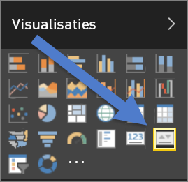
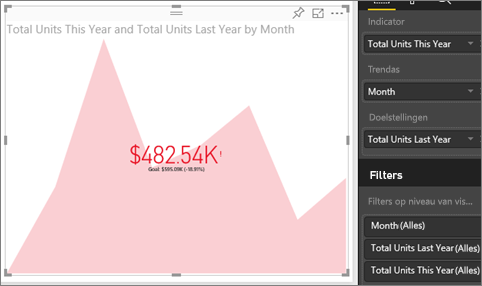

# Visuele KPI-elementen (zelfstudie)
Een Key Performance Indicator (KPI) is een visuele aanwijzing waarmee de voortgang naar een meetbaar doel wordt aangegeven. Zie [Microsoft Developer Network](https://msdn.microsoft.com/library/hh272050) voor meer informatie over KPI's.

## Een KPI gebruiken
KPI's zijn een prima keuze:

* voor het meten van voortgang (waarmee loop ik voor of achter?)
* voor het meten van de afstand tot een doel (hoe ver loop ik voor of achter?)   

## Vereisten voor Visuele KPI-elementen
Een Key Performance Indicator (KPI) is gebaseerd op een specifieke meting en is ontworpen voor het evalueren van de huidige waarde en status van een metrieke waarde tegen een gedefinieerd doel. Daarom zijn voor een visueel KPI-element een *basismeting* vereist, waarmee een waarde en een *doelmeting* of doelwaarde worden bepaald, en een drempelwaarde of doelstelling.

> [!NOTE]
> Momenteel moet een KPI-gegevensset doelstellingswaarden voor een KPI bevatten. Als uw gegevensset geen doelstellingswaarde bevat, kunt u doelstellingen maken door een Excel-werkblad met doelstellingen aan uw gegevensmodel of PBIX-bestand toe te voegen.
> 
> 

## KPI's maken
Meld u aan bij Power BI als u mee wilt doen. Selecteer achtereenvolgens **Gegevens ophalen > Voorbeelden > Voorbeeld van een retailanalyse**. We maken een KPI die de voortgang meet die we hebben gemaakt bij een verkoopdoel.

Of laat Will u demonstreren hoe u enkelvoudige, visuele metrieke elementen maakt: meters, kaarten en KPI's.

<iframe width="560" height="315" src="https://www.youtube.com/embed/xmja6EpqaO0?list=PL1N57mwBHtN0JFoKSR0n-tBkUJHeMP2cP" frameborder="0" allowfullscreen></iframe>

1. Selecteer **Verkopen > Totaal aantal eenheden dit jaar**.  Dit wordt de indicator.
2. Voeg **Tijd > Maand** toe.  Dit stelt de trend voor.
3. BELANGRIJK: sorteer de kaart op **Maand**. Als u de visualisatie naar een KPI hebt omgezet, is er geen optie meer om te sorteren.
4. Zet het visuele element om naar een KPI door het KPI-pictogram in het deelvenster Visualisatie te selecteren.
   
    
5. Voeg een doelstelling toe. Voeg de verkopen van vorig jaar als doelstelling toe. Sleep **Totaal aantal eenheden vorig jaar** naar het veld **Doelstellingen**.
   
    
6. U kunt eventueel de KPI opmaken door het verfrollerpictogram te selecteren om het deelvenster Opmaak te openen.
   
   * **Indicator**: hiermee worden de weergave-eenheden en het aantal decimalen bepaald.
   * **Trendas**: als deze is ingesteld op **Aan** wordt de trendas weergegeven als achtergrond van het visuele KPI-element.  
   * **Doelstellingen**: als deze is ingesteld op **Aan** worden de doelstelling en de weg naar het doel als een percentage op het visuele element weergegeven.
   * **Status**: sommige KPI's worden bij hogere waarden als *beter* beschouwd en sommige worden bij lagere waarden als *beter* beschouwd. For example, earnings VS. Bijvoorbeeld omzet versus wachttijd. Meestal is een hogere waarde voor omzet beter versus een hogere waarde voor wachttijd, die gewoonlijk als slecht wordt beschouwd. Met deze schakelaar kunt u bepaald gedrag van een KPI selecteren. De statusselectie is standaard: **hoog is beter**.
7. Als u de KPI's naar wens hebt ingesteld, [maakt u ze aan een dashboard vast](service-dashboard-pin-tile-from-report.md).

KPI's zijn ook op uw mobiele apparaten beschikbaar, zodat u altijd een vinger aan de pols van uw bedrijf hebt

## Overwegingen en probleemoplossing
* Als uw KPI niet lijkt op de hierboven afgebeelde KPI, kan dat komen omdat u op maand dient te sorteren. Omdat KPI's geen sorteeroptie hebben, moet u op maand sorteren *voordat* u uw visualisatie naar een KPI omzet.

## Volgende stappen
[Reports in Power BI](service-reports.md) (Rapporten in Power BI)

[Visualizations in Power BI reports](power-bi-report-visualizations.md) (Visualisaties in Power BI-rapporten)

[Power BI - Basic Concepts](service-basic-concepts.md) (Power BI - basisconcepten)

Hebt u nog vragen? [Misschien dat de Power BI-community het antwoord weet](http://community.powerbi.com/)

