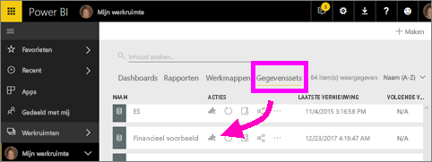
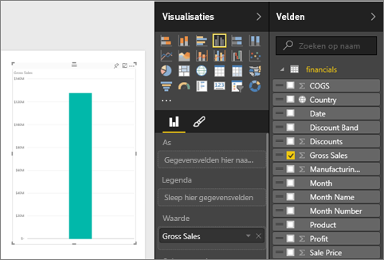
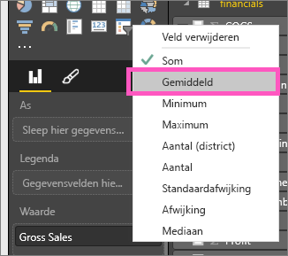
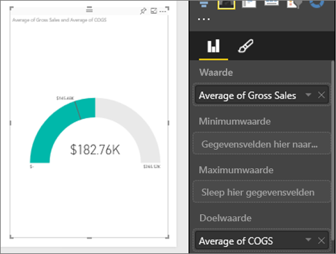
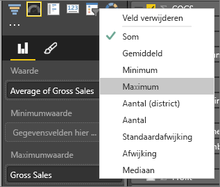
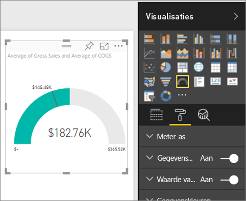
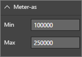
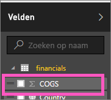
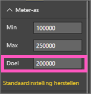

# Radiale-meterdiagrammen in Power BI (zelfstudie)
Een radiale-meterdiagram heeft een cirkelvormige boog en toont één waarde die de voortgang naar een doel/KPI meet.  Het doel of de doelwaarde wordt weergegeven door de lijn (naald). De voortgang naar het doel wordt weergegeven door de arcering.  En de waarde die de voortgang vertegenwoordigt, wordt vetgedrukt weergegeven in de boog. Alle mogelijke waarden zijn gelijkmatig verdeeld langs de boog, van minimum (meest linkse waarde) tot maximum (meest rechtse waarde).

In het onderstaande voorbeeld zijn we een autohandelaar die de gemiddelde verkoop van het verkoopteam per maand bijhoudt. Ons doel is 140 en dat wordt weergegeven door de zwarte naald.  De minimale mogelijke gemiddelde verkoop is ingesteld op 0 en we hebben het maximum ingesteld op 200.  De blauwe arcering geeft aan dat we deze maand momenteel ongeveer 120 verkopen gemiddeld hebben. Gelukkig hebben we nog een week de tijd om ons doel te bereiken.

## Wanneer gebruikt u een radiale meter
Radiale meters zijn een uitstekende keuze om:

* de voortgang naar een doel weer te geven.
* een percentielmeting weer te geven, zoals een KPI.
* de status van één meting weer te geven.
* informatie weer te geven die snel kan worden gelezen en begrepen.

### Vereisten
 - Power BI-service of Power BI Desktop
 - Excel-werkmap met financiële voorbeelden: [het voorbeeld rechtstreeks downloaden](http://go.microsoft.com/fwlink/?LinkID=521962).

## Een eenvoudige radiale meter maken
Deze instructies maken gebruik van Power BI-service. Als u deze wilt volgen, meld u zich aan bij Power BI en opent u het Excel-bestand Financial Sample.  

Of kijk naar Will die laat zien hoe u eenvoudige metrische visuele elementen maakt: meters, kaarten en KPI's.

<iframe width="560" height="315" src="https://www.youtube.com/embed/xmja6EpqaO0?list=PL1N57mwBHtN0JFoKSR0n-tBkUJHeMP2cP" frameborder="0" allowfullscreen></iframe>

### Stap 1: Het Excel-bestand Financial Sample openen
1. [Download het Excel-bestand Financial Sample](sample-financial-download.md) als u dit nog niet hebt gedaan. Vergeet niet de opslaglocatie.

2. Open het bestand in ***Power BI-service***  door **Gegevens ophalen \> Bestanden** te selecteren en naar de locatie te bladeren waar u het bestand hebt opgeslagen. Selecteer **Importeren**. Financial Sample wordt als gegevensset toegevoegd aan uw werkruimte.

3. Selecteer in de inhoudslijst **Gegevensset** **Financial Sample** om dit in de modus Verkennen te openen.

    

### Stap 2: Een meter maken om de brutoverkoop bij te houden
1. Selecteer **Gross Sales** (brutoverkoop) in het deelvenster **Velden**.
   
   
2. Wijzig de aggregatie in **Gemiddelde**.
   
   
3. Selecteer het meterpictogram  om het kolomdiagram om te zetten in een meter.
   
   Power BI maakt standaard een meterdiagram waarin ervan wordt uitgegaan dat de huidige waarde (in dit geval het gemiddelde van Gross Sales) ligt op het punt halverwege de meter. Aangezien de gemiddelde brutoverkoop $ 182.760 is, is de beginwaarde (Minimum) ingesteld op 0 en de eindwaarde (Maximum) op het dubbele van de huidige waarde.
   
   

### Stap 3: Een doelwaarde instellen
1. Sleep **COGS** naar het veld **Doelwaarde**.
2. Wijzig de aggregatie in **Gemiddelde**.
   Power BI voegt een naald toe die de doelwaarde van **$ 145.480** vertegenwoordigt. Zoals u ziet, hebben we ons doel overschreden.
   
   
   
   > [!NOTE]
   > U kunt ook handmatig een doelwaarde invoeren.  Zie 'Opmaakopties gebruiken om de minimum-, maximum- en doelwaarde handmatig in te stellen' hieronder.
   > 
   > 

### Stap 4: Een maximumwaarde instellen
In stap 2 gebruikte Power BI het veld Waarde om automatisch een minimum (begin) en maximum (eind) in te stellen.  Stel echter dat u uw eigen maximumwaarde wilt instellen.  Stel dat u, in plaats van de huidige waarde te verdubbelen als de maximaal mogelijke waarde, het maximum wilt instellen op de hoogste waarde voor brutoverkoop in uw gegevensset? 

1. Sleep **Gross Sales** van de lijst **Velden** naar het vak **Maximumwaarde**.
2. Wijzig de aggregatie in **Maximum**.
   
   
   
   De meter wordt opnieuw getekend met een nieuwe eindwaarde, 1,21 miljoen, voor brutoverkoop.
   
   

### Stap 5: Het rapport opslaan
1. [Sla het rapport op](service-report-save.md).
2. [Voeg het meterdiagram toe aan een dashboardtegel](service-dashboard-tiles.md). 

## Opmaakopties gebruiken om de minimum-, maximum- en doelwaarde handmatig in te stellen
1. Verwijder **Gross Sales** uit het vak **Maximumwaarde**.
2. Open het opmaakvenster door het pictogram met de verfroller te selecteren.
   
   
3. Vouw **Meter-as** uit en voer waarden in voor **Min** en **Max**.
   
    
4. Verwijder de huidige doelwaarde door het vinkje naast **COGS** te verwijderen.
   
    
5. Wanneer het veld **Doel** wordt weergegeven onder **Meter-as**, voert u een waarde in.
   
    
6. Pas de opmaak van het meterdiagram desgewenst verder aan.

## Volgende stappen
[Typen visualisaties in Power BI](power-bi-visualization-types-for-reports-and-q-and-a.md)

[Een visualisatie toevoegen aan een rapport](power-bi-report-add-visualizations-i.md)

[Een visualisatie vastmaken aan een dashboard](service-dashboard-pin-tile-from-report.md)

[Power BI - basisbeginselen](service-basic-concepts.md)

Hebt u nog vragen? [Misschien dat de Power BI-community het antwoord weet](http://community.powerbi.com/)

