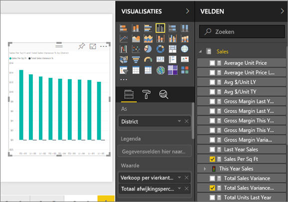
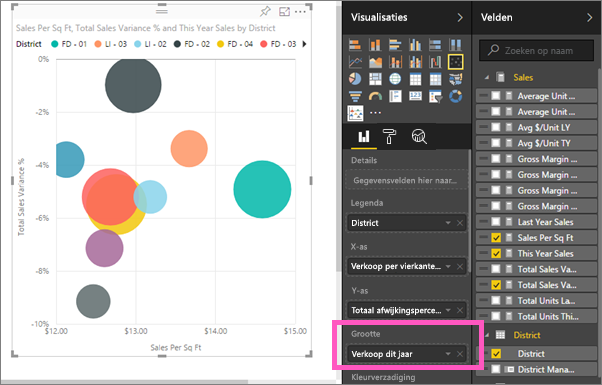
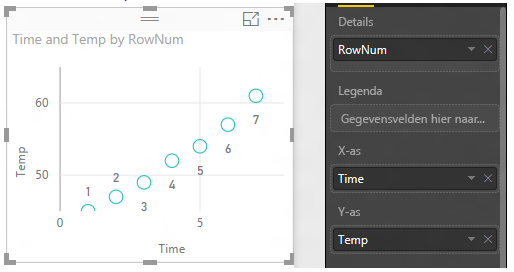
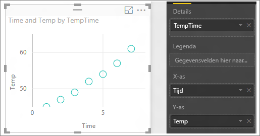

# Spreidingsdiagrammen en bellendiagrammen in Power BI (zelfstudie)
Een spreidingsdiagram heeft altijd twee waardeassen, waarbij een reeks numerieke gegevens op een horizontale as en een andere reeks numerieke waarden op de verticale as wordt weergegeven. In het diagram worden punten weergegeven op het snijpunt van een numerieke x- en y-waarde, waarbij deze waarden in één gegevenspunt worden gecombineerd. Deze gegevenspunten kunnen, afhankelijk van de gegevens, gelijkmatig of ongelijkmatig over de horizontale as zijn verdeeld.

Bij een bellendiagram worden de gegevenspunten vervangen door bellen. De *grootte* van de bellen geven de gegevens een extra dimensie.

## Wanneer u een spreidingsdiagram of bellendiagram gebruikt
### In de volgende gevallen komen spreidingsdiagrammen goed van pas:
* om relaties weer te geven van tussen de 2 (spreiding) of 3 (bellen) **numerieke** waarden.
* om twee groepen getallen als een reeks xy-coördinaten te tekenen.
* in plaats van een lijndiagram als u de schaal van de horizontale as wilt wijzigen    
* om de horizontale as om te zetten in een logaritmische schaal.
* om werkbladgegevens met paren of gegroepeerde sets waarden weer te geven. In een spreidingsdiagram kunt u de onafhankelijke schalen van de assen aanpassen voor meer informatie over de gegroepeerde waarden.
* om patronen weer te geven in grote gegevenssets, bijvoorbeeld door lineaire of niet-lineaire trends, clusters en uitschieters weer te geven.
* om een groot aantal gegevenspunten te vergelijken zonder rekening te houden met tijd Hoe meer gegevens u in een spreidingsdiagram opneemt, hoe beter de vergelijkingen die u kunt maken.

### In de volgende gevallen komen bellendiagrammen goed van pas:
* als uw gegevens 3 gegevensreeksen bevatten met elk een set waarden.
* om financiële gegevens weer te geven.  Verschillende belgrootten zijn handig om specifieke waarden visueel te benadrukken.
* om te gebruiken met kwadranten.

## Een spreidingsdiagram maken
Bekijk deze video voor informatie over de optie Een spreidingsdiagram maken en volg daarna de onderstaande stappen om zelf een spreidingsdiagram te maken.

<iframe width="560" height="315" src="https://www.youtube.com/embed/PVcfPoVE3Ys?list=PL1N57mwBHtN0JFoKSR0n-tBkUJHeMP2cP" frameborder="0" allowfullscreen></iframe>

In deze instructies wordt het voorbeeld van een retailanalyse gebruikt. Om mee te lezen kunt u het [voorbeeld downloaden](sample-datasets.md) voor de Power BI-service (app.powerbi.com) of voor Power BI Desktop.   

1. Begin op een [lege rapportpagina](power-bi-report-add-page.md) en selecteer de velden **Verkoop** \> **Sales Per Sq Ft** en **Verkoop** > **Afwijking van totale verkoop in %**. Als u de Power BI-service gebruikt, moet u het rapport openen in de [bewerkweergave](service-interact-with-a-report-in-editing-view.md).
 
2. Selecteer in het deelvenster Velden **District > District**.
   
    
4. Converteer naar een spreidingsdiagram. Selecteer het pictogram voor spreidingsdiagrammen in het deelvenster Visualisaties.
   .
5. Sleep **District** van **Details** naar **Legenda**.
   
    

We hebben nu een spreidingsdiagram die Afwijking van totale verkoop in % op de y-as afzet tegen de Verkoop per vierkante meter op de x-as.  De kleuren van de gegevenspunten vertegenwoordigen de districten.  Nu gaan we een derde dimensie toevoegen.

## Een bellendiagram maken
1. Sleep vanuit het deelvenster Velden **Verkoop** > **Omzet van dit jaar** > **Vaarde** naar het gebied **Grootte**. 
   
   
2. Beweeg de muisaanwijzer over een bel.  De grootte van de bel geeft de waarde van **Omzet van dit jaar** weer.
   
    
3. U kunt desgewenst [de kleuren, labels, titels, achtergrond en meer van het visuele element wijzigen](service-getting-started-with-color-formatting-and-axis-properties.md).

## Aandachtspunten en probleemoplossing
### **Uw spreidingsdiagram heeft slechts één gegevenspunt**
Hebt u een spreidingsdiagram gemaakt en wordt daarin slechts één gegevenspunt weergegeven waarin alle waarden op de x- en y-as worden samengevoegd?  Of worden in het diagram alle waarden langs een horizontale of verticale lijn weergegeven?

Voeg een veld toe aan het gebied **Details** om aan te geven hoe de waarden moeten worden gegroepeerd. Het veld moet uniek zijn voor elk punt dat moet worden weergegeven.  
Zoals een eenvoudig rijnummer of ID-veld:

Als uw gegevens dit niet bevatten, maakt u een veld waarin uw x- en y-waarden samen worden gevoegd in iets unieks per punt:

[Gebruik van de Query Editor van Power BI Desktop om een indexkolom toe te voegen](desktop-add-custom-column.md) aan uw gegevensset om een nieuw veld te maken.  Voeg deze kolom toe aan het gebied **Details** van uw visualisatie.

## Volgende stappen
 [Typen visualisaties in Power BI](power-bi-visualization-types-for-reports-and-q-and-a.md)

[Probeer het uit, het is gratis.](https://powerbi.com/)  

Hebt u nog vragen? [Misschien dat de Power BI-community het antwoord weet](http://community.powerbi.com/)

