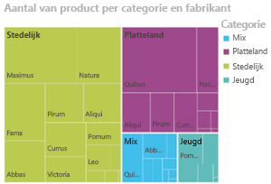
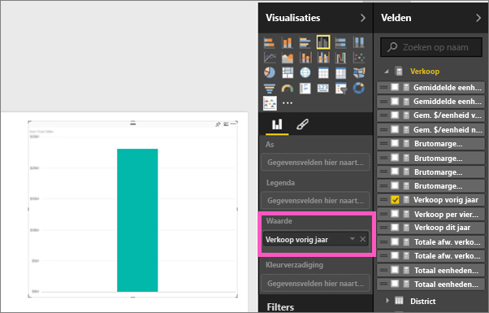
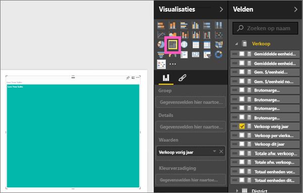
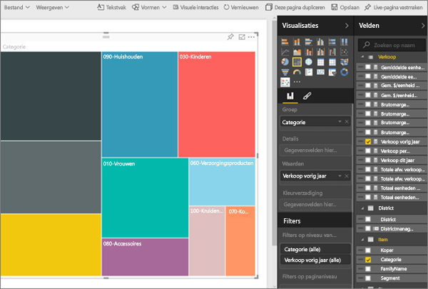
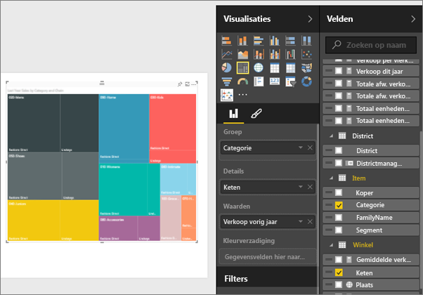
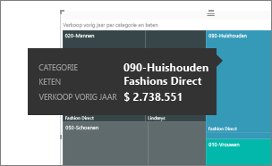
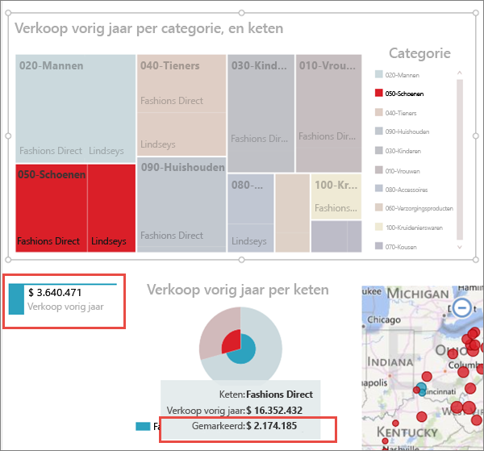

# Treemaps in Power BI
In treemaps worden hiërarchische gegevens weergegeven als een set van geneste rechthoeken.  Elk niveau van de hiërarchie wordt weergegeven als een gekleurde rechthoek (ook wel een vertakking genoemd) die andere gekleurde rechthoeken (bladeren) bevat.  De ruimte in elke rechthoek wordt toegewezen op basis van de kwantitatieve waarde die wordt gemeten, waarbij de rechthoeken op grootte worden gesorteerd van linksboven (grootste) naar rechtsonder (kleinste).

Als ik bijvoorbeeld mijn verkopen analyseer, heb ik mogelijk rechthoeken op het bovenste niveau (vertakkingen) voor de volgende kledingcategorieën: **Urban**, **Landelijk**, **Jeugd** en **Mix**.  Mijn categorierechthoeken zou kleinere rechthoeken (bladeren) bevatten voor de kledingfabrikanten in die categorie, en deze kleinere rechthoeken zouden qua grootte worden aangepast en ingekleurd op basis van het aantal verkochte items.  In de vertakking **Urban** hierboven, is er veel kleding van Maximus verkocht, minder kleding van Natura en Fama en zeer weinig van Leo.  De grootste rechthoek in de vertakking **Urban** van mijn treemap zou dus worden weergegeven (in de linkerbovenhoek) voor Maximus, terwijl Natura en Fama iets kleinere rechthoeken krijgen. Daarnaast worden er tal van andere rechthoeken voor alle ander verkochte kleding worden weergegeven en krijgt Leo de kleinste rechthoek.  En ik kan het aantal verkochte items vergelijken met andere kledingcategorieën door de grootte en inkleuring van elk bladknooppunt met elkaar te vergelijken. Hoe groter de rechthoek en hoe donkerder de kleur, hoe hoger de waarde.

## Wanneer u een treemap gebruikt
In de volgende gevallen komen treemaps goed van pas:

* Wanneer u grote hoeveelheden hiërarchische gegevens moet weergeven.
* Wanneer een staafdiagram het grote aantal waarden niet effectief kan verwerken.
* Wanneer u de verhoudingen tussen de verschillende en het geheel wilt weergeven.
* Wanneer u het patroon van de distributie van de meting tussen de verschillende niveaus van categorieën in de hiërarchie wilt weergeven.
* Wanneer u kenmerken wilt weergeven met grootte- en kleurcoderingen.
* Wanneer u patronen, uitbijters, de belangrijkste bijdragers en uitzonderingen wilt identificeren.

### Vereisten
 - Power BI-service of Power BI Desktop
 - Voorbeeld van een retailanalyse

## Een eenvoudige treemap maken
Wilt u eerst kijken hoe iemand anders een treemap maakt?  Ga naar 2:10 in deze video om te kijken hoe Amanda een treemap maakt.

<iframe width="560" height="315" src="https://www.youtube.com/embed/IkJda4O7oGs" frameborder="0" allowfullscreen></iframe>

U kunt ook zelf een treemap maken. In deze instructies wordt het voorbeeld van een retailanalyse gebruikt. Meld u aan bij de Power BI-service (niet Desktop) als u mee wilt doen en selecteer achtereenvolgens **Gegevens ophalen \> Voorbeelden \> Voorbeeld van een retailanalyse \> Verbinding maken \> Naar dashboard gaan**. Visualisaties maken in een rapport vereist bewerkingsmachtiging voor de gegevensset en het rapport. Gelukkig zijn voorbeelden van Power BI bewerkbaar. Maar als iemand een rapport met u deelt, kunt u geen nieuwe visualisaties toevoegen.

1. Selecteer de tegel 'Total stores' (Totaal aantal winkels) om het rapport Voorbeeld van een retailanalyse te openen.    
2. Open de [bewerkingsweergave](service-interact-with-a-report-in-editing-view.md) en selecteer de meting **Verkoop** > **Omzet afgelopen jaar**.   
      
3. Converteer de grafiek naar een treemap.  
      
4. Sleep **Item** > **Categorie** naar de bron **Groep**. Er wordt een treemap in Power BI gemaakt waarbij de grootte van de rechthoeken de totale omzet weerspiegelt en de kleur een categorie representeert.  In wezen hebt u een hiërarchie gemaakt die op visuele wijze de relatieve grootte van het totale aantal verkopen per categorie beschrijft.  De categorie **Heren** is de categorie met de meeste verkopen en de categorie **Kousen** is de categorie met de minste verkopen.   
      
5. Sleep **Winkel** > **Keten** naar de bron **Details** om uw treemap te voltooien. U kunt nu de omzet van het afgelopen jaar vergelijken op basis van de categorie en de keten.   
   
   
   > [!NOTE]
   > Kleurverzadiging en Details kunnen niet tegelijkertijd worden gebruikt.
   > 
   > 
5. Beweeg de cursor over het gebied **Keten** om de knopinfo voor dat gedeelte van de **Categorie** weer te geven.  Als u muiswijzer bijvoorbeeld over **Lindseys** in de rechthoek **040-Juniors** beweegt, wordt de tooltip voor het aandeel van Lindsey in de categorie Juniors weergegeven.  
   
6. [Voeg de treemap toe als een dashboardtegel (de visual vastmaken)](service-dashboard-tiles.md). 
7. [Sla het rapport op](service-report-save.md).

## Markeren en kruislings filteren
Zie [Een filter aan een rapport toevoegen](power-bi-report-add-filter.md) voor meer informatie over het gebruik van het deelvenster Filters.

Wanneer u een categorie of details in een treemap markeert, worden de andere visualisatie op de rapportpagina kruislings gemarkeerd en gefilterd en omgekeerd. Als u alles op de voet wilt volgen, voegt u enkele visuals aan dezelfde pagina toe of kopieert u de treemap en plakt u deze in rapportpagina die alle andere visuals bevat.

1. Selecteer op de treemap een Categorie of Keten in een Categorie.  Hiermee worden de andere visualisaties op de pagina kruislings gemarkeerd. Als ik bijvoorbeeld **050-Schoenen** selecteer, kan ik zien dat er het afgelopen een omzet van $ 3.640.471 is gedraaid, waarvan $ 2.174.185 afkomstig was van Fashions Direct.  
   

2. Als u in het cirkeldiagram **Omzet afgelopen jaar per keten** het segment **Fashions Direct** selecteert, wordt de treemap kruislings gefilterd.  
       

3. Zie [Visualisatie-interacties in een Power BI-rapport](service-reports-visual-interactions.md) als u wilt beheren hoe grafieken elkaar kruislings markeren en filteren.

## Volgende stappen
[Een visualisatie vastmaken aan een dashboard](service-dashboard-pin-tile-from-report.md)  
[Power BI - basisconcepten](service-basic-concepts.md)  

Hebt u nog vragen? [Misschien dat de Power BI-community het antwoord weet](http://community.powerbi.com/)  

