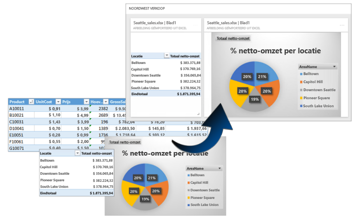
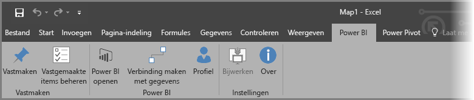
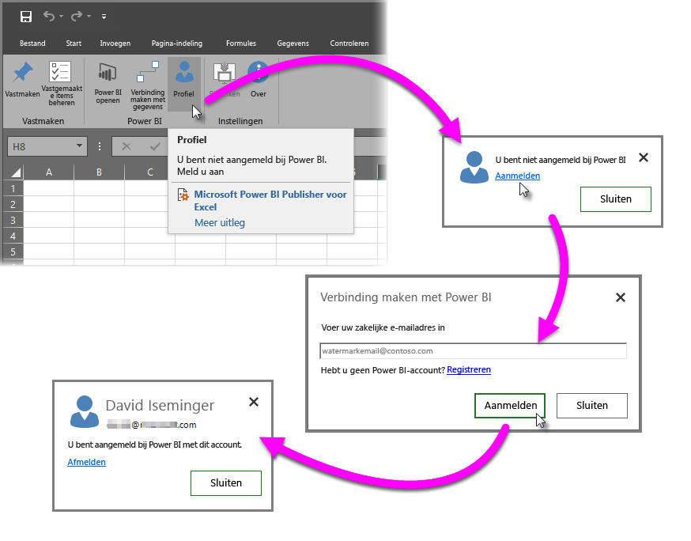
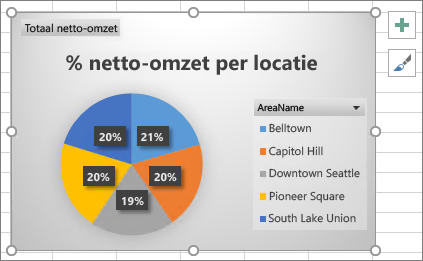
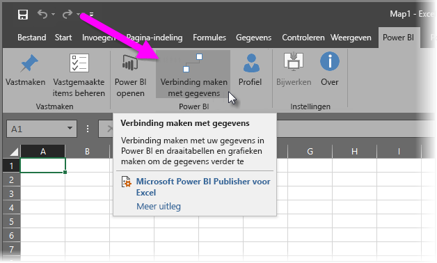
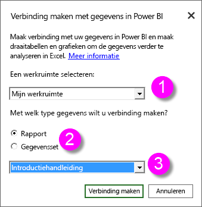
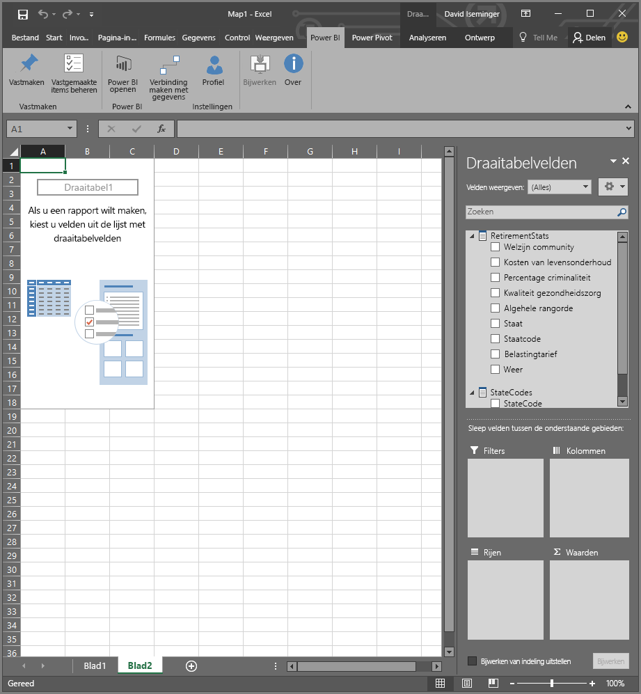
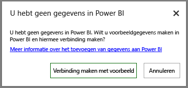

# Power BI Publisher voor Excel
Met Microsoft **Power BI Publisher voor Excel** kunt u momentopnamen maken van uw belangrijkste inzichten in Excel, zoals draaitabellen, grafieken en bereiken, en deze vastmaken aan dashboards in Power BI.

Wat kunt u vastmaken? Vrijwel alles uit een Excel-werkblad. U kunt een celbereik selecteren uit een eenvoudig blad of een tabel, een draaitabel of draaigrafiek, illustraties en afbeeldingen, tekst.

Wat u niet kunt vastmaken: u kunt geen 3D-kaarten of visualisaties vastmaken in Power View-bladen. Er zijn ook enkele elementen die u wel kunt vastmaken, maar waarvoor dit niet erg zinvol is, zoals een slicer of tijdlijnfilter.

Wanneer u een element vastmaakt vanuit Excel, wordt er een nieuwe tegel toegevoegd aan een nieuw of bestaand dashboard in Power BI. De nieuwe tegel is een momentopname en is dus niet dynamisch. U kunt de tegel wel bijwerken. Als u bijvoorbeeld iets wijzigt in een draaitabel of -grafiek die al is vastgemaakt, wordt de dashboardtegel in Power BI niet automatisch bijgewerkt. U kunt de vastgemaakte elementen dan bijwerken met behulp van **Vastgemaakte items beheren**. U leest meer over **Vastgemaakte items beheren** in de volgende secties.

## Downloaden en installeren
Power BI Publisher voor Excel is een invoegtoepassing die u kunt downloaden en vervolgens kunt installeren in desktopversies van Microsoft Excel 2007 en hoger.

[Power BI Publisher voor Excel downloaden](http://go.microsoft.com/fwlink/?LinkId=715729)

Wanneer u de invoegtoepassing hebt geïnstalleerd, ziet u een nieuw lint van **Power BI** in Excel. Hier kunt u zich aanmelden (of afmelden) bij Power BI, elementen vastmaken aan dashboards en elementen beheren die u al hebt vastgemaakt.

De invoegtoepassing **Power BI Publisher voor Excel** is standaard ingeschakeld, maar als u het lint van Power BI om wat voor reden dan ook niet ziet in Excel, moet u de toepassing handmatig inschakelen. Klik op **Bestand** > **Opties** > **Invoegtoepassingen** > **COM-invoegtoepassingen**. Selecteer **Microsoft Power BI Publisher voor Excel**.

## Een bereik vastmaken aan een dashboard
U kunt elk bereik met cellen selecteren in het werkblad en een momentopname van dat bereik vastmaken aan een bestaand of nieuw dashboard in Power BI. U kunt dezelfde momentopname overigens aan meerdere dashboards vastmaken.

Allereerst moet u controleren of u bent aangemeld bij Power BI.

1. Selecteer **Profiel** op het lint van **Power BI** in Excel. Als u al bent aangemeld bij Power BI, ziet u een dialoogvenster met de naam van het account waarmee u bent aangemeld. Als dat het account is dat u wilt gebruiken, kunt u verder met de volgende set stappen om het bereik vast te maken. Selecteer *Afmelden* als u een ander Power BI-account wilt gebruiken. Als u niet bent aangemeld, gaat u naar de volgende stap (Stap 2).
   
   
2. Als u niet bent aangemeld, selecteert u de koppeling **Aanmelden** die wordt weergegeven wanneer u **Profiel** selecteert op het lint van **Power BI** in Excel. Voer in het dialoogvenster **Verbinding maken met Power BI** het e-mailadres in van het Power BI-account dat u wilt gebruiken en selecteer vervolgens **Aanmelden**.
   
   

Nadat u bent aangemeld, voert u deze stappen uit om een bereik vast te maken aan een dashboard:

1. Selecteer in Excel het lint van **Power BI** om de knop **Vastmaken** weer te geven.
2. Selecteer een bereik in uw Excel-werkmap.
3. Klik op de knop **Vastmaken** op het lint van **Power BI** om het dialoogvenster **Aan dashboard vastmaken** weer te geven. Als u nog niet bent aangemeld bij Power BI, wordt u gevraagd dit nu te doen. Selecteer een werkruimte in de vervolgkeuzelijst **Werkruimte**. Als u het bereik wilt vastmaken aan uw eigen dashboard, controleert u of **Mijn werkruimte** is geselecteerd. Als u het bereik wilt vastmaken aan een dashboard in een groepswerkruimte, selecteert u de groep in de vervolgkeuzelijst.
4. Geef aan of u het bereik wilt vastmaken aan een *bestaand dashboard* of een *nieuw dashboard*.
5. Klik op **OK** om uw selectie vast te maken aan het dashboard.
6. Selecteer in het dialoogvenster **Aan dashboard vastmaken** een bestaand dashboard in de werkruimte of maak een nieuw dashboard en klik op de knop **OK**.
   
   

## Een grafiek vastmaken aan een dashboard
Klik op de grafiek en klik vervolgens op Vastmaken .

## Vastgemaakte elementen beheren
Met **Vastgemaakte items beheren** kunt u de bijbehorende tegel van een vastgemaakt element in Power BI bijwerken (vernieuwen). Elementen die al zijn vastgemaakt aan dashboards in Power BI, kunt u ook weer losmaken.

Als u tegels in uw dashboard wilt bijwerken, selecteert u in **Vastgemaakte items beheren** een of meer elementen en selecteert u vervolgens **Bijwerken**.

Als u de toewijzing tussen een vastgemaakt element in Excel en de bijbehorende tegel in een dashboard wilt verwijderen, selecteert u **Verwijderen**. Als u **Verwijderen** selecteert, wordt het element *niet* verwijderd uit uw werkblad in Excel. Ook wordt de bijbehorende tegel in het dashboard niet verwijderd. U verwijdert alleen de koppeling, of *toewijzing* tussen de elementen. Het verwijderde element wordt niet meer weergegeven in **Vastgemaakte items beheren**. Als u het element opnieuw vastmaakt, wordt het weergegeven als een nieuwe tegel.

Als u een vastgemaakt element (een tegel) wilt verwijderen uit een dashboard, moet u dat doen in Power BI. Selecteer het pictogram **Menu openen**  op de tegel die u wilt verwijderen en selecteer vervolgens **Tegel verwijderen**   .

## Verbinding maken met gegevens in Power BI
Vanaf de release van juli 2016 van **Power BI Publisher voor Excel** (inclusief de huidige release, zie de bovenstaande koppeling) kunt u rechtstreeks verbinding maken met gegevens in de Power BI-service en die gegevens in Excel analyseren met behulp van draaitabellen en draaigrafieken. Met deze functie kunt u Power BI-gegevens en Excel eenvoudig samen gebruiken voor het analyseren van de gegevens die voor u het belangrijkst zijn.

Deze release bevat onder andere deze verbeteringen:

* Stuurprogramma's die nodig zijn om verbinding te maken met gegevens in Power BI, worden automatisch bijgewerkt met elke release. U hoeft deze stuurprogramma's dus niet zelf te installeren of beheren.
* U hoeft geen ODC-bestanden meer te downloaden voor het maken van de verbindingen. De verbindingen worden automatisch gemaakt door **Power BI Publisher voor Excel** op het moment dat u het rapport of de gegevensset selecteert die u wilt gebruiken.
* Het is nu mogelijk om in dezelfde werkmap meerdere verbindingen en draaitabellen te maken.
* Fouten zijn verbeterd en worden specifiek voor **Power BI Publisher voor Excel** verwerkt. Er worden geen standaardberichten van Excel meer gebruikt.

### Verbinding maken met Power BI-gegevens in Excel
U kunt als volgt heel eenvoudig verbinding maken met Power BI-gegevens met behulp van **Power BI Publisher voor Excel**:

1. Zorg dat u bent aangemeld bij Power BI. Eerder in dit artikel wordt uitgelegd hoe u zich kunt aanmelden (of zich kunt aanmelden met een ander account).
2. Als u bent aangemeld bij Power BI met het account dat u wilt gebruiken, selecteert u **Verbinding maken met gegevens** op het lint van **Power BI** in Excel.
   
   
3. Excel maakt via HTTPS verbinding met Power BI en u ziet het dialoogvenster **Verbinding maken met gegevens in Power BI**. Hier kunt u de *werkruimte* selecteren waaruit u gegevens wilt selecteren (1 in de onderstaande afbeelding), met wat voor *type gegevens* u verbinding wilt maken, een **rapport** of een **gegevensset** (2), en een vervolgkeuzelijst (3) waarin u *het rapport of de gegevensset* kunt selecteren waarmee verbinding wordt gemaakt.
   
   
4. Als u uw keuzes hebt gemaakt en vervolgens **Verbinden** selecteert in het dialoogvenster **Verbinding maken met gegevens in Power BI**, wordt een draaitabel voorbereid door Excel en ziet u het deelvenster **Draaitabelvelden**. Hier kunt u velden selecteren uit de verbonden Power BI-gegevens en tabellen of grafieken maken die helpen bij het analyseren van de gegevens.
   
   

Als u geen gegevens hebt in Power BI, wordt dit gedetecteerd door Excel en wordt aangeboden om voorbeeldgegevens te maken zodat u toch verbinding kunt maken en kunt kijken hoe het werkt.

Er zijn enkele aandachtspunten voor deze release van **Power BI Publisher voor Excel**:

* **Gedeelde gegevens**. Gegevens die met u zijn gedeeld, maar niet direct zichtbaar zijn in Power BI, zijn niet beschikbaar in het dialoogvenster **Verbinding maken met gegevens in Power BI**.
* **SSAS on-premises**. Als de gegevensset die u selecteert afkomstig is van een on-premises SQL Server Analysis Services (SSAS) en de gegevensset in Power BI DirectQuery gebruikt voor toegang tot de gegevens, maakt **Power BI Publisher voor Excel** verbinding met die gegevens via de on-premises netwerkverbinding en dus *niet* via Power BI. Dit betekent dat gebruikers die verbinding willen maken met dergelijke gegevenssets, verbonden moeten zijn met het on-premises netwerk en moeten worden geverifieerd voor toegang tot die gegevens met de verificatiemethode die is ingesteld voor de instantie van Analysis Services waarin de gegevens zijn opgeslagen.
* **Vereiste stuurprogramma's** - **. Power BI Publisher voor Excel** installeert alle stuurprogramma's die nodig zijn voor de werking van deze functie. Dit gebeurt automatisch. Een voorbeeld van een automatisch geïnstalleerd stuurprogramma is het Excel OLE DB-stuurprogramma voor Analysis Services. Als dit stuurprogramma wordt verwijderd door de gebruiker (of om een andere reden), werkt de verbinding met Power BI-gegevens niet.
* **Gegevensset moet metingen bevatten**. Er moeten modelmetingen zijn gedefinieerd voor de gegevensset om Excel in staat te stellen de metingen als waarden te behandelen in draaitabellen en om de gegevens correct te analyseren. Lees hier meer over [metingen](desktop-measures.md).
* **Ondersteuning voor groepen**. Gegevenssets die worden gedeeld met mensen buiten de opgegeven groep worden niet ondersteund. Er kan ook geen verbinding worden gemaakt met dergelijke gegevenssets.
* **Gratis versus Pro-abonnementen**. Activiteiten die zijn gekoppeld aan groepen worden niet ondersteund voor gebruikers van de gratis versie van Power BI. Deze gebruikers zien dus geen gegevenssets of rapporten die zijn gedeeld met een groep in hun eigen werkruimte.
* **Gedeelde rapporten of gegevenssets**. Er kan geen verbinding worden gemaakt met rapporten of gegevenssets die met u zijn gedeeld.
* **Tabellen gebruiken in plaats van gegevensmodellen**. Gegevenssets en rapporten die zijn gemaakt door alleen tabellen te importeren uit Excel (zonder een gegevensmodel), worden niet ondersteund op dit moment. Er kan dan ook geen verbinding worden gemaakt met deze sets en rapporten.

Als u indrukwekkende grafieken of andere visuele elementen hebt gemaakt zoals een bereik van gegevens, kunt u deze eenvoudig vastmaken aan een dashboard in Power BI. Volg hiervoor de eerder beschreven instructies.

## Verwante artikelen
Er zijn veel manieren om Excel en Power BI samen gebruiken en zo alles uit beide programma's te halen. Raadpleeg de volgende artikelen voor meer informatie:

* [Analyze in Excel](service-analyze-in-excel.md) (Analyseren in Excel)
* [Analyze in Excel troubleshooting](desktop-troubleshooting-analyze-in-excel.md) (Problemen met analyseren in Excel oplossen)

