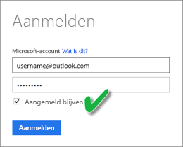

# Een gegevensset vernieuwen die is gemaakt van een CSV-bestand in OneDrive of SharePoint Online
## Wat zijn de voordelen?
Wanneer u verbinding maakt met een CSV-bestand op OneDrive of SharePoint Online maakt, wordt in Power BI een gegevensset gemaakt. Gegevens van het CSV-bestand worden vervolgens geïmporteerd in de gegevensset in Power BI. Power BI maakt vervolgens automatisch verbinding met het bestand en zorgt ervoor dat het wordt vernieuwd na eventuele wijzigingen in de gegevensset in Power BI. Als u het CSV-bestand in OneDrive of SharePoint Online hebt bewerkt, worden deze wijzigingen weergegeven in Power BI zodra u deze opslaat, meestal binnen ongeveer een uur. Alle visualisaties in Power BI op basis van de gegevensset worden tevens automatisch bijgewerkt.

Als de bestanden zich in een gedeelde map in OneDrive voor bedrijven of SharePoint Online bevinden, kunnen andere gebruikers aan hetzelfde bestand werken. Eventuele wijzigingen worden automatisch bijgewerkt in Power BI zodra deze zijn opgeslagen, meestal binnen een uur.

Veel organisaties voeren processen uit die automatisch databases doorzoeken op gegevens die vervolgens elke dag in een CSV-bestand worden opgeslagen. Als het bestand is opgeslagen op OneDrive of SharePoint Online en hetzelfde bestand elke dag wordt overschreven, in plaats van een nieuw bestand met een andere naam dat elke dag wordt gemaakt, kunt u in Power BI verbinding maken met dat bestand. Uw gegevensset die met het bestand verbonden is, wordt gesynchroniseerd zodra het bestand op OneDrive of SharePoint Online wordt bijgewerkt. Alle visualisaties op basis van de gegevensset worden tevens automatisch bijgewerkt.

## Wat wordt ondersteund?
Bestanden met door komma's gescheiden waarden zijn eenvoudige tekstbestanden, dus worden verbindingen met externe gegevensbronnen en -rapporten niet ondersteund. U kunt geen vernieuwing plannen van een gegevensset die is gemaakt van een bestand met door komma's gescheiden waarden. Wanneer het bestand zich echter op OneDrive of SharePoint Online bevindt, synchroniseert Power BI automatisch ongeveer elk uur eventuele wijzigingen in het bestand met de gegevensset.

## OneDrive of OneDrive voor Bedrijven. Wat is het verschil?
Als u zowel een persoonlijk OneDrive-account als een OneDrive voor Bedrijven-account hebt, kunt u het beste alle bestanden waarmee u in Power BI verbinding wilt maken in OneDrive voor Bedrijven bewaren. Waarom? Omdat u waarschijnlijk twee verschillende accounts gebruikt om u aan te melden.

Verbinding maken met OneDrive voor Bedrijven verloopt vaak zonder problemen in Power BI omdat het account waarmee u zich aanmeldt bij Power BI meestal hetzelfde account is als het account waarmee u zich aanmeldt bij OneDrive voor Bedrijven. Bij het persoonlijke OneDrive-account meldt u zich echter waarschijnlijk met een ander [Microsoft-account](https://account.microsoft.com) aan.

Zorg, wanneer u zich aanmeldt bij uw Microsoft-account, dat u Aangemeld blijven selecteert. Power BI kan vervolgens eventuele updates synchroniseren met de gegevenssets in Power BI

Als u in uw bestand in OneDrive wijzigingen aanbrengt die niet kunnen worden gesynchroniseerd met de gegevensset of rapporten in Power BI, bijvoorbeeld omdat de referenties voor uw Microsoft-account zijn gewijzigd, moet u opnieuw verbinding maken met het bestand en dit opnieuw importeren uit uw persoonlijke OneDrive.

## Wanneer het fout gaat
Als een wijziging in de gegevens in het CSV-bestand op OneDrive niet wordt doorgevoerd in Power BI, is het waarschijnlijk dat Power BI geen verbinding met uw OneDrive kan maken. Maak verbinding met het bestand en importeer het opnieuw. Zorg, als u wordt gevraagd om u aan te melden, dat u **Aangemeld blijven** selecteert.

## Volgende stappen
[Problemen met het vernieuwen van hulpprogramma's voor probleemoplossing](service-gateway-onprem-tshoot.md)
[Scenario’s voor het vernieuwen van probleemoplossing](refresh-troubleshooting-refresh-scenarios.md)

Nog vragen? [Misschien dat de Power BI-community het antwoord weet](https://community.powerbi.com/)

