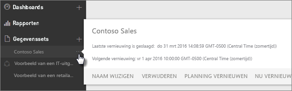
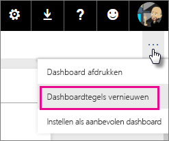
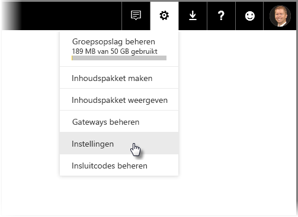
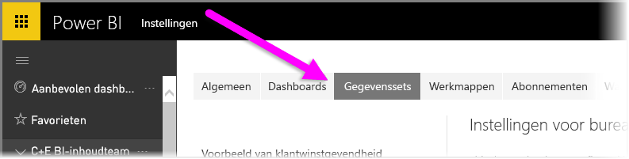
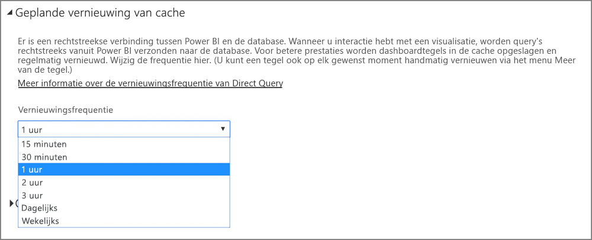

# Gegevens vernieuwen in Power BI
Het maken van de juiste keuzes is sterk afhankelijk van of u beschikt over de recentste gegevens. U hebt waarschijnlijk al de functie Gegevens ophalen in Power BI gebruikt om verbinding te maken met gegevens, gegevens te uploaden, en enkele rapporten en een dashboard te maken. Nu is het belangrijk om ervoor te zorgen dat uw gegevens echt actueel zijn.

In veel gevallen hoeft u hier helemaal niets voor te doen. Sommige gegevens, zoals uit een inhoudspakket van Salesforce of Marketo, worden automatisch voor u vernieuwd. Als uw verbinding gebruikmaakt van een live-verbinding of DirectQuery, zijn de gegevens ook altijd actueel. Maar in andere gevallen, zoals met een Excel-werkmap of Power BI Desktop-bestand dat verbinding maakt met een externe online- of on-premises gegevensbron, moet u handmatig vernieuwen of een schema voor gegevensvernieuwing instellen zodat de gegevens in uw rapporten en dashboards voor u worden vernieuwd door Power BI.

Dit artikel maakt deel uit van een reeks artikelen waarin wordt uitgelegd hoe het vernieuwen van gegevens echt werkt in Power BI, of u wel of niet een schema voor gegevensvernieuwing moet instellen en wat de vereisten zijn om uw gegevens te vernieuwen.

## Achtergrondinformatie over gegevensvernieuwing
Voordat u gegevensvernieuwing instelt, is het belangrijk om te begrijpen wat er wordt vernieuwd en waar uw gegevens vandaan komen.

Een *gegevensbron* is waar de gegevens die u verkent in rapporten en dashboards echt vandaan komen. Dit kan bijvoorbeeld een onlineservice zijn zoals Google Analytics of QuickBooks, een database in de cloud zoals Azure SQL Database, of een database of bestand op een lokale computer of server in uw eigen organisatie. Dit zijn allemaal gegevensbronnen. Het type gegevensbron bepaalt hoe de gegevens uit de bron worden vernieuwd. In de sectie [Wat kan er worden vernieuwd?](#what-can-be-refreshed) verderop in dit artikel bespreken we voor elk type gegevensbron wat vernieuwen precies inhoudt.

In Power BI wordt automatisch een *gegevensset* gemaakt wanneer u met de functie Gegevens ophalen verbinding maakt met gegevens om deze te uploaden uit een inhoudspakket, maar u kunt ook verbinding maken met een live-gegevensbron. In Power BI Desktop en Excel 2016 kunt u een bestand ook rechtstreeks publiceren naar de Power BI-service, wat hetzelfde effect heeft als de functie Gegevens ophalen.

In beide gevallen wordt er een gegevensset gemaakt die wordt weergegeven in de container Mijn werkruimte of Groep in de Power BI-service. Wanneer u het **beletselteken (...)** voor een gegevensset selecteert, kunt u de gegevens verkennen in een rapport, instellingen bewerken en gegevensvernieuwing instellen.

Een dataset kan gegevens ophalen uit een of meer gegevensbronnen. U kunt bijvoorbeeld Power BI Desktop gebruiken om gegevens op te halen uit een SQL-database in uw organisatie, maar ook om andere gegevens op te halen uit een online-OData-feed. Als u het bestand vervolgens naar Power BI publiceert, wordt er één gegevensset gemaakt, maar deze heeft wel gegevensbronnen voor zowel de SQL-database als de OData-feed.

Een gegevensset bevat informatie over de gegevensbronnen, referenties voor de gegevensbronnen en in de meeste gevallen ook een subset van gegevens die uit de gegevensbron zijn gekopieerd. Als u visualisaties maakt in rapporten en dashboards, kijkt u naar gegevens in de gegevensset. In het geval van een live-verbinding zoals Azure SQL Database, bepaalt de gegevensset welke gegevens u rechtstreeks ziet uit de gegevensbron. Voor een live-verbinding met Analysis Services komt de definitie van de gegevensset rechtstreeks uit Analysis Services.

> *Als u gegevens vernieuwt, voert u een bewerking uit op de gegevens in de gegevensset die in Power BI is opgeslagen uit uw gegevensbron. Hierbij worden alle gegevens vernieuwd en is er dus geen sprake van een incrementele update van de gegevens.*
> 
> 

Wanneer u gegevens in een dataset vernieuwt met de opdracht Nu vernieuwen of door het instellen van een schema voor gegevensvernieuwing, gebruikt Power BI informatie in de gegevensset om verbinding te maken met de gegevensbronnen die voor de set zijn gedefinieerd, waarna de bijgewerkte gegevens in de gegevensset worden geladen. Eventuele visualisaties in uw rapporten of dashboards die op die gegevens zijn gebaseerd, worden automatisch bijgewerkt.

Voordat we verdergaan, is er nog iets anders dat zeer belangrijk is:

> *Ongeacht hoe vaak u de gegevensset vernieuwt, of hoe vaak u live-gegevens bekijkt, zijn het de gegevens in de gegevensbron die up-to-date moeten zijn.*
> 
> 

De meeste organisaties verwerken hun gegevens eenmaal per dag, meestal in de avonduren. Als u gegevensvernieuwing plant voor een gegevensset die is gemaakt van een Power BI Desktop-bestand dat verbinding maakt met een on-premises database, en verwerking van de SQL-database eenmaal per dag in de avonduren is gepland, hoeft u de geplande gegevensvernieuwing ook maar eenmaal per dag uit te voeren. Dit kan zijn nadat de verwerking van de database is voltooid, maar voordat de volgende werkdag begint. Natuurlijk zijn er heel veel andere scenario's mogelijk. Power BI biedt allerlei manieren om verbinding te maken met gegevensbronnen die regelmatig of zelfs in real-time worden bijgewerkt.

## Soorten gegevensvernieuwing
Er kan in Power BI onderscheid worden gemaakt tussen vier soorten gegevensvernieuwing: van pakket, van model/ gegevens, van tegels en van visuele containers.

### Pakket vernieuwen
Hiermee wordt een bestand van Power BI Desktop of Excel gesynchroniseerd tussen de Power BI-service en OneDrive of SharePoint Online. Er worden geen gegevens opgehaald uit de oorspronkelijke gegevensbron. De gegevensset in Power BI wordt alleen bijgewerkt met wat er in het bestand staat in OneDrive of SharePoint Online.

### Model/gegevens vernieuwen
Dit type verwijst naar het vernieuwen van de gegevensset, binnen de Power BI-service, met gegevens uit de oorspronkelijke gegevensbron. Dit wordt gedaan met behulp van een geplande vernieuwing of met de opdracht Nu vernieuwen. Dit vereist een gateway voor on-premises gegevensbronnen.

### Tegels vernieuwen
Met dit type vernieuwing wordt de cache met visuele elementen voor tegels in het dashboard bijgewerkt wanneer de gegevens zijn gewijzigd. Dit gebeurt ongeveer elke vijftien minuten. U kunt het vernieuwen van tegels ook afdwingen door het **beletselteken (...)**  in de rechterbovenhoek van een dashboard te selecteren en vervolgens **Dashboardtegels vernieuwen** te selecteren.

Zie [Problemen met tegelfouten oplossen](refresh-troubleshooting-tile-errors.md) voor meer informatie over algemene fouten bij het vernieuwen van tegels.

### Visuele containers vernieuwen
Het vernieuwen van de visuele containers houdt in dat de visuele rapportelementen in de cache, binnen een rapport, worden bijgewerkt wanneer de gegevens zijn gewijzigd.

## Wat kan er worden vernieuwd?
In Power BI gebruikt u meestal de opdracht Gegevens ophalen om gegevens te importeren uit een bestand op een lokaal station, OneDrive of SharePoint Online, een rapport te publiceren in Power BI Desktop of rechtstreeks verbinding te maken met een database in de cloud in uw eigen organisatie. Bijna alle gegevens in Power BI kunnen worden vernieuwd, maar of dit nodig is, hangt af van de manier waarop de gegevensset is gemaakt en hoe deze is verbonden met de gegevensbronnen. Laten we eens kijken hoe gegevens worden vernieuwd in verschillende scenario's.

Voordat we verdergaan, geven we een overzicht van enkele belangrijke definities die u moet begrijpen:

**Automatisch vernieuwen**: Dit betekent dat er geen gebruikersconfiguratie nodig is om de gegevensset regelmatig te vernieuwen. De instellingen voor gegevensvernieuwing worden voor u geconfigureerd door Power BI. Providers van onlineservices vernieuwen hun gegevens meestal één keer per dag. In het geval van bestanden die worden geladen uit OneDrive vindt er elk uur automatische vernieuwing plaats voor gegevens die niet afkomstig zijn uit een externe gegevensbron. Hoewel u verschillende instellingen voor automatisch en handmatig vernieuwen kunt configureren, is dit waarschijnlijk niet nodig.

**Door gebruiker geconfigureerde handmatige of geplande vernieuwing**: Dit betekent dat u een gegevensset handmatig kunt vernieuwen met behulp van de opdracht Nu vernieuwen of een schema voor gegevensvernieuwing kunt instellen met behulp van de opdracht Vernieuwen plannen in de instellingen van een gegevensset. Dit type gegevensvernieuwing is vereist voor Power BI Desktop-bestanden en Excel-werkmappen die verbinding maken met externe online- en on-premises gegevensbronnen.

> [!NOTE]
> Wanneer u een tijdstip configureert voor geplande vernieuwing, kan er een vertraging van maximaal één uur optreden voordat deze wordt gestart.
> 
> 

**Live-/DirectQuery**: Dit betekent dat er een live-verbinding is tussen Power BI en de gegevensbron. Voor on-premises gegevensbronnen moeten beheerders een gegevensbron configureren in een gateway van de organisatie, maar tussenkomst van de gebruiker is mogelijk niet nodig.

> [!NOTE]
> Om de prestaties te verbeteren, worden dashboards met gegevens die zijn verbonden via DirectQuery automatisch bijgewerkt. U kunt een tegel ook op elk gewenst moment handmatig vernieuwen via het menu **Meer** van de tegel.
> 
> 

## Lokale bestanden en bestanden in OneDrive of SharePoint Online
Gegevensvernieuwing wordt ondersteund voor Power BI Desktop-bestanden en Excel-werkmappen die verbinding maken met externe online- of on-premises gegevensbronnen. Hiermee worden alleen de gegevens vernieuwd voor de gegevensset in de Power BI-service. Het lokale bestand wordt niet bijgewerkt.

U krijgt de beschikking over zeer veel flexibiliteit als u uw bestanden opslaat in OneDrive of SharePoint Online en dan vanuit Power BI verbinding met de bestanden maakt. Maar deze flexibiliteit zorg er ook voor dat dit een van de lastigste scenario's kan zijn om te begrijpen. Geplande vernieuwing voor bestanden die zijn opgeslagen in OneDrive of SharePoint Online, is anders dan pakketvernieuwing. In de sectie [Soorten gegevensvernieuwing](#types-of-refresh) kunt u hier meer over lezen.

### Power BI Desktop-bestand
| **Gegevensbron** | **Automatische vernieuwing** | **Door gebruiker geconfigureerde handmatige of geplande vernieuwing** | **Gateway vereist** |
| --- | --- | --- | --- |
| De opdracht Gegevens ophalen (op het lint) wordt gebruikt om verbinding te maken met gegevens uit vermelde online-gegevensbronnen en om deze gegevens op te vragen. |Nee |Ja |Nee (zie hieronder) |
| De opdracht Gegevens ophalen wordt gebruikt om verbinding te maken met een live-database van Analysis Services en om deze gegevens te verkennen. |Ja |Nee |Ja |
| De opdracht Gegevens ophalen wordt gebruikt om verbinding te maken met een ondersteunde on-premises DirectQuery-gegevensbron en om deze gegevens te verkennen. |Ja |Nee |Ja |
| De opdracht Gegevens ophalen wordt gebruikt om verbinding te maken met gegevens uit Azure SQL Database, Azure SQL Data Warehouse of Azure HDInsight Spark en om deze gegevens op te vragen. |Ja (elk uur) |Nee |Nee |
| De opdracht Gegevens ophalen wordt gebruikt om verbinding te maken met gegevens uit een genoemde on-premises gegevensbron en om deze gegevens op te vragen, met uitzondering van Hadoop-bestanden (HDFS) en Microsoft Exchange. |Nee |Ja |Ja |

> [!NOTE]
> Als u de functie [**Web.Page**](https://msdn.microsoft.com/library/mt260924.aspx) gebruikt, hebt u geen gateway nodig als u de gegevensset of het rapport na 18 november 2016 opnieuw hebt gepubliceerd.
> 
> 

Meer informatie kunt u lezen in [Een gegevensset vernieuwen die is gemaakt van een Power BI Desktop-bestand in OneDrive](refresh-desktop-file-onedrive.md).

### Excel-werkmap
| **Gegevensbron** | **Automatische vernieuwing** | **Door gebruiker geconfigureerde handmatige of geplande vernieuwing** | **Gateway vereist** |
| --- | --- | --- | --- |
| Tabellen met gegevens in een werkblad dat niet is geladen in het Excel-gegevensmodel. |Ja, elk uur *(alleen OneDrive/SharePoint Online)* |Alleen handmatig *(alleen OneDrive/SharePoint Online)* |Nee |
| Tabellen met gegevens in een werkblad dat is gekoppeld aan een tabel in het Excel-gegevensmodel (gekoppelde tabellen). |Ja, elk uur *(alleen OneDrive/SharePoint Online)* |Alleen handmatig *(alleen OneDrive/SharePoint Online)* |Nee |
| Power Query* wordt gebruikt om verbinding maken met gegevens uit vermelde online-gegevensbronnen, om deze gegevens op te vragen en om gegevens te laden in het Excel-gegevensmodel. |Nee |Ja |Nee |
| Power Query* wordt gebruikt om verbinding te maken met een genoemde on-premises gegevensbron, met uitzondering van Hadoop-bestanden (HDFS) en Microsoft Exchange, om deze gegevens op te vragen en om gegevens te laden in het Excel-gegevensmodel. |Nee |Ja |Ja |
| Power Pivot wordt gebruikt om verbinding maken met gegevens uit vermelde online-gegevensbronnen, om deze gegevens op te vragen en om gegevens te laden in het Excel-gegevensmodel. |Nee |Ja |Nee |
| Power Pivot wordt gebruikt om verbinding maken met gegevens uit vermelde on-premises gegevensbronnen, om deze gegevens op te vragen en om gegevens te laden in het Excel-gegevensmodel. |Nee |Ja |Ja |

*\*Power Query staat in Excel 2016 bekend onder de naam Gegevens ophalen en transformeren.*

Meer gedetailleerde informatie vindt u in [Een gegevensset vernieuwen die is gemaakt op basis van een Excel-werkmap in OneDrive](refresh-excel-file-onedrive.md).

### Bestand met door komma's gescheiden waarden (.csv) in OneDrive of SharePoint Online
| **Gegevensbron** | **Automatische vernieuwing** | **Door gebruiker geconfigureerde handmatige of geplande vernieuwing** | **Gateway vereist** |
| --- | --- | --- | --- |
| Eenvoudige, door komma's gescheiden waarden |Ja (elk uur) |Alleen handmatig |Nee |

Zie [Een gegevensset vernieuwen die is gemaakt op basis van een CSV-bestand (door komma's gescheiden waarden) in OneDrive](refresh-csv-file-onedrive.md) voor meer informatie.

## Inhoudspakketten
Er zijn twee soorten inhoudspakketten in Power BI:

**Inhoudspakketten van onlineservices**: zoals Adobe Analytics, SalesForce en Dynamics CRM Online. Gegevenssets die zijn gemaakt op basis van onlineservices worden automatisch één keer per dag vernieuwd. Hoewel dit waarschijnlijk niet nodig is, kunt u de gegevens handmatig vernieuwen of een schema voor gegevensvernieuwing instellen. Omdat onlineservices zich in de cloud bevinden, is een gateway niet vereist.

**Organisatie-inhoudspakketten**: deze worden gemaakt en gedeeld door gebruikers in uw eigen organisatie. Gebruikers van inhoudspakketten kunnen geen schema voor gegevensvernieuwing instellen of handmatig vernieuwen. Alleen de maker van het inhoudspakket kan vernieuwen instellen voor de gegevenssets in het inhoudspakket. Instellingen voor vernieuwen worden overgenomen met de gegevensset.

### Inhoudspakketten uit onlineservices
| **Gegevensbron** | **Automatische vernieuwing** | **Door gebruiker geconfigureerde handmatige of geplande vernieuwing** | **Gateway vereist** |
| --- | --- | --- | --- |
| Onlineservices in Gegevens ophalen &gt; Services |Ja |Ja |Nee |

### Organisatie-inhoudspakketten
De mogelijkheden voor het vernieuwen van gegevens voor een gegevensset die is opgenomen in een organisatie-inhoudspakket verschillen per gegevensset. Zie de informatie hierboven over lokale bestanden, OneDrive of SharePoint Online.

Zie [Inleiding tot organisatie-inhoudspakketten](service-organizational-content-pack-introduction.md) voor meer informatie.

## Live-verbindingen en DirectQuery voor on-premises gegevensbronnen
Met de on-premises gegevensgateway kunt u vanuit Power BI query's uitvoeren op de on-premises gegevensbronnen. Wanneer u interactie hebt met een visualisatie, worden query's rechtstreeks vanuit Power BI verzonden naar de database. Er worden dan bijgewerkte gegevens geretourneerd en de visualisaties worden bijgewerkt. Omdat er een rechtstreekse verbinding bestaat tussen Power BI en de database, is het niet nodig om gegevensvernieuwing te plannen.

Wanneer u een live-verbinding gebruikt om verbinding te maken met een gegevensbron van SQL Service Analysis Services (SSAS), in plaats van DirectQuery, kan de live-verbinding met een SSAS-bron verlopen via de cache, zelfs bij het laden van een rapport. Dit gedrag zorgt ervoor dat het rapport sneller kan worden geladen. U kunt de meest recente gegevens uit de SSAS-gegevensbron opvragen via de knop **Vernieuwen**. Eigenaren van SSAS-gegevensbronnen kunnen de vernieuwingsfrequentie voor de cache van de gegevensset configureren om ervoor te zorgen dat rapporten zo actueel zijn als nodig is. 

Wanneer u een gegevensbron configureert met de on-premises gegevensgateway, kunt u deze gegevensbron gebruiken als de optie voor geplande vernieuwing. In deze configuratie wordt de persoonlijke gateway dan niet gebruikt.

> [!NOTE]
> Als uw gegevensset is geconfigureerd voor een live- of DirectQuery-verbinding, worden gegevenssets ongeveer elk uur vernieuwd of wanneer er interactie plaatsvindt met de gegevens. U kunt de *vernieuwingsfrequentie* handmatig aanpassen met de optie *Geplande vernieuwing van cache* in de Power BI-service.
> 
> 

| **Gegevensbron** | **Live/DirectQuery** | **Door gebruiker geconfigureerde handmatige of geplande vernieuwing** | **Gateway vereist** |
| --- | --- | --- | --- |
| Tabel van Analysis Services |Ja |Ja |Ja |
| Multidimensionale database van Analysis Services |Ja |Ja |Ja |
| SQL Server |Ja |Ja |Ja |
| SAP HANA |Ja |Ja |Ja |
| Oracle |Ja |Ja |Ja |
| Teradata |Ja |Ja |Ja |

Zie [On-premises gegevensgateway](service-gateway-onprem.md) voor meer informatie.

## Databases in de cloud
Met DirectQuery is er een rechtstreekse verbinding tussen Power BI en de database in de cloud. Wanneer u interactie hebt met een visualisatie, worden query's rechtstreeks vanuit Power BI verzonden naar de database. Er worden dan bijgewerkte gegevens geretourneerd en de visualisaties worden bijgewerkt. Omdat zowel de Power BI-service als de gegevensbron zich in de cloud bevindt, is er geen behoefte aan een persoonlijke gateway.

Als er geen interactie van de gebruiker is in een visualisatie, worden gegevens ongeveer elk uur automatisch vernieuwd. U kunt deze vernieuwingsfrequentie wijzigen met behulp van de optie *Geplande vernieuwing van cache*.

Als u de frequentie wilt instellen, selecteert u het **tandwiel** in de rechterbovenhoek van de Power BI-service en selecteert u vervolgens **Instellingen**.

De pagina **Instellingen** wordt weergegeven, waar u de gegevensset kunt selecteren waarvoor u de frequentie wilt aanpassen. Selecteer op deze pagina bovenaan het tabblad **Gegevenssets**.

Selecteer de gegevensset en u ziet in het deelvenster aan de rechterkant een aantal opties voor deze dataset. Voor de DirectQuery/live-verbinding kunt u de vernieuwingsfrequentie met behulp van de bijbehorende vervolgkeuzelijst instellen op een waarde tussen 15 minuten en wekelijks, zoals weergegeven in de volgende afbeelding.

| **Gegevensbron** | **Live/DirectQuery** | **Door gebruiker geconfigureerde handmatige of geplande vernieuwing** | **Gateway vereist** |
| --- | --- | --- | --- |
| SQL Azure Data Warehouse |Ja |Ja |Nee |
| Spark in HDInsight |Ja |Ja |Nee |

Zie [Azure en Power BI](service-azure-and-power-bi.md) voor meer informatie.

## Realtime-dashboards
Gegevens in realtime-dashboards worden up-to-date gehouden met behulp van de Microsoft Power BI REST-API of Microsoft Stream Analytics. Aangezien het voor realtime-dashboards niet nodig is dat gebruikers de vernieuwingsfrequentie configureren, worden deze dashboards hier niet uitvoerig besproken.

| **Gegevensbron** | **Automatisch** | **Door gebruiker geconfigureerde handmatige of geplande vernieuwing** | **Gateway vereist** |
| --- | --- | --- | --- |
| Aangepaste apps ontwikkeld met de Power BI Rest-API of Microsoft Stream Analytics |Ja, live streamen |Nee |Nee |

Zie [Een realtime-dashboard maken in Power BI](https://msdn.microsoft.com/library/mt267603.aspx) voor meer informatie.

## Geplande vernieuwing configureren
Zie [Geplande vernieuwing configureren](refresh-scheduled-refresh.md) voor meer informatie over het configureren van geplande vernieuwing van gegevens.

## Algemene scenario's voor gegevensvernieuwing
Soms is de beste manier om meer te leren over het vernieuwen van gegevens in Power BI te kijken naar voorbeelden. Hier volgen enkele van de meest voorkomende scenario's voor het vernieuwen van gegevens:

### Excel-werkmap met tabellen met gegevens
U hebt een Excel-werkmap met meerdere tabellen met gegevens, maar geen van de tabellen is in het gegevensmodel van Excel geladen. U gebruikt de opdracht Gegevens ophalen om het werkmapbestand van de lokale schijf naar Power BI te uploaden en een dashboard te maken. U hebt nu echter op de lokale schijf wat wijzigingen doorgevoerd in een paar tabellen van de werkmap en u wilt uw dashboard in Power BI bijwerken met de nieuwe gegevens.

Helaas wordt vernieuwen niet ondersteund in dit scenario. Om de gegevensset voor het dashboard te vernieuwen, moet u de werkmap opnieuw uploaden. Er is echter een prima oplossing: sla het werkmapbestand op in OneDrive of SharePoint Online.

Als u verbinding maakt met een bestand in OneDrive of SharePoint Online, bevatten uw rapporten en dashboards gegevens zoals deze in het bestand zijn opgenomen. In dit geval uw Excel-werkmap. Power BI controleert het bestand automatisch, ongeveer elk uur, op updates. Als u wijzigingen aanbrengt in de werkmap (opgeslagen in OneDrive of SharePoint Online), worden deze wijzigingen binnen een uur doorgevoerd in uw dashboard en rapporten. U hoeft dus helemaal geen gegevensvernieuwing in te stellen. Als u de wijzigingen echter direct moet zien in Power BI, kunt u de gegevensset handmatig vernieuwen met behulp van de opdracht Nu vernieuwen.

Meer informatie vindt u in [Excel-gegevens in Power BI](service-excel-workbook-files.md) of [Een gegevensset vernieuwen die is gemaakt op basis van een Excel-werkmap in OneDrive](refresh-excel-file-onedrive.md).

### Excel-werkmap die verbinding maakt met een SQL-database in uw bedrijf
Stel dat u een Excel-werkmap met de naam Verkooprapport.xlsx hebt op uw lokale computer. Power Query in Excel is gebruikt om verbinding te maken met een SQL-database op een server in uw bedrijf en een query uit te voeren op verkoopgegevens die in het gegevensmodel zijn geladen. Elke morgen opent u de werkmap en klikt u op Vernieuwen om de draaitabellen bij te werken.

U wilt de verkoopgegevens nu in Power BI verkennen, dus u gebruikt Gegevens ophalen om verbinding te maken met de werkmap Verkooprapport.xlsx en deze te uploaden vanaf de lokale schijf.

In dit geval kunt u de gegevens in de gegevensset Verkooprapport.xlsx handmatig vernieuwen of een schema voor gegevensvernieuwing instellen. Omdat de gegevens uiteindelijk afkomstig zijn uit de SQL-database in uw bedrijf, moet u een gateway downloaden en installeren. Nadat u de gateway hebt geïnstalleerd en geconfigureerd, gaat u naar de instellingen van de gegevensset Verkooprapport en meldt u zich aan bij gegevensbron. Dit hoeft u overigens maar één keer te doen. U kunt vervolgens een schema voor vernieuwing instellen, zodat Power BI automatisch verbinding maakt met de SQL-database en bijgewerkte gegevens ophaalt. Uw rapporten en dashboards worden ook automatisch bijgewerkt.

> [!NOTE]
> Hiermee worden alleen de gegevens vernieuwd in de gegevensset in de Power BI-service. Het lokale bestand wordt niet bijgewerkt.
> 
> 

Meer informatie vindt u in [Excel-gegevens in Power BI](service-excel-workbook-files.md), [Power BI Gateway - Personal](personal-gateway.md), [On-premises gegevensgateway](service-gateway-onprem.md), [Een gegevensset vernieuwen die is gemaakt op basis van een Excel-werkmap op een lokaal station](refresh-excel-file-local-drive.md).

### Power BI Desktop-bestand met gegevens uit een OData-feed
In dit geval gebruikt u Gegevens ophalen in Power BI Desktop om verbinding te maken met tellinggegevens in een OData-feed en deze te importeren.  U maakt verschillende rapporten in Power BI Desktop, geeft het bestand de naam WACensus en slaat het op in een share van uw bedrijf. U publiceert het bestand vervolgens naar de Power BI-service.

In dit geval kunt u de gegevens in de gegevensset WACensus handmatig vernieuwen of een schema voor gegevensvernieuwing instellen. Omdat de gegevens in de gegevensbron afkomstig zijn uit een online-OData-feed, hoeft u geen gateway te installeren. U moet wel naar de instellingen van de gegevensset WACensus gaan en u aanmelden bij de OData-gegevensbron. U kunt vervolgens een schema voor vernieuwing instellen, zodat Power BI automatisch verbinding maakt met de OData-feed en bijgewerkte gegevens ophaalt. Uw rapporten en dashboards worden ook automatisch bijgewerkt.

Meer informatie vindt u in [Publiceren vanuit Power BI Desktop](desktop-upload-desktop-files.md), [Een gegevensset vernieuwen die is gemaakt op basis van een Power BI Desktop-bestand op een lokaal station](refresh-desktop-file-local-drive.md) en [Een gegevensset vernieuwen die is gemaakt op basis van een Power BI Desktop-bestand in OneDrive](refresh-desktop-file-onedrive.md).

### Gedeeld inhoudspakket van een andere gebruiker in uw organisatie
U hebt verbinding gemaakt met een organisatie-inhoudspakket. Het pakket bevat een dashboard, diverse rapporten en een dataset.

In dit scenario kunt u geen vernieuwing voor de gegevensset instellen. Het is de verantwoordelijkheid van de gegevensanalist die het inhoudspakket heeft gemaakt, om ervoor te zorgen dat de gegevensset wordt vernieuwd, afhankelijk van de gebruikte gegevensbronnen.

Als de dashboards en rapporten uit het inhoudspakket niet worden bijgewerkt, moet u contact opnemen met de gegevensanalist die het inhoudspakket heeft samengesteld.

Zie [Inleiding tot inhoudspakketten van uw organisatie](service-organizational-content-pack-introduction.md) en [Werken met organisatie-inhoudspakketten](service-organizational-content-pack-copy-refresh-access.md) voor meer informatie.

### Inhoudspakket van een onlineserviceprovider zoals Salesforce
In Power BI hebt u de opdracht Gegevens ophalen gebruikt om verbinding te maken met gegevens van een onlineserviceprovider zoals Salesforce en om deze gegevens te importeren. In dat geval valt er hier weinig te doen. Uw Salesforce-gegevensset wordt namelijk automatisch één keer per dag vernieuwd. 

Net als bij de meeste onlineserviceproviders, worden gegevens eenmaal per dag bijgewerkt door Salesforce, meestal 's nachts. U kunt de Salesforce-gegevensset handmatig vernieuwen of een schema voor gegevensvernieuwing instellen, maar dit is niet nodig omdat de gegevensset automatisch wordt vernieuwd door Power BI, evenals uw rapporten en dashboards.

Zie [Salesforce-inhoudspakket voor Power BI](service-connect-to-salesforce.md) voor meer informatie.

## Problemen oplossen
Als er problemen zijn, komt dit meestal omdat Power BI niet kan worden aangemeld bij gegevensbronnen of omdat de gegevensset verbinding maakt met een on-premises gegevensbron terwijl de gateway offline is. Controleer eerst of Power BI kan worden aangemeld bij gegevensbronnen. Als het wachtwoord voor aanmelding bij een gegevensbron is veranderd, of als Power BI wordt afgemeld bij een gegevensbron, probeert u eerst om opnieuw aan te melden bij de gegevensbronnen met de gegevensbronreferenties.

Zie [Problemen oplossen met on-premises gateway](service-gateway-onprem-tshoot.md) en [Problemen met vernieuwingsscenario's oplossen](refresh-troubleshooting-refresh-scenarios.md) voor meer informatie over het oplossen van problemen.

## Volgende stappen
[Problemen oplossen met on-premises gateway](service-gateway-onprem-tshoot.md)  
[Problemen met vernieuwingsscenario's oplossen](refresh-troubleshooting-refresh-scenarios.md)  
[Power BI Gateway - Personal](personal-gateway.md)  
[On-premises gegevensgateway](service-gateway-onprem.md)  

Nog vragen? [Misschien dat de Power BI-community het antwoord weet](http://community.powerbi.com/)

