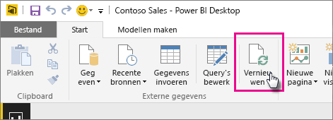

# Een gegevensset vernieuwen die is gemaakt van een Power BI Desktop-bestand op een lokaal station
## Wat wordt ondersteund?
In Power BI worden Nu vernieuwen en Vernieuwen plannen ondersteund voor gegevenssets die worden gemaakt vanuit Power BI Desktop-bestanden die worden geïmporteerd van een lokaal station, waarbij Gegevens ophalen/Query-editor wordt gebruikt om verbinding te maken met en gegevens te laden uit een van de volgende gegevensbronnen:

### Power BI Gateway - persoonlijk
* Alle onlinegegevensbronnen die worden weergegeven in Gegevens ophalen en Query-editor in Power BI Desktop.
* Alle on-premises gegevensbronnen die worden weergegeven in Gegevens ophalen en Query-editor in Power BI Desktop, met uitzondering van Hadoop-bestanden (HDFS) en Microsoft Exchange.

<!-- Refresh Data sources-->
[!INCLUDE [refresh-datasources](./includes/refresh-datasources.md)]

> [!NOTE]
> Er moet een gateway geïnstalleerd en actief zijn om in Power BI verbinding te kunnen maken met on-premises gegevensbronnen en de gegevensset te kunnen vernieuwen.
> 
> 

U kunt de gegevens eenmalig handmatig vernieuwen in Power BI Desktop door Vernieuwen te selecteren op het tabblad Start in het lint. Wanneer u hier Vernieuwen selecteert, worden de gegevens in het model van het *bestand* vernieuwd met de bijgewerkte gegevens van de oorspronkelijke gegevensbron. Deze methode van vernieuwen, geheel vanuit de toepassing Power BI Desktop zelf, is iets anders dan het handmatig of gepland vernieuwen in Power BI. Het is belangrijk dat u dit verschil begrijpt.

Wanneer u uw Power BI Desktop-bestand importeert van een lokaal station, worden de gegevens, samen met andere informatie over het model, geladen in een gegevensset in de Power BI-service. In de Power BI-service (niet in Power BI Desktop) wilt u de gegevens in de gegevensset vernieuwen, omdat uw rapporten in de Power BI-service daarop gebaseerd zijn. Omdat de gegevensbronnen extern zijn, kunt u de gegevensset handmatig vernieuwen met **Nu vernieuwen** of een vernieuwingsschema instellen met **Vernieuwen plannen**.

Wanneer u de gegevensset vernieuwt, wordt in Power BI geen verbinding gemaakt met het bestand op het lokale station om de bijgewerkte gegevens op te halen. De informatie in de gegevensset wordt gebruikt om rechtstreeks verbinding te maken met de gegevensbronnen, de bijgewerkte gegevens op te halen en deze vervolgens in de gegevensset te laden.

> [!NOTE]
> De vernieuwde gegevens in de gegevensset worden niet gesynchroniseerd naar het bestand op het lokale station.
> 
> 

## Hoe kan ik het vernieuwen plannen?
Wanneer u een vernieuwingsschema instelt, maakt Power BI rechtstreeks verbinding met de gegevensbronnen met behulp van de verbindingsgegevens en referenties in de gegevensset om eventuele bijgewerkte gegevens op te halen en in de gegevensset te laden. Alle visualisaties in rapporten en dashboards die zijn gebaseerd op die gegevensset in de Power BI-service, worden ook bijgewerkt.

Zie [Het plannen van de vernieuwing configureren](refresh-scheduled-refresh.md) voor meer informatie over het instellen van de planning voor een vernieuwing.

## Wanneer het fout gaat
Als er iets fout gaat, komt dit meestal doordat Power BI niet kan worden aangemeld bij gegevensbronnen of doordat de gegevensset verbinding maakt met een on-premises gegevensbron terwijl de gateway offline is. Controleer eerst of Power BI kan worden aangemeld bij gegevensbronnen. Als het wachtwoord voor aanmelding bij een gegevensbron is veranderd, of als Power BI wordt afgemeld bij een gegevensbron, probeert u eerst om opnieuw aan te melden bij de gegevensbronnen met de gegevensbronreferenties.

Laat de optie **Mij e-mail met melding voor mislukte vernieuwing sturen** ingeschakeld. U wilt het immers direct weten als een geplande vernieuwing mislukt.

## Problemen oplossen
Soms gaat het vernieuwen van gegevens niet zoals u verwacht. Meestal komt dat door een probleem met een gateway. Zie de artikelen over het oplossen van problemen met de gateway voor informatie over hulpprogramma's en bekende problemen.

[Problemen met de on-premises gegevensgateway oplossen](service-gateway-onprem-tshoot.md)

[Problemen met Power BI Gateway - Personal oplossen](service-admin-troubleshooting-power-bi-personal-gateway.md)

Hebt u nog vragen? [Misschien dat de Power BI-community het antwoord weet](http://community.powerbi.com/)

