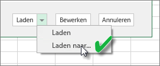

# Een gegevensset vernieuwen die is gemaakt van een Excel-werkmap op een lokaal station
## Wat wordt ondersteund?
In Power BI worden Nu vernieuwen en Vernieuwen plannen ondersteund voor gegevenssets die worden gemaakt vanuit Excel-werkmappen die worden geïmporteerd van een lokaal station, waarbij Power Query (gegevens ophalen/transformeren in Excel 2016) of Power Pivot wordt gebruikt om verbinding te maken met één van de volgende gegevensbronnen en gegevens te uploaden naar het Excel-gegevensmodel:  

### Power BI Gateway - Personal
* Alle onlinegegevensbronnen die worden weergegeven in Power Query.
* Alle on-premises gegevensbronnen die worden weergegeven in Power Query, met uitzondering van Hadoop-bestanden (HDFS) en Microsoft Exchange.
* Alle onlinegegevensbronnen die worden weergegeven in Power Pivot.\*
* Alle on-premises gegevensbronnen die worden weergegeven in Power Pivot, met uitzondering van Hadoop-bestanden (HDFS) en Microsoft Exchange.

<!-- Refresh Data sources-->
[!INCLUDE [refresh-datasources](./includes/refresh-datasources.md)]

> **Opmerkingen:**  
> 
> * Power BI kan alleen verbinding maken met on-premises gegevensbronnen en de gegevensset vernieuwen als een gateway is geïnstalleerd en actief is.
> * Als u Excel 2013 gebruikt, zorgt u ervoor dat u Power Query hebt bijgewerkt naar de nieuwste versie.
> * Vernieuwen wordt niet ondersteund voor Excel-werkmappen die zijn geïmporteerd van een lokaal station waar gegevens alleen bestaan in werkbladen of gekoppelde tabellen. Vernieuwen wordt ondersteund voor werkbladgegevens als deze gegevens worden opgeslagen op en geïmporteerd uit OneDrive. Zie [Een gegevensset vernieuwen die is gemaakt van een Excel-werkmap in OneDrive of SharePoint Online](refresh-excel-file-onedrive.md) voor meer informatie.
> * Als u een gegevensset vernieuwt die is gemaakt op basis van een Excel-werkmap, geïmporteerd van een lokaal station, worden alleen de gegevens die zijn opgevraagd uit gegevensbronnen vernieuwd. Als u de structuur van het gegevensmodel wijzigt in Excel of Power Pivot - als u bijvoorbeeld een nieuwe meting maakt of u de naam van een kolom wijzigt - worden deze wijzigingen niet gekopieerd naar de gegevensset. Als u dergelijke wijzigingen aanbrengt, moet u de werkmap opnieuw uploaden of publiceren. Als u verwacht regelmatig wijzigingen aan te brengen aan de structuur van uw werkmap en u wilt dat deze in de gegevensset in Power BI worden weergegeven zonder opnieuw te hoeven uploaden, plaatst u uw werkmap op OneDrive. De structuur en de werkbladgegevens uit werkmappen die zijn opgeslagen op en worden geïmporteerd uit OneDrive worden automatisch door Power BI vernieuwd.
> 
> 

## Hoe kan ik ervoor zorgen dat gegevens in het Excel-gegevensmodel worden geladen?
Wanneer u Power Query gebruikt (Gegevens ophalen en transformeren in Excel 2016) om verbinding te maken met een gegevensbron, zijn er verschillende locaties mogelijk voor het laden van gegevens. Wanneer u gegevens wilt laden in het gegevensmodel, moet u de optie **Deze gegevens toevoegen aan het gegevensmodel** selecteren in het dialoogvenster **Laden naar**.

> [!NOTE]
> In de volgende afbeeldingen ziet u voorbeelden uit Excel 2016.
> 
> 

Klik in **Navigator** op de optie **Laden naar...**  
    

U kunt in Navigator ook op **Bewerken** klikken om de Query-editor te openen. Daar kunt u op **Sluiten en laden naar....** klikken  
    

Selecteer vervolgens in **Laden naar** de optie **Deze gegevens toevoegen aan het gegevensmodel**.  
    

### Kan ik ook Externe gegevens ophalen in Power Pivot gebruiken?
Geen enkel probleem. Wanneer u Power Pivot gebruikt om verbinding te maken met een on-premises of online gegevensbron en om gegevens hieruit op te halen, worden de gegevens automatisch in het gegevensmodel geladen.

## Hoe kan ik een vernieuwing plannen?
Wanneer u een vernieuwingsschema instelt, maakt Power BI rechtstreeks verbinding met de gegevensbronnen met behulp van de verbindingsgegevens en referenties in de gegevensset om eventuele bijgewerkte gegevens op te halen en in de gegevensset te laden. Alle visualisaties in rapporten en dashboards die zijn gebaseerd op die gegevensset in de Power BI-service, worden ook bijgewerkt.

Zie [Het plannen van de vernieuwing configureren](refresh-scheduled-refresh.md) voor meer informatie over het instellen van de planning voor een vernieuwing.

## Wanneer het fout gaat
Als er iets fout gaat, komt dit meestal doordat Power BI niet kan worden aangemeld bij gegevensbronnen of doordat de gegevensset verbinding maakt met een on-premises gegevensbron terwijl de gateway offline is. Controleer eerst of Power BI kan worden aangemeld bij gegevensbronnen. Als het wachtwoord voor aanmelding bij een gegevensbron is veranderd, of als Power BI wordt afgemeld bij een gegevensbron, probeert u eerst om opnieuw aan te melden bij de gegevensbronnen met de gegevensbronreferenties.

Laat de optie **Mij een e-mail met melding voor mislukte vernieuwing sturen** ingeschakeld. U wilt immers direct op de hoogte worden gesteld als een geplande vernieuwing is mislukt.

>[!IMPORTANT]
>Vernieuwen wordt niet ondersteund voor OData-feeds waarmee vanuit Power Pivot verbinding wordt gemaakt en waaruit gegevens worden opgehaald. Wanneer u een OData-feed als gegevensbron gebruikt, moet u Power Query gebruiken.

## Probleemoplossing
Soms gaat het vernieuwen van gegevens niet zoals u verwacht. Meestal komt dat door een probleem met een gateway. Zie de artikelen over het oplossen van problemen met de gateway voor informatie over hulpprogramma's en bekende problemen.

[Problemen met de on-premises gegevensgateway oplossen](service-gateway-onprem-tshoot.md)

[Problemen met Power BI Gateway - Personal oplossen](service-admin-troubleshooting-power-bi-personal-gateway.md)

## Volgende stappen
Nog vragen? [Misschien dat de Power BI-community het antwoord weet](http://community.powerbi.com/)

