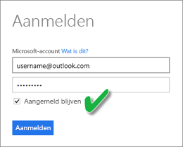
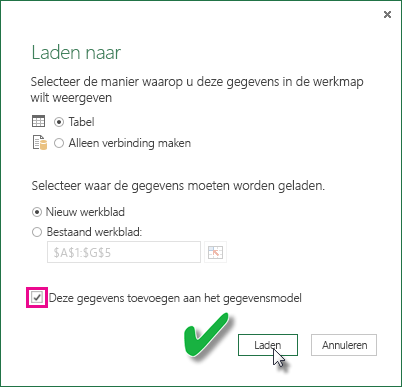

# Een gegevensset vernieuwen die is gemaakt van een Excel-werkmap in OneDrive of SharePoint Online
U kunt Excel-werkmappen importeren die zijn opgeslagen op uw lokale computer of in de cloudopslag, zoals OneDrive voor Bedrijven of SharePoint Online. In dit artikel worden de voordelen van het gebruik van cloudopslag voor uw Excel-bestanden beschreven. Zie [Gegevens ophalen uit Excel-werkmapbestanden](service-excel-workbook-files.md) voor meer informatie over het importeren van Excel-bestanden in Power BI.

## Wat zijn de voordelen?
Door bestanden uit OneDrive of SharePoint Online te importeren, zorgt u ervoor dat uw werk in Excel gesynchroniseerd blijft met de Power BI-service. Alle gegevens die u in het model van uw bestand hebt geladen, worden geïmporteerd in de gegevensset. Ook worden alle rapporten die u in het bestand hebt gemaakt in Rapporten in Power BI geladen. Wanneer u wijzigingen in uw bestand in OneDrive of SharePoint Online aanbrengt (zoals het toevoegen van nieuwe metingen, wijzigen van kolomnamen of bewerken van visualisaties) en u het bestand vervolgens opslaat, worden die wijzigingen gewoonlijk binnen een uur ook in Power BI doorgevoerd.

Wanneer u een Excel-werkmap importeert vanuit uw persoonlijke OneDrive, worden alle gegevens in de werkmap, zoals de tabellen in de werkbladen en/of de gegevens die in het Excel-gegevensmodel zijn geladen en de structuur van het gegevensmodel, geïmporteerd in een nieuwe gegevensset in Power BI. Eventuele Power View-visualisaties worden opnieuw gemaakt in Rapporten. Power BI maakt ongeveer elk uur automatisch verbinding met de werkmap in OneDrive of SharePoint Online om op updates te controleren. Als de werkmap is gewijzigd, worden de gegevensset en rapporten in de Power BI-service door Power BI vernieuwd.

U kunt ook zelf de gegevensset in de Power BI-service vernieuwen. Wanneer u de gegevensset handmatig vernieuwt of hiervoor een vernieuwing plant, maakt Power BI rechtstreeks verbinding met de externe gegevensbronnen om een query uit te voeren naar bijgewerkte gegevens en laadt het deze gegevens vervolgens in de gegevensset. Wanneer een gegevensset wordt vernieuwd vanuit Power BI, worden de gegevens in de werkmap in OneDrive of SharePoint Online niet vernieuwd. 

## Wat wordt ondersteund?
In Power BI worden Nu vernieuwen en Vernieuwen plannen ondersteund voor gegevenssets die worden gemaakt vanuit Power BI Desktop-bestanden die worden geïmporteerd van een lokaal station, waarbij Gegevens ophalen/Query-editor wordt gebruikt om verbinding te maken met en gegevens te laden uit een van de volgende gegevensbronnen:  

### Power BI Gateway - persoonlijk
* Alle onlinegegevensbronnen die worden weergegeven in Gegevens ophalen en Query-editor in Power BI Desktop.
* Alle on-premises gegevensbronnen die worden weergegeven in Gegevens ophalen en Query-editor in Power BI Desktop, met uitzondering van Hadoop-bestanden (HDFS) en Microsoft Exchange.

<!-- Refresh Data sources-->
[!INCLUDE [refresh-datasources](./includes/refresh-datasources.md)]

> [!NOTE]
> Power BI kan alleen verbinding maken met on-premises gegevensbronnen en de gegevensset vernieuwen als een gateway is geïnstalleerd en actief is.
> 
> 

## OneDrive of OneDrive voor Bedrijven. Wat is het verschil?
Als u zowel een persoonlijk OneDrive-account als een OneDrive voor Bedrijven-account hebt, kunt u het beste alle bestanden die u wilt importeren in Power BI bewaren in OneDrive voor Bedrijven. Waarom? Omdat u waarschijnlijk twee verschillende accounts gebruikt om u aan te melden.

Verbinding maken met OneDrive voor Bedrijven verloopt vaak zonder problemen in Power BI omdat het account waarmee u zich aanmeldt bij Power BI meestal hetzelfde account is als het account waarmee u zich aanmeldt bij OneDrive voor Bedrijven. Bij het persoonlijke OneDrive-account meldt u zich echter waarschijnlijk met een ander [Microsoft-account](https://account.microsoft.com) aan.

Zorg, wanneer u zich aanmeldt met uw Microsoft-account, dat u Aangemeld blijven selecteert. In dat geval kunnen alle wijzigingen die u aanbrengt in het bestand in Power BI Desktop worden gesynchroniseerd met gegevenssets in Power BI  
    

Als u in uw bestand in OneDrive wijzigingen aanbrengt die niet kunnen worden gesynchroniseerd met de gegevensset of rapporten in Power BI, bijvoorbeeld omdat de referenties voor uw Microsoft-account zijn gewijzigd, moet u opnieuw verbinding maken en het bestand opnieuw importeren uit uw persoonlijke OneDrive.

## Opties voor het verbinding maken met een Excel-bestand
Wanneer u verbinding maakt met een Excel-werkmap in OneDrive voor Bedrijven of in SharePoint Online, kunt u op twee manieren gegevens ophalen uit uw werkmap en importeren in Power BI.

[**Excel-gegevens importeren in Power BI** ](service-excel-workbook-files.md#import-or-connect-to-an-excel-workbook-from-power-bi): wanneer u een Excel-werkmap uit OneDrive voor Bedrijven of SharePoint Online importeert, werkt het zoals hierboven is beschreven.

[**In Power BI verbinding maken met een Excel-werkmap en deze beheren en weergeven** ](service-excel-workbook-files.md#one-excel-workbook--two-ways-to-use-it): wanneer u deze optie gebruikt, maakt u vanuit Power BI een rechtstreekse verbinding naar uw werkmap in OneDrive voor Bedrijven of SharePoint Online.

Wanneer u op deze manier verbinding maakt met een Excel-werkmap, wordt er geen gegevensset gemaakt in Power BI. De werkmap wordt echter in de Power BI-service onder Rapporten weergegeven met een Excel-pictogram naast de naam. U kunt, in tegenstelling tot bij Excel Online, een vernieuwingsschema instellen wanneer u vanuit Power BI verbinding maakt met uw werkmap, als de werkmap verbinding heeft met externe gegevensbronnen waaruit gegevens in het Excel-gegevensmodel worden geladen.

Wanneer u op deze manier een vernieuwingsschema instelt, is het enige verschil dat de vernieuwde gegevens in het gegevensmodel van de werkmap in OneDrive of SharePoint Online worden geladen in plaats van in een gegevensset in Power BI.

## Hoe kan ik ervoor zorgen dat gegevens in het Excel-gegevensmodel worden geladen?
Wanneer u Power Query gebruikt (Gegevens ophalen en transformeren in Excel 2016) om verbinding te maken met een gegevensbron, zijn er verschillende locaties mogelijk voor het laden van gegevens. Wanneer u gegevens wilt laden in het gegevensmodel, moet u de optie **Deze gegevens toevoegen aan het gegevensmodel** selecteren in het dialoogvenster **Laden naar**.

> [!NOTE]
> In de volgende afbeeldingen ziet u voorbeelden uit Excel 2016.
> 
> 

Klik in **Navigator** op de optie **Laden naar...**  
    

U kunt in Navigator ook op **Bewerken** klikken om de Query-editor te openen. Daar kunt u op **Sluiten en laden naar....** klikken  
    

Selecteer vervolgens in **Laden naar** de optie **Deze gegevens toevoegen aan het gegevensmodel**.  
    

### Kan ik ook Externe gegevens ophalen in Power Pivot gebruiken?
Geen enkel probleem. Wanneer u Power Pivot gebruikt om verbinding te maken met een on-premises of online gegevensbron en om gegevens hieruit op te halen, worden de gegevens automatisch in het gegevensmodel geladen.

## Hoe kan ik een vernieuwing plannen?
Wanneer u een vernieuwingsschema instelt, maakt Power BI rechtstreeks verbinding met de gegevensbronnen met behulp van de verbindingsgegevens en referenties in de gegevensset om eventuele bijgewerkte gegevens op te halen en in de gegevensset te laden. Alle visualisaties in rapporten en dashboards die zijn gebaseerd op die gegevensset in de Power BI-service, worden ook bijgewerkt.

Zie [Het plannen van de vernieuwing configureren](refresh-scheduled-refresh.md) voor meer informatie over het instellen van de planning voor een vernieuwing.

## Wanneer het fout gaat
Als er iets fout gaat, komt dit meestal doordat Power BI niet kan worden aangemeld bij gegevensbronnen of doordat de gegevensset verbinding maakt met een on-premises gegevensbron terwijl de gateway offline is. Controleer eerst of Power BI kan worden aangemeld bij gegevensbronnen. Als het wachtwoord voor aanmelding bij een gegevensbron is veranderd, of als Power BI wordt afgemeld bij een gegevensbron, probeert u eerst om opnieuw aan te melden bij de gegevensbronnen met de gegevensbronreferenties.

Laat de optie **Mij een e-mail met melding voor mislukte vernieuwing sturen** ingeschakeld. U wilt immers direct op de hoogte worden gesteld als een geplande vernieuwing is mislukt.

## Belangrijke opmerkingen
\* Vernieuwen wordt niet ondersteund voor OData-feeds waarmee vanuit Power Pivot verbinding wordt gemaakt en waaruit gegevens worden opgehaald. Wanneer u een OData-feed als gegevensbron gebruikt, moet u Power Query gebruiken.

## Probleemoplossing
Soms gaat het vernieuwen van gegevens niet zoals u verwacht. Meestal komt dat door een probleem met een gateway. Zie de artikelen over het oplossen van problemen met de gateway voor informatie over hulpprogramma's en bekende problemen.

[Problemen met de on-premises gegevensgateway oplossen](service-gateway-onprem-tshoot.md)

[Problemen met Power BI Gateway - Personal oplossen](service-admin-troubleshooting-power-bi-personal-gateway.md)

Nog vragen? [Misschien dat de Power BI-community het antwoord weet](http://community.powerbi.com/)

