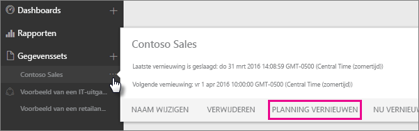
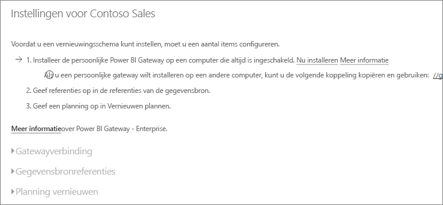
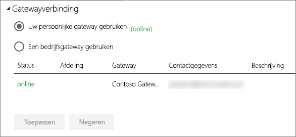
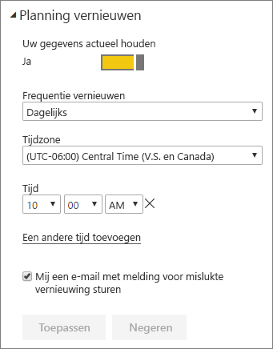

# Een geplande vernieuwing configureren

>[!NOTE]
>Na twee maanden van inactiviteit wordt de geplande vernieuwing voor uw gegevensset onderbroken. Zie de sectie [ *Geplande vernieuwing* ](#schedule-refresh) verderop in dit artikel voor meer informatie.
> 
> 

Als uw gegevensset geplande vernieuwing ondersteunt met Nu vernieuwen en Vernieuwen plannen, zijn er enkele belangrijke vereisten en instellingen voor een geslaagde vernieuwing. Dit zijn **Gatewayverbinding**, **Gegevensbronreferenties** en **Vernieuwen plannen**. Laten we deze items eens nader bekijken.

Hieronder worden de optie beschreven voor [Power BI Gateway - Personal](personal-gateway.md) en de [on-premises gegevensgateway](service-gateway-onprem.md).

Ga als volgt te werk om het venster Vernieuwen plannen weer te geven:

1. Selecteer het **beletselteken (...)**  naast een gegevensset die wordt vermeld onder **Gegevenssets**.
2. Selecteer **Vernieuwen plannen**.
   
    

## Gatewayverbinding
Welke opties hier worden weergegeven, is afhankelijk van het type gateway (een persoonlijke of bedrijfsgateway) en of de gateway online en beschikbaar is.

Als er geen gateway beschikbaar is, ziet u dat **Gatewayinstellingen** is uitgeschakeld. Daarnaast wordt er een bericht weergegeven met informatie hoe u de persoonlijke gateway kunt installeren.

Als u een persoonlijke gateway hebt geconfigureerd, kunt u deze selecteren. De gateway moet wel online zijn. Als er geen gateway beschikbaar is, wordt aangegeven dat deze offline is.

U kunt ook de bedrijfsgateway selecteren als deze beschikbaar is voor. Er is alleen een bedrijfsgateway beschikbaar als uw account wordt vermeld op het tabblad Gebruikers van de gegevensbron die is geconfigureerd voor een bepaalde gateway.

## Gegevensbronreferenties
### Power BI Gateway - Personal
Als u de persoonlijke gateway gebruikt om gegevens te vernieuwen, moet u de referenties opgeven waarmee u verbinding maakt met de back-endgegevensbron. Als u verbinding maakt met een inhoudspakket van een online service, worden de referenties die u hebt opgegeven om verbinding te maken, overgedragen voor geplande vernieuwing.

U hoeft zich alleen de eerste keer dat u een gegevensset vernieuwt aan te melden bij de gegevensbron. Wanneer u de referenties eenmaal hebt ingevoerd, worden deze bewaard in de gegevensset.

> [!NOTE]
> Als het wachtwoord dat u gebruikt om u aan te melden bij een gegevensbron, is verlopen of gewijzigd, moet u voor bepaalde verificatiemethoden het wachtwoord voor de gegevensbron ook wijzigen in Referenties voor gegevensbron.
> 
> 

Wanneer er iets niet goed gaat, komt dit doorgaans doordat de gateway offline is omdat deze niet kan worden aangemeld bij Windows, en dus de service niet kan worden gestart, of omdat Power BI niet kan worden aangemeld bij de gegevensbronnen om naar bijgewerkte gegevens te zoeken. Als de vernieuwingsbewerking mislukt, controleert u de instellingen van de gegevensset. Als de gatewayservice offline is, wordt deze fout weergegeven bij Gatewaystatus. Als Power BI niet kan worden aangemeld bij de gegevensbronnen, wordt er een fout weergegeven in Referenties voor gegevensbron.

### On-premises gegevensgateway
Als u de on-premises gegevensgateway gebruikt om gegevens te vernieuwen, hoeft u geen referenties op te geven, aangezien de referenties voor de gegevensbron worden gedefinieerd de gatewaybeheerder.

> [!NOTE]
> Als u verbinding met een on-premises SharePoint maakt om gegevens te vernieuwen, ondersteunt Power BI alleen de volgende verificatiemechanismen: *Anoniem*, *Basis* en *Windows (NTLM/Kerberos)*. Power BI biedt geen ondersteuning voor *ADFS* of een *formulieren gebaseerde verificatie* om gegevens van on-premises SharePoint-gegevensbronnen te vernieuwen.
> 
> 

## Vernieuwen van gegevens plannen
In de sectie voor geplande vernieuwingen definieert u de frequentie en de tijdvakken voor het vernieuwen van de gegevensset. Voor sommige gegevensbronnen hoeft er geen gateway aanwezig te zijn om te kunnen configureren. Andere gegevensbronnen vereisen wel een gateway.

Als u de instellingen wilt configureren, moet u de schuifregelaar **Gegevens bijwerken** instellen op **Ja**.

> [!NOTE]
> Met de Power BI-service worden uw gegevens binnen **15 minuten** van de geplande vernieuwingstijd vernieuwd.
> 
> 

> [!NOTE]
> Na twee maanden van inactiviteit wordt de geplande vernieuwing voor uw gegevensset onderbroken. Een gegevensset wordt gezien als inactief als de dasboards en rapporten die op basis van de gegevensset zijn samengesteld, niet door gebruikers zijn bezocht. Op dat moment ontvangt de eigenaar van de gegevensset een e-mail met het bericht dat de geplande vernieuwing is onderbroken en het vernieuwingsschema voor de gegevensset wordt weergegeven als **uitgeschakeld**. Als u de geplande vernieuwing wilt hervatten, hoeft u een van de dashboard of rapporten die op basis van de gegevensset zijn samengesteld, alleen maar te bezoeken.
> 
> 

## Wat wordt ondersteund?
Bepaalde gegevenssets worden ondersteund door verschillende gateways met betrekking tot geplande vernieuwingen. Ter referentie volgt hier wat beschikbaar.

### Power BI Gateway - Personal
**Power BI Desktop**

* Alle onlinegegevensbronnen die worden weergegeven in Gegevens ophalen en Query-editor in Power BI Desktop.
* Alle on-premises gegevensbronnen die worden weergegeven in Gegevens ophalen en Query-editor in Power BI Desktop, met uitzondering van Hadoop-bestanden (HDFS) en Microsoft Exchange.

**Excel**

> [!NOTE]
> In Excel 2016 of later wordt Power Query nu weergegeven in de Gegevens-sectie van het lint, onder Gegevens ophalen en transformeren.
> 
> 

* Alle onlinegegevensbronnen die worden weergegeven in Power Query.
* Alle on-premises gegevensbronnen die worden weergegeven in Power Query, met uitzondering van Hadoop-bestanden (HDFS) en Microsoft Exchange.
* Alle onlinegegevensbronnen die worden weergegeven in Power Pivot.\*
* Alle on-premises gegevensbronnen die worden weergegeven in Power Pivot, met uitzondering van Hadoop-bestanden (HDFS) en Microsoft Exchange.

<!-- Refresh Data sources-->
[!INCLUDE [refresh-datasources](./includes/refresh-datasources.md)]

## Probleemoplossing
Soms gaat het vernieuwen van gegevens niet zoals u verwacht. Meestal komt dat door een probleem met een gateway. Zie de artikelen over het oplossen van problemen met de gateway voor informatie over hulpprogramma's en bekende problemen.

[Problemen met de on-premises gegevensgateway oplossen](service-gateway-onprem-tshoot.md)

[Problemen met Power BI Gateway - Personal oplossen](service-admin-troubleshooting-power-bi-personal-gateway.md)

## Volgende stappen
[Gegevens vernieuwen in Power BI](refresh-data.md)  
[Power BI Gateway - Personal](personal-gateway.md)  
[On-premises gegevensgateway](service-gateway-onprem.md)  
[Problemen met de on-premises gegevensgateway oplossen](service-gateway-onprem-tshoot.md)  
[Problemen met Power BI Gateway - Personal oplossen](service-admin-troubleshooting-power-bi-personal-gateway.md)  

Hebt u nog vragen? [Misschien dat de Power BI-community het antwoord weet](http://community.powerbi.com/)

