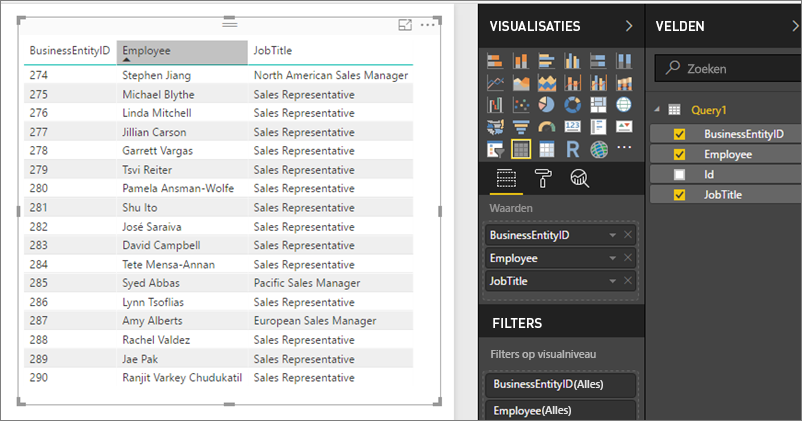

# Gedeelde gegevenssets openen als OData-feeds in Power BI Report Server
Met een OData-feed hebt u toegang tot gedeelde gegevenssets van Power BI Desktop.

1. Via de URL voor de OData-feed maakt u verbinding met de OData-bron.
   
    
2. Nadat u de gegevens hebt geïmporteerd in Power BI Desktop, kunt u deze wijzigen in de Query-editor.
   
    
3. U kunt de gegevens nu gebruiken om rapporten te ontwerpen.
   
    

Zorg dat u **Geavanceerde opties** gebruikt, zodat u kolommen voor open typen kunt inschakelen en de kolommen zo kunt opmaken in Power Query dat ze voldoen aan uw behoeften.

Meer informatie over [verbinding maken met OData-velden in Power BI Desktop](../desktop-connect-odata.md).

Nog vragen? [Misschien dat de Power Bi-community het antwoord weet](https://community.powerbi.com/).

