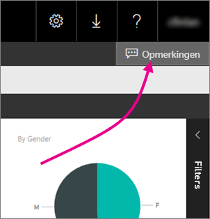
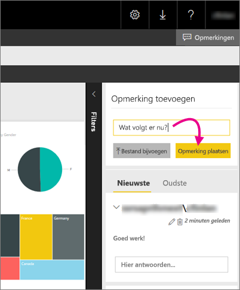

# Opmerkingen toevoegen aan een rapport in een rapportserver
In de webportal van een rapportserver kunt u opmerkingen toevoegen aan rapporten, waaronder Power BI-rapporten. De opmerkingen staan live bij het rapport en iedereen met de juiste machtigingen ziet de opmerkingen voor het rapport. Zie de sectie [Machtigingen](#permissions) hieronder voor meer informatie.

## Opmerkingen toevoegen of weergeven
1. Open een gepagineerd rapport of Power BI-rapport op een rapportserver.
2. Selecteer in de rechterbovenhoek **Opmerkingen**.
   
    
   
    In het deelvenster Opmerkingen ziet u alle bestaande opmerkingen.
3. Schrijf de opmerking en selecteer vervolgens **Opmerking plaatsen**.
   
    
   
    Uw opmerking wordt in het deelvenster op het webportaal weergegeven, samen met eventuele vorige opmerkingen. Ze worden niet weergegeven bij het rapport op in de mobiele Power BI-apps.
   
   > [!TIP]
   > Wist u dat? U kunt [aantekeningen toevoegen aan Power BI-rapporten in de mobiele Power BI-apps](../consumer/mobile/mobile-annotate-and-share-a-tile-from-the-mobile-apps.md) en de rapporten met aantekeningen met anderen delen.
   > 
   > 

## Machtigingen
Afhankelijk van uw machtigingen is het volgende op u van toepassing:

* U kunt geen opmerkingen bekijken.
* U kunt alle opmerkingen bekijken en uw eigen opmerkingen plaatsen, bewerken en verwijderen.
* U kunt alle opmerkingen bekijken en uw eigen opmerkingen plaatsen, bewerken en verwijderen, en opmerkingen van anderen verwijderen.

## Volgende stappen
* [Wat is Power BI Report Server?](get-started.md)  

Hebt u nog vragen? [Misschien dat de Power BI-community het antwoord weet](https://community.powerbi.com/)

