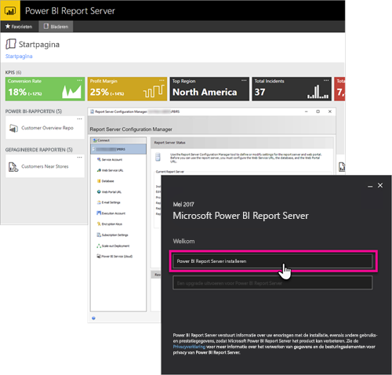

# Overzicht van het beheerdershandboek voor Power BI Report Server
Welkom bij het beheerdershandboek voor Power BI Report Server, een on-premises locatie om uw Power BI-rapporten, mobiele rapporten en gepagineerde rapporten op te slaan en te beheren.

Dit handboek biedt u inzicht in concepten over het plannen, implementeren en beheren van uw Power BI-rapportserver.

## Installatie en migratie
U moet Power BI Report Server installeren om het gaan gebruiken. We hebben informatie waarmee u deze taak kunt uitvoeren.

Bekijk, voordat u begint met installeren, upgraden of migreren naar Power BI-rapportserver, de [systeemvereisten](system-requirements.md) voor de rapportserver.

### Installeren
Als u een nieuwe Power BI-rapportserver implementeert, kunt u de volgende documenten als hulpmiddel gebruiken. Er is een snelstartgids beschikbaar om meteen te beginnen. U kunt eventueel ook het installatiedocument bekijken voor de volledige informatie.

* [Snelstartgids: Power BI Report Server installeren](quickstart-install-report-server.md)
* [Power BI Report Server installeren](install-report-server.md)

### Migratie
Er is geen in-place upgrade voor SQL Server Reporting Services. Als u over een bestaand SQL Server Reporting Services-exemplaar beschikt waarvan u een Power BI-rapportserver wilt maken, moet u deze migreren. Er zijn ook andere redenen waarom u wellicht een migratie zou willen uitvoeren. Neem het migratiedocument door voor meer informatie.

[Een rapportserverinstallatie migreren](migrate-report-server.md)

## Uw rapportserver configureren
Voor het configureren van uw rapportserver zijn veel opties beschikbaar. Wilt u SSL gebruiken? Configureert u een e-mailserver? Wilt u een integratie met de Power BI-service zodat u visualisaties vastmaken?

Het merendeel van uw configuratie wordt uitgevoerd binnen Report Server Configuration Manager. Bekijk de documentatie over [configuratiebeheer](https://docs.microsoft.com/sql/reporting-services/install-windows/reporting-services-configuration-manager-native-mode) voor meer informatie.

## Beveiliging
Beveiliging en bescherming zijn belangrijk voor elke organisatie. Meer informatie over verificatie, autorisatie, rollen en machtigingen vindt u in de [beveiligings](https://docs.microsoft.com/sql/reporting-services/security/reporting-services-security-and-protection)documentatie.

## Volgende stappen
[Snelstartgids: Power BI Report Server installeren](quickstart-install-report-server.md)  
[De productcode van uw rapportserver zoeken](find-product-key.md)  
[Voor Power BI Report Server geoptimaliseerde versie van Power BI Desktop installeren](install-powerbi-desktop.md)  
[Report Builder installeren](https://docs.microsoft.com/sql/reporting-services/install-windows/install-report-builder)  
[SQL Server Data Tools (SSDT) downloaden](http://go.microsoft.com/fwlink/?LinkID=616714)

Nog vragen? [Misschien dat de Power BI-community het antwoord weet](https://community.powerbi.com/)

