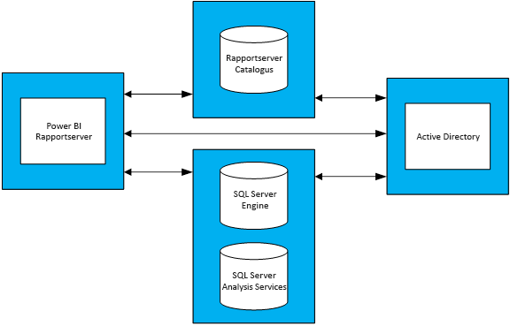

# Richtlijnen voor capaciteitsplanning voor Power BI Report Server
Power BI Report Server is een selfservice-BI en rapportageoplossing voor ondernemingen die klanten on-premises, achter hun firewall kunnen implementeren. De oplossing combineert de interactieve rapportagemogelijkheden van Power BI Desktop met het on-premises serverplatform van SQL Server Reporting Services. Met het intensieve en toenemende gebruik van analyses en rapporten binnen ondernemingen is het soms behoorlijk lastig om de hardware-infrastructuur en de benodigde softwarelicenties voor het schalen van het gebruikersbestand te budgetteren. Het doel van dit document is een leidraad te geven bij de capaciteitsplanning voor Power BI Report Server door het delen van de resultaten van talrijke belastingtests die met verschillende workloads op een rapportserver zijn uitgevoerd. Hoewel de rapporten, query's en gebruikspatronen sterk kunnen variëren, vormen de resultaten die in dit artikel worden gepresenteerd, alsmede de daadwerkelijk uitgevoerde testen en de gedetailleerde beschrijving van de testprocedures, een goed referentiepunt voor iedereen die overweegt om Power BI Report Server te implementeren.

## Managementsamenvatting
We hebben twee verschillende typen workloads in Power BI Report Server uitgevoerd. Voor elke workload hebben we verschillende typen rapporten weergegeven en diverse webportalbewerkingen uitgevoerd. 

* Voor de workload Power BI-rapport Intensief bestond de meest frequente bewerking (oftewel de bewerking die 60% van de tijd werd uitgevoerd) uit het weergeven van Power BI-rapporten.
* De workload Gepagineerd rapport Intensief bestond voornamelijk uit het weergeven van pagineerde rapporten.

Met een Power BI Report Server-servertopologie van vier server en de verwachting dat niet meer dan 5% van de gebruikers tegelijkertijd een rapportserver zullen gebruiken, wordt in de volgende tabel beschreven door hoeveel gebruikers Power BI Report Server maximaal tegelijkertijd kan worden gebruikt met een betrouwbaarheid van ten minste 99%. 

| Workload | 8 kernen/32 GB RAM | 16 kernen/64 GB RAM |
| --- | --- | --- |
| **Power BI-rapport Intensief** (>60%) |1.000 gebruikers |3.000 gebruikers |
| **Gepagineerd (RDL) rapport Intensief** (>60%) |2.000 gebruikers |3.200 gebruikers |

Bij elke test bleek dat van alle resources de CPU het zwaarst werd belast. Op basis hiervan blijkt dat er met betrekking tot de betrouwbaarheid van het systeem meer winst kan worden geboekt met een uitbreiding van het aantal kernen dan door de hoeveelheid geheugen of vasteschijfruimte te verhogen. 

## Testmethodologie
De gebruikte testtopologie is gebaseerd op Microsoft Azure Virtual Machines in plaats van leverancierspecifieke fysieke hardware. Alle computers werden gehost in regio's binnen de VS. Dit komt overeen met de algemene trend om de hardwarevirtualisatie zowel on-premises als in de openbare cloud uit te voeren. 

### Topologie van Power BI Report Server
De Power BI Report Server-implementatie bestaat uit de volgende virtuele machines:

* Active Directory-domeincontroller: SQL Server Database Engine, SQL Server Analysis Services en Power BI Report Server hebben deze controller nodig om veilig alle aanvragen te kunnen verifiëren.
* SQL Server Database Engine en SQL Server Analysis Services: hier waren alle databases opgeslagen die door de rapporten werden gebruikt op het moment dat ze werden weergegeven.
* Power BI Report Server
* Power BI Report Server-database. De rapportserverdatabase wordt gehost op een andere computer dan Power BI Report Server, zodat Power BI niet met SQL Server Database Engine hoeft te wedijveren om geheugen-, CPU-, netwerk- en schijfresources.

Zie bijlage 1.1 Power BI Report Server-topologie en bijlage 1.2 Configuratie van de virtuele machine van Power BI Report Server voor een grondige configuratie van elke virtuele machine die wordt gebruikt in de topologie.

### Testen
De testen die worden gebruikt om de belastingtesten uit te voeren, zijn openbaar beschikbaar in een GitHub-project met de naam Reporting Services LoadTest (zie https://github.com/Microsoft/Reporting-Services-LoadTest)). Met dit hulpprogramma kunnen gebruikers de kenmerken van de prestaties, betrouwbaarheid, schaalbaarheid en herstelmogelijkheden van SQL Server Reporting Services en Power BI Report Server bestuderen. Dit project bestaat uit vier groepen van testcases:

* Testen waarbij de weergave van Power BI-rapporten wordt gesimuleerd.
* Testen waarbij de weergave van mobiele rapporten wordt gesimuleerd.
* Testen waarbij de weergave van kleine en grote gepagineerde rapporten wordt gesimuleerd. 
* Testen waarbij diverse verschillende typen webportalbewerkingen worden gesimuleerd. 

Alle testen zijn geschreven om een volledige bewerking van begin tot eind uit te voeren (zoals het weergeven van een rapport, het maken van een nieuwe gebruikersbron, enzovoort). Dit wordt gerealiseerd door een of meer webaanvragen naar de rapportserver te verzenden (via API's). In de praktijk moet een gebruiker mogelijk een aantal tussenliggende bewerkingen uitvoeren om een van deze end-to-end-bewerkingen uit te voeren. Als een gebruiker bijvoorbeeld een rapport wil weergeven moet de gebruiker naar de webportal gaan, de map met het rapport zoeken en openen en vervolgens het rapport klikken om dit weer te geven. Hoewel tijdens een test niet alle benodigde bewerkingen worden uitgevoerd om een end-to-end-taak te voltooien, is de belasting van Power BI Report Server wel grotendeels hetzelfde. U kunt het GitHub-project verkennen voor meer informatie over de verschillende typen rapporten die worden gebruikt en de diverse bewerkingen die worden uitgevoerd.

### Workloads
Er zijn twee workloadprofielen gebruikt voor de testen: Power BI-rapport Intensief en Gepagineerd rapport Intensief. In de onderstaande tabel wordt de distributie van de aanvragen beschreven die worden uitgevoerd voor Report Server.

| Activiteit | Power BI-rapport Intensief, frequentie | Gepagineerd rapport Intensief, frequentie |
| --- | --- | --- |
| **Power BI-rapporten weergeven** |60% |10% |
| **RDL-rapporten (gepagineerde rapporten) weergeven** |30% |60% |
| **Mobiele rapporten weergeven** |5% |20% |
| **Webportalbewerkingen** |5% |10% |

### Gebruikersbelasting
Voor elke testuitvoering zijn de testen uitgevoerd op basis van de frequentie zoals opgegeven in een van de twee workloads. Voor alle testen werden om te beginnen 20 gelijktijdige gebruikersaanvragen naar de rapportserver verzonden. De gebruikersbelasting werd geleidelijk verhoogd, totdat de betrouwbaarheidsdoelstelling van 99% niet meer werd gehaald.

## Resultaten
### Capaciteit voor het aantal gelijktijdige gebruikers
Zoals gezegd, was er bij aanvang van elke test sprake van 20 gelijktijdige gebruikers die aanvragen verzonden naar de rapportserver. Het aantal gelijktijdige gebruikers werd geleidelijk verhoogd totdat 1% van alle aanvragen mislukte. In de volgende tabel met resultaten kunnen we zien hoeveel gelijktijdige gebruikersaanvragen de server onder piekbelasting kan verwerken met een foutpercentage van minder dan 1%.

| Workload | 8 kernen/32 GB | 16 kernen/64 GB |
| --- | --- | --- |
| **Power BI-rapport Intensief** |50 gelijktijdige gebruikers |150 gelijktijdige gebruikers |
| **Gepagineerd rapport Intensief** |100 gelijktijdige gebruikers |160 gelijktijdige gebruikers |

### Totale gebruikerscapaciteit
Bij Microsoft beschikken we over een productie-implementatie van Power BI Report Server die door verschillende teams wordt gebruikt. Wanneer we het daadwerkelijke gebruik van deze omgeving analyseren, zien we dat het aantal gelijktijdige gebruikers op een gegeven moment (zelfs tijdens de dagelijkse piekbelasting) doorgaans niet groter is dan 5% van het totale gebruikersbestand. We hebben de gelijktijdigheidsverhouding van 5% als benchmark gebruikt om het totale gebruikersbestand te extrapoleren dat Power BI Report Server kan verwerken met een betrouwbaarheid van minimaal 99%.

| Workload | 8 kernen/32 GB | 16 kernen/64 GB |
| --- | --- | --- |
| **Power BI-rapport Intensief** |1.000 gebruikers |3.000 gebruikers |
| **Gepagineerd rapport Intensief** |2.000 gebruikers |3.200 gebruikers |

### Resultaten weergeven
Selecteer een rapport om de resultaten van de belastingtest weer te geven.

| Workload | 8 kernen/32 GB | 16 kernen/64 GB |
| --- | --- | --- |
| **Power BI-rapport Intensief** |[Weergave - 8 kernen](https://msit.powerbi.com/view?r=eyJrIjoiMDhhNGY4NGQtNGRhYy00Yzk4LTk2MzAtYzFlNWI5NjBkMGFiIiwidCI6IjcyZjk4OGJmLTg2ZjEtNDFhZi05MWFiLTJkN2NkMDExZGI0NyIsImMiOjV9) |[Weergave - 8 kernen](https://msit.powerbi.com/view?r=eyJrIjoiNDBiODk1OGUtYTAyOC00MzVhLThmZmYtNzVjNTFjNzMwYzkwIiwidCI6IjcyZjk4OGJmLTg2ZjEtNDFhZi05MWFiLTJkN2NkMDExZGI0NyIsImMiOjV9) |
| **Gepagineerd rapport Intensief** |[Weergave - 8 kernen](https://msit.powerbi.com/view?r=eyJrIjoiNDFiZWYzMTktZGIxNS00MzcwLThjODQtMmJkMGRiZWEzNjhlIiwidCI6IjcyZjk4OGJmLTg2ZjEtNDFhZi05MWFiLTJkN2NkMDExZGI0NyIsImMiOjV9) |[Weergave - 16 kernen](https://msit.powerbi.com/view?r=eyJrIjoiOTU0YjJkYTgtNDg4Yy00NzlhLWIwMGYtMzg4YWI2MjNmOTZjIiwidCI6IjcyZjk4OGJmLTg2ZjEtNDFhZi05MWFiLTJkN2NkMDExZGI0NyIsImMiOjV9) |

<iframe width="640" height="360" src="https://msit.powerbi.com/view?r=eyJrIjoiMDhhNGY4NGQtNGRhYy00Yzk4LTk2MzAtYzFlNWI5NjBkMGFiIiwidCI6IjcyZjk4OGJmLTg2ZjEtNDFhZi05MWFiLTJkN2NkMDExZGI0NyIsImMiOjV9" frameborder="0" allowFullScreen="true"></iframe>

<iframe width="640" height="360" src="https://msit.powerbi.com/view?r=eyJrIjoiNDBiODk1OGUtYTAyOC00MzVhLThmZmYtNzVjNTFjNzMwYzkwIiwidCI6IjcyZjk4OGJmLTg2ZjEtNDFhZi05MWFiLTJkN2NkMDExZGI0NyIsImMiOjV9" frameborder="0" allowFullScreen="true"></iframe>

<iframe width="640" height="360" src="https://msit.powerbi.com/view?r=eyJrIjoiNDFiZWYzMTktZGIxNS00MzcwLThjODQtMmJkMGRiZWEzNjhlIiwidCI6IjcyZjk4OGJmLTg2ZjEtNDFhZi05MWFiLTJkN2NkMDExZGI0NyIsImMiOjV9" frameborder="0" allowFullScreen="true"></iframe>

<iframe width="640" height="360" src="https://msit.powerbi.com/view?r=eyJrIjoiOTU0YjJkYTgtNDg4Yy00NzlhLWIwMGYtMzg4YWI2MjNmOTZjIiwidCI6IjcyZjk4OGJmLTg2ZjEtNDFhZi05MWFiLTJkN2NkMDExZGI0NyIsImMiOjV9" frameborder="0" allowFullScreen="true"></iframe>

## Samenvatting
Bij elke belastingstestuitvoering bleek dat tijdens de piekbelasting van de computer met Power BI Report Server de CPU het zwaarst werd belast. OP basis hiervan kan worden gesteld dat als eerste resource het aantal kernen moet worden uitgebreid. U kunt eventueel de schaal vergroten door meer servers aan uw topologie toe te voegen waarop Power BI Report Server wordt gehost.

De resultaten in dit artikel zijn afgeleid van testen waarbij een specifieke set rapporten wordt uitgevoerd op basis van een specifieke set gegevens en deze bewerking op een specifieke manier wordt herhaald. De resultaten vormen een nuttig referentiepunt, maar houd er rekening mee dat uw gebruik afhankelijk is van uw rapporten, query's, gebruikspatronen en de implementatie van uw Power BI Report Server.

## Bijlage
### 1 Topologie
**1.1 Topologie van Power BI Report Server**

Er is een vaste VM-configuratie voor elk type machine gebruikt (behalve voor de machine waarop Power BI Report Server werd gehost), om ons uitsluitend te concentreren op het gedrag van Power BI Report Server onder verschillende configuraties. Elke machine waren de machines ingericht overeenkomstig de tweede generatie (v2) uit de D-serie met Premium-opslagschijven. U kunt getailleerde informatie over elke VM-grootte vinden in de sectie 'Algemeen gebruik' op https://azure.microsoft.com/en-us/pricing/details/virtual-machines/windows/.

| Type virtuele machine | Processor | Geheugen | Azure VM-grootte |
| --- | --- | --- | --- |
| **Active Directory-domeincontroller** |2 kernen |7 GB |Standard_DS2_v2 |
| **SQL Server Database Engine en Analysis Services** |16 kernen |56 GB |Standard_DS5_v2 |
| **Report Server-database** |16 kernen |56 GB |Standard_DS5_v2 |

**1.2 Configuratie van de virtuele machine van Power BI Report Server** 

Voor de virtuele machine waarop Power BI Report Server werd gehost, zijn andere processor- en geheugenconfiguraties gebruikt. In tegenstelling tot de andere virtuele machines was deze machine ingericht overeenkomstig de derde generatie (v3) machines uit de D-serie met Premium-opslagschijven. U kunt getailleerde informatie over deze VM-grootte vinden in de sectie 'Algemeen gebruik' op https://azure.microsoft.com/en-us/pricing/details/virtual-machines/windows/.

| Virtuele machine | Processor | Geheugen | Azure VM-grootte |
| --- | --- | --- | --- |
| **Power BI Report Server (klein)** |8 kernen |32 GB |Standard_D8S_v3 |
| **Power BI Report Server (groot)** |16 kernen |64 GB |vStandard_D16S_v3 |

### 2 Het hulpprogramma LoadTest uitvoeren
Als u het hulpprogramma LoadTest van Reporting Services wilt uitvoeren voor uw implementatie of een Microsoft Azure-implementatie van Power BI Report Server, voert u de volgende stappen uit.

1. Maak een kloon van het Reporting Services LoadTest-project op GitHub (https://github.com/Microsoft/Reporting-Services-LoadTest)).
2. In de projectmap vindt u een oplossingsbestand met de naam RSLoadTests.sln. Open dit bestand in Visual Studio 2015 of later.
3. Bepaal of u dit hulpprogramma wilt uitvoeren voor uw implementatie van Power BI Report Server of voor een implementatie van Power BI Report Server in Microsoft Azure. Als u dit hulpprogramma gebruikt voor uw eigen implementatie, gaat u naar stap 5.
4. Volg de instructies die worden weergegeven op https://github.com/Microsoft/Reporting-Services-LoadTest#create-a-sql-server-reporting-services-load-environment-in-azure om een Power BI Report Server-omgeving in Azure te maken.
5. Nadat u de omgeving hebt geïmplementeerd, volgt u de instructies die worden weergegeven op https://github.com/Microsoft/Reporting-Services-LoadTest#load-test-execution om de tests uit te voeren.

Hebt u nog vragen? [Misschien dat de Power BI-community het antwoord weet](https://community.powerbi.com/)

