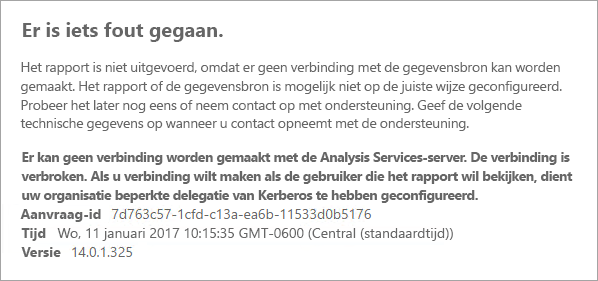
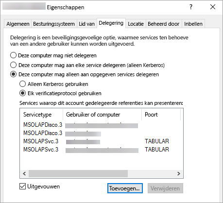

# <a name="configure-kerberos-to-use-power-bi-reports"></a>Kerberos configureren om Power BI-rapporten te gebruiken
<iframe width="640" height="360" src="https://www.youtube.com/embed/vCH8Fa3OpQ0?showinfo=0" frameborder="0" allowfullscreen></iframe>

Informatie over hoe u de rapportserver configureert voor Kerberos-verificatie met gegevensbronnen die worden gebruikt binnen uw Power BI-rapporten voor een gedistribueerde omgeving.

Power BI Report Server omvat de mogelijkheid om Power BI-rapporten te hosten. Er worden veel gegevensbronnen ondersteund door uw rapportserver. Dit artikel richt zich specifiek op SQL Server Analysis Services, maar u kunt de concepten ook gebruiken en toepassen op andere gegevensbronnen, zoals SQL Server.

U kunt Power BI Report Server, SQL Server en Analysis Services installeren op één computer. Alles zou moeten werken zonder aanvullende configuratie. Dit is ideaal voor een testomgeving. U kunt tegen fouten aanlopen als deze services zijn geïnstalleerd op afzonderlijke computers; dit wordt een gedistribueerde omgeving genoemd. In deze omgeving moet u Kerberos-verificatie gebruiken. Er is een configuratie vereist om dit te implementeren. 

U moet in het bijzonder beperkte delegering configureren. U hebt Kerberos wel geconfigureerd in uw omgeving, maar dit is mogelijk niet geconfigureerd voor beperkte delegering.

## <a name="error-running-report"></a>Fout bij het uitvoeren van rapport
Als de rapportserver niet juist is geconfigureerd, ontvangt u mogelijk de volgende fout.

    Something went wrong.

    We couldn’t run the report because we couldn’t connect to its data source. The report or data source might not be configured correctly. 

In de technische details ziet u het volgende bericht.

    We couldn’t connect to the Analysis Services server. The server forcibly closed the connection. To connect as the user viewing the report, your organization must have configured Kerberos constrained delegation.



## <a name="configuring-kerberos-constrained-delegation"></a>Configureren van beperkte Kerberos-overdracht
Er moeten meerdere items worden geconfigureerd, omdat beperkte Kerberos-delegering anders niet werkt. Dit omvat instellingen voor SPN (Service Principal Names) en instellingen voor delegering op serviceaccounts.

> [!NOTE]
> Om SPN's en instellingen voor delegering te configureren, moet u domeinbeheerder zijn.
> 
> 

We moeten het volgende configureren, oftewel valideren.

1. Verificatietype binnen Report Server-configuratie.
2. SPN's voor het serviceaccount van de rapportserver.
3. SPN's voor de Analysis Services-service.
4. SPN's voor de SQL Browser-service op de Analysis Services-machine. Dit is alleen voor benoemde exemplaren.
5. Instellingen voor delegering op het serviceaccount van de rapportserver.

## <a name="authentication-type-within-report-server-configuration"></a>Verificatietype binnen Report Server-configuratie
We moeten het verificatietype voor de rapportserver configureren om beperkte Kerberos-delegering mogelijk te maken. Dit wordt gedaan binnen het bestand **rsreportserver.config**. De standaardlocatie voor dit bestand is `C:\Program Files\Microsoft Power BI Report Server\PBIRS\ReportServer`.

In het bestand rsreportserver.config wilt u zoeken naar de sectie **Verificatie/Vericatietypen**.

We moeten controleren of RSWindowsNegotiate wordt vermeld en of deze bovenaan staat in de lijst met verificatietypen. Uw scherm moet er nu als volgt uitzien.

```
<AuthenticationTypes>
    <RSWindowsNegotiate/>
    <RSWindowsNTLM/>
</AuthenticationTypes>
```

Als u het configuratiebestand hebt moeten wijzigen, moet u de rapportserver stoppen en starten om ervoor te zorgen dat de wijzigingen van kracht worden.

Raadpleeg voor meer informatie [Windows-verificatie configureren op de rapportserver](https://docs.microsoft.com/sql/reporting-services/security/configure-windows-authentication-on-the-report-server).

## <a name="spns-for-the-report-server-service-account"></a>SPN's voor het serviceaccount van de rapportserver
Vervolgens moeten we controleren of de rapportserver geldige SPN's beschikbaar heeft. Dit is gebaseerd op het serviceaccount dat is geconfigureerd voor de rapportserver.

### <a name="virtual-service-account-or-network-service"></a>Virtual Service Account of Network Service
Als de rapportserver is geconfigureerd voor het Virtual Service Account of Network Service Account, hoeft u verder niets te doen. Deze accounts vallen in de context van het machineaccount. Het computeraccount heeft standaard HOST-SPN's. Deze bestrijken de HTTP-service en worden gebruikt door de rapportserver.

Als u de naam van een virtuele server gebruikt, een naam die niet dezelfde is als het computeraccount, omvatten de HOST-vermeldingen u niet en moet u de SPN's voor de hostnaam van de virtuele server handmatig toevoegen.

### <a name="domain-user-account"></a>Domeingebruikersaccount
Als de rapportserver is geconfigureerd om een domeingebruikersaccount te gebruiken, moet u handmatig HTTP-SPN's op dat account maken. U kunt dit doen met behulp van het hulpprogramma setspn dat bij Windows wordt geleverd.

> [!NOTE]
> U hebt domeinbeheerdersrechten nodig om de SPN te maken.
> 
> 

Het wordt aanbevolen om twee SPN's maken. Een met de NetBIOS-naam en de andere met de volledig gekwalificeerde domeinnaam (FQDN). De SPN heeft de volgende indeling.

    <Service>/<Host>:<port>

Power BI Report Server gebruikt een service van HTTP. Voor HTTP-SPN's vermeldt u geen poort. Hier zijn we geïnteresseerd in de service HTTP. De host van de SPN is de naam die u in een URL gebruikt. Dit is meestal de computernaam. Als u zich achter een load balancer bevindt, kan dit een virtuele naam zijn.

> [!NOTE]
> U kunt de URL controleren door ofwel te kijken naar wat u in de adresbalk van de browser invoert ofwel door te kijken in de Configuration Manager op het tabblad Web Portal-URL van Report Server.
> 
> 

Als de computernaam ContosoRS is, zijn de SPN-namen de volgende.

| Type SPN | SPN-naam |
| --- | --- |
| FQDN (volledig gekwalificeerde domeinnaam) |HTTP/ContosoRS.contoso.com |
| NetBIOS |HTTP/ContosoRS |

### <a name="location-of-spn"></a>Locatie van SPN-naam
Waar plaatst u de SPN-naam dan? U plaatst de SPN op dat wat u gebruikt voor uw serviceaccount. Als u Virtual Service Account of Network Service gebruikt, is dit het computeraccount. We hebben dit al eerder genoemd, maar u hoeft dit alleen maar te doen voor een virtuele URL. Als u een domeingebruiker gebruikt voor het serviceaccount van de rapportserver, plaatst u de SPN op dat domeingebruikersaccount.

Als we het Network Service Account gebruiken en onze computernaam is ContosoRS, plaatsen we de SPN op ContosoRS.

Als we een domeingebruikersaccount van RSService gebruiken, plaatsen we de SPN op RSService.

### <a name="using-setspn-to-add-the-spn"></a>SetSPN gebruiken om de SPN toe te voegen
We kunnen het hulpprogramma SetSPN gebruiken om de SPN-naam toe te voegen. We volgen hetzelfde voorbeeld als hierboven met het computeraccount en het domeingebruikersaccount.

Het plaatsen van de SPN op een computeraccount voor de FQDN-naam- en NetBIOS SPN, zou er als volgt uitzien als we een virtuele URL van contosoreports zouden gebruiken.

      Setspn -a HTTP/contosoreports.contoso.com ContosoRS
      Setspn -a HTTP/contosoreports ContosoRS

Het plaatsen van de SPN op een domeingebruikersaccount, voor zowel de FQDN als NetBIOS SPN, zou er als volgt uitzien als u de computernaam voor de host van de SPN zou gebruiken.

      Setspn -a HTTP/ContosoRS.contoso.com RSService
      Setspn -a HTTP/ContosoRS RSService

## <a name="spns-for-the-analysis-services-service"></a>SPN's voor de Analysis Services-service
De SPN's voor Analysis Services zijn vergelijkbaar met wat we hebben gedaan met de Power BI Report Server. De indeling van de SPN verschilt enigszins als u een benoemd exemplaar hebt.

Voor Analysis Services gebruiken we een service van MSOLAPSvc.3. We geven de naam van het exemplaar op voor de poortlocatie op de SPN-naam. Het hostgedeelte van de SPN-naam is ofwel de computernaam of de virtuele naam van het cluster.

Een voorbeeld van een Analysis Services-SPN zou er als volgt uitzien.

| Type | Indeling |
| --- | --- |
| Standaardexemplaar |MSOLAPSvc.3/ContosoAS.contoso.com<br>MSOLAPSvc.3/ContosoAS |
| Benoemd exemplaar |MSOLAPSvc.3/ContosoAS.contoso.com:INSTANCENAME<br>MSOLAPSvc.3/ContosoAS:INSTANCENAME |

Het plaatsen van de SPN is ook vergelijkbaar met wat werd genoemd met Power BI Report Server. Deze is gebaseerd op het serviceaccount.  Als u Local System of Network Service gebruikt, bent u in de context van het computeraccount. Als u een domeingebruikersaccount gebruikt voor het Analysis Services-exemplaar, plaatst u de SPN op het domeingebruikersaccount.

### <a name="using-setspn-to-add-the-spn"></a>SetSPN gebruiken om de SPN toe te voegen
We kunnen het hulpprogramma SetSPN gebruiken om de SPN-naam toe te voegen. In dit voorbeeld is de naam van de computer ContosoAS.

Als u de SPN op een computeraccount voor de FQDN-naam- en NetBIOS SPN plaatst, zou dit er als volgt uitzien.

    Setspn -a MSOLAPSvc.3/ContosoAS.contoso.com ContosoAS
    Setspn -a MSOLAPSvc.3/ContosoAS ContosoAS

Als u de SPN op een domeingebruikersaccount voor de FQDN-naam- en NetBIOS SPN plaatst, zou dit er als volgt uitzien.

    Setspn -a MSOLAPSvc.3/ContosoAS.contoso.com OLAPService
    Setspn -a MSOLAPSvc.3/ContosoAS OLAPService

## <a name="spns-for-the-sql-browser-service"></a>SPN's voor de SQL Browser-service
Als u een benoemd Analysis Services-exemplaar hebt, moet u er ook voor zorgen dat u een SPN voor de browserservice hebt. Dit is uniek voor Analysis Services.

De SPN's voor SQL Browser zijn vergelijkbaar met wat we hebben gedaan met de Power BI Report Server.

Voor de SQL Browser gebruiken we een Service van MSOLAPDisco.3. We geven de naam van het exemplaar op voor de poortlocatie op de SPN-naam. Het hostgedeelte van de SPN-naam is ofwel de computernaam of de virtuele naam van het cluster.
U hoeft niets op te geven voor de exemplaarnaam of poort.

Een voorbeeld van een Analysis Services-SPN zou er als volgt uitzien.

    MSOLAPDisco.3/ContosoAS.contoso.com
    MSOLAPDisco.3/ContosoAS

Het plaatsen van de SPN is ook vergelijkbaar met wat werd genoemd met Power BI Report Server. Het verschil is hier is dat SQL Browser altijd wordt uitgevoerd onder het lokale systeemaccount. Dit betekent dat de SPN-namen altijd op het computeraccount komen. 

### <a name="using-setspn-to-add-the-spn"></a>SetSPN gebruiken om de SPN toe te voegen
We kunnen het hulpprogramma SetSPN gebruiken om de SPN-naam toe te voegen. In dit voorbeeld is de naam van de computer ContosoAS.

Het plaatsen van de SPN op het computeraccount voor de FQDN-naam- en NetBIOS SPN, zou er als volgt uitzien.

    Setspn -a MSOLAPDisco.3/ContosoAS.contoso.com ContosoAS
    Setspn -a MSOLAPDisco.3/ContosoAS ContosoAS

Raadpleeg voor meer informatie [Een SPN voor de SQL Server Browser-service is vereist](https://support.microsoft.com/kb/950599).

## <a name="delegation-settings-on-the-report-server-service-account"></a>Instellingen voor delegering op het serviceaccount van de rapportserver
Het laatste deel dat we moeten configureren, zijn de instellingen voor delegering op het serviceaccount van de rapportserver. Er zijn verschillende hulpprogramma's die u kunt gebruiken om deze stappen uit te voeren. Voor dit document houden we het bij Active Directory-gebruikers en -computers.

U gaat eerst naar de eigenschappen van het serviceaccount van de rapportserver in Active Directory-gebruikers en computers. Dit is ofwel het computeraccount, als u Virtual Service Account of Network Service hebt gebruikt, of het is een domeingebruikersaccount.

We gaan beperkte delegering configureren met protocoldoorvoer. Met beperkte delegering moet u expliciet zijn met betrekking tot aan welke services u wilt overdragen. We gaan de SPN van de Analysis Services-service en van de SQL Browser toevoegen aan de lijst waaraan Power BI Report Server kan delegeren.

1. Klik met de rechtermuisknop op het serviceaccount van de rapportserver en selecteer **Eigenschappen**.
2. Selecteer het tabblad **Delegering**.
3. Selecteer **Deze computer mag alleen aan opgegeven services delegeren**.
4. Selecteer **Elk verificatieprotocol gebruiken**.
5. Selecteer **Toevoegen** onder **Services waarop dit account gedelegeerde referenties kan presenteren**.
6. Selecteer **Gebruikers of computers** in het nieuwe dialoogvenster.
7. Voer het serviceaccount voor de Analysis Services-service in en selecteer **OK**.
8. Selecteer de SPN die u hebt gemaakt. Deze begint met `MSOLAPSvc.3`. Als u zowel de FQDN-naam als de NetBIOS SPN hebt toegevoegd, worden beide geselecteerd. Mogelijk ziet u maar één.
9. Selecteer **OK**.  De SPN staat nu in de lijst.
10. U kunt optioneel ook **Uitgevouwen** selecteren om zowel de FQDN- als de NetBIOS SPN-naam in de lijst weer te geven.
11. Selecteer nogmaals **Toevoegen**. We gaan nu de SPN van de SQL Browser toevoegen.
12. Selecteer **Gebruikers of computers** in het nieuwe dialoogvenster.
13. Voer de computernaam in van de computer waarop de SQL Browser-service staat en selecteer **OK**.
14. Selecteer de SPN die u hebt gemaakt. Deze begint met `MSOLAPDisco.3`. Als u zowel de FQDN-naam als de NetBIOS SPN hebt toegevoegd, worden beide geselecteerd. Mogelijk ziet u maar één.
15. Selecteer **OK**. Het dialoogvenster ziet er als volgt uit als u **Uitgevouwen** hebt ingeschakeld.
    
    
16. Selecteer **OK**.
17. Start de Microsoft Power BI Report Server opnieuw op.

## <a name="running-a-power-bi-report"></a>Een Power BI-rapport uitvoeren
Wanneer alle bovenstaande configuratie is uitgevoerd, wordt uw rapport correct weergegeven. 


Hoewel deze configuratie in de meeste gevallen werkt, kan er met Kerberos een andere configuratie zijn afhankelijk van uw omgeving. Als het rapport nog niet wordt geladen, neemt u contact op met uw domeinbeheerder voor verder onderzoek of neemt u contact op met ondersteuning.

## <a name="next-steps"></a>Volgende stappen
[Beheerdershandboek](admin-handbook-overview.md)  
[Power BI Report Server installeren](install-report-server.md)  

Hebt u nog vragen? [Misschien dat de Power BI-community het antwoord weet](https://community.powerbi.com/)

