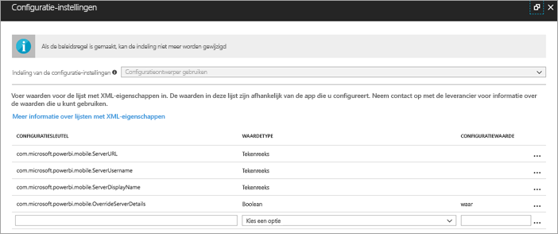
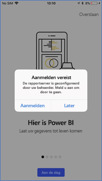
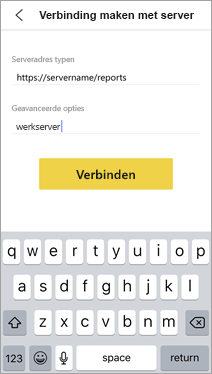
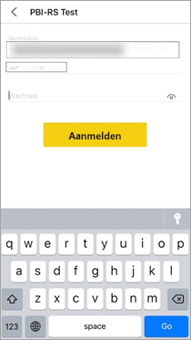

# Toegang via Power BI mobiele iOS-apps tot rapportservers op afstand configureren

In dit artikel leert u hoe u het MDM-hulpprogramma van uw organisatie gebruikt om toegang op afstand via de Power BI mobiele iOS-app tot een rapportserver te configureren. Om dit in te stellen maken IT-beheerders een app-configuratiebeleid waarbij de vereiste informatie naar de app wordt gepusht. 

 Vervolgens kunnen gebruikers van Power BI mobiele iOS-apps eenvoudiger op afstand verbinding maken met de rapportserver van hun organisatie omdat de verbinding met de rapportserver al is geconfigureerd. 

## Het app-configuratiebeleid maken in het MDM-hulpprogramma 

Als beheerder volgt u deze stappen in Microsoft Intune om het app-configuratiebeleid te maken. De stappen en ervaring bij het opzetten van het app-configuratiebeleid is mogelijk anders bij andere MDM-hulpprogramma’s. 

1. Maak verbinding met uw MDM-hulpprogramma. 
2. Maak en benoem een nieuw app-configuratiebeleid. 
3. Kies naar welke gebruikers u dit app-configuratiebeleid wilt distribueren. 
4. Maak sleutel-waardeparen. 

In de volgende tabel staan de paren.

|Sleutel  |Type  |Beschrijving  |
|---------|---------|---------|
| com.microsoft.powerbi.mobile.ServerURL | Tekenreeks | Rapportserver-URL   Moet beginnen met http/https |
| com.microsoft.powerbi.mobile.ServerUsername | Tekenreeks | [optioneel]   De gebruikersnaam die u wilt gebruiken om verbinding te maken met de server.   Als deze niet bestaat, wordt de gebruiker gevraagd de gebruikersnaam voor de verbinding in te voeren.| 
| com.microsoft.powerbi.mobile.ServerDisplayName | Tekenreeks | [optioneel]   De standaardwaarde is rapportserver   Een beschrijvende naam die in de app wordt gebruikt als naam voor de server | 
| com.microsoft.powerbi.mobile.OverrideServerDetails | Boolean | De standaardwaarde is Waar   Als deze optie is ingesteld op Waar, worden hiermee alle eventuele definities van de rapportserver overschreven die al op het mobiele apparaat bestaan (bestaande servers die al zijn geconfigureerd, worden verwijderd).   Wanneer overschrijven is ingesteld op Waar, voorkomt u hiermee ook dat gebruikers die configuratie kunnen verwijderen.   Wanneer de optie is ingesteld op Onwaar, worden de gepushte waarden toegevoegd en blijven bestaande instellingen bestaan.   Als dezelfde server-URL al is geconfigureerd in de mobiele app, laat de app die configuratie ongewijzigd en wordt de gebruiker niet gevraagd om opnieuw een verificatie voor dezelfde server uit te voeren. |

Hier ziet u een voorbeeld van het instellen van het configuratiebeleid met behulp van Intune.

## Eindgebruikers maken verbinding met een rapportserver

Nadat u het app-configuratiebeleid publiceert, krijgen gebruikers en apparaten die bij de distributielijst horen die voor dat beleid is gedefinieerd, de volgende ervaring wanneer ze de Power BI mobiele iOS-app starten. 

1. Ze zien een bericht dat hun mobiele app is geconfigureerd met een rapportserver en tikken op **Aanmelden**.

    

2.  Op de pagina **Verbinding maken met server** zijn de details over de rapportserver al ingevuld. Ze tikken op **Verbinding maken**.

    

3. Ze voeren een wachtwoord ter verificatie in en tikken op **Aanmelden**. 

    

Ze kunnen nu KPI's en Power BI-rapporten zien en gebruiken die zijn opgeslagen op de rapportserver.

## Volgende stappen
[Administratoroverzicht](admin-handbook-overview.md)  
[Power BI Report Server installeren](install-report-server.md)  

Hebt u nog vragen? [Misschien dat de Power BI-community het antwoord weet](https://community.powerbi.com/)

