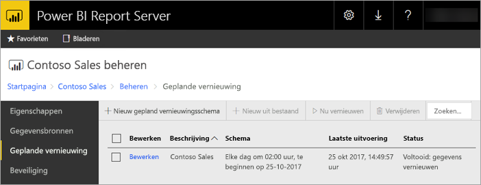
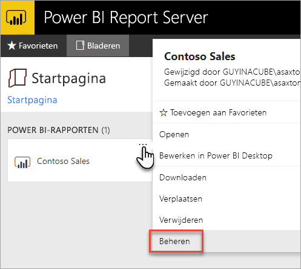
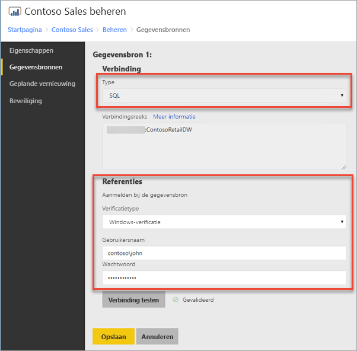
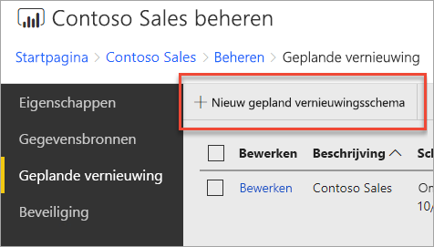
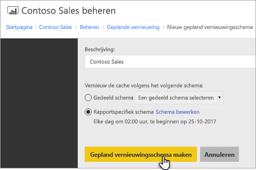
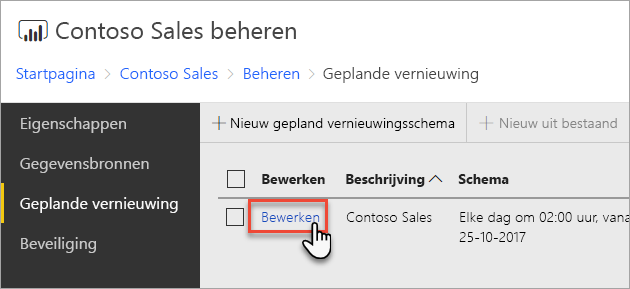
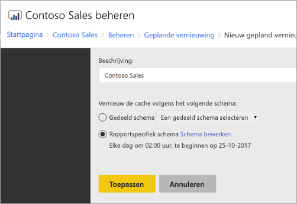

# Een geplande vernieuwing van uw Power BI-rapport configureren
Om de gegevens in uw Power BI-rapport te vernieuwen, moet u een gepland vernieuwingsschema maken. Dit doet u in het gedeelte *Beheren* van een Power BI-rapport.

## Referenties voor gegevensbron configureren
Voordat u een vernieuwingsschema inplant, moet u de referenties instellen voor **elke gegevensbron** die wordt gebruikt in uw Power BI-rapport.

1. Klik in de webportal met de rechtermuisknop op het Power BI-rapport en selecteer **Beheren**.
   
    
2. Selecteer in het menu links het tabblad **Gegevensbronnen**.
3. Voor elke gegevensbron die wordt weergegeven, kiest u het type verificatie dat u wilt gebruiken bij het verbinden met deze gegevensbron. Geef de juiste referenties op.
   
    

## Een gepland vernieuwingsschema maken
Volg deze stappen om een gepland vernieuwingsschema te maken.

1. Klik in de webportal met de rechtermuisknop op het Power BI-rapport en selecteer **Beheren**.
   
    
2. Selecteer in het menu links het tabblad **Geplande vernieuwing**.
3. Selecteer op de pagina **Geplande vernieuwing** de optie **Nieuw gepland vernieuwingsschema**.
   
    
4. Op de pagina **Nieuw gepland vernieuwingsschema** voert u een beschrijving in en stelt u een planning in om aan te geven wanneer uw gegevensmodel moet worden vernieuwd.
5. Selecteer **Gepland vernieuwingsschema maken** wanneer u klaar bent.
   
    

## Een gepland vernieuwingsschema wijzigen
Het wijzigen van een gepland vernieuwingsschema lijkt op het maken ervan.

1. Klik in de webportal met de rechtermuisknop op het Power BI-rapport en selecteer **Beheren**.
   
    
2. Selecteer in het menu links het tabblad **Geplande vernieuwing**.
3. Op de pagina **Geplande vernieuwing** selecteert u **Bewerken** naast het vernieuwingsschema dat u wilt beheren.
   
    
4. Op de pagina **Gepland vernieuwingsschema bewerken** voert u een beschrijving in en stelt u een planning in om aan te geven wanneer uw gegevensmodel moet worden vernieuwd.
5. Selecteer **Toepassen** wanneer u klaar bent.
   
    

## De statuscontrole van een gepland vernieuwingsschema bekijken
U bekijkt de status van een gepland vernieuwingsschema in de webportal.

1. Klik in de webportal met de rechtermuisknop op het Power BI-rapport en selecteer **Beheren**.
   
    
2. Selecteer in het menu links het tabblad **Geplande vernieuwing**.
3. Op de pagina **Geplande vernieuwing** kunt u in de rechterkolom de status van een schema zien.
   
   | **Status** | **Beschrijving** |
   | --- | --- |
   | Nieuw gepland vernieuwingsschema |Het schema is gemaakt, maar is niet uitgevoerd. |
   | Vernieuwen |Het vernieuwingsproces is gestart. |
   | Model streamen naar Analysis Server |Het model wordt gekopieerd van de catalogusdatabase van de rapportserver naar het gehoste Analysis Services-exemplaar. |
   | Gegevens vernieuwen |De gegevens in het model worden vernieuwd. |
   | Referenties verwijderen uit het model |De referenties waarmee verbinding wordt gemaakt met de gegevensbron worden uit het model verwijderd. |
   | Model opslaan in de catalogus |Het vernieuwen van gegevens is voltooid en het vernieuwde model wordt in de catalogusdatabase van de rapportserverdatabase opgeslagen. |
   | Voltooid: gegevens vernieuwen |Het vernieuwen is voltooid. |
   | Fout: |Er is een fout opgetreden tijdens het vernieuwen. Deze wordt weergegeven. |

De webpagina moet worden vernieuwd om de huidige status te bekijken. De status verandert niet automatisch.

## Volgende stappen
Zie [Schema’s maken, wijzigen en verwijderen](https://docs.microsoft.com/sql/reporting-services/subscriptions/create-modify-and-delete-schedules) voor meer informatie over het maken en wijzigen van schema's.

Zie [Problemen oplossen met geplande vernieuwing in Power BI Report Server](scheduled-refresh-troubleshoot.md) voor meer informatie over het oplossen van problemen met de geplande vernieuwing.

Hebt u nog vragen? [Misschien dat de Power BI-community het antwoord weet](https://community.powerbi.com/)

