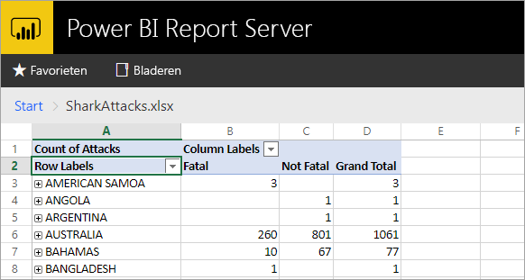
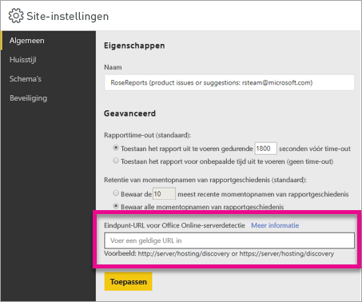

# <a name="configure-your-report-server-to-host-excel-workbooks-using-office-online-server-oos"></a>De rapportserver configureren om Excel-werkmappen te hosten met Office Online Server (OOS)

Naast het bekijken van Power BI-rapporten in de webportal, kan Power BI Report Server Excel-werkmappen hosten met behulp van [Office Online Server](https://docs.microsoft.com/officeonlineserver/office-online-server-overview) (OOS). Uw rapportserver wordt één locatie voor het publiceren en bekijken van selfservice-inhoud van Microsoft BI.



## <a name="prepare-server-to-run-office-online-server"></a>De server voorbereiden om Office Online Server uit te voeren

Voer deze procedures uit op de server waarop u Office Online Server wilt uitvoeren. Deze server moet een Windows Server 2012 R2 of Windows Server 2016 zijn. Voor Windows Server 2016 is de versie van Office Online Server van april 2017 of later vereist.

### <a name="install-prerequisite-software-for-office-online-server"></a>Vereiste software installeren voor Office Online Server

1. Open de Windows PowerShell-prompt als beheerder en voer deze opdracht uit om de vereiste rollen en services te installeren.

    **Windows Server 2012 R2:**

    ```
    Add-WindowsFeature Web-Server,Web-Mgmt-Tools,Web-Mgmt-Console,Web-WebServer,Web-Common-Http,Web-Default-Doc,Web-Static-Content,Web-Performance,Web-Stat-Compression,Web-Dyn-Compression,Web-Security,Web-Filtering,Web-Windows-Auth,Web-App-Dev,Web-Net-Ext45,Web-Asp-Net45,Web-ISAPI-Ext,Web-ISAPI-Filter,Web-Includes,InkandHandwritingServices,NET-Framework-Features,NET-Framework-Core,NET-HTTP-Activation,NET-Non-HTTP-Activ,NET-WCF-HTTP-Activation45,Windows-Identity-Foundation,Server-Media-Foundation
    ```

    **Windows Server 2016:**

    ```
    Add-WindowsFeature Web-Server,Web-Mgmt-Tools,Web-Mgmt-Console,Web-WebServer,Web-Common-Http,Web-Default-Doc,Web-Static-Content,Web-Performance,Web-Stat-Compression,Web-Dyn-Compression,Web-Security,Web-Filtering,Web-Windows-Auth,Web-App-Dev,Web-Net-Ext45,Web-Asp-Net45,Web-ISAPI-Ext,Web-ISAPI-Filter,Web-Includes,NET-Framework-Features,NET-Framework-45-Features,NET-Framework-Core,NET-Framework-45-Core,NET-HTTP-Activation,NET-Non-HTTP-Activ,NET-WCF-HTTP-Activation45,Windows-Identity-Foundation,Server-Media-Foundation
    ```

    Start de server opnieuw op als u hierom wordt gevraagd.
2. Installeer de volgende software:

   * [.NET Framework 4.5.2](https://go.microsoft.com/fwlink/p/?LinkId=510096)
   * [Visual C++ Redistributable Packages for Visual Studio 2013](https://www.microsoft.com/download/details.aspx?id=40784)
   * [Visual C++ Redistributable for Visual Studio 2015](https://go.microsoft.com/fwlink/p/?LinkId=620071)
   * [Microsoft.IdentityModel.Extention.dll](https://go.microsoft.com/fwlink/p/?LinkId=620072)

### <a name="install-office-online-server"></a>Office Online Server installeren

Als u functies van Excel Online wilt gebruiken die gebruikmaken van toegang tot externe gegevens (zoals Power Pivot), houd er dan rekening mee dat Office Online Server zich moet bevinden in hetzelfde Active Directory-forest als de gebruikers, evenals alle externe gegevensbronnen die u wilt openen met Windows-verificatie.

1. Download Office Online Server via het [Volume Licensing Service Center (VLSC)](http://go.microsoft.com/fwlink/p/?LinkId=256561). De download bevindt zich bij de Office-producten in de VLSC-portal. Voor ontwikkelingsdoeleinden kunt u OOS downloaden vanuit de downloads voor MSDN-abonnees.
2. Voer Setup.exe uit.
3. Selecteer op de pagina **Lees de licentievoorwaarden voor Microsoft-software** de optie **Ik ga akkoord met de voorwaarden van deze overeenkomst** en selecteer **Doorgaan**.
4. Selecteer op de pagina **Kies een bestandslocatie** de map waar u de bestanden van Office Online Server wilt installeren (bijvoorbeeld C:\Program Files\Microsoft Office Web Apps\*) en selecteer **Nu installeren**. Als de opgegeven map niet bestaat, wordt deze voor u gemaakt.

    Het is raadzaam om Office Online Server op het systeemstation te installeren.

5. Als Setup de installatie van Office Online Server heeft voltooid, selecteert u **Sluiten**.

### <a name="install-language-packs-for-office-web-apps-server-optional"></a>Taalpakketten installeren voor Office Web Apps Server (optioneel)

Met de taalpakketten van Office Online Server kunnen gebruikers webgebaseerde Office-bestanden weergeven in meerdere talen.

Volg deze stappen voor het installeren van de taalpakketten.

1. Download de taalpakketten van Office Online Server via het [Microsoft Downloadcentrum](http://go.microsoft.com/fwlink/p/?LinkId=798136).
2. Voer **wacserverlanguagepack.exe** uit.
3. Selecteer in de wizard voor de installatie van de taalpakketten van Office Online Server op de pagina **Lees de licentievoorwaarden voor Microsoft-software** de optie **Ik ga akkoord met de voorwaarden van deze overeenkomst** en selecteer **Doorgaan**.
4. Als Setup de installatie van Office Online Server heeft voltooid, selecteert u **Sluiten**.

## <a name="deploy-office-online-server"></a>Office Online Server implementeren

### <a name="create-the-office-online-server-farm-https"></a>De Office Online Server-farm maken (HTTPS)

Gebruik de opdracht New-OfficeWebAppsFarm om een nieuwe Office Online Server-farm te maken die uit één server bestaat, zoals wordt weergegeven in het volgende voorbeeld.

```
New-OfficeWebAppsFarm -InternalUrl "https://server.contoso.com" -ExternalUrl "https://wacweb01.contoso.com" -CertificateName "OfficeWebApps Certificate"
```

**Parameters**

* **–InternalURL** is de volledig gekwalificeerde domeinnaam (FQDN) van de server met Office Online Server, zoals `http://servername.contoso.com`.
* **–ExternalURL** is de FQDN-naam die toegankelijk is op het internet.
* **–CertificateName** is de beschrijvende naam van het certificaat.

### <a name="create-the-office-online-server-farm-http"></a>De Office Online Server-farm maken (HTTP)

Gebruik de opdracht New-OfficeWebAppsFarm om een nieuwe Office Online Server-farm te maken die uit één server bestaat, zoals wordt weergegeven in het volgende voorbeeld.

```
New-OfficeWebAppsFarm -InternalURL "http://servername" -AllowHttp
```

**Parameters**

* **–InternalURL** is de naam van de server met Office Online Server, zoals `http://servername`.
* **–AllowHttp** configureert de farm voor het gebruik van HTTP.

### <a name="verify-that-the-office-online-server-farm-was-created-successfully"></a>Controleren of de Office Online Server-farm is gemaakt

Nadat de farm is gemaakt, worden de details over de farm weergegeven in de Windows PowerShell-prompt. Gebruik een webbrowser om te controleren of Office Online Server is geïnstalleerd en correct is geconfigureerd. Open met deze browser de detectie-URL van Office Online Server, zoals wordt weergegeven in het volgende voorbeeld. De detectie-URL is de *InternalUrl*-parameter die u hebt opgegeven bij het instellen van uw Office Online Server-farm, gevolgd door */hosting/discovery*, bijvoorbeeld:

```
<InternalUrl>/hosting/discovery
```

Als Office Online Server werkt zoals verwacht, ziet u een WOPI- detectiebestand (Web Application Open Platform Interface Protocol) in XML-indeling in uw webbrowser. De eerste paar regels van het bestand moeten eruitzien als in het volgende voorbeeld:

```
<?xml version="1.0" encoding="utf-8" ?> 
- <wopi-discovery>
- <net-zone name="internal-http">
- <app name="Excel" favIconUrl="<InternalUrl>/x/_layouts/images/FavIcon_Excel.ico" checkLicense="true">
<action name="view" ext="ods" default="true" urlsrc="<InternalUrl>/x/_layouts/xlviewerinternal.aspx?<ui=UI_LLCC&><rs=DC_LLCC&>" /> 
<action name="view" ext="xls" default="true" urlsrc="<InternalUrl>/x/_layouts/xlviewerinternal.aspx?<ui=UI_LLCC&><rs=DC_LLCC&>" /> 
<action name="view" ext="xlsb" default="true" urlsrc="<InternalUrl>/x/_layouts/xlviewerinternal.aspx?<ui=UI_LLCC&><rs=DC_LLCC&>" /> 
<action name="view" ext="xlsm" default="true" urlsrc="<InternalUrl>/x/_layouts/xlviewerinternal.aspx?<ui=UI_LLCC&><rs=DC_LLCC&>" /> 
```

### <a name="configure-excel-workbook-maximum-size"></a>Maximale grootte van Excel-werkmap configureren

De maximale grootte voor alle bestanden in Power BI Report Server is 100 MB. Om hieraan te voldoen, moet u dit handmatig instellen in OOS.

```
Set-OfficeWebAppsFarm -ExcelWorkbookSizeMax 100
```

## <a name="using-effectiveusername-with-analysis-services"></a>EffectiveUserName gebruiken met Analysis Services

U wilt mogelijk live verbindingen met Analysis Services toestaan voor verbindingen binnen een Excel-werkmap die gebruikmaken van EffectiveUserName. OOS kan alleen gebruikmaken van EffectiveUserName als u het computeraccount van de OOS-server toevoegt als beheerder van het Analysis Services-exemplaar. Management Studio voor SQL Server 2016 of hoger is vereist om dit te doen.

Op het moment worden alleen ingesloten Analysis Services-verbindingen ondersteund in een Excel-werkmap. Het gebruikersaccount moet gemachtigd zijn om verbinding te maken met Analysis Services, omdat de mogelijkheid om via een proxy verbinding te maken met de gebruiker niet beschikbaar is.

Voer de volgende PowerShell-opdrachten uit in de OOS-server.

```
Set-OfficeWebAppsFarm -ExcelUseEffectiveUserName:$true
Set-OfficeWebAppsFarm -ExcelAllowExternalData:$true
Set-OfficeWebAppsFarm -ExcelWarnOnDataRefresh:$false
```

## <a name="configure-a-power-pivot-instance-for-data-models"></a>Een Power Pivot-exemplaar voor gegevensmodellen configureren

Door een Analysis Services Power Pivot-modusexemplaar te installeren, kunt u werken met Excel-werkmappen die Power Pivot gebruiken. Zorg ervoor dat de exemplaarnaam *POWERPIVOT* is. Voeg het computeraccount van de OOS toe als beheerder voor het exemplaar van Analysis Services Power Pivot-modus. Management Studio voor SQL Server 2016 of hoger is vereist om dit te doen.

Voer de volgende opdracht uit zodat OOS het exemplaar van de Power Pivot-modus kan gebruiken.

```
New-OfficeWebAppsExcelBIServer -ServerId <server_name>\POWERPIVOT
```

Voer de volgende opdracht uit als u externe gegevens uit de bovenstaande Analysis Services-stap nog niet toestaat.

```
Set-OfficeWebAppsFarm -ExcelAllowExternalData:$true
```

### <a name="firewall-considerations"></a>Aandachtspunten voor de firewall

Om firewallproblemen te voorkomen, moet u wellicht de poorten 2382 en 2383 openen. U kunt ook de *msmdsrv.exe* toevoegen voor het Power Pivot-exemplaar als een firewallbeleid voor de toepassing.

## <a name="configure-power-bi-report-server-to-use-the-oos-server"></a>Power BI Report Server configureren voor het gebruik van de OOS-server

Op de pagina **Algemeen** van **Site-instellingen** voert u de detectie-URL in van OOS. De detectie-URL van OOS is de *InternalUrl* die wordt gebruikt bij het implementeren van de OOS-server, gevolgd door */hosting/discovery*. Bijvoorbeeld `http://servername/hosting/discovery` voor HTTP. En `https://server.contoso.com/hosting/discovery` voor HTTPS.

Om naar **Site-instellingen** te gaan, selecteert u het **tandwielpictogram** in de rechterbovenhoek. Selecteer vervolgens **Site-instellingen**.

Alleen gebruikers met de rol **Systeembeheerder** kunnen de instellingen van de detectie-URL van Office Online Server zien.



Nadat u de detectie-URL hebt ingevoerd en **Toepassen** hebt geselecteerd, moet u een Excel-werkmap in de webportal selecteren om deze op deze locatie weer te geven.

## <a name="limitations-and-considerations"></a>Beperkingen en overwegingen

* U hebt alleen de mogelijkheid om werkmappen te lezen.

## <a name="next-steps"></a>Volgende stappen

[Administratoroverzicht](admin-handbook-overview.md)  
[Power BI Report Server installeren](install-report-server.md)  
[Report Builder downloaden](https://www.microsoft.com/download/details.aspx?id=53613)  
[SQL Server Data Tools (SSDT) downloaden](http://go.microsoft.com/fwlink/?LinkID=616714)

Nog vragen? [Misschien dat de Power BI-community het antwoord weet](https://community.powerbi.com/)
