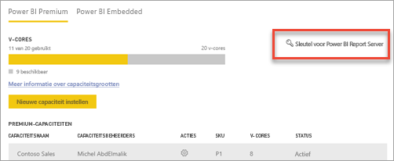
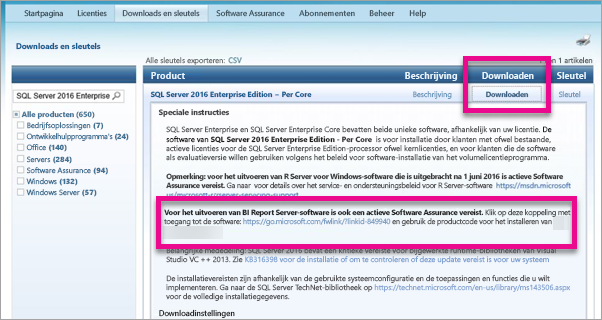

# De productcode van uw rapportserver zoeken
Meer informatie over hoe u uw Power BI Report Server-productcode kunt vinden voor het installeren van uw server in een productieomgeving.

<iframe width="640" height="360" src="https://www.youtube.com/embed/6CQnf-NGtpU?rel=0&amp;showinfo=0" frameborder="0" allowfullscreen></iframe>

U hebt Power BI Report Server gedownload, en u hebt een SQL Server Enterprise Software Assurance-overeenkomst. Of u hebt Power BI Premium aangeschaft. U wilt de server installeren in een productieomgeving, maar u hebt een productcode nodig om dit te kunnen doen. Waar is de productcode? 

De productcode bevindt zich in een van de volgende twee locaties, afhankelijk van wat u hebt aangeschaft.

## U hebt Power BI Premium aangeschaft
Als u Power BI Premium hebt aangeschaft, vindt u uw Power BI Report Server-productcode op het tabblad **Capaciteitsinstellingen** in de Power BI-beheerportal. Dit is alleen beschikbaar voor hoofdbeheerders of gebruikers die de rol Power BI-servicebeheerder toegewezen hebben gekregen.

Als u **Power BI Report Server-sleutel** selecteert, wordt een dialoogvenster weergeven met uw productcode. U kunt deze kopiëren en gebruiken bij de installatie.

## U hebt een Software Assurance-overeenkomst aangeschaft
Als u een SQL Server Enterprise SA-overeenkomst hebt, kunt u uw productcode vinden in het [Volume Licensing Service Center](https://www.microsoft.com/Licensing/servicecenter/). Zoek bij het nieuwste servicepack naar de meest recente versie van SQL Server. Als u deze niet ziet, kijkt u bij de RTM-versie van de meest recente versie van SQL Server.

> [!NOTE]
> U moet zoeken in het downloadgedeelte. Niet het gedeelde met productcodes.
> 
> 

## Volgende stappen
[Quickstart: Power BI Report Server installeren](quickstart-install-report-server.md)  
[Voor Power BI Report Server geoptimaliseerde versie van Power BI Desktop installeren](install-powerbi-desktop.md)  
[Report Builder installeren](https://docs.microsoft.com/sql/reporting-services/install-windows/install-report-builder)  
[SQL Server Data Tools (SSDT) downloaden](http://go.microsoft.com/fwlink/?LinkID=616714)

Nog vragen? [Misschien dat de Power BI-community het antwoord weet](https://community.powerbi.com/)

