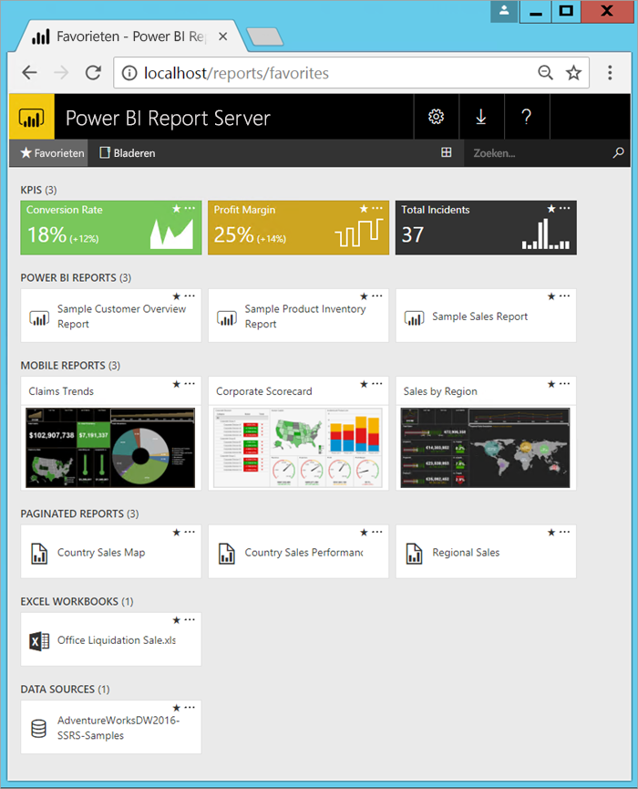

# Wat is Power BI Report Server?

Power BI Report Server is een on-premises rapportserver met een webportal waarin u rapporten en KPI's kunt bekijken en beheren, in combinatie met de hulpmiddelen voor het maken van rapporten, gepagineerde rapporten, mobiele rapporten en KPI's van Power BI. Uw gebruikers hebben op verschillende manieren toegang tot deze rapporten: ze kunnen ze in een webbrowser of op een mobiel apparaat bekijken of als een e-mailbericht in hun Postvak IN.

## Power BI Report Server vergelijken 
Power BI Report Server lijkt op zowel SQL Server Reporting Services als de online Power BI-service, maar er zijn verschillen. Power BI Report Server host net als de Power BI-service zowel Power BI-rapporten (PBIX) als Excel-bestanden. Power BI Report Server is net als Reporting Services on-premises en host gepagineerde rapporten (RDL). Power BI Report Server omvat Reporting Services: alles wat u kunt doen in Reporting Services, kunt u doen met Power BI Report Server en nog meer, en het biedt ondersteuning voor Power BI-rapporten. Zie [Comparing Power BI Report Server and the Power BI service](compare-report-server-service.md) (Power BI Report Server vergelijken met de Power BI-service) voor meer informatie.

## Licenties voor Power BI Report Server
Power BI Report Server is verkrijgbaar via twee verschillende licenties: [Power BI Premium](../service-premium.md) en [SQL Server Enterprise Edition](https://www.microsoft.com/sql-server/sql-server-2017-editions) met Software Assurance. Met een licentie voor Power BI Premium kunt u een hybride implementatie maken waarin de cloud en uw on-premises omgeving gemengd zijn.  

## Webportal
Het toegangspunt voor Power BI Report Server is een veilige webportal die u in een moderne browser kunt bekijken. Hier hebt u toegang tot al uw rapporten en KPI's. De inhoud op de webportal is in een traditionele mappenhiërarchie gerangschikt. De inhoud in de mappen is gerangschikt op type: Power BI-rapporten, mobiele rapporten, gepagineerde rapporten, KPI's, en Excel-werkmappen, plus gedeelde gegevenssets en gedeelde gegevensbronnen die u kunt gebruiken als bouwstenen voor uw rapporten. U kunt uw favorieten labelen, zodat u ze in één map kunt bekijken. En u kunt KPI's rechtstreeks in de webportal maken. 

Afhankelijk van uw machtigingen kunt de inhoud van de webportal beheren. U kunt rapportverwerking inplannen, rapporten op aanvraag openen en u abonneren op gepubliceerde rapporten. U kunt ook uw eigen aangepaste [huisstijl](https://docs.microsoft.com/sql/reporting-services/branding-the-web-portal) toepassen op uw webportal. 

Meer informatie over de [webportal van Power BI Report Server](https://docs.microsoft.com/sql/reporting-services/web-portal-ssrs-native-mode) (Engelstalig).

## Power BI-rapporten
U maakt Power BI-rapporten (PBIX) met de versie van Power BI Desktop die voor de rapportserver is geoptimaliseerd. Vervolgens publiceert u ze en bekijkt u ze in de webportal in uw eigen omgeving.

Een Power BI-rapport biedt een meervoudige weergave in een gegevensmodel, met visualisaties die andere bevindingen en inzichten uit dat gegevensmodel voorstellen.  Een rapport kan één visualisatie of pagina's vol visualisaties bevatten. Afhankelijk van uw functie kunt u rapporten lezen en verkennen of ze voor andere personen maken.

[Voor Power BI Report Server geoptimaliseerde versie van Power BI Desktop](quickstart-create-powerbi-report.md) installeren.

## Gepagineerde rapporten
Gepagineerde rapporten (RDL) zijn rapporten in documentstijl met visualisaties, waarin tabellen horizontaal en verticaal kunnen worden uitgebreid om alle gegevens weer te geven, eventueel doorlopend op volgende pagina's. Ze zijn ideaal voor het genereren van documenten met een perfecte vaste indeling die zijn geoptimaliseerd voor afdrukken, zoals PDF- en Word-bestanden.

U kunt modern vormgegeven rapporten maken met [Report Builder](https://docs.microsoft.com/sql/reporting-services/report-builder/report-builder-in-sql-server-2016) of Report Designer in [SQL Server Data Tools (SSDT)](https://docs.microsoft.com/sql/reporting-services/tools/reporting-services-in-sql-server-data-tools-ssdt).

## Mobiele rapporten van Reporting Services
Mobiele rapporten maken verbinding met on-premises gegevens en hebben een responsieve indeling die wordt aangepast aan verschillende apparaten en de wijze waarop deze worden vastgehouden. U maakt ze met SQL Server Mobile Report Publisher.

Meer informatie over [Mobiele rapporten van Reporting Services](https://docs.microsoft.com/sql/reporting-services/mobile-reports/create-mobile-reports-with-sql-server-mobile-report-publisher). 

## Programmeerfuncties van Report Server
Maak gebruik van de programmeerfuncties van Power BI Report Server zodat u de functionaliteit van uw rapporten kunt uitbreiden en aanpassen met API's voor het integreren of uitbreiden van gegevens en het verwerken van rapporten in aangepaste toepassingen.

Meer [ontwikkelaarsdocumentatie voor Report Server](https://docs.microsoft.com/sql/reporting-services/reporting-services-developer-documentation).

## Volgende stappen
[Power BI Report Server installeren](install-report-server.md)  
[Report Builder installeren](https://docs.microsoft.com/sql/reporting-services/install-windows/install-report-builder)  

Hebt u nog vragen? [Misschien dat de Power BI-community het antwoord weet](https://community.powerbi.com/)

