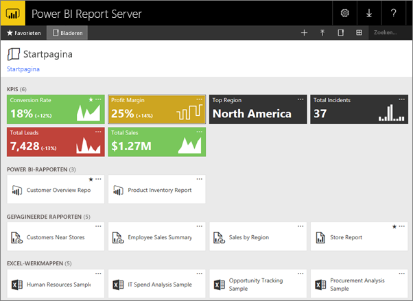
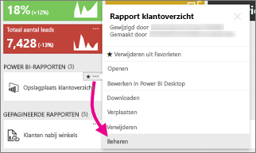
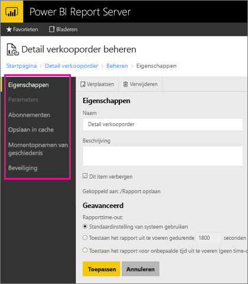
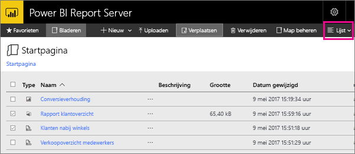

# Navigeren in de webportal van Power BI Report Server
De webportal van Power BI Report Server is een on-premises locatie om uw Power BI-rapporten, mobiele rapporten en gepagineerde rapporten weer te geven, op te slaan en te beheren.

U kunt de webportal weergeven in elke moderne browser. Rapporten en KPI's worden in de webportal geordend in mappen. Deze kunt u markeren als favorieten. U kunt hier ook Excel-werkmappen opslaan. Vanuit de webportal kunt u de hulpprogramma's starten die u nodig hebt om rapporten te maken:

* **Power BI-rapporten** die zijn gemaakt met Power BI Desktop: deze kunt u weergeven in de webportal en de mobiele Power BI-apps.
* **Gepagineerde rapporten** die zijn gemaakt in Report Builder: dit zijn modern ogende documenten met een vaste indeling die zijn geoptimaliseerd voor afdrukken.
* **KPI's** die rechtstreeks in de webportal zijn gemaakt.

U kunt in de webportal door de mappen van de rapportserver bladeren of naar specifieke rapporten zoeken. U kunt een rapport, de algemene eigenschappen van het rapport en eerdere exemplaren van het rapport, zoals vastgelegd in de rapportgeschiedenis, weergeven. Afhankelijk van uw machtigingen kunt u zich mogelijk ook abonneren op rapporten die worden geleverd aan uw Postvak IN of een gedeelde map in het bestandssysteem.

## Webportaltaken
U kunt de webportal gebruiken voor een aantal taken, waaronder de volgende:

* Rapporten weergeven, zoeken en afdrukken en u erop abonneren.
* De mappenhiërarchie maken, beveiligen en beheren om de items op de server te ordenen.
* De uitvoeringseigenschappen, de rapportgeschiedenis en de rapportparameters configureren.
* Gedeelde schema's en gedeelde gegevensbronnen maken om de schema's en verbindingen met de gegevensbronnen gemakkelijker te beheren.
* Gegevensgestuurde abonnementen maken om rapporten uit te rollen naar een lange lijst met geadresseerden.
* Gekoppelde rapporten maken om een bestaand rapport op verschillende manieren opnieuw te gebruiken voor andere doelen.
* Veelgebruikte hulpprogramma's downloaden en openen, zoals Power BI Desktop (Report Server), Report Builder, en Mobile Report Publisher.
* [KPI's maken](https://docs.microsoft.com/sql/reporting-services/working-with-kpis-in-reporting-services).
* Feedback verzenden of functieaanvragen indienen.
* [De webportal voorzien van een huisstijl](https://docs.microsoft.com/sql/reporting-services/branding-the-web-portal)
* [Werken met KPI's](https://docs.microsoft.com/sql/reporting-services/working-with-kpis-in-reporting-services)
* [Werken met gedeelde gegevenssets](https://docs.microsoft.com/sql/reporting-services/work-with-shared-datasets-web-portal)

## Rollen en machtigingen voor de webportal
De webportal is een webtoepassing die wordt uitgevoerd in een browser. Wanneer u de webportal start, kunnen er verschillende pagina's, koppelingen en opties worden weergegeven, afhankelijk van de machtigingen die u voor de rapportserver hebt. Als u bent toegewezen aan een rol met volledige machtigingen, hebt u toegang tot alle toepassingsmenu's en pagina's voor het beheren van een rapportserver. Als u aan een rol bent toegewezen met machtigingen voor het weergeven en uitvoeren van rapporten, worden alleen de menu's en pagina's weergegeven die u nodig hebt voor deze activiteiten. Het is mogelijk dat er verschillende rollen aan u zijn toegewezen voor verschillende rapportservers of zelfs voor verschillende rapporten en mappen op één rapportserver.

## De webportal starten
1. Open uw webbrowser.
   
    Zie de lijst met [ondersteunde webbrowsers en versies](browser-support.md).
2. Typ de URL van de webportal in de adresbalk.
   
    De standaard-URL is *http://[computernaam]/reports*.
   
    De rapportserver is mogelijk zo geconfigureerd dat een specifieke poort moet worden gebruikt. Bijvoorbeeld *http://[computernaam]:80/reports* of *http://[computernaam]:8080/reports*
   
    Zoals u ziet, worden de webportalitems gegroepeerd in de volgende categorieën:
   
   * KPI's
   * Mobiele rapporten
   * Gepagineerde rapporten
   * Power BI Desktop-rapporten
   * Excel-werkmappen
   * Gegevenssets
   * Gegevensbronnen
   * Resources

## Power BI Desktop-rapporten (PBIX-bestanden) maken en bewerken
U kunt machtigingen voor Power BI Desktop-rapporten weergeven, uploaden, maken, ordenen en beheren in de webportal.

### Een Power BI Desktop-rapport maken
1. Selecteer **Nieuw** > **Power BI-rapport**.
   
    
   
    De Power BI Desktop-app wordt geopend.
   
    
2. Maak uw Power BI-rapport. Zie [Snelstartgids: Power BI-rapporten](quickstart-create-powerbi-report.md) voor meer informatie.
3. Upload uw rapport naar de rapportserver.

### Een bestaand Power BI Desktop-rapport bewerken
1. Selecteer in de rechterbovenhoek van de rapporttegel het weglatingsteken (**...** ) en vervolgens **Bewerken in Power BI Desktop**.
   
    
   
    De Power BI Desktop-app wordt geopend.
2. Breng uw wijzigingen aan en sla ze op... [hoe?]

## Gepagineerde rapporten (RDL-bestanden) maken en bewerken
U kunt gepagineerde rapporten weergeven, uploaden, maken en ordenen en de machtigingen ervoor beheren in de webportal.

### Een gepagineerd rapport maken
1. Selecteer **Nieuw** > **Gepagineerd rapport**.
   
    De app Report Builder wordt geopend.
   
    
2. Een gepagineerd rapport maken. Zie [Snelstartgids: gepagineerde rapporten](quickstart-create-paginated-report.md) voor meer informatie.
3. Upload uw rapport naar de rapportserver.

### Een bestaand gepagineerd rapport bewerken
1. Selecteer in de rechterbovenhoek van de rapporttegel het weglatingsteken (... ) en vervolgens **Bewerken in Report Builder**.
   
    
   
    De app Report Builder wordt geopend.
2. Breng uw wijzigingen aan en sla het rapport op.

## Excel-werkmappen uploaden en ordenen
U kunt Power BI Desktop-rapporten en Excel-werkmappen uploaden en ordenen en de machtigingen ervoor beheren. De rapporten en mappen worden in de webportal bij elkaar gegroepeerd.

De werkmappen worden opgeslagen in Power BI Report Server, op dezelfde manier als andere resourcebestanden. Als u een van de werkmappen selecteert, wordt deze lokaal naar uw bureaublad gedownload. U kunt de aangebrachte wijzigingen opslaan door de werkmap opnieuw te uploaden naar de rapportserver.

## Items beheren in de webportal
Met Power BI Report Server hebt u gedetailleerde controle over de items die u op de webportal opslaat. U kunt bijvoorbeeld abonnementen, caching, momentopnamen en de beveiliging voor afzonderlijke gepagineerde rapporten instellen.

1. Selecteer in de rechterbovenhoek van een item het weglatingsteken (...) en selecteer vervolgens **Beheren**.
   
    
2. Kies de eigenschap of andere functie die u wilt instellen.
   
    
3. Selecteer **Toepassen**.

Meer informatie over het [werken met abonnementen in de webportal](https://docs.microsoft.com/sql/reporting-services/working-with-subscriptions-web-portal).

## Uw favoriete rapporten en KPI's taggen
U kunt uw rapporten en KPI's taggen die u wilt toevoegen aan uw favorieten. Ze zijn dan gemakkelijker te vinden omdat ze allemaal worden verzameld in één map met favorieten, zowel in de webportal als in de mobiele Power BI-apps. 

1. Selecteer het weglatingsteken (**...** ) in de rechterbovenhoek van de KPI of het rapport dat u wilt toevoegen aan uw favorieten en selecteer vervolgens **Toevoegen aan Favorieten**.
   
    
2. Selecteer op het lint van het webportaal de optie **Favorieten** om de KPI of het rapport samen met uw andere favorieten weer te geven op de pagina Favorieten in de webportal.
   
    
   
    Deze favorieten worden nu ook weergegeven in de mobiele Power BI-apps, samen met uw favoriete dashboards uit de Power BI-service.
   
    

## Items weergeven of verbergen in de webportal
U kunt items in de webportal verbergen en u kunt verborgen items weergeven.

### Een item verbergen
1. Selecteer in de rechterbovenhoek van een item het weglatingsteken (...) en selecteer vervolgens **Beheren**.
   
    
2. Selecteer **Dit item verbergen**.
   
    
3. Selecteer **Toepassen**.

### Verborgen items weergeven
1. Selecteer **Tegels** (of **Lijst**) in de rechterbovenhoek en selecteer vervolgens **Verborgen items weergeven**.
   
    De items worden weergegeven. Ze worden grijs weergegeven, maar u kunt ze gewoon openen en bewerken.
   
    

## Naar items zoeken
U kunt een zoekterm opgeven. U ziet vervolgens alles wat u kunt openen. De resultaten worden gecategoriseerd in KPI's, rapporten, gegevenssets en andere items. Vervolgens kunt u de resultaten beheren en ze toevoegen aan uw favorieten.  

## Items in lijstweergave verplaatsen of verwijderen
Standaard wordt de inhoud in de webportal weergegeven in de tegelweergave.

Desgewenst kunt u overschakelen naar de lijstweergave. In deze weergave is het makkelijker om meerdere items tegelijkertijd te verplaatsen of te verwijderen. 

1. Selecteer **Tegels** > **Lijst**.
   
    
2. Selecteer de items en selecteer vervolgens **Verplaatsen** of **Verwijderen**.

## Volgende stappen
[Gebruikershandboek](user-handbook-overview.md)  
[Snelstartgids: gepagineerde rapporten](quickstart-create-paginated-report.md)  
[Snelstartgids: Power BI-rapporten](quickstart-create-powerbi-report.md)

Nog vragen? [Misschien dat de Power Bi-community het antwoord weet](https://community.powerbi.com/).

