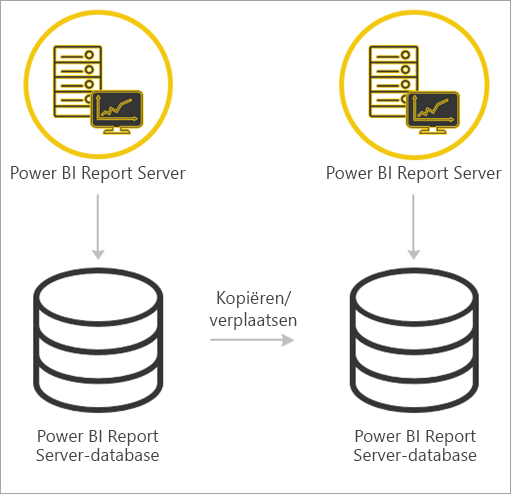

# <a name="migrate-a-report-server-installation"></a>Een rapportserverinstallatie migreren
Leer hoe u een exemplaar van SQL Server Reporting Services migreert naar een exemplaar van Power BI Report Server.

Migreren wordt gedefinieerd als het verplaatsen van gegevensbestanden van een toepassing naar een nieuw exemplaar van Power BI Report Server. Hieronder vindt u enkele veelvoorkomende redenen om de installatie te migreren:

* Uw wilt overstappen van SQL Server Reporting Services naar Power BI Report Server.
  
  > [!NOTE]
  > Er is geen directe upgrade van SQL Server Reporting Services naar Power BI Report Server. U moet migreren.
  > 
  > 
* U hebt een grootschalige implementatie of updatevereisten.
* U wijzigt de hardware of topologie van uw installatie.
* U ondervindt een probleem waardoor u geen upgrade kunt uitvoeren.

## <a name="migrating-to-power-bi-report-server-from-ssrs-native-mode"></a>Migreren van SSRS (native modus) naar Power BI Report Server
Als u van SSRS (native modus) migreert naar Power BI Report Server moet u enkele stappen uitvoeren.

 naar Power BI Report Server")

> [!NOTE]
> SQL Server 2008 Reporting Services en later worden ondersteund voor migratie.
> 
> 

* Back-ups maken van de database, toepassing en configuratiebestanden.
* Maak een back-up van de versleutelingssleutel.
* Kloon de rapportserverdatabase die optreedt als host van uw rapporten.
* Installeer Power BI Report Server. Als u dezelfde hardware gebruikt, kunt u Power BI Report Server op dezelfde server installeren als het exemplaar van SSRS. Zie [Power BI Report Server installeren](install-report-server.md) voor meer informatie over het installeren van Power BI Report Server.

> [!NOTE]
> De exemplaarnaam voor Power BI Report Server is *PBIRS*.
> 
> 

* Gebruik Report Server Configuration Manager om de rapportserver te configureren en maak verbinding met de gekloonde database.
* Voer de benodigde opschoontaken uit voor het exemplaar van SSRS (native modus).

## <a name="migration-to-power-bi-report-server-from-ssrs-sharepoint-integrated-mode"></a>Migratie van SSRS (SharePoint-integratiemodus) naar Power BI Report Server
Als u migreert van SSRS (SharePoint-integratiemodus) naar Power BI Report Server, is niet zo eenvoudig als voor de native modus. Hoewel deze stappen enige houvast bieden, is het mogelijk dat u andere bestanden en assets in SharePoint hebt die op een andere manier moeten worden beheerd.

 naar Power BI Report Server")

U moet de specifieke inhoud van de rapportserver migreren van SharePoint naar Power BI Report Server. Verondersteld wordt dat u Power BI Report Server al ergens in uw omgeving hebt geïnstalleerd. Zie [Power BI Report Server installeren](install-report-server.md) voor meer informatie over het installeren van Power BI Report Server.

Als u de inhoud van de rapportserver wilt kopiëren van uw SharePoint-omgeving naar Power BI Report Server, moet u hulpprogramma's als **rs.exe** gebruiken om de inhoud te kopiëren. Hieronder volgt een voorbeeld van een script om de rapportserverinhoud van SharePoint te kopiëren naar Power BI Report Server.

> [!NOTE]
> Het voorbeeldscript werkt voor SharePoint 2010 en later en SQL Server 2008 Reporting Services en later.
> 
> 

### <a name="sample-script"></a>Voorbeeldscript
```
Sample Script
rs.exe
-i ssrs_migration.rss -e Mgmt2010
-s http://SourceServer/_vti_bin/reportserver
-v st="sites/bi" -v f="Shared Documents“
-u Domain\User1 -p Password
-v ts=http://TargetServer/reportserver
-v tu="Domain\User" -v tp="Password"
```

## <a name="migrateing-from-one-power-bi-report-server-to-another"></a>Migreren van het ene naar een ander exemplaar van Power BI Report Server
Het proces voor de migratie van het ene naar een ander exemplaar van Power BI Report Server is hetzelfde als voor de migratie vanuit SSRS (native modus).



* Back-ups maken van de database, toepassing en configuratiebestanden.
* Maak een back-up van de versleutelingssleutel.
* Kloon de rapportserverdatabase die optreedt als host van uw rapporten.
* Installeer Power BI Report Server. U kunt Power BI Report Server *niet* op dezelfde server installeren als de server met het exemplaar dat u wilt migreren. Zie [Power BI Report Server installeren](install-report-server.md) voor meer informatie over het installeren van Power BI Report Server.

> [!NOTE]
> De exemplaarnaam voor Power BI Report Server is *PBIRS*.
> 
> 

* Gebruik Report Server Configuration Manager om de rapportserver te configureren en maak verbinding met de gekloonde database.
* Voer de benodigde opschoontaken uit voor de oude installatie van Power BI Report Server.

## <a name="next-steps"></a>Volgende stappen
[Administratoroverzicht](admin-handbook-overview.md)  
[Power BI Report Server installeren](install-report-server.md)  
[Script met het hulpprogramma rs.exe en de webservice](https://docs.microsoft.com/sql/reporting-services/tools/script-with-the-rs-exe-utility-and-the-web-service)

Nog vragen? [Misschien dat de Power BI-community het antwoord weet](https://community.powerbi.com/)

