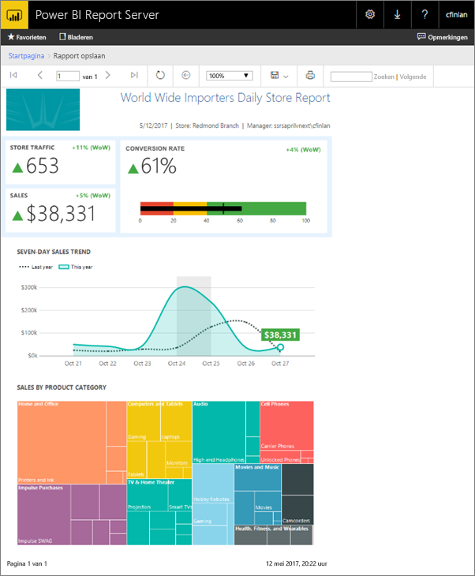
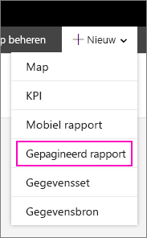
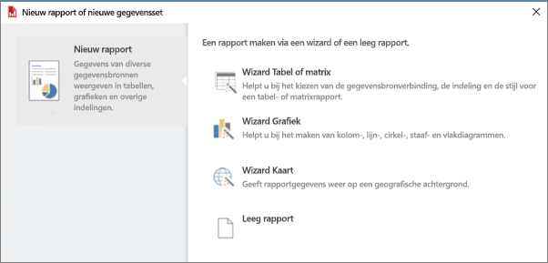
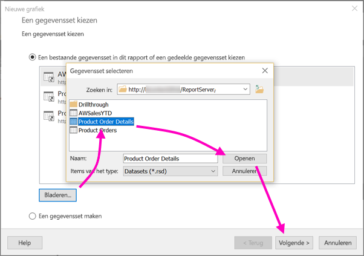
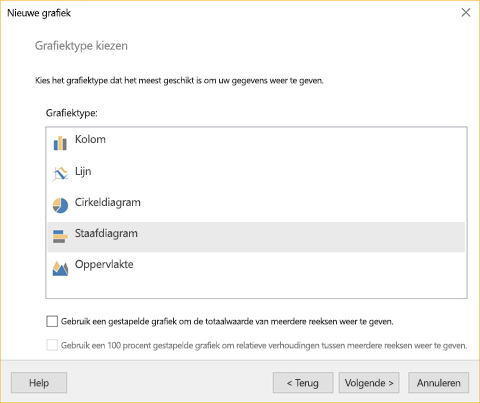
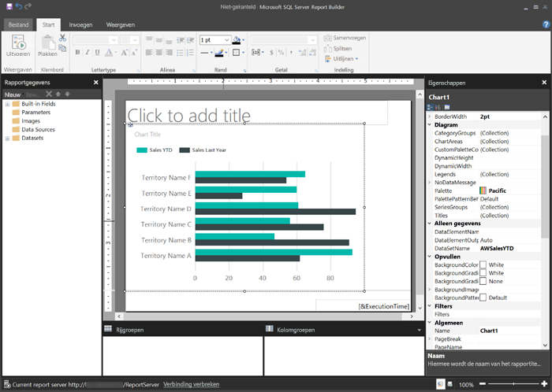
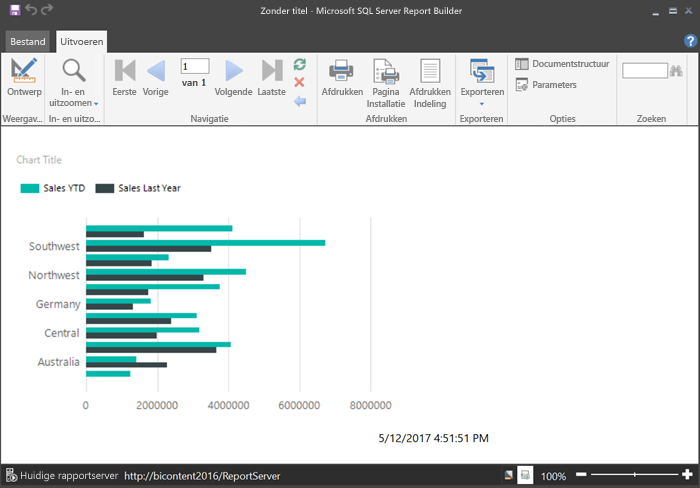
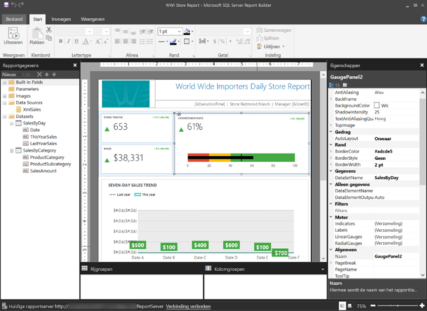

# Een gepagineerd rapport maken voor Power BI Report Server
Zoals de naam al aangeeft, kunnen gepagineerde rapporten uit meerdere pagina's bestaan. Ze worden opgemaakt met een vaste indeling en kunnen uiterst precies worden aangepast. Gepagineerde rapporten zijn RDL bestanden.

U kunt gepagineerde rapporten beheren en opslaan in de webportal van Power BI Report Server, net als u in de webportal van de SQL Server Reporting Services (SSRS). U maakt en bewerkt de rapporten in Report Builder of Report Designer in SQL Server Data Tools (SSDT). Vervolgens kunt u ze naar een van de twee webportals publiceren. De rapportlezers binnen uw organisatie kunnen ze weergeven in een browser of in een mobiele Power BI-app op hun mobiele apparaat.

Als u al gepagineerde rapporten in Report Builder of Report Designer hebt gemaakt, bent u er klaar voor om gepagineerde rapporten voor Power BI Report Server te maken. Als dat niet het geval is, volgen hier enkele snelle stappen om u op weg te helpen.

## Stap 1: Report Builder installeren en starten
Mogelijk hebt u Report Builder al geïnstalleerd om rapporten voor een SSRS-server te maken. U kunt dezelfde versie of Report Builder gebruiken om rapporten voor Power BI Report Server te maken. Als u Report Builder nog niet hebt geïnstalleerd, kunt u dit vrij eenvoudig alsnog doen.

1. Selecteer in de Power BI Report Server-webportal **Nieuw** > **Gepagineerd rapport**.
   
    
   
    Als u Report Builder nog niet hebt geïnstalleerd, wordt u nu door het installatieproces geleid.
2. Nadat Report Builder is geïnstalleerd, wordt het programma geopend en wordt het scherm **Nieuw rapport of nieuwe gegevensset** weergegeven.
   
    
3. Selecteer de wizard voor het type rapport dat u wilt maken:
   
   * Tabel of matrix
   * Diagram
   * Kaart
   * Leeg
4. Laten we beginnen met de wizard Grafieken.
   
    Met de wizard Grafieken doorloopt u het proces om eenvoudige diagrammen in een rapport te maken. Daar kunt u het rapport vrijwel zonder enige restrictie naar wens aanpassen.

## Stap 2: De wizard voor grafieken doorlopen
Met de wizard Grafieken doorloopt u de basisstappen om een visualisatie in een rapport te maken.

Gepagineerde rapporten kunnen verbinding maken met een groot aantal gegevensbronnen, van Microsoft SQL Server en Microsoft Azure SQL Database tot Oracle, Hyperion en nog veel meer. Meer informatie over [gegevensbronnen die worden ondersteund door gepagineerde rapporten](connect-data-sources.md).

Op de eerste pagina in de wizard Grafieken, **Een gegevensset kiezen**, kunt u een gegevensset maken of een gedeelde gegevensset op een server kiezen. *Gegevenssets* retourneren rapportgegevens naar aanleiding van een query voor een externe gegevensbron.

1. Selecteer **Bladeren** > selecteer een gedeelde gegevensset op een server > **Openen** > **Volgende**.
   
    
   
     Moet u een gegevensset maken? Zie [Een gedeelde of ingesloten gegevensset maken](https://docs.microsoft.com/sql/reporting-services/report-data/create-a-shared-dataset-or-embedded-dataset-report-builder-and-ssrs).
2. Kiest een type diagram. In dit geval kiest u een staafdiagram.
   
    
3. Rangschik de velden door ze naar de vakken **Categorieën**, **Reeks** en **Waarden** te slepen.
   
    
4. Selecteer **Volgende** > **Voltooien**.

## Stap 3: Uw rapport ontwerpen
U bevindt zich nu in de weergave voor het ontwerpen van rapporten. Zoals u ziet, wordt er een tijdelijke gegevensaanduiding weergegeven, niet uw gegevens.

* Als u uw gegevens wilt weergeven, selecteert u **Uitvoeren**.
  
     
* Selecteer **Ontwerpen** om terug te keren naar de ontwerpweergave.

U kunt het diagram dat u zojuist hebt gemaakt, wijzigen door de indeling, waarden, legenda... eigenlijk vrijwel alles aan te passen.

En u kunt diverse andere visualisaties toevoegen: meters, tabellen, matrices, kaarten en meer. U kunt kop- en voetteksten toevoegen voor meerdere pagina's. Zie de [zelfstudies voor Report Builder](https://docs.microsoft.com/sql/reporting-services/report-builder-tutorials) om het zelf te proberen.

## Stap 4: Uw rapport opslaan op de rapportserver
Wanneer uw rapport klaar is, slaat u het op in Power BI Report Server.

1. Selecteer in het menu **Bestand** de optie **Opslaan als** en sla het bestand op naar de rapportserver. 
2. Nu kunt u het rapport weergeven in de browser.
   
    

## Volgende stappen
Er zijn meer dan genoeg goede bronnen voor het ontwerpen van rapporten in Report Builder en in Report Designer in SQL Server Data Tools. De zelfstudies over Report Builder vormen een goed startpunt.

* [Zelfstudies over Report Builder](https://docs.microsoft.com/sql/reporting-services/report-builder-tutorials)
* [Gebruikershandboek voor Power BI Report Server](user-handbook-overview.md)  

Nog vragen? [Misschien dat de Power BI-community het antwoord weet](https://community.powerbi.com/)

