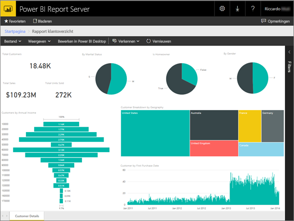
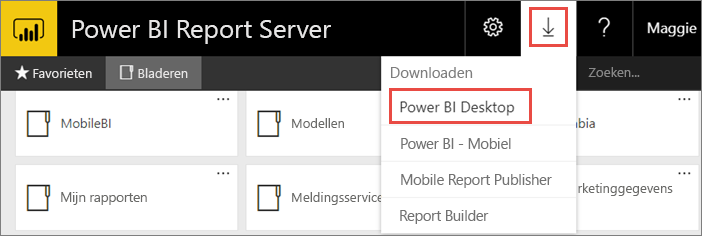
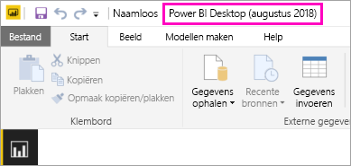
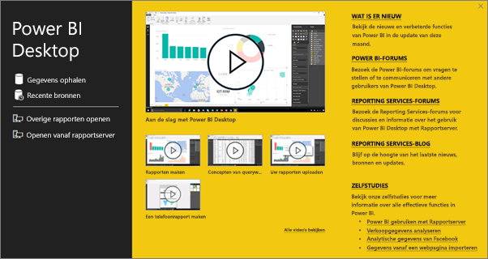
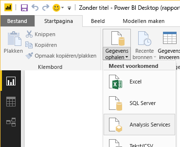
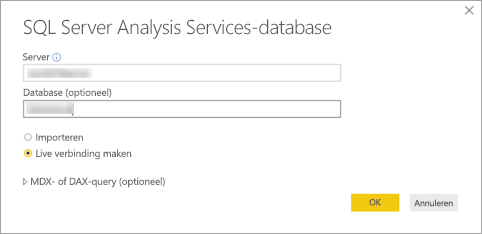
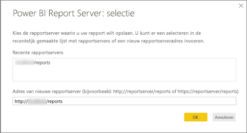
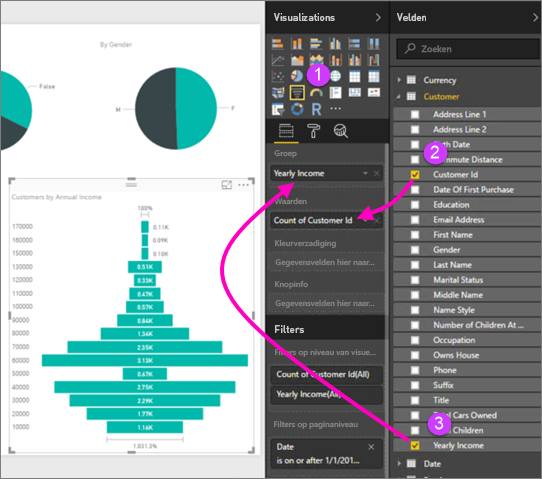
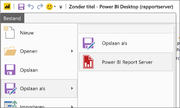

# Een Power BI-rapport maken voor Power BI Report Server
U kunt Power BI-rapporten on-premises opslaan en beheren in de webportal van Power BI Report Server, net zoals u Power BI-rapporten kunt opslaan in de cloud in de Power BI-service (https://powerbi.com)). U maakt rapporten in Power BI Desktop en publiceert deze naar de webportal. Gebruikers in uw organisatie kunnen de rapporten weergeven in een browser of in een mobiele Power BI-app op een mobiele apparaat.

Nu volgen vier snelle stappen om u op weg te helpen.

## Stap 1: voor Power BI Report Server geoptimaliseerde versie van Power BI Desktop installeren

Als u al Power BI-rapporten hebt gemaakt in Power BI Desktop, bent u bijna klaar om Power BI-rapporten te maken voor Power BI Report Server. Het is raadzaam om de versie van Power BI Desktop te installeren die is geoptimaliseerd voor Power BI Report Server, zodat u zeker weet dat de server en app altijd zijn gesynchroniseerd. U kunt beide versies van Power BI Desktop op dezelfde computer installeren.

1. Selecteer in de webportal voor rapportserver de pijl **Downloaden** > **Power BI Desktop**.

    

    U kunt ook rechtstreeks naar [Microsoft Power BI Desktop](https://www.microsoft.com/download/details.aspx?id=57271) (geoptimaliseerd voor Power BI Report Server, augustus 2018) gaan in het Microsoft Downloadcentrum.

2. Selecteer **Downloaden** in het downloadcentrum.

3. Selecteer het volgende, afhankelijk van uw computer:

    - **PBIDesktopRS.msi** (de 32-bits versie) of

    - **PBIDesktopRS_x64.msi** (de 64-bits versie).

4. Nadat u het installatieprogramma hebt gedownload, voert u de installatiewizard van Power BI Desktop (augustus 2018) uit.

2. Selecteer aan het einde van de installatie de optie **Power BI Desktop nu starten**.
   
    Het programma wordt automatisch gestart en u kunt aan de slag. U hebt de juiste versie als 'Power BI Desktop (augustus 2018)' wordt vermeld in de titelbalk.

    

3. Als u niet bekend bent met Power BI Desktop, is het misschien een goed idee om de video's op het welkomstscherm te bekijken.
   
    

## Stap 2: Een gegevensbron selecteren
U kunt verbinding maken met allerlei gegevensbronnen. Lees hier meer informatie over [het maken van verbinding met gegevensbronnen](connect-data-sources.md) (Engelstalig).

1. Selecteer **Gegevens ophalen** op het welkomstscherm.
   
    U kunt de optie **Gegevens ophalen** ook selecteren op het tabblad **Start**.
2. Selecteer uw gegevensbron, in dit voorbeeld **Analysis Services**.
   
    
3. Voer een waarde in voor **Server** en eventueel voor **Database**. Zorg ervoor dat **Live verbinding maken** is geselecteerd > **OK**.
   
    
4. Kies de rapportserver waarop u de rapporten wilt opslaan.
   
    

## Stap 3: Het rapport ontwerpen
Nu wordt het pas echt leuk. U gaat de visualisaties of visuele elementen maken die uw gegevens het best illustreren.

U kunt bijvoorbeeld een trechterdiagram maken van klanten en waarden groeperen op jaarlijkse omzet.

1. Selecteer **Trechterdiagram** bij **Visualisaties**.
2. Sleep het veld dat moet worden geteld naar het vak **Waarden**. Als het niet een numeriek veld is, wordt het type waarde automatisch gewijzigd in *Aantal van*.
3. Sleep het veld waarop u wilt groeperen naar het vak **Groep**.

Hier kunt u nog veel meer lezen over [het ontwerpen van een Power BI-rapport](../desktop-report-view.md).

## Stap 4: Het rapport opslaan op de rapportserver
Wanneer uw rapport klaar is, kunt u het opslaan op de Power BI-rapportserver die u hebt gekozen in stap 2.

1. Selecteer in het menu **Bestand** de optie **Opslaan als** > **Power BI Report Server**.
   
    
2. Nu kunt u het rapport bekijken in de webportal.
   
    

## Volgende stappen
### Power BI Desktop
Er zijn heel interessante informatiebronnen voor het maken van rapporten in Power BI Desktop. Deze koppeling is een goed startpunt.

* [Aan de slag met Power BI Desktop](../desktop-getting-started.md)
* Zelfstudie: [Aan de slag met Power BI Desktop](../guided-learning/gettingdata.yml?tutorial-step=2)

### Power BI Report Server
* [Voor Power BI Report Server geoptimaliseerde versie van Power BI Desktop installeren](install-powerbi-desktop.md)  
* [Wat is Power BI Report Server?](get-started.md)  

Hebt u nog vragen? [Misschien dat de Power BI-community het antwoord weet](https://community.powerbi.com/)
