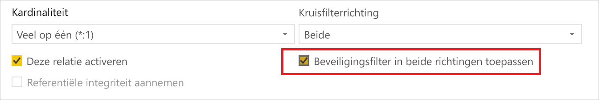
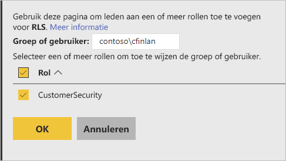
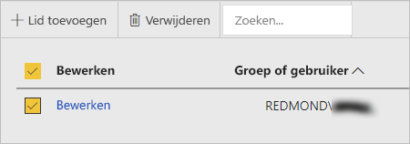

# Beveiliging op rijniveau (RLS) in Power BI Report Server

Het instellen van beveiliging op rijniveau (RLS) met Power BI Report Server kan toegang tot gegevens beperken voor bepaalde gebruikers. Filters beperken de toegang tot gegevens op rijniveau en u kunt filters definiëren in rollen.  Als u de standaardmachtigingen in Power BI Report Server gebruikt, kan elke gebruiker met de machtigingen Uitgever of Inhoudsbeheerder voor het Power BI-rapport leden toewijzen aan rollen voor dat rapport.    

U configureert RLS voor rapporten die met Power BI Desktop zijn geïmporteerd in Power BI. U kunt RLS ook configureren voor rapporten die gebruikmaken van DirectQuery, zoals SQL Server.  Houd er rekening mee dat RLS niet wordt gerespecteerd als de DirectQuery-verbinding gebruikmaakt van geïntegreerde verificatie voor rapportlezers. Voor Analysis Services-liveverbindingen configureert u beveiliging op rijniveau voor het on-premises model. De beveiligingsoptie wordt niet weergegeven voor gegevenssets met een liveverbinding. 

[!INCLUDE [rls-desktop-define-roles](../includes/rls-desktop-define-roles.md)]

## Kruislings filteren in twee richtingen

Het beveiligingsfilter op rijniveau gebruikt standaard filters in één richting, ongeacht of de relaties zijn ingesteld op één richting of twee richtingen. U kunt kruislings filteren in twee richtingen handmatig inschakelen met beveiliging op rijniveau.

- Selecteer de relatie en schakel het selectievakje **Beveiligingsfilter in beide richtingen toepassen** in. 

    

Schakel dit selectievakje in wanneer u  [dynamische beveiliging op rijniveau](https://docs.microsoft.com/sql/analysis-services/supplemental-lesson-implement-dynamic-security-by-using-row-filters) implementeert op basis van gebruikersnaam of aanmeldings-id. 

Zie voor meer informatie [Kruislings filteren in twee richtingen met DirectQuery in Power BI Desktop](../desktop-bidirectional-filtering.md) en het technisch document [Het semantische BI-model in tabelvorm beveiligen](http://download.microsoft.com/download/D/2/0/D20E1C5F-72EA-4505-9F26-FEF9550EFD44/Securing%20the%20Tabular%20BI%20Semantic%20Model.docx).

[!INCLUDE [rls-desktop-view-as-roles](../includes/rls-desktop-view-as-roles.md)]

## Leden toevoegen aan rollen 

Nadat u uw rapport hebt opgeslagen in Power BI Report Server, kunt u beveiliging beheren en leden toevoegen of verwijderen op de server. Alleen voor gebruikers met de machtigingen Uitgever of Inhoudsbeheerder voor het rapport is de optie voor beveiliging op rijniveau beschikbaar en wordt deze niet grijs weergegeven.

 Als het rapport niet beschikt over de rollen die nodig zijn, opent u het in Power BI Desktop, voegt u rollen toe of wijzigt u ze, en slaat u het vervolgens weer op in Power BI Report Server. 

1. In Power BI Desktop slaat u het rapport op naar Power BI Report Server. U moet de versie van Power BI Desktop gebruiken die is geoptimaliseerd voor Power BI Report Server.
2. Selecteer in Power BI Report Server het beletselteken (**...** ) naast het rapport. 

3. Selecteer **Beheren** > **Beveiliging op rijniveau**. 

     

    Op de pagina **Beveiliging op rijniveau** voegt u leden toe aan een rol die u hebt gemaakt in Power BI Desktop.

5. Als u een lid wilt toevoegen, selecteert u **Lid toevoegen**.

1. Voer de gebruiker of groep in het tekstvak in met de indeling Gebruikersnaam (DOMEIN\gebruiker) en selecteer de rollen die u eraan wilt toewijzen. Het lid moet zich binnen uw organisatie bevinden.   

    

    Afhankelijk van hoe u Active Directory hebt geconfigureerd, kunt u hier ook de User Principal Name invoeren. De rapportserver geeft in dat geval de overeenkomende gebruikersnaam in de lijst weer.

1. Klik op **OK** om toe te passen.   

8. Als u leden wilt verwijderen, schakelt u het selectievakje naast de namen in en selecteert u **Verwijderen**.  U kunt meerdere leden tegelijk verwijderen. 

    

## username() en userprincipalname()

U kunt gebruikmaken van de DAX-functies username() of userprincipalname() binnen uw gegevensset. U kunt deze gebruiken in expressies in Power BI Desktop. Wanneer u uw model publiceert, gebruikt Power BI Report Server deze.

In Power BI Desktop retourneert de functie username() een gebruiker met de indeling DOMEIN\Gebruiker en retourneert userprincipalname() een gebruiker met de indeling user@contoso.com.

In Power BI Report Server retourneren username() en userprincipalname() beide de UPN (User Principal Name) van de gebruiker, die vergelijkbaar is met een e-mailadres.

Als u aangepaste verificatie gebruikt in Power BI Report Server, wordt de gebruikersnaamindeling geretourneerd die u hebt ingesteld voor gebruikers.  

## Beperkingen 

Dit zijn de huidige beperkingen voor beveiliging op rijniveau in Power BI-modellen. 

Gebruikers die rapporten hadden met de DAX-functie username() zien nu nieuw gedrag waar de User Principal Name (UPN) wordt geretourneerd, TENZIJ DirectQuery wordt gebruikt met geïntegreerde beveiliging.  Aangezien RLS niet wordt gerespecteerd in dat scenario, is het gedrag in dat scenario niet gewijzigd.

U kunt RLS alleen definiëren in gegevenssets die zijn gemaakt met Power BI Desktop. Om RLS in te schakelen voor gegevenssets die zijn gemaakt met Excel, moet u uw bestanden eerst converteren naar PBIX-bestanden (Power BI Desktop). Meer informatie over [Excel-bestanden converteren](../desktop-import-excel-workbooks.md).

Alleen Extraheren, Transformeren, Laden (ETL) en DirectQuery-verbindingen met behulp van de opgeslagen referenties worden ondersteund. Live-verbindingen met Analysis Services- en DirectQuery-verbindingen via geïntegreerde verificatie worden verwerkt in de onderliggende gegevensbron. 

Als u geïntegreerde beveiliging met DirectQuery gebruikt, kunnen uw gebruikers het volgende zien:
- RLS is uitgeschakeld en alle gegevens worden geretourneerd.
- Gebruikers kunnen hun roltoewijzingen niet bijwerken en krijgen een fout op de pagina RLS beheren.
- Voor de DAX-functie username blijft u de gebruikersnaam ontvangen als DOMEIN\GEBRUIKER. 

Auteurs van rapporten hebben geen toegang tot de rapportgegevens in Power BI Report Server totdat ze aan zichzelf dienovereenkomstig rollen hebben toegewezen nadat het rapport is geüpload. 

 

## Veelgestelde vragen 

### Kan ik deze rollen voor Analysis Services-gegevensbronnen maken? 

Dat kan als u de gegevens hebt geïmporteerd in Power BI Desktop. Als u een liveverbinding gebruikt, kunt u RLS niet configureren binnen de Power BI-service. RLS wordt on-premises gedefinieerd in het Analysis Services-model. 

### Kan ik RLS gebruiken om de kolommen of metingen te beperken die toegankelijk zijn voor mijn gebruikers? 

Nee. Als een gebruiker toegang heeft tot een bepaalde gegevensrij, kan deze alle gegevenskolommen voor die rij zien. 

### Kan ik met RLS gedetailleerde gegevens verbergen maar toegang geven tot samengevatte gegevens in visuele elementen? 

Nee, u beveiligt individuele rijen met gegevens maar gebruikers kunnen altijd de details of de samengevatte gegevens zien. 

### Kan ik nieuwe functies toevoegen in Power BI Desktop als ik al bestaande rollen en leden heb toegewezen? 

Ja, als u al bestaande rollen hebt gedefinieerd en leden hebt toegewezen in Power BI Report Server, kunt u aanvullende rollen maken en uw rapport opnieuw publiceren zonder dat dit invloed heeft op uw huidige toewijzingen. 
 

## Volgende stappen

[Wat is Power BI Report Server?](get-started.md) 
[Handboek voor beheerders](admin-handbook-overview.md)  

Hebt u nog vragen? [Misschien dat de Power BI-community het antwoord weet](https://community.powerbi.com/)