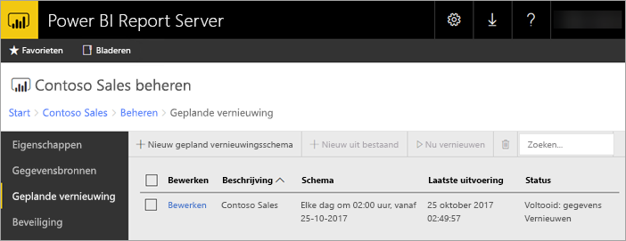

# Geplande vernieuwing van Power BI-rapporten in Power BI Report Server
Met behulp van geplande vernieuwing van Power BI-rapporten kunt u ervoor zorgen dat de gegevens voor een rapport up-to-date blijven.

Geplande vernieuwing is specifiek voor Power BI-rapporten met een ingesloten model. Dit betekent dat u de gegevens in het rapport hebt geïmporteerd in plaats van een live-verbinding of DirectQuery te gebruiken. Wanneer u gegevens importeert, worden deze losgekoppeld van de oorspronkelijke gegevensbron en moeten ze worden bijgewerkt om de gegevens actueel te houden. Geplande vernieuwing is de manier om uw gegevens up-to-date te houden.

Geplande vernieuwing kunt u configureren in de beheersectie van een rapport. Zie [Een geplande vernieuwing van uw Power BI-rapport configureren](configure-scheduled-refresh.md) voor meer informatie over het configureren van geplande vernieuwing.

## Hoe het werkt
Er zijn verschillende onderdelen betrokken bij het gebruik van geplande vernieuwing voor uw Power BI-rapporten.

* SQL Server Agent fungeert als een timer voor het genereren van geplande gebeurtenissen.
* Geplande taken worden toegevoegd aan een wachtrij met gebeurtenissen en meldingen in de rapportserverdatabase. In een scale-out-implementatie wordt de wachtrij gedeeld tussen alle rapportservers in de implementatie.
* Alle rapportverwerking die plaatsvindt als resultaat van een geplande gebeurtenis, wordt uitgevoerd als een achtergrondproces.
* Het gegevensmodel wordt in een Analysis Services-exemplaar geladen.
* Voor sommige gegevensbronnen wordt de mashup-engine van Power Query gebruikt om verbinding te maken met gegevensbronnen en de gegevens te transformeren. Met andere gegevensbronnen kan rechtstreeks verbinding worden gemaakt vanuit een Analysis Services-service die wordt gebruikt voor het hosten van de gegevensmodellen voor Power BI Report Server.
* Nieuwe gegevens worden geladen in het gegevensmodel in Analysis Services.
* Analysis Services verwerkt de gegevens en voert eventuele vereiste berekeningen uit.

Power BI Report Server onderhoudt een wachtrij voor alle geplande bewerkingen. De wachtrij wordt regelmatig gecontroleerd op nieuwe gebeurtenissen. Standaard wordt de wachtrij met een interval van tien seconden gescand. U kunt het interval wijzigen door de configuratie-instellingen **PollingInterval**, **IsNotificationService** en **IsEventService** aan te passen in het bestand RSReportServer.config. **IsDataModelRefreshService** kan ook worden gebruikt om in te stellen of een rapportserver geplande gebeurtenissen verwerkt.

### Analysis Services
Het weergeven van een Power BI-rapport, evenals het uitvoeren van een geplande vernieuwing, is alleen mogelijk als het gegevensmodel van het Power BI-rapport in Analysis Services is geladen. Er wordt samen met Power BI Report Server een proces van Analysis Services uitgevoerd.

## Overwegingen en beperkingen
### Situaties waarin geplande vernieuwing niet kan worden gebruikt
U kunt niet voor alle Power BI-rapporten een schema voor geplande vernieuwing instellen. Hier volgt een lijst met Power BI-rapporten waarvoor het niet mogelijk is om een schema voor geplande vernieuwing te maken.

* Het rapport bevat een of meer Analysis Services-gegevensbronnen die een live-verbinding gebruiken.
* Het rapport bevat een of meer gegevensbronnen die DirectQuery gebruiken.
* Het rapport bevat geen gegevensbron, bijvoorbeeld omdat gegevens handmatig worden ingevoerd via *Gegevens invoeren* of omdat een rapport alleen statische inhoud bevat, zoals afbeeldingen, tekst, enzovoort.

Naast de bovenstaande lijst zijn er specifieke scenario's met gegevensbronnen in de *importmodus* waarvoor u geen schema voor geplande vernieuwing kunt maken.

* Als er een gegevensbron van het type *Bestand* of *Map* wordt gebruikt en het een lokaal bestandspad is (bijvoorbeeld C:\Users\gebruiker\Documents), kunt u geen schema voor geplande vernieuwing maken. Het pad moet een pad zijn waarmee de rapportserver verbinding kan maken, zoals een netwerkshare. Voorbeeld: *\\mijnshare\Documents*.
* Als alleen via OAuth (denk aan Facebook, Google Analytics, Salesforce, enzovoort) verbinding kan worden gemaakt met de gegevensbron, kan er geen schema voor het vernieuwen van de cache worden gemaakt. Op dit moment ondersteunt RS voor geen enkele gegevensbron OAuth-verificatie, ongeacht of deze is bedoeld voor gepagineerde, mobiele of Power BI-rapporten.

### Geheugenlimieten
De traditionele werkbelasting voor een rapportserver is vergelijkbaar met een webtoepassing. De mogelijkheid om rapporten te laden met geïmporteerde gegevens of DirectQuery en de mogelijkheid om geplande vernieuwing uit te voeren, zijn afhankelijk van een gehost Analysis Services-exemplaar, naast de rapportserver uiteraard. Dit kan onverwachte geheugendruk op de server veroorzaken. Plan de implementatie van uw server daarom in de wetenschap dat niet alleen de rapportserver geheugen verbruikt, maar ook Analysis Services.

Zie [Monitor an Analysis Services Instance](https://docs.microsoft.com/sql/analysis-services/instances/monitor-an-analysis-services-instance) (Een Analysis Services-exemplaar bewaken) voor informatie over het bewaken van een Analysis Services-exemplaar.

Zie [Geheugeneigenschappen](https://docs.microsoft.com/sql/analysis-services/server-properties/memory-properties) voor informatie over geheugeninstellingen in Analysis Services.

## Volgende stappen
[Geplande vernieuwing van een Power BI-rapport configureren](configure-scheduled-refresh.md).

Nog vragen? [Misschien dat de Power BI-community het antwoord weet](https://community.powerbi.com/)

