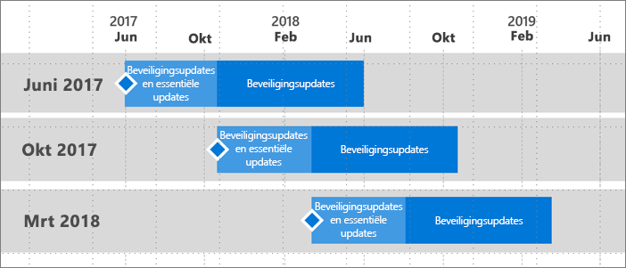

# Ondersteuningstijdlijn voor Power BI Report Server
Er wordt een paar keer per jaar een nieuwe release van Power BI Report Server uitgebracht. Beveiligingsupdates en essentiële updates zijn beschikbaar totdat de volgende release (GA) algemeen beschikbaar wordt. Na de volgende release, blijft de vorige release beveiligingsupdates voor de rest van de levensduur van versie 12 ontvangen.

Dit ondersteuningsbeleid stelt ons in staat om snel innovaties aan klanten te leveren, terwijl klanten de flexibiliteit wordt geboden om de innovaties in hun eigen tempo te implementeren.

* Onderhoudsfase voor beveiligingsupdates en essentiële updates: wanneer u de meest recente huidige versie van Power BI Report Server uitvoert, ontvangt u zowel beveiligingsupdates als essentiële updates.
* Onderhoudsfase voor beveiligingsupdates (alleen): nadat er een nieuwe versie is uitgebracht, worden de oudere versies voor de rest van de levenscyclus van twaalf (12) maanden alleen nog ondersteund met beveiligingsupdates (weergegeven in afbeelding 1).

    

## Versiegeschiedenis
| **Versie** | **Beschikbaarheidsdatum** | **Einddatum voor de ondersteuning** |
| --- | --- | --- |
| Juni 2017 |12 juni 2017 |12 juni 2018 |
| Oktober 2017 |31 oktober 2017 |31 oktober 2018 |
| Maart 2018 | 19 maart 2018 | 19 maart 2019 |

Ga naar [On-premises rapportage met Power BI Report Server](https://powerbi.microsoft.com/report-server/) om Power BI Report Server en de geoptimaliseerde versie van Power BI Desktop voor Power BI Report Server te downloaden.

## Volgende stappen
[Wat is er nieuw in Power BI Report Server](whats-new.md)  
[Gebruikershandboek](user-handbook-overview.md)  
[Beheerdershandboek](admin-handbook-overview.md)  
[Snelstartgids: Power BI Report Server installeren](quickstart-install-report-server.md)  

Nog vragen? [Misschien dat de Power BI-community het antwoord weet](https://community.powerbi.com/)

