# Voorbeeld van klantwinstgevendheid in Power BI: een rondleiding

## Overzicht van het voorbeeld van klantwinstgevendheid
Het inhoudspakket Voorbeeld van klantwinstgevendheid bevat een dashboard, rapport en gegevensset voor een bedrijf dat marketingmateriaal maakt. Dit dashboard is gemaakt door een CFO om de belangrijkste metrische gegevens te verzamelen over haar vijf business unit managers, producten, klanten en brutomarges. In een oogopslag kan ze zien welke factoren van invloed zijn op de winstgevendheid.

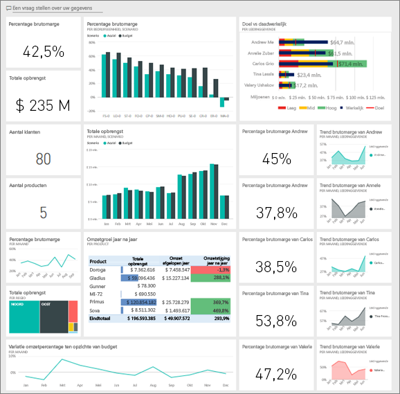

Dit voorbeeld is onderdeel van een serie die laat zien hoe u Power BI kunt gebruiken met bedrijfsgegevens, rapporten en dashboards. Dit zijn echte gegevens die afkomstig zijn van obviEnce ([www.obvience.com)](http://www.obvience.com/) die zijn geanonimiseerd. De gegevens zijn beschikbaar in verschillende indelingen: inhoudspakket/-app, Excel-werkmap of een .pbix-bestand van Power BI Desktop. Zie [Voorbeeldgegevenssets](sample-datasets.md).

## Vereisten
Doet u mee? Deze zelfstudie maakt gebruik van de Power BI-service en het voorbeeldinhoudspakket 'Klantwinstgevendheid'.  Omdat de rapportervaringen zo gelijk zijn, kunt u de zelfstudie ook volgen met Power BI Desktop- en het PBIX-voorbeeldbestand. De instructies om verbinding te maken met het inhoudspakket en het PBIX-bestand staan hieronder.

### Het inhoudspakket voor dit voorbeeld ophalen

1. Open Power BI-service (app.powerbi.com) en meld u aan.
2. Selecteer in de linkerbendehoek **Gegevens ophalen**.

    
3. Selecteer op de pagina Gegevens ophalen het pictogram **Voorbeelden**.

   
4. Selecteer het **voorbeeld van klantwinstgevendheid** en kies vervolgens **Verbinding maken**.  

   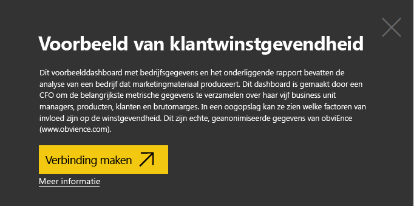
5. Het inhoudspakket wordt geïmporteerd in Power BI en er wordt een nieuw dashboard, nieuw rapport en een nieuwe gegevensset toegevoegd aan de huidige werkruimte. De nieuwe inhoud is gemarkeerd met een geel sterretje. Gebruik de voorbeelden om met Power BI te experimenteren.  

   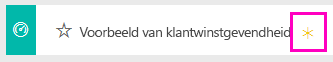

### Het pbix-bestand voor dit voorbeeld ophalen

U kunt ook het voorbeeld downloaden als pbix-bestand, dat bedoeld is voor gebruik met Power BI Desktop.
[Voorbeeld van klantwinstgevendheid](http://download.microsoft.com/download/6/A/9/6A93FD6E-CBA5-40BD-B42E-4DCAE8CDD059/Customer-Profitability-Sample-PBIX.pbix)

### De Excel-werkmap ophalen voor dit voorbeeld

Als u zich verder wilt verdiepen in de gegevensbron van dit voorbeeld, is het ook beschikbaar als een [(Excel-werkmap)](http://go.microsoft.com/fwlink/?LinkId=529781). De werkmap bevat Power View-werkbladen die u kunt bekijken en wijzigen. Als u de onbewerkte gegevens wilt bekijken, selecteert u **Power Pivot > Beheren**.

## Wat vertelt het dashboard ons?

Zoek onder **Mijn werkruimte** het dashboard voor het voorbeeld van klantwinstgevendheid:

### Dashboardtegels voor de gehele onderneming
1. Open het dashboard in de Power BI-service. De dashboardtegels geven onze CFO een weergave van metrische gegevens op hoog niveau die belangrijk voor haar zijn.  Wanneer ze iets interessants ziet, kan ze een tegel selecteren om dieper in de gegevens te graven.

2. Bekijk de tegels aan de linkerkant van het dashboard.

    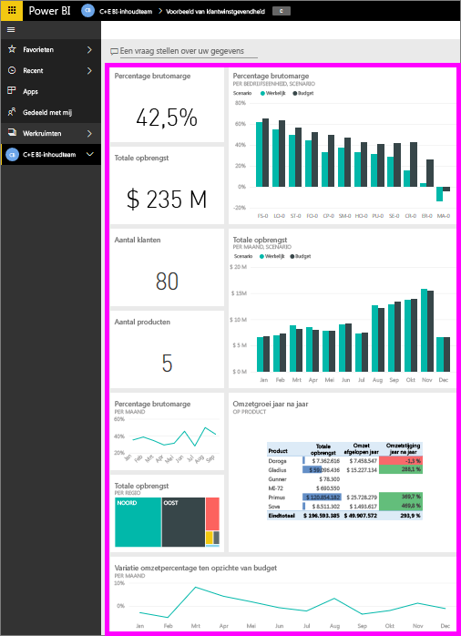

- De brutomarge van het bedrijf is 42,5 %.
- We hebben 80 klanten.
- We verkopen 5 verschillende producten.
- We hadden ons laagste omzetvariantiepercentage ten opzichte van budget in februari, gevolgd door het hoogste in maart.
- Het grootste deel van onze omzet is afkomstig uit de regio’s Oost en Noord. Brutomarge heeft nooit het budget overschreden, waarbij voor ER-0 en MA-0 enig verder onderzoek nodig is.
- Totale omzet van het jaar is bijna gelijk aan het budget.

### Managerspecifieke dashboardtegels
De tegels aan de rechterkant van het dashboard geven een team-scorecard weer. De CFO moet haar managers blijven volgen. Deze tegels bieden haar een overzicht op hoog niveau van de winst - op grond van het brutomargepercentage. Als de trend in het brutomargepercentage voor een manager afwijkt van de verwachting, dan kan ze dit verder onderzoeken.

- Alle leidinggevenden, behalve Carlos, hebben hun verkoopdoel al overschreden. Maar de werkelijke verkopen van Carlos zijn de hoogste.
- Het brutomargepercentage van Annelie is het laagste, maar we zien een constante stijging sinds maart.
- Valery heeft haar brutomargepercentage daarentegen aanzienlijk zien afnemen.
- En Andrew had een sterk wisselend jaar.

## De onderliggende gegevens van het dashboard verkennen
Dit dashboard bevat tegels die gekoppeld zijn aan een rapport en aan een Excel-werkmap.

### Open de Excel Online-gegevensbron
Twee tegels op dit dashboard, 'Target vs Actual' (Doel vs Realisatie) en 'Year Over Year Revenue Growth' (Omzetgroei jaar na jaar) zijn vastgemaakt vanuit een Excel-werkmap. Dus als u één van deze tegels selecteert, opent Power BI de gegevensbron, in dit geval Excel Online.

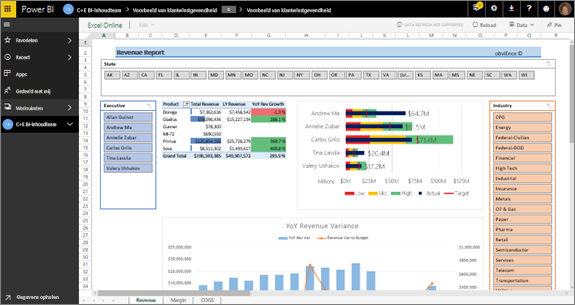

1. Selecteer één van de tegels die vanuit Excel zijn vastgemaakt. Excel Online wordt in de Power BI-service geopend.
2. U ziet dat de werkmap 3 tabbladen aan gegevens bevat. Open 'Revenue'.
3. Laten we bekijken waarom Carlos zijn doel nog niet heeft bereikt.  
    a. Selecteer in de schuifbalk 'Executive' **Carlos Grilo**.   
    b. Uit de eerste draaitabel blijkt dat de omzet van het beste product van Carlos, Primus, met 152% is gedaald in vergelijking met het afgelopen jaar. En uit de jaar-na-jaargrafiek blijkt dat hij de meeste maanden onder budget zit.  

    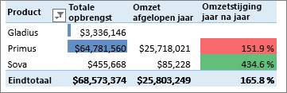

    

4. Blijf verkennen en als u iets interessants vindt, kunt u rechtsboven **Vastmaken**  selecteren om [het aan het dashboard vast te maken](service-dashboard-pin-tile-from-excel.md).

5. Gebruik de pijl terug in uw browser om terug te keren naar het dashboard.

### Open het onderliggende Power BI-rapport
De meerderheid van de tegels op het voorbeelddashboard Klantwinstgevendheid zijn vastgemaakt vanuit het onderliggende voorbeeldrapport Klantwinstgevendheid.

1. Selecteer één van deze tegels om het rapport in de leesweergave te openen.

2. Het rapport heeft 3 pagina's. Elk tabblad aan de onderkant van het rapport vertegenwoordigt een pagina.

    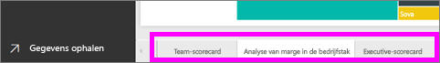

    * Team-scorecard richt zich op de prestaties van de 5 managers en hun bedrijfscijfers.
    * Analyse van marge in de bedrijfstak biedt een manier om onze winst te analyseren ten opzichte van de gehele bedrijfstak.
    * Executive-scorecard biedt een weergave van elk van onze managers met een indeling die geschikt is voor Cortana.

### De pagina Team-scorecard

Laten we in detail kijken naar twee van de teamleden en zien welke inzichten kunnen worden verkregen. Selecteer in de slicer aan de linkerkant de naam Andrew om de rapportpagina zo te filteren dat alleen gegevens over Andrew worden weergegeven.

* Kijk voor een snelle KPI naar Andrews **Omzetstatus** - deze is groen. Zijn prestaties zijn goed.
* Het vlakdiagram Omzetvariatiepercentage ten opzichte van budget per maand laat zien dat met uitzondering van een dip in februari Andrew het over het algemeen prima doet. Zijn dominante regio is Oost en hij verwerkt 49 klanten en 5 (van de 7) producten. Zijn brutomargepercentage is niet het hoogste of laagste.
* De waarde bij Omzet dit jaar en omzetvariantiepercentage ten opzichte van budget per maand laat een constante gelijkmatige winst zien. Maar als op het vierkant voor **Centraal** in de regiotreemap klikt om te filteren, ontdekt u dat Andrew alleen in maart omzet heeft en alleen in Indiana. Is dit de bedoeling of is dit iets dat moet worden onderzocht?

Nu naar Valery. Selecteer in de slicer de naam Valery om de rapportpagina zo te filteren dat alleen gegevens over haar worden weergegeven.  

* U ziet de rode KPI voor **Status omzet dit jaar**. Dit moet zeker verder worden onderzocht.
* Haar omzetvariantie schetst ook een zorgwekkend beeld - ze haalt haar inkomstenmarges niet.
* Valery heeft slechts 9 klanten, verwerkt slechts 2 producten en werkt bijna exclusief met klanten in het noorden. Deze specialisatie kan de grote schommelingen in haar metrische gegevens verklaren.
* Als u het vierkant **Noord** in de treemap selecteert, kunt u zien dat de brutomarge van Valery in het noorden consistent is met haar totale marge.
* Als u de andere vakken **Regio** selecteert, verschijnt een interessant verhaal: haar brutomargepercentage reikt van 23% tot 79% en haar inkomstencijfers zijn in alle regio's behalve het noorden sterk seizoensgebonden.

Blijf spitten om erachter te komen waarom het gebied van Valery niet goed presteert. Bekijk de regio's, de andere bedrijfsonderdelen en de volgende pagina in het rapport Analyse van marge in de bedrijfstak.

### Analyse van marge in de bedrijfstak
Deze rapportpagina bevat een ander deel van de gegevens. Hier wordt gekeken naar de brutomarge voor de gehele bedrijfstak, opgedeeld per segment. De CFO gebruikt deze pagina om de metrische gegevens van het bedrijf en bedrijfsonderdelen te vergelijken met de gegevens uit de bedrijfstak om trends en winstgevendheid te kunnen verklaren. U vraagt zich misschien af waarom een vlakdiagram Brutomarge per maand en naam van executive op deze pagina staat, aangezien dit teamspecifiek is. Doordat dit diagram hier staat, kunnen we de pagina filteren per business unit manager.  
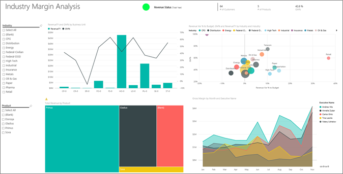

Hoe verschilt de winstgevendheid per bedrijfstak? Hoe worden de producten en klanten onderverdeeld per bedrijfstak? Selecteer een of meer bedrijfstakken linksboven. (Start vanaf de bedrijfstak CPG) Als u het filter wilt wissen, selecteert u het gumpictogram.

Op de bellengrafiek zoekt de CFO naar de grootste bellen, omdat deze de grootste invloed hebben op de omzet. Doordat de pagina per manager kan worden gefilterd door op hun namen te klikken in het vlakdiagram, kan de invloed van elke manager per branche eenvoudig worden bekeken.

* De invloed van Andrew omvat veel verschillende bedrijfstaksegmenten met breed uiteenlopende brutomargepercentages (de meeste aan de positieve kant) en variantiepercentages.
* De grafiek van Annelie is vergelijkbaar, behalve dat ze zich op slechts een handvol bedrijfstakken richt met een focus op het segment Federal en het product Gladius.
* Carlos richt zich duidelijk op het segment Services, met een hoge winst. Hij heeft het variantiepercentage sterk verbeterd voor het High Tech-segment en een voor hem nieuw segment, Industrieel, vertoont uitzonderlijk goede prestaties in vergelijking met het budget.
* Tina werkt met een handvol segmenten en heeft het hoogste brutomargepercentage. De voornamelijk kleine bellen laten echter zien dat haar invloed op de winstgevendheid van het bedrijf minimaal is.
* Valery, die verantwoordelijk is voor slechts één product, werkt in slechts 5 bedrijfstakken. Haar invloed voor de bedrijfstak is seizoensgebonden, maar produceert altijd een grote bel, die wijst op een grote invloed op de winstgevendheid van het bedrijf. Biedt de bedrijfstak een verklaring voor haar negatieve prestaties?

### Executive-scorecard
Deze pagina wordt opgemaakt als een antwoordkaart voor Cortana. Zie [Antwoordkaarten maken voor Cortana](service-cortana-answer-cards.md) voor meer informatie.

## Dieper graven in de gegevens door vragen te stellen met Q&A
Voor onze analyse zou het handig zijn als we bepalen welke bedrijfstak de meeste omzet voor Valery genereert. Hiervoor gebruiken we Q&A.

1. Open het rapport in de bewerkingsweergave en selecteer **Rapport bewerken**. De bewerkingsweergave is alleen beschikbaar als u 'eigenaar' bent van het rapport. Hieraan wordt soms gerefereerd als de **creator**-modus. Als dit rapport met u is gedeeld, kunt u het niet openen in de bewerkingsweergave.

2.  Selecteer in de bovenste menubalk **Een vraag stellen** om het venter Vragen en antwoorden te openen.

    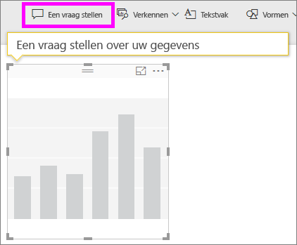

3. Typ **totale omzet per branche voor Valery**. Zoals u ziet wordt de visualisatie bijgewerkt terwijl u de vraag typt.

    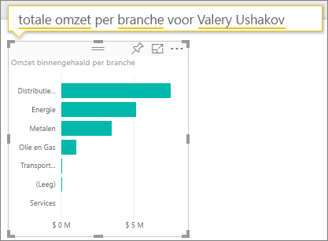

   Distributie is het grootste opbrengstgebied voor Valery.

### Dieper graven door filters toe te voegen
Laten we kijken naar de branche *Distributie*.  

1. Open de rapportpagina 'Industry Margin Analysis' (Marge-analyse branche).
2. Vouw het filterdeelvenster rechts uit zonder visualisaties te selecteren op de rapportagepagina. In het deelvenster Filters mogen alleen filters op paginaniveau worden weergegeven.  

   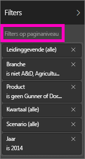
3. Zoek het filter voor **bedrijfstak** en selecteer de pijl om de lijst uit te vouwen. We gaan een paginafilter voor de bedrijfstak Distributie toevoegen. Wis eerst alle selecties door het selectievakje **Alles selecteren** uit te schakelen. Selecteer vervolgens alleen **Distributie**.  

   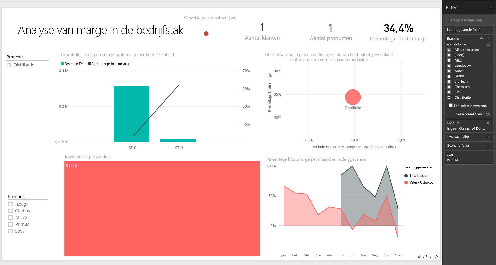
4. Het vlakdiagram Brutomarge per maand en naam executive laat zien dat alleen Valery en Tina klanten hebben in deze bedrijfstak en dat Valery alleen van juni tot en met november met deze bedrijfstak heeft gewerkt.   
5. Selecteer **Tina** en vervolgens **Valery** in de legenda van het vlakdiagram Brutomarge per maand en naam executive. U ziet dat het deel van Tina van de Totale omzet per product echt klein is vergeleken met dat van Valery.
6. Als u de werkelijke omzet wilt bekijken, gebruikt u Q&A **om de totale opbrengsten per executive voor distributie van scenario op te vragen**.  

     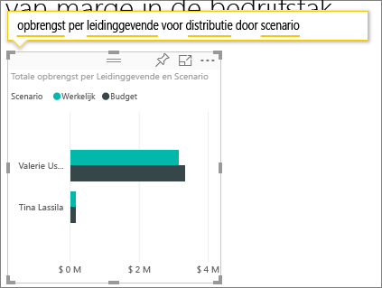

    We kunnen ook andere bedrijfstakken verkennen en zelfs klanten toevoegen aan onze visuele elementen om inzicht te krijgen in de oorzaken voor de prestaties van Valery.

Dit is een veilige omgeving om in te spelen. U kunt er altijd voor kiezen om de wijzigingen niet op te slaan. Als u deze wel opslaat, kunt u altijd naar **Gegevens ophalen** gaan voor een nieuwe kopie van dit voorbeeld.

U kunt ook [alleen de gegevensset (Excel-werkmap)](http://go.microsoft.com/fwlink/?LinkId=529781) voor dit voorbeeld downloaden.

## Volgende stap: Verbinding maken met uw gegevens
We hopen dat deze rondleiding heeft laten zien hoe Power BI-dashboards, Q&A en rapporten inzicht kunnen geven in klantgegevens. Nu is het uw beurt: aan uw eigen gegevens koppelen. Met Power BI kunt u verbinding maken met een groot aantal gegevensbronnen. Meer informatie over [Aan de slag met Power BI](service-get-started.md).

[Terug naar de voorbeelden in Power BI](sample-datasets.md)  
