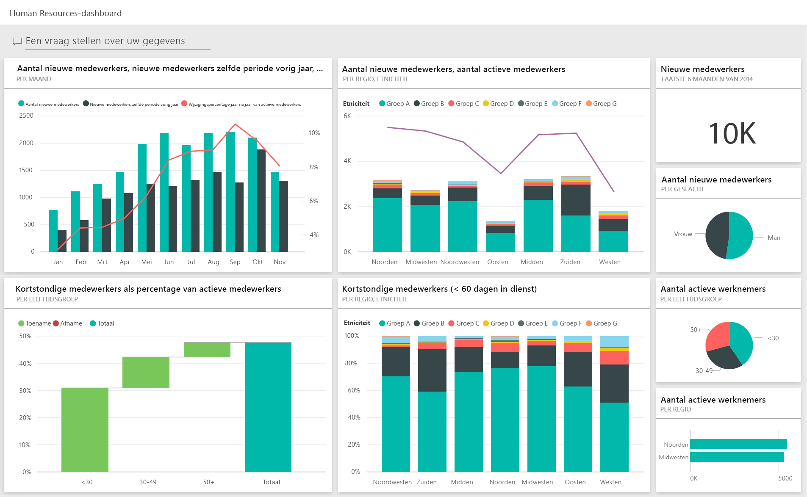
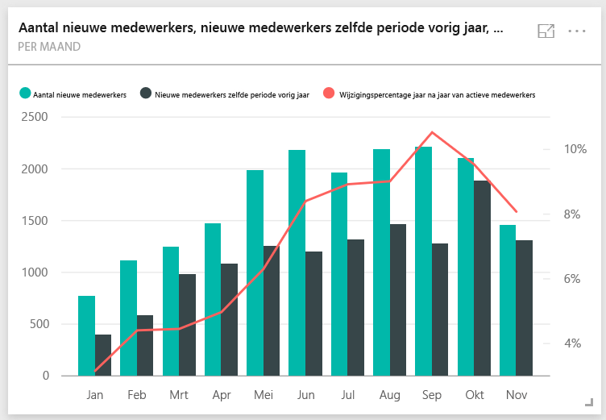
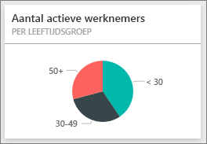
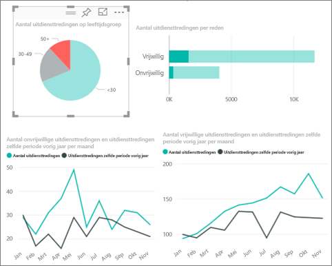
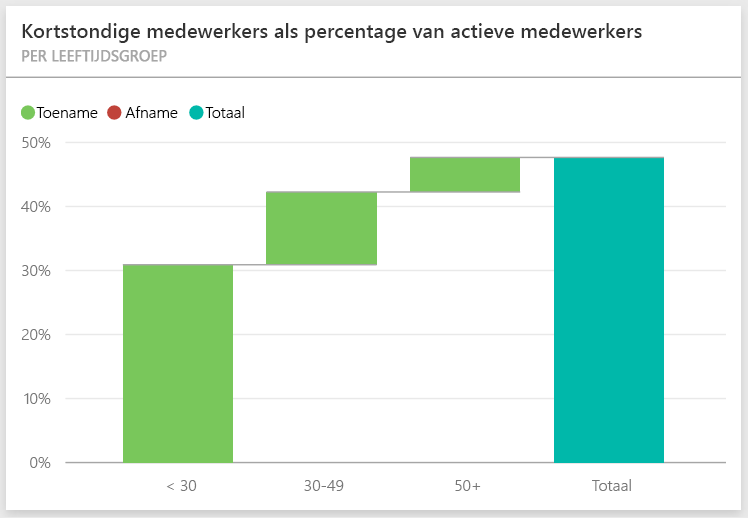
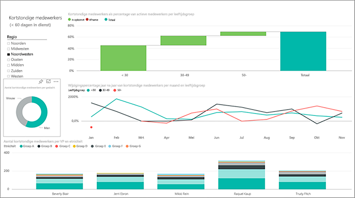
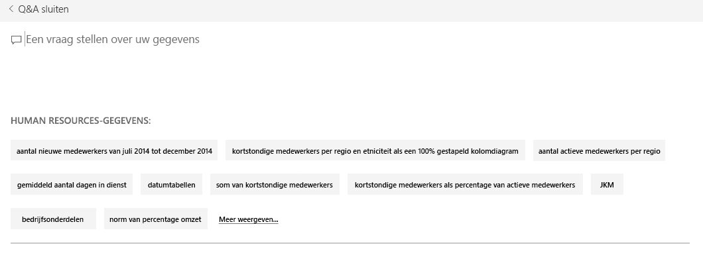
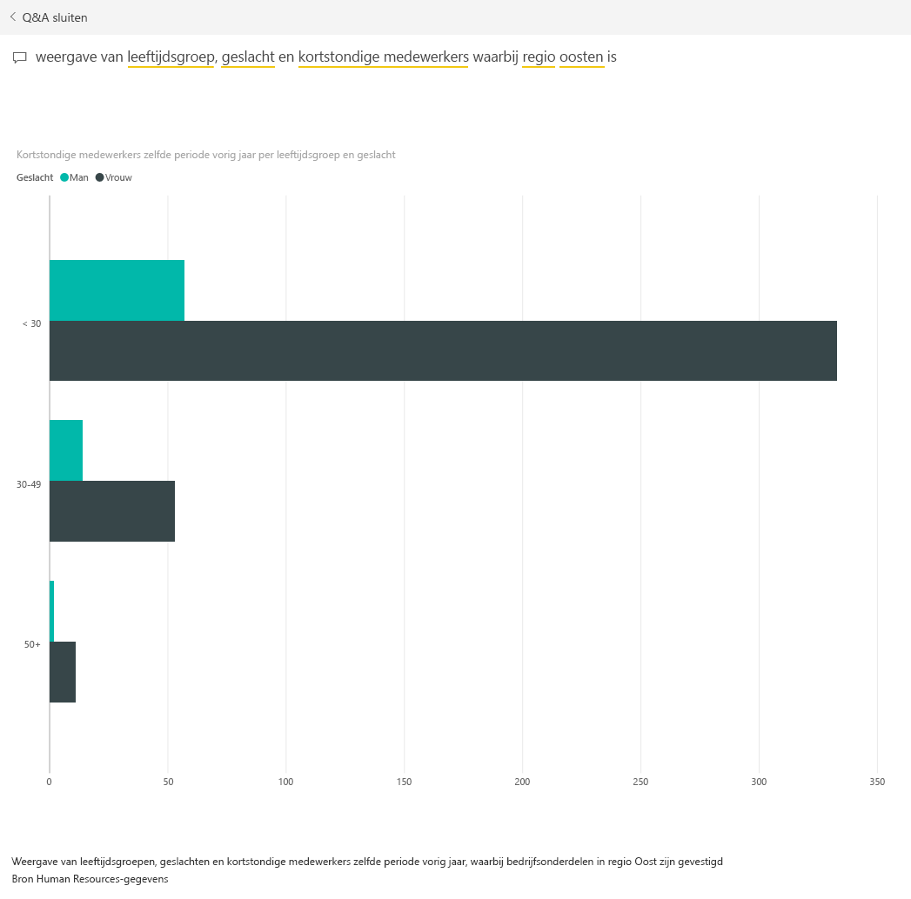

# Voorbeeld van human resources voor Power BI: rondleiding
De HR-afdeling hanteert hetzelfde rapportagemodel voor verschillende bedrijven, zelfs wanneer deze verschillen qua branche of omvang. In dit voorbeeld kijken we naar nieuwe medewerkers, actieve medewerkers en medewerkers die niet meer in dienst zijn en proberen we trends te ontdekken in de strategie voor het aannemen van personeel. Dit zijn de belangrijkste doelstellingen die we beter willen begrijpen:

* Wie nemen we aan
* Vooroordelen in onze strategie voor het aannemen van personeel
* Trends in het vrijwillig ontslag nemen

Dit voorbeeld is onderdeel van een serie die laat zien hoe u Power BI kunt gebruiken met bedrijfsgegevens, rapporten en dashboards. Dit zijn echte gegevens die afkomstig zijn van obviEnce ([www.obvience.com)](http://www.obvience.com/) die zijn geanonimiseerd.

Doet u mee? Ga in de [Power BI-service](https://powerbi.com) naar **Gegevens ophalen > Voorbeelden > Voorbeeld van human resources > Verbinden** om een kopie van het voorbeeld te downloaden.

U kunt ook [alleen de gegevensset (Excel-werkmap)](http://go.microsoft.com/fwlink/?LinkId=529780) voor dit voorbeeld downloaden.

## Nieuwe medewerkers
Laten we eerst eens kijken naar de gegevens van nieuwe medewerkers.

1. Selecteer in uw werkruimte het tabblad **Dashboards** en open het dashboard Human Resources.
2. Selecteer in het dashboard de tegel **New Hire Count, New Hires SPLY en Actives YoY % Change** **by Month**.  
     
   
   De pagina **New Hires** van het voorbeeldrapport Human Resources wordt geopend.  
   
   

Enkele zaken die opvallen:

* De combinatiegrafiek **New Hire Count, New Hires SPLY en Actives YoY % Change per Month** toont aan dat we dit jaar elke maand meer mensen hebben aangenomen dan vorig jaar, waarbij het in sommige maanden om aanzienlijk meer mensen gaat.
* In de combinatiegrafiek **New Hire Count en Active Employee Count per Region en Ethnicity** valt op dat we minder nieuwe mensen aannemen in de regio **East**.
* De watervalgrafiek **New Hires YoY Var per Age Group** laat zien dat we voornamelijk jongere mensen in dienst nemen. De reden hiervoor kan zijn dat het hoofdzakelijk om part-time banen gaat.
* De cirkelgrafiek **New Hire Count per Gender** toont een redelijk gelijkmatige verdeling.

Kunt u nog meer inzichten vinden; bijvoorbeeld een regio waar de verdeling tussen mannen en vrouwen sterk afwijkt? Selecteer verschillende leeftijdsgroepen en geslachten in de grafieken om de relaties tussen leeftijd, geslacht, regio en etniciteit te verkennen.

Selecteer de naam van het dashboard in de bovenste navigatiebalk om terug te keren naar het dashboard.

## Actieve en voormalige medewerkers vergelijken
Laten we eens kijken naar gegevens van de huidige medewerkers en medewerkers die niet langer voor het bedrijf werken.

Selecteer op het dashboard de tegel **Active Employee Count by Age Group**.  

Het voorbeeldrapport van Human Resources wordt geopend op de pagina **Active Employees vs. Separations**.  

**Aandachtspunten**:

* De combinatiegrafieken aan de linkerkant tonen de jaar-tot-jaarwijzigingen voor actieve medewerkers en vrijwillig vertrokken medewerkers. We hebben dit jaar meer actieve medewerkers door snelle inhuur, maar ook meer medewerkers die de organisatie hebben verlaten.
* In augustus zijn er meer mensen vertrokken dan in andere maanden. Selecteer de verschillende leeftijdsgroepen, geslachten of regio's om te zien of u uitbijters kunt vinden.
* Als we naar de cirkeldiagrammen kijken, valt op dat de verdeling van actieve medewerkers naar geslacht en leeftijdsgroep tamelijk gelijkmatig is. Selecteer verschillende leeftijdsgroepen om te zien of de verdeling naar geslacht verschillen oplevert in leeftijd. Hebben we binnen elke leeftijdsgroep een evenredige verdeling naar geslacht? 

## Redenen voor ontslag
Laten we het rapport eens bekijken in de bewerkingsweergave. Selecteer **Rapport bewerken** in de linkerbovenhoek. 

Wijzig de cirkeldiagrammen zodat deze gegevens van vertrokken medewerkers (Separates) in plaats van actieve medewerkers (Actives) aangeven.

1. Selecteer het cirkeldiagram **Active Employee Count per Age Group**.
2. Selecteer bij **Velden** aan de rechterkant de pijl naast **Employees** om de tabel met medewerkers uit te vouwen. Schakel het selectievakje naast **Active Employee Count** uit om dat veld te verwijderen.
3. Schakel het selectievakje naast **Separation Count** in de tabel Employees in om dat veld toe te voegen aan het vak **Waarden**.
4. Ga terug naar het rapportcanvas en selecteer de staaf **Voluntary** in het staafdiagram **Separation Count per Separation Reason**. In de andere visualisaties in het rapport worden nu de gegevens gemarkeerd voor medewerkers die vrijwillig zijn vertrokken.
5. Klik op het cirkelsegment 50+ van het cirkeldiagram Separation Count per Age Group.
   
   Kijk naar het lijndiagram Separations per Reason in de rechterbenedenhoek. Dit diagram is gefilterd op alleen vrijwillig vertrokken medewerkers.  
   
   
   Ziet u de trend in de leeftijdsgroep 50+? Tijdens het laatste gedeelte van het jaar vertrekken meer medewerkers ouder dan 50 op vrijwillige basis de organisatie. Dit zou een gebied zijn om met meer gegevens te onderzoeken.
6. U kunt dezelfde stappen ook uitvoeren voor het cirkeldiagram **Active Employee Count per Gender** en hier het aantal vertrokken medewerkers weergeven in plaats van actieve medewerkers. Bekijk de gegevens van vrijwillig vertrokken medewerkers onderverdeeld naar geslacht om te zien of dat andere inzichten oplevert.
7. Klik op **Power BI** in de bovenste navigatiebalk om terug te keren naar het dashboard. U kunt de wijzigingen die u hebt aangebracht in het rapport al dan niet opslaan.

## Kortstondige medewerkers
Het laatste gebied dat we gaan onderzoeken zijn kortstondige medewerkers. Dit zijn medewerkers die niet meer dan 60 dagen in dienst zijn geweest. We nemen snel mensen aan. Maar nemen we wel de juiste kandidaten in dienst?

1. Selecteer de tegel **Bad Hires as % of Actives by Age Group** in het dashboard. Hiermee opent u het rapport op pagina 3, 'Bad Hires'.
   
     
2. Schakel het selectievakje **Northwest** in de regiokiezer aan de linkerkant in en het segment **Male** in het ringdiagram Bad Hire Count per Gender.  Bekijk de andere grafieken op de pagina 'Bad Hires'. U ziet dat er meer mannen dan vrouwen heel snel zijn vertrokken en dat er veel kortstondige medewerkers uit groep A afkomstig zijn.
     
3. Als we naar het ringdiagram **Bad Hire Count by Gender** kijken en de regio's in de slicer **Region** doorlopen, zien we dat East de enige regio is waarin meer vrouwen dan mannen het bedrijf snel hebben verlaten.  
4. Selecteer de naam van het dashboard in de bovenste navigatiebalk om terug te keren naar het dashboard.

## Een vraag stellen in het vak Q&A
Het [Q&A-vraagvak](service-how-to-q-and-a.md) is de plek waar u een vraag kunt stellen in natuurlijke taal, maar alleen in het Engels. Q&A herkent de woorden die u typt, en zoekt uit waar in de gegevensset het antwoord kan worden gevonden.

1. Klik in het Q&A-vraagvak. U ziet dat het vak direct al suggesties bevat, zelfs voordat u begint te typen:
   
   
2. Kies een van deze suggesties of typ: **show age group, gender and bad hires SPLY where region is east**.  
   
   
   
   U ziet dat de meeste kortstondige medewerkers vrouwen zijn jonger dan 30.

Dit is een veilige omgeving om wat dingen uit te proberen. U kunt er namelijk altijd voor kiezen de wijzigingen niet op te slaan. Als u ze wel opslaat, kunt u altijd via **Gegevens ophalen** een nieuwe kopie van dit voorbeeld downloaden.

## Volgende stap: Verbinding maken met uw gegevens
We hopen dat deze rondleiding heeft laten zien hoe Power BI-dashboards, Q&A en rapporten inzicht kunnen geven in gegevens van de HR-afdeling. Nu is het uw beurt om verbinding met uw eigen gegevens te maken. Met Power BI kunt u verbinding maken met een groot aantal gegevensbronnen. Zie [Aan de slag met Power BI](service-get-started.md) voor meer informatie.  

