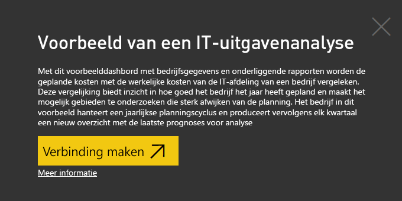
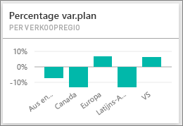
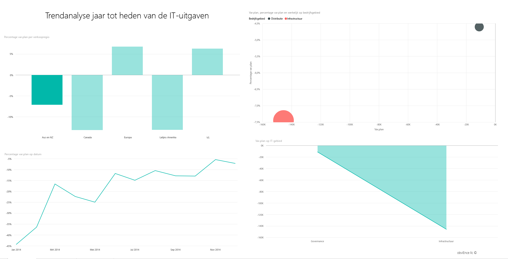
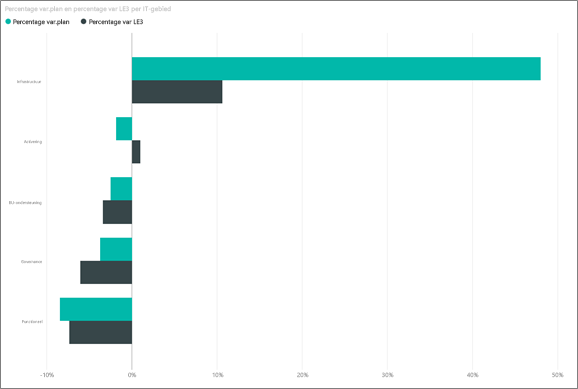
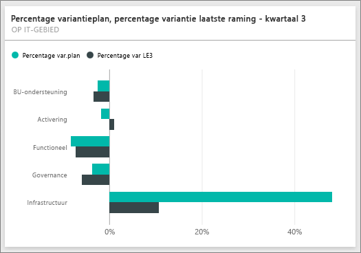
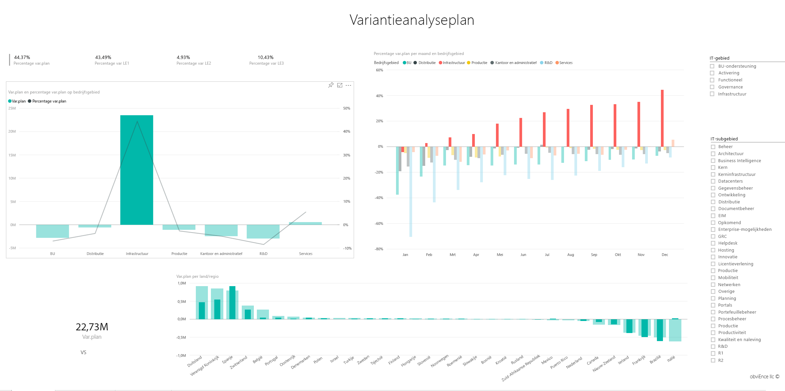

# Voorbeeld van een IT-uitgavenanalyse voor Power BI: een rondleiding

## Overzicht van het voorbeeld van een IT-uitgavenanalyse
Met het [inhoudspakket](service-organizational-content-pack-introduction.md) IT-uitgavenanalyse (dashboard, rapport en gegevensset) kunt u de geplande kosten van een IT-afdeling afzetten tegen de werkelijke kosten. Deze vergelijking biedt inzicht in hoe goed het bedrijf het jaar heeft gepland en de mogelijkheid om gebieden te onderzoeken die sterk afwijken van de planning. Het bedrijf in dit voorbeeld hanteert een jaarlijks planningscyclus en produceert vervolgens elk kwartaal een nieuw overzicht met de laatste prognoses om de wijzigingen in de IT-uitgaven in het fiscale jaar te kunnen analyseren.

Dit voorbeeld is onderdeel van een serie die laat zien hoe u Power BI kunt gebruiken met bedrijfsgegevens, rapporten en dashboards. Dit zijn echte, geanonimiseerde gegevens, afkomstig van obviEnce (<http://obvience.com/>).

## Vereisten

 Voordat u het voorbeeld kunt gebruiken, moet u het eerst downloaden als een [inhoudspakket](https://docs.microsoft.com/en-us/power-bi/sample-it-spend#get-the-content-pack-for-this-sample), een [PBIX-bestand](http://download.microsoft.com/download/E/9/8/E98CEB6D-CEBB-41CF-BA2B-1A1D61B27D87/IT-Spend-Analysis-Sample-PBIX.pbix) of een [Excel-werkmap](http://go.microsoft.com/fwlink/?LinkId=529783).

### Het inhoudspakket voor dit voorbeeld ophalen

1. Open Power BI-service (app.powerbi.com) en meld u aan.
2. Selecteer in de linkerbendehoek **Gegevens ophalen**.
   
    
3. Selecteer op de pagina Gegevens ophalen het pictogram **Voorbeelden**.
   
   
4. Selecteer het **voorbeeld van een IT-uitgavenanalyse** en kies **Verbinding maken**.  
  
   
   
5. Het inhoudspakket wordt geïmporteerd in Power BI en er wordt een nieuw dashboard, nieuw rapport en een nieuwe gegevensset toegevoegd aan de huidige werkruimte. De nieuwe inhoud is gemarkeerd met een geel sterretje. 
   
   
  
### Het pbix-bestand voor dit voorbeeld ophalen

U kunt ook het voorbeeld downloaden als pbix-bestand, dat bedoeld is voor gebruik met Power BI Desktop. 

 * [Voorbeeld van een IT-uitgavenanalyse](http://download.microsoft.com/download/E/9/8/E98CEB6D-CEBB-41CF-BA2B-1A1D61B27D87/IT%20Spend%20Analysis%20Sample%20PBIX.pbix)

### De Excel-werkmap ophalen voor dit voorbeeld
U kunt ook [alleen de gegevensset (Excel-werkmap)](http://go.microsoft.com/fwlink/?LinkId=529783) voor dit voorbeeld downloaden. De werkmap bevat Power View-werkbladen die u kunt bekijken en wijzigen. Als u de onbewerkte gegevens wilt bekijken, selecteert u **Power Pivot > Beheren**.

## Het dashboard Voorbeeld van een IT-uitgavenanalyse
De twee getallentegels op het dashboard, de **Var plan %**  en **Laatste prognose variantie % kwartaal 3**, geven ons een overzicht hoe we presteren ten opzichte van het plan en ten opzichte van de laatste kwartaalprognose (LE3 = Latest Estimate Quarter 3). In totaal wijken we ongeveer 6% van het plan af. Laten we de oorzaak van deze afwijking eens onderzoeken: wanneer, waar en welke categorie?

## De pagina YTD trendanalyse van de IT-uitgaven
Wanneer u de dashboardtegel **Var plan % per verkoopregio** selecteert, wordt de pagina Trendanalyse van de IT-uitgaven van het rapport Voorbeeld van een IT-uitgavenanalyse weergegeven. We zien in één oogopslag een positieve afwijking in de Verenigde Staten en Europa en een negatieve afwijking in Canada, Latijns-Amerika en Australië. De VS vertoont een variantie van ongeveer 6% +LE en Australië ongeveer 7% -LE.

Maar het kan misleidend zijn om alleen naar dit diagram te kijken en op basis hiervan uw conclusies te trekken. We moeten naar de werkelijke bedragen kijken om dingen in perspectief te plaatsen.

1. Selecteer **Aus en NZ** in de diagram Var plan % per verkoopgebied en bekijk het diagram Var plan per IT-gebied.

   
2. Selecteer nu **VS**. Zoals u begrijpt vormt Australië in vergelijking met de VS slechts een klein deel van onze totale uitgaven.

    We hebben het probleem dus afgebakend tot de VS, maar wat nu? Laten we eens kijken welke categorie in de VS de oorzaak is van de afwijking.

## Vragen stellen over de gegevens
1. Selecteer in de bovenste navigatiebalk de optie **Voorbeeld van een IT-uitgavenanalyse** om terug te keren naar de dashboards.
2. Typ in het vak de vraag 'staafdiagram IT-gebieden weergeven, var plan % var le3%'.

   

   In het eerste gebied IT, **Infrastructuur**, is het percentage tussen het eerste variantieplan en de laatste prognose voor het variantieplan drastisch gewijzigd.

## De pagina YTD uitgaven per kostenelementen
Ga terug naar het dashboard en bekijk de dashboardtegel **Var plan %, Var LE3%**.

De Infrastructuur springt eruit met een aanzienlijke positieve afwijking ten opzichte van het plan.

1. Klik op deze tegel naar de pagina YTD uitgaven per kostenelementen van het rapport Voorbeeld van een IT-uitgavenanalyse te gaan.
2. Klik in de linkerbenedenhoek van het scherm op de staaf **Infrastructuur** in het diagram ‘Var plan % en % Var LE3 per IT-gebied’ en bekijk de afwijkingen ten opzichte van het plan in Var plan % per verkoopregio aan de linkerkant.

    
3. Klik op de naam van elk Kostenelementgroep in de slicer om kostenelementen met een grote afwijking te zoeken.
4. Selecteer **Overige** en klik in het IT-gebied op **Infrastructuur**. Klik vervolgens op de subgebieden in de slicer voor de IT-subgebieden om de subgebieden met de grootste afwijking te vinden.  

   We zien een grote afwijking bij **Netwerken**.

   Blijkbaar heeft het bedrijf besloten om de werknemers als voordeel te voorzien van telefoonservices, maar deze actie was niet gepland.

## De pagina Variantieanalyse plan
Klik onderin hetzelfde rapport op het tabblad Variantieanalyse om naar pagina 3 van het rapport te gaan.

Klik aan de linkerkant in de combinatiegrafiek Var plan en Var plan % per zakelijk gebied op de kolom Infrastructuur om de infrastructuurwaarden te markeren op de rest van de pagina.

Zoals u kunt zien in het diagram ‘Var plan % per maand en zakelijk gebied’, is er rond februari voor het eerst een positieve variantie voor die infrastructuur waarneembaar die vervolgens blijft stijgen. U kunt ook zien dat de variantie ten opzichte van de planwaarde per land varieert, in vergelijking met de waarde voor alle zakelijke gebieden. Gebruik de slicers IT-gebied en IT-subgebieden aan de rechter om de waarden voor de rest van de pagina te filteren in plaats van ze te markeren. Klik op de verschillende IT-gebieden aan de rechterkant om de gegevens op een andere manier te verkennen. U kunt ook op de IT-subgebieden klikken en de afwijking op dat niveau bekijken.

## Het rapport bewerken
Klik in de linkerbovenhoek op **Rapport bewerken** en verken de mogelijkheden in de bewerkingsweergave.

* Zie hoe de pagina's worden gemaakt: de velden in elk diagram, de filters op de pagina's
* Pagina's en diagrammen toevoegen op basis van dezelfde gegevens
* Het type visualisatie voor elk diagram wijzigen
* Vastmaken aan uw dashboard

Dit is een veilige omgeving om in te experimenteren. U kunt er namelijk altijd voor kiezen de wijzigingen niet op te slaan. Als u deze wel opslaat, kunt u altijd naar Gegevens ophalen gaan voor een nieuwe kopie van dit voorbeeld.

## Volgende stappen: Verbinding maken met uw gegevens
We hopen dat deze rondleiding heeft laten zien hoe Power BI-dashboards, Q&A en rapporten inzicht kunnen geven in uitgavengegevens van de IT-afdeling. Nu is het uw beurt om verbinding met uw eigen gegevens te maken. Met Power BI kunt u verbinding maken met een groot aantal gegevensbronnen. Zie [Aan de slag met Power BI](service-get-started.md) voor meer informatie.
