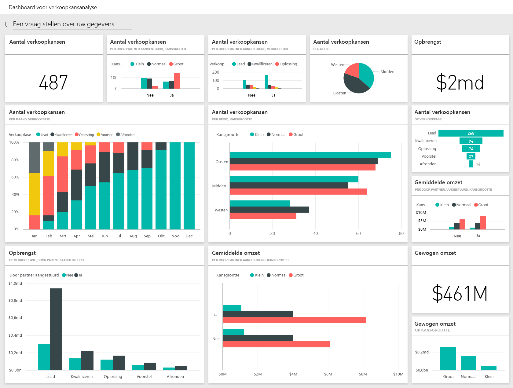
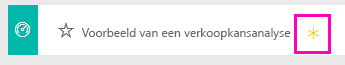
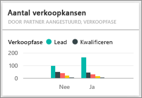

# Voorbeeld van een verkoopkansanalyse voor Power BI: een rondleiding volgen

## Overzicht van het voorbeeld van een verkoopkansanalyse
Het **voorbeeld van een verkoopanalyse** bevat een dashboard (en het bijbehorende rapport) voor een softwarebedrijf met twee verkoopkanalen: *direct* en *partner*. De Sales manager heeft dit dashboard gemaakt om kansen en omzet bij te houden per regio, dealgrootte en kanaal.

De verkoopmanager vertrouwt op twee soorten omzet:

* **Omzet**: dit is de schatting van een verkoopmedewerker van wat de omzet van het bedrijf zal zijn.
* **Gewogen omzet**: dit wordt berekend als Omzet X Waarschijnlijkheidspercentage en wordt algemeen gezien als een meer nauwkeurige manier om de werkelijke verkoopomzet te voorspellen. Waarschijnlijkheid wordt bepaald door de huidige ***verkoopfase*** van de deal.
  * Lead: 10%  
  * Kwalificeren: 20%  
  * Oplossing: 40%  
  * Voorstel: 60%  
  * Afronden: 80%

  

Dit voorbeeld is onderdeel van een serie die laat zien hoe u Power BI kunt gebruiken met bedrijfsgegevens, rapporten en dashboards. Dit zijn echte gegevens die afkomstig zijn van obviEnce ([www.obvience.com)](http://www.obvience.com/) die zijn geanonimiseerd.

## Vereisten

 Voordat u het voorbeeld kunt gebruiken, moet u het eerst downloaden als een [inhoudspakket](https://docs.microsoft.com/en-us/power-bi/sample-opportunity-analysis#get-the-content-pack-for-this-sample), een [PBIX-bestand](http://download.microsoft.com/download/9/1/5/915ABCFA-7125-4D85-A7BD-05645BD95BD8/Opportunity Analysis Sample PBIX.pbix) of een [Excel-werkmap](http://go.microsoft.com/fwlink/?LinkId=529782).

### Het inhoudspakket voor dit voorbeeld ophalen

1. Open Power BI-service (app.powerbi.com) en meld u aan.
2. Selecteer in de linkerbendehoek **Gegevens ophalen**.
   
    
3. Selecteer op de pagina Gegevens ophalen het pictogram **Voorbeelden**.
   
   
4. Selecteer het **voorbeeld van een verkoopkansanalyse** en kies **Verbinding maken**.  
  
   
   
5. Het inhoudspakket wordt geïmporteerd in Power BI en er wordt een nieuw dashboard, nieuw rapport en een nieuwe gegevensset toegevoegd aan de huidige werkruimte. De nieuwe inhoud is gemarkeerd met een geel sterretje. 
   
   
  
### Het pbix-bestand voor dit voorbeeld ophalen

U kunt ook het voorbeeld downloaden als pbix-bestand, dat bedoeld is voor gebruik met Power BI Desktop. 

 * [Voorbeeld van een verkoopkansanalyse](http://download.microsoft.com/download/9/1/5/915ABCFA-7125-4D85-A7BD-05645BD95BD8/Opportunity%20Analysis%20Sample%20PBIX.pbix)

### De Excel-werkmap ophalen voor dit voorbeeld
U kunt ook [alleen de gegevensset (Excel-werkmap)](http://go.microsoft.com/fwlink/?LinkId=529782) voor dit voorbeeld downloaden. De werkmap bevat Power View-werkbladen die u kunt bekijken en wijzigen. Als u de onbewerkte gegevens wilt bekijken, selecteert u **Power Pivot > Beheren**.

## Wat vertelt het dashboard ons?
Onze Sales manager heeft een dashboard gemaakt om die metrische gegevens bij te houden die voor haar het belangrijkste zijn. Wanneer ze iets interessants ziet, kan ze een tegel selecteren om de gegevens nader te bekijken.

1. De bedrijfsomzet is $ 2 miljard en de gewogen omzet is $ 461 miljoen.
2. Het aantal verkoopkansen en de omzet volgen een vertrouwd trechterpatroon, met totalen die afnemen in elke volgende fase.
3. In de regio Oost liggen onze meeste kansen.
4. De grote verkoopkansen genereren meer omzet dan de gemiddelde of kleine verkoopkansen.
5. Grote deals via partners genereren meer omzet: $ 8 miljoen gemiddeld versus $ 6 miljoen voor directe verkopen.

Aangezien de inspanningen om een deal binnen te halen dezelfde zijn of de deal nu is geclassificeerd als groot, gemiddeld of klein, moet ons bedrijf de gegevens bekijken om meer te leren over grote verkoopkansen.

Selecteer de tegel **Aantal verkoopkansen op Partnergestuurd en Verkoopfase** om pagina 1 van het rapport te openen.  

## De pagina's in het rapport verkennen
### Pagina 1 van ons rapport heeft de titel 'Overzicht van aantal verkoopkansen'.

* Oost is onze belangrijkste regio wat betreft het aantal verkoopkansen.  
* Selecteer een voor een elke regio in het cirkeldiagram om de pagina te filteren. Voor elke regio streven partners aanzienlijk grotere verkoopkansen na.   
* Het kolomdiagram Aantal verkoopkansen op Partnergestuurd en Grootte van verkoopkans geeft duidelijk aan dat de meeste grote verkoopkansen door partners worden gestuurd en dat meer van de kleine en gemiddelde verkoopkansen niet partnergestuurd zijn.
* Selecteer elke Verkoopfase in het staafdiagram linksonder om het verschil te zien in regionale aantallen. Je ziet dat Oost onze grootste regio is wat betreft aantallen, maar in de fases Oplossing, Voorstel en Afronden hebben alle drie regio's vergelijkbare aantallen. Dit betekent dat we een hoger percentage deals hebben in Centraal en West.

### Pagina 2 van ons rapport heet 'Overzicht omzet'.
Deze pagina kijkt op een vergelijkbare manier naar de gegevens, maar gebruikt het perspectief van omzet in plaats van aantal.  

* Oost is niet alleen onze grootste regio wat betreft aantal verkoopkansen, maar ook wat betreft omzet.  
* Wanneer u filtert op Partnergestuurd (selecteer **Ja** in de legenda rechtsboven), ziet u een omzet van $ 1,5 miljard en $ 294 miljoen. Vergelijk dit met $ 644 miljard en $ 166 miljoen voor niet-partnergestuurde omzet.  
* De gemiddelde omzet voor grote accounts is hoger (8 miljoen) als de verkoopkans partnergestuurd is vergeleken met 6 miljoen voor niet-partnergestuurde zakelijke activiteiten.  
* Voor partnergestuurde zakelijke activiteiten is de gemiddelde omzet voor grote verkoopkansen bijna het dubbele van die van gemiddelde verkoopkansen (4 miljoen).  
* De gemiddelde omzet voor het midden- en kleinbedrijf is vergelijkbaar voor zowel partnergestuurde als niet-partnergestuurde zakelijke activiteiten.   

Het is duidelijk dat onze partners het beter doen als het gaat om verkopen aan klanten.  Het is misschien verstandig om meer deals via onze partners te laten lopen.

### Pagina 3 van ons rapport heet 'Aantallen per regio en fase'
Deze pagina kijkt naar dezelfde gegevens, maar splitst ze op per regio en fase.  

* Door te filteren op Oost (selecteer **Oost** in het cirkeldiagram), ziet u dat de verkoopkansen in het oosten ongeveer gelijk verdeeld zijn tussen partnergestuurd en niet-partnergestuurd.
* Grote verkoopkansen komen het meeste voor in de regio Midden, kleine verkoopkansen komen het meest voor in de regio Oost en gemiddelde verkoopkansen komen het meest voor in de regio West.

### Pagina 4 van ons rapport heet 'Verwachte verkoopkansen'
Opnieuw kijken we naar vergelijkbare factoren, maar nu vanuit het perspectief datum/tijd.  

Onze CFO gebruikt deze pagina om de werkbelasting te beheren. Door te kijken naar de omzetmogelijkheden per verkoopfase en maand, kan ze op de juiste manier plannen.

* De gemiddelde omzet is voor de fase Afronden de hoogste. Het sluiten van deze deals is een topprioriteit.
* Door te filteren op maand (door de naam van de maand te selecteren in de linkerslicer) ziet u dat er in januari zich een groot percentage deals in de fase Afronden bevinden met een gewogen omzet van $ 75 miljoen. Februari heeft daarentegen voornamelijk gemiddelde deals in de fase Oplossing en Voorstel.
* In het algemeen fluctueren de cijfers van gewogen omzet op basis van verkoopfase, aantal verkoopkansen en dealgrootte. Voeg filters toe (met behulp van het filterdeelvenster rechts) voor deze factoren om meer inzichten te ontdekken.

Dit is een veilige omgeving om in te experimenteren. U kunt er altijd voor kiezen om de wijzigingen niet op te slaan. Als u deze wel opslaat, kunt u altijd naar **Gegevens ophalen** gaan voor een nieuwe kopie van dit voorbeeld.

## Volgende stappen: verbinding maken met uw gegevens
We hopen dat deze rondleiding heeft laten zien hoe Power BI-dashboards, Q&A en rapporten inzicht kunnen geven in trackinggegevens over verkoopkansen. Nu is het uw beurt om verbinding met uw eigen gegevens te maken. Met Power BI kunt u verbinding maken met een groot aantal gegevensbronnen. Zie [Aan de slag met Power BI](service-get-started.md) voor meer informatie.

[Voorbeelden downloaden](sample-datasets.md)  
