# Voorbeeld van een retailanalyse voor Power BI: rondleiding

In dit voorbeelddashboard en het onderliggende rapport met bedrijfsgegevens worden de verkoopgegevens uit de detailhandel geanalyseerd van artikelen die in verschillende winkels en gebieden zijn verkocht. Met de metrische gegevens vergelijkt u de prestaties van dit jaar met die van vorig jaar voor de volgende gebieden: omzet, eenheden, brutomarge, afwijkingen en analyses van nieuwe winkels. Dit zijn echte gegevens die afkomstig zijn van obviEnce ([www.obvience.com)](http://www.obvience.com) die zijn geanonimiseerd.

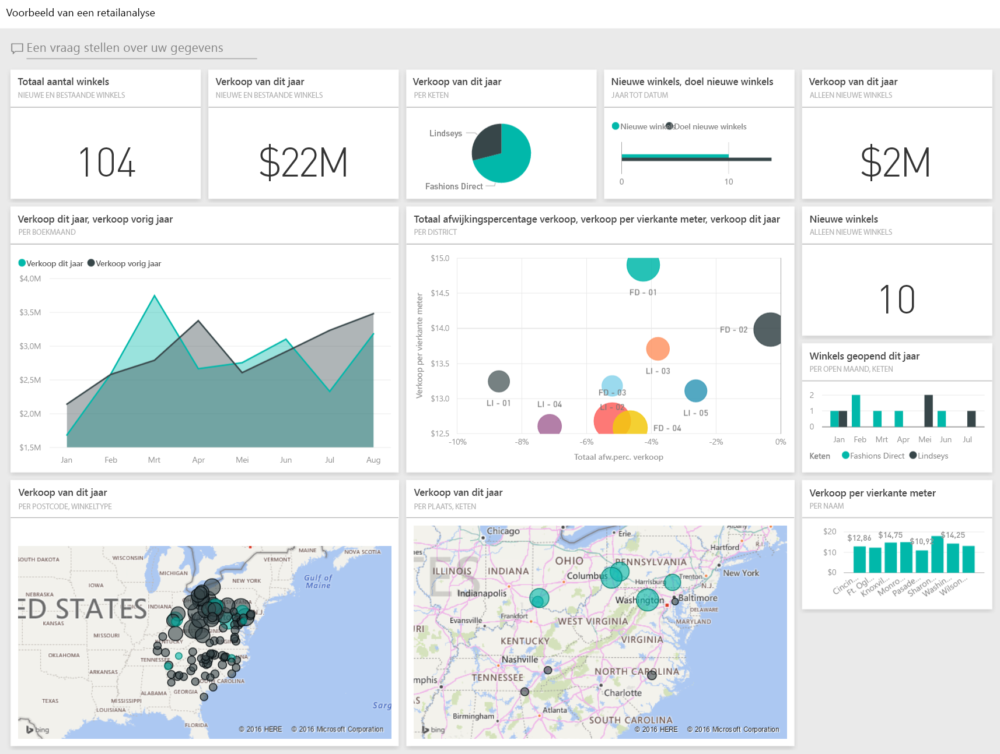

## Vereisten

 Voordat u het voorbeeld kunt gebruiken, moet u het eerst downloaden als een [inhoudspakket](https://docs.microsoft.com/power-bi/sample-datasets#get-and-open-a-sample-content-pack-in-power-bi-service), een [PBIX-bestand](http://download.microsoft.com/download/9/6/D/96DDC2FF-2568-491D-AAFA-AFDD6F763AE3/Retail%20Analysis%20Sample%20PBIX.pbix) of een [Excel-werkmap](http://go.microsoft.com/fwlink/?LinkId=529778).

### Het inhoudspakket voor dit voorbeeld ophalen

1. Open Power BI-service (app.powerbi.com) en meld u aan.
2. Selecteer in de linkerbendehoek **Gegevens ophalen**.
   
    
3. Selecteer op de pagina Gegevens ophalen het pictogram **Voorbeelden**.
   
   
4. Selecteer **Voorbeeld van een retailanalyse** en kies **Verbinding maken**.  
  
   
   
5. Het inhoudspakket wordt geïmporteerd in Power BI en er wordt een nieuw dashboard, nieuw rapport en een nieuwe gegevensset toegevoegd aan de huidige werkruimte. De nieuwe inhoud is gemarkeerd met een geel sterretje. 
   
   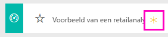
  
### Het pbix-bestand voor dit voorbeeld ophalen

U kunt ook het voorbeeld downloaden als pbix-bestand, dat bedoeld is voor gebruik met Power BI Desktop. 

 * [Voorbeeld van een retailanalyse](http://download.microsoft.com/download/9/6/D/96DDC2FF-2568-491D-AAFA-AFDD6F763AE3/Retail%20Analysis%20Sample%20PBIX.pbix)

### De Excel-werkmap ophalen voor dit voorbeeld
U kunt ook [alleen de gegevensset (Excel-werkmap)](http://go.microsoft.com/fwlink/?LinkId=529778) voor dit voorbeeld downloaden. De werkmap bevat Power View-werkbladen die u kunt bekijken en wijzigen. Als u de onbewerkte gegevens wilt bekijken, selecteert u **Power Pivot > Beheren**.

## Rapport openen op dashboard
1. Selecteer de tegel 'Total Stores' op het dashboard:

   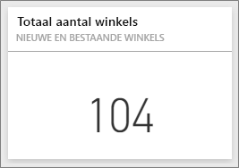  

   Hiermee gaat u naar de pagina 'Store Sales Overview' in het rapport. U ziet dat we in totaal 104 winkels hebben, waarvan er tien nieuw zijn. We hebben ketens: Fashions Direct en Lindseys. Fashions Direct-winkels zijn gemiddeld groter.
2. Selecteer in het cirkeldiagram **Fashions Direct**.

   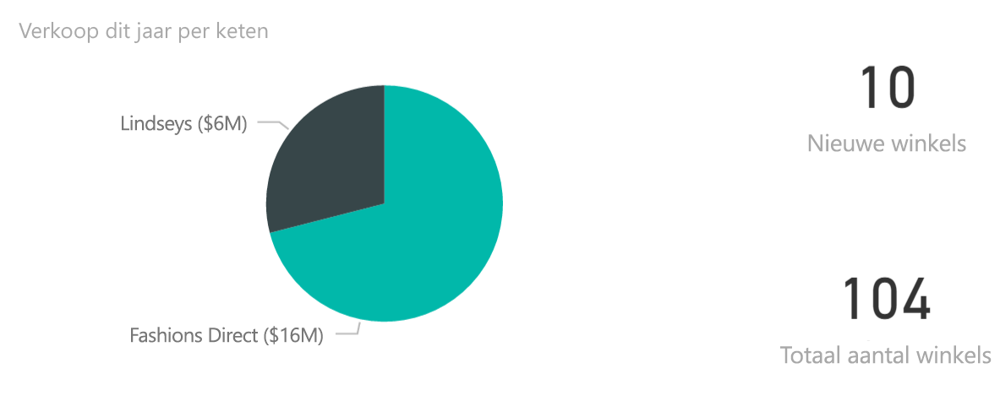  

   Kijk wat er in het bellendiagram gebeurt:

   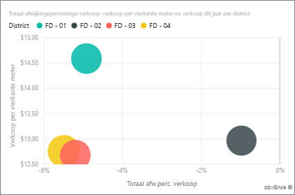  

   Het district FD-01 heeft de hoogste gemiddelde omzet per vierkante meter, FD-02 heeft de laagste variantie in omzet vergeleken met vorig jaar, FD-03 en FD 04 presteren algemeen gezien het slechtst.
3. Selecteer afzonderlijke bellen of andere grafieken om overal andere gegevens te markeren, zodat u de impact van uw selecties kunt zien.
4. Als u terug wilt naar het dashboard, selecteert u de naam van het dashboard in de bovenste navigatiebalk (breadcrumbs).

   
5. Selecteer op het dashboard de tegel 'This Year’s Sales'.

   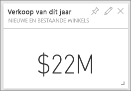

   Dit heeft hetzelfde effect als het typen van 'This Year’s Sales in het vragenvak.

   U ziet dit scherm:

   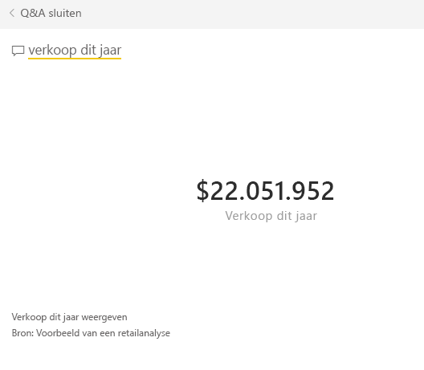

## Een tegel die is gemaakt met Q&A van Power BI
Laten we eens wat specifieke gegevens bekijken.

1. Stel de vraag 'this year sales **by district**'. Kijk naar het resultaat: het antwoord wordt automatisch uitgezet in een staafdiagram en u krijgt ook andere suggesties:

   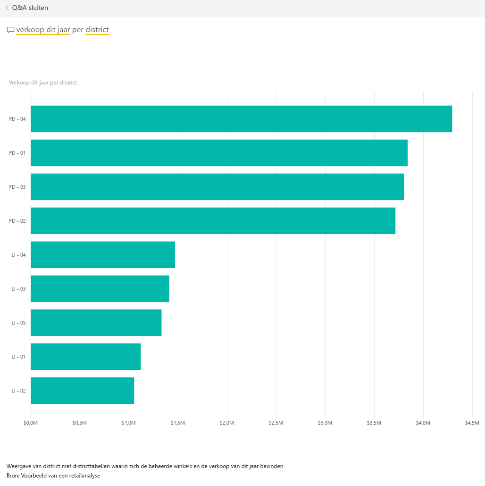
2. Verander de vraag in 'this year sales **by zip and chain**'.

   U ziet het antwoord verschijnen in de juiste grafieken terwijl u de vraag typt.
3. Experimenteer met andere vragen en kijk wat voor soort resultaten u krijgt.
4. Als u klaar bent, gaat u terug naar het dashboard.

## Dieper in de gegevens duiken
Nu gaan we gaan meer op detailniveau kijken, met name naar de prestaties van de districten.

1. Selecteer op het dashboard de tegel waarop de omzet van vorig jaar en dit jaar wordt vergeleken.

   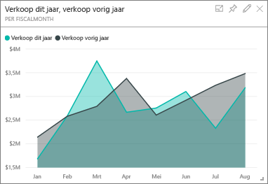

   Let vooral op het grote verschil in het variantiepercentage. Vooral in de maanden januari, april en juli is vorig jaar veel meer omzet gehaald dan dit jaar.

   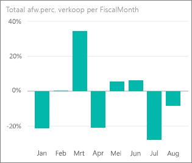

   Laten we eens kijken of we kunnen zien waar de problemen zitten.
2. Selecteer **020-Mens** in het bellendiagram.

   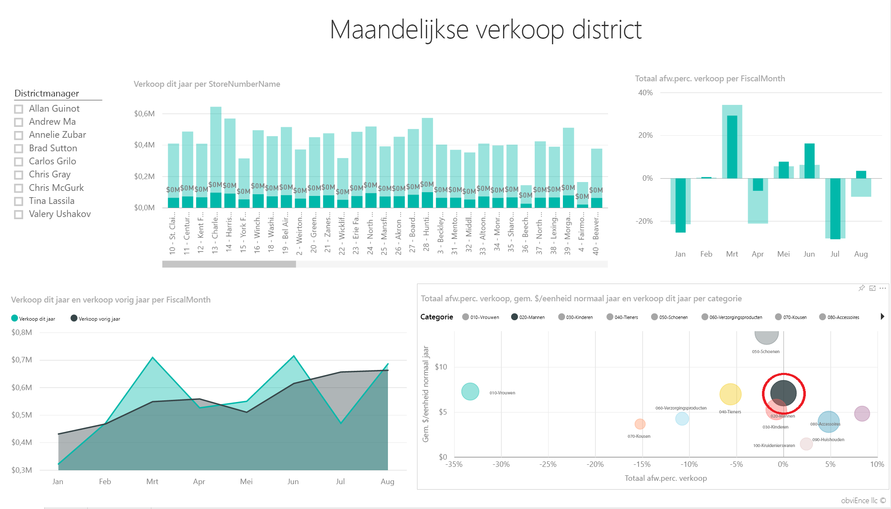  

   U ziet dat de mannenkleding in april beter heeft verkocht dan het bedrijf als geheel, maar januari en juli zijn nog steeds probleemmaanden.
3. Selecteer nu de bel **010-Womens**.

   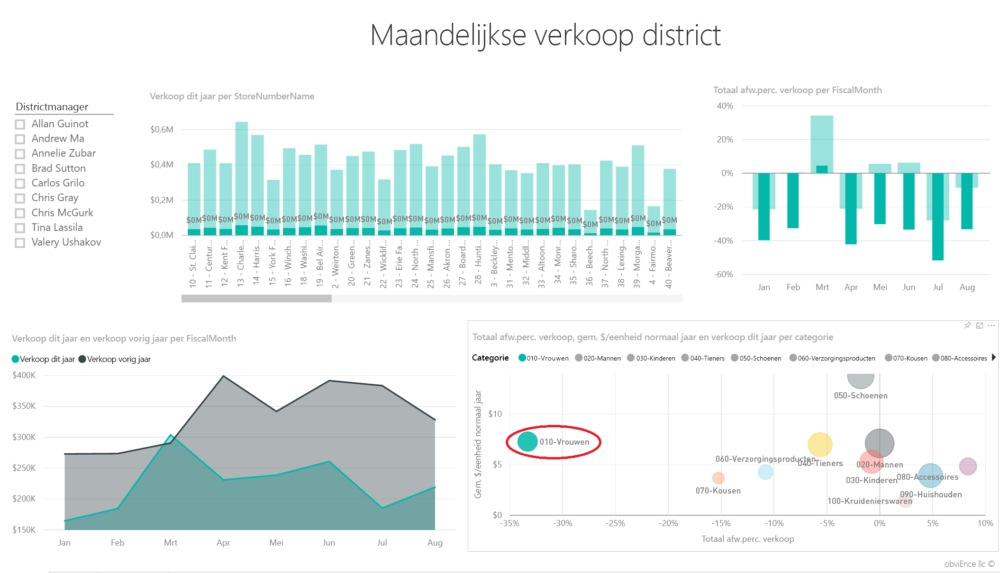

   U ziet dat de dameskleding gedurende alle maanden veel slechter heeft gepresteerd dan de overige categorieën, en veel slechter in bijna elke maand vergeleken met afgelopen jaar.
4. Selecteer de bel opnieuw om het filter te wissen.

## De slicer uitproberen
Laten we eens kijken hoe specifieke districten het doen.

1. Selecteer Allan Guinot in de slicer linksboven.

   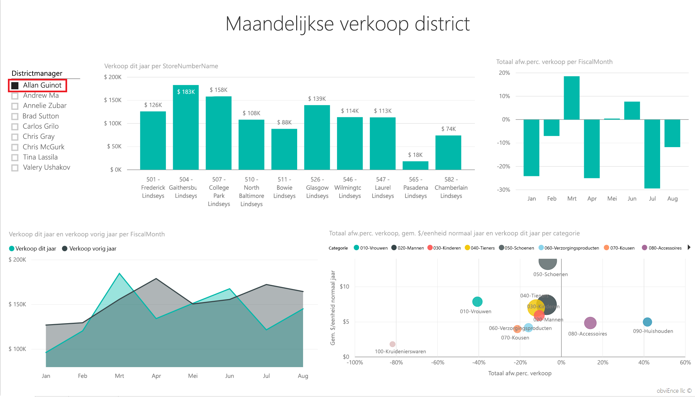

   U ziet dat zijn district vorig jaar een beter dan gemiddeld omzet haalde in maart en juni.
2. Selecteer nu de bel voor dameskleding.

   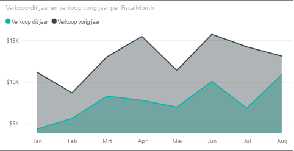

   Het valt meteen op dat zijn district voor de categorie dameskleding nooit de omzetcijfers van vorig jaar heeft gehaald.
3. Verken de andere districtmanagers en categorieën. Welke inzichten kunt u nog meer vinden?
4. Als u klaar bent, gaat u terug naar het dashboard.

## Wat vertellen onze gegevens ons over omzetgroei dit jaar?
Het laatste onderdeel dat we willen verkennen is onze groei, aangezien er dit jaar weer nieuwe winkels zijn geopend.

1. Selecteer de tegel 'Stores Opened This Year’.

   

   Zoals u kunt zien op de tegel, zijn er dit jaar meer Fashions Direct-winkels geopend dan vestigingen van Lindseys.
2. Kijk eens naar de grafiek 'Sales Per Sq Ft per Name':

   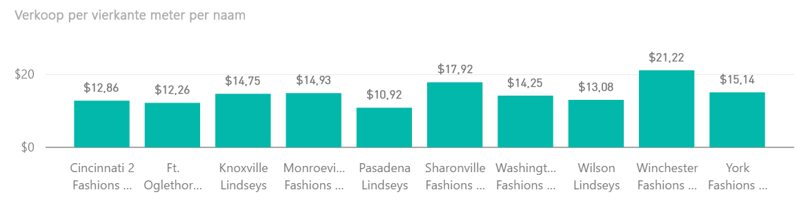

    Er is nogal wat verschil in de gemiddelde omzet per vierkante meter in de nieuwe winkels.
3. Klik op Fashions Direct in de legenda van de grafiek rechtsboven. U ziet dat, zelfs voor dezelfde keten, de beste winkel (Winchester Fashions Direct) aanzienlijk beter presteert dan de slechtste winkel (Cincinnati 2 Fashions Direct), met $ 21,22 tegenover $ 12,86 respectievelijk.

   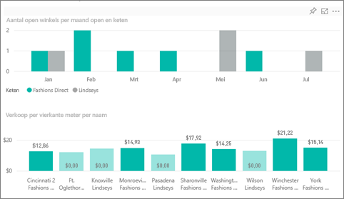
4. Klik op Winchester Fashions Direct in de slicer en bekijk het lijndiagram. De eerste omzetcijfers zijn voor februari.
5. Klik op Cincinnati 2 Fashions Direct in de slicer en u ziet in het lijndiagram dat deze winkel is geopend in juni en de slechtste presterende winkel lijkt te zijn.
6. Net als in eerdere weergaven, kunt u de gegevens verkennen door op andere staven, lijnen en bellen in de grafieken te klikken en te kijken welke inzichten u kunt vaststellen.

Dit is een veilige omgeving om in te experimenteren. U kunt er namelijk altijd voor kiezen de wijzigingen niet op te slaan. Als u deze wel opslaat, kunt u altijd naar Gegevens ophalen gaan voor een nieuwe kopie van dit voorbeeld.

## Verbinding maken met uw gegevens
We hopen dat deze rondleiding heeft laten zien hoe Power BI-dashboards, Q&A en rapporten inzicht kunnen geven in retailgegevens. Nu is het uw beurt om verbinding met uw eigen gegevens te maken. Met Power BI kunt u verbinding maken met een groot aantal gegevensbronnen. Zie [Aan de slag met Power BI](service-get-started.md) voor meer informatie.

## Volgende stappen
* [Het inhoudspakket Retail Analysis Sample downloaden](sample-tutorial-connect-to-the-samples.md)
* [Een ZIP-bestand van alle voorbeeldbestanden downloaden](http://go.microsoft.com/fwlink/?LinkId=535020)    
* [De Excel-werkmap voor dit Power BI-voorbeeld downloaden](http://go.microsoft.com/fwlink/?LinkId=529778)    
* [Gegevens ophalen (voor Power BI)](service-get-data.md)    
* [Power BI - basisconcepten](consumer/end-user-basic-concepts.md)    
* Hebt u nog vragen? [Misschien dat de Power BI-community het antwoord weet](http://community.powerbi.com/)
