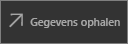
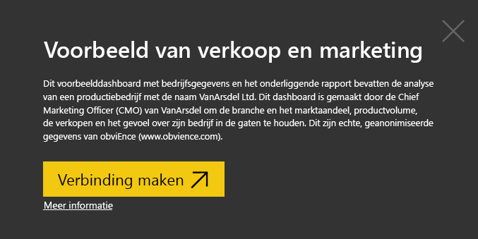
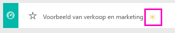
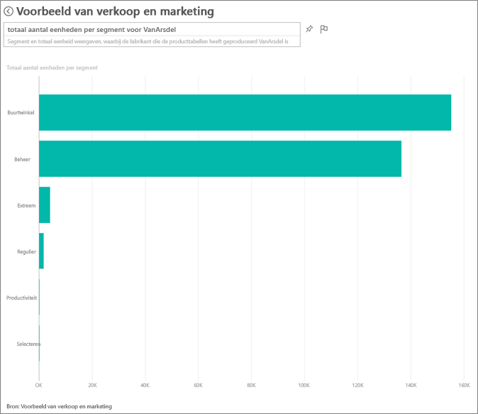
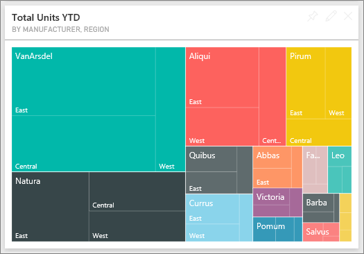
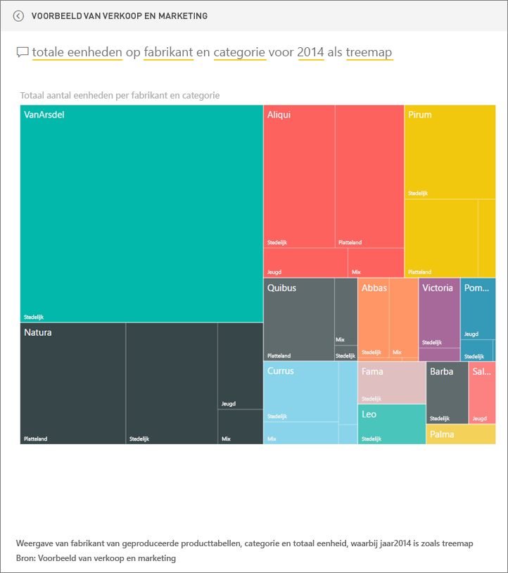
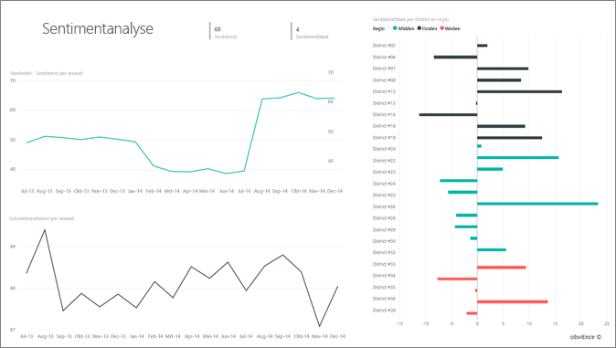
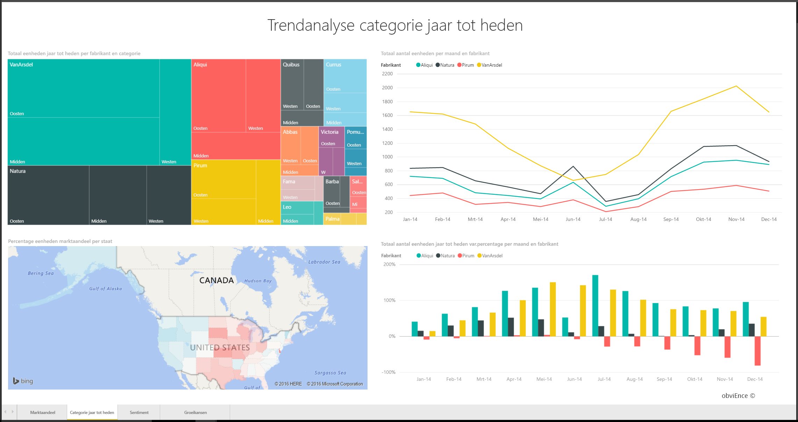
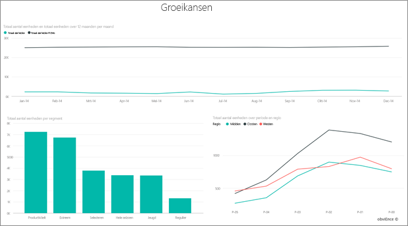

# Voorbeeld van verkoop en marketing voor Power BI: een rondleiding

## Overzicht van het voorbeeld van verkoop en marketing
Het **voorbeeld van verkoop en marketing** bevat een dashboard en rapporten voor een fictief productiebedrijf met de naam VanArsdel Ltd. Dit dashboard is gemaakt door de Chief Marketing Officer (CMO) van VanArsdel om de branche en het marktaandeel, productvolume, de verkopen en het gevoel over zijn bedrijf in de gaten te houden.

VanArsdel heeft veel concurrenten, maar is de marktleider binnen de branche. De CMO wil het marktaandeel vergroten en de groeimogelijkheden verkennen. Maar om de een of andere reden is het marktaandeel van VanArsdel geslonken, met een aanzienlijke dip in juni.

Dit voorbeeld is onderdeel van een serie die laat zien hoe u Power BI kunt gebruiken met bedrijfsgegevens, rapporten en dashboards. Dit zijn echte, geanonimiseerde gegevens van obviEnce (www.obvience.com).

## Vereisten

 Voordat u het voorbeeld kunt gebruiken, moet u het eerst downloaden als een [inhoudspakket](https://docs.microsoft.com/en-us/power-bi/sample-sales-and-marketing#get-the-content-pack-for-this-sample), een [PBIX-bestand](http://download.microsoft.com/download/9/7/6/9767913A-29DB-40CF-8944-9AC2BC940C53/Sales and Marketing Sample PBIX.pbix) of een [Excel-werkmap](http://go.microsoft.com/fwlink/?LinkId=529785).

### Het inhoudspakket voor dit voorbeeld ophalen

1. Open Power BI-service (app.powerbi.com) en meld u aan.
2. Selecteer in de linkerbendehoek **Gegevens ophalen**.
   
    
3. Selecteer op de pagina Gegevens ophalen het pictogram **Voorbeelden**.
   
   
4. Selecteer het **voorbeeld van verkoop en marketing** en kies vervolgens **Verbinding maken**.  
  
   
   
5. Het inhoudspakket wordt geïmporteerd in Power BI en er wordt een nieuw dashboard, nieuw rapport en een nieuwe gegevensset toegevoegd aan de huidige werkruimte. De nieuwe inhoud is gemarkeerd met een geel sterretje. 
   
   
  
### Het pbix-bestand voor dit voorbeeld ophalen

U kunt ook het voorbeeld downloaden als pbix-bestand, dat bedoeld is voor gebruik met Power BI Desktop. 

 * [Voorbeeld van verkoop en marketing](http://download.microsoft.com/download/9/7/6/9767913A-29DB-40CF-8944-9AC2BC940C53/Sales%20and%20Marketing%20Sample%20PBIX.pbix)

### De Excel-werkmap ophalen voor dit voorbeeld
U kunt ook [alleen de gegevensset (Excel-werkmap)](http://go.microsoft.com/fwlink/?LinkId=529785) voor dit voorbeeld downloaden. De werkmap bevat Power View-werkbladen die u kunt bekijken en wijzigen. Als u de onbewerkte gegevens wilt bekijken, selecteert u **Power Pivot > Beheren**.

## Wat vertelt het dashboard ons?
Laten de rondleiding beginnen bij het dashboard en eens kijken welke tegels de CMO heeft vastgemaakt. We zien informatie over ons marktaandeel, de verkopen en het sentiment. En we zien die gegevens opgedeeld per regio, tijd en concurrentie.

* De getallentegels in de linkerkolom tonen ons het verkoopvolume van de branche voor het afgelopen jaar (50.000), het marktaandeel (32,86%), het verkoopvolume (16.000), de sentimentscore (68), de sentimentkloof (4) en het totale aantal verkochten eenheden (1 miljoen).
* De bovenste lijndiagram laat zien hoe onze marktaandeel in de loop van de tijd fluctueert. Ons marktaandeel is in juni aanzienlijk geslonken. Ook ons R12M-aandeel (12 maanden voortschrijdend) dat enige tijd steeg, lijkt nu te stagneren.
* Onze grootste concurrent is Aliqui (duidelijk in de middelste kolomdiagramtegel.)
* We doen met name veel zaken in de oostelijke en centrale gebieden.
* De lijndiagram onderaan laat zien dat onze dip in juni niet seizoensgebonden is, aangezien geen van onze concurrenten dezelfde trend laat zien.
* De twee tegels Totaal aantal eenheden bevatten het verkochte aantal eenheden per segment en per regio/fabrikant. Het grootste marktsegmenten voor onze branche zijn **Productiviteit** en **Convenience**.

### De Q&A-functie gebruiken om wat dieper te graven
#### Welke segmenten zijn goed voor onze verkoop? Komt dit overeen met de trend binnen de branche?
1. Selecteer de tegel Overzicht totale aantal eenheden per segment. Deze wordt geopend door Q&A.
2. Typ aan het eind van een bestaande query **voor VanArsdel**. Q&A interpreteert de een bijgewerkt diagram met het antwoord weer. Onze productvolume afkomstig is afkomstig van Convenience en Beheer.

   
3. Ons aandeel in de categorieën **Beheer** en **Convenience** is zeer hoog. Dit zijn de segmenten waarin wij concurreren.
4. Keer terug naar het dashboard door de naam van het dashboard in de bovenst navigatiebalk (broodkruimels) te selecteren.

#### Hoe ziet het marktaandeel voor het totale aantal eenheden eruit voor een categorie (versus regio)?
1. Bekijk ook de tegel YTD per fabrikant, regio. Ik vraag me af hoe het totale marktaandeel van de eenheid er per categorie uitziet?

   
2. Typ boven aan het dashboard in het vragenvak de vraag om het **Totale aantal eenheden per fabrikant en categorie voor 2014 als een treemap** weer te geven. Zoals u ziet wordt de visualisatie bijgewerkt terwijl u de vraag typt.
   
3. Als u de bevindingen wilt vergelijken, moet u de diagram vastmaken aan uw dashboard. Een interessant gegeven is dat in 2014 VanArsdel alleen producten heeft verkocht die in de categorie **Urban** vallen.
4. Ga terug naar het dashboard.

Dashboards fungeren ook al ingangspunt in rapporten.  Als er een tegel is gemaakt van een onderliggend rapport, kunt u het rapport openen door op de tegel te klikken.

De R12M-lijn (Rolling 12 maanden) op het dashboard laat zien dat ons marktaandeel na verloop van tijd niet meer toeneemt en zelfs een beetje slinkt. En waarom vindt er in juni een grote dip in marktaandeel plaats? U kunt dit nader onderzoeken door op de visualisatie te klikken om het onderliggende rapport te openen.

### Ons rapport heeft 4 pagina's
#### Op pagina 1 van ons rapport ligt de focus voornamelijk op het marktaandeel van VanArsdel.

1. Bekijk onderaan de kolomdiagram Totaal aantal eenheden per maand en isVanArsdel. De zwarte kolom representeert VanArsdel (onze producten) en groen is onze concurrentie. De dip die VanArsdel in juni 2014 ondervond, vond niet plaats bij de concurrentie.
2. De staafdiagram Totale categorievolume per segment, rechts in het midden, is gefilterd om de twee topsegmenten van VanArsdel te tonen. Dit filter is als volgt gemaakt:  

   a.  Vouw het deelvenster Filters aan de rechterkant uit.  
   b.  Klik om de visualisatie te selecteren.  
   c.  Onder Filters op niveau van visuele elementen ziet dat **Segment** zodanig is gefilterd dat alleen **Convenience** en **Beheer** zijn opgenomen.  
   d.  Wijzig het filter door Segment te selecteren en die sectie uit vouwen. Vervolgens schakelt u **Productiviteit** in, zodat ook dat segment wordt toegevoegd.  
3. Selecteer in Totaal aantal eenheden per maand en isVanArsdel de zwarte Ja in de legenda om de pagina kruislings te filteren op VanArsdel. Zoals u ziet concurreren we niet in het segment Productiviteit.
4. Selecteer de zwarte Ja opnieuw om het filter te verwijderen.
5. Bekijk het lijndiagram. Het diagram toont het maandelijkse marktaandeel en de marktaandelen 12 maanden voortschrijdend. 12 maanden voortschrijdende gegevens helpen om de maandelijkse fluctuaties uit te vlakken en de trends voor de lange termijn te tonen. Selecteer in het staafdiagram achtereenvolgens Convenience en Beheer om te zien hoe het marktaandeel voor elk fluctueert. Het segment Beheer laat veel meer schommelingen in het marktaandeel zien dan het segment Convenience.

We proberen nog steeds te achterhalen waarom ons marktaandeel in juni zo'n dip vertoonde. Laten we het Sentiment controleren.

#### Pagina 3 van ons rapport is voornamelijk gericht op Sentiment.

Tweets, Facebook, blogs, artikelen, enzovoort dragen bij aan het sentiment dat wordt weergegeven in de twee lijndiagrammen. Het sentimentdiagram in de linkerbovenhoek laat zien dat het sentiment met betrekking tot onze producten tot en met februari redelijk neutraal was. Vervolgens begon het in februari te kelderen en vond in juni de grootste dip plaats. Wat is er gebeurd waardoor het sentiment zo kelderde? We moeten naar externe bronnen kijken. In februari werd de klantenservice van VanArsdel in verschillende artikelen en blogberichten zeer negatief beoordeeld. Deze slechte publiciteit is direct gecorreleerd aan het sentiment van klanten en de verkoop. Er is hard gewerkt om de klantenservice te verbeteren en dat is niet onopgemerkt gebleven door klanten en de branche. In juli nam het positieve sentiment toe en bereikt zelfs een recordhoogte van meer dan 60. Deze opleving met betrekking tot het sentiment word op pagina 1 en 3 weerspiegeld in Totaal aantal eenheden per maand. Misschien verklaart dit gedeeltelijk onze dip in juni voor het marktaandeel?

De sentimentkloof is een ander gebied dat kan worden verkend: welke gebieden hebben de grootste sentimentkloof, hoe kan het management hier op inspelen en manieren vinden om dit in andere districten te repliceren.

#### Pagina 2 van ons rapport is voornamelijk gericht op YTD categorietrend.

* Van alle bedrijven in deze categorie is VanArsdel de grootste en zijn Natura, Aliqui en Pirium onze grootste concurrenten. Wij houden ze in de gaten.
* Aliqui groeit, maar het productvolume is in vergelijking met die van ons vrij laag.
* VanArsdel is groen in de treemap. In het oosten geven onze klanten de voorkeur aan onze competitie, in het centrale gedeelte doen we het goed en ons marktaandeel in het oosten is het laagst.
* De geografie heeft een impact op het aantal verkochte eenheden. Het oosten is de meeste fabrikanten de dominante regio en VanArsdel is ook sterk vertegenwoordigt in de centrale regio.
* Rechtsonder op het diagram Totale eenheden YTD var % per maand en fabrikant zien we een positieve afwijking en dat is een goed teken. We presteren beter dan vorig jaar, maar dat geldt ook voor onze concurrent Aliqui.

#### Pagina 4 van ons rapport concentreert zich voornamelijk op concurrerende productanalyses.

* In de linkerbenedenhoek van het diagram worden alle categoriesegmenten weergegeven, met uitzondering van de twee sterkste segmenten van VanArsdel. U kun potentiële expansiegebieden voor VanArsdel kunnen vinden door te filteren op categorie en op de staven te klikken. De segmenten **Extreem** en **Productiviteit** groeien sneller dan de andere segmenten.
* Maar we concurreren niet in deze segmenten. Als we ons in deze gebieden willen begeven, kunnen we onze gegevens gebruiken om te kijken welke segmenten in welke regio's populair zijn. We kunnen verder onderzoek doen naar vragen als "welke regio groeit het snelst en wie zou onze grootste concurrent zoals welke regio sneller groeit en wie is onze grootste concurrent in dat segment zou worden verder onderzoek.
* Weet u nog dat we een dip voor het marktaandeel hadden in juni? Juni is een belangrijke maand voor het segment Productiviteit. Dit is een segment waarin we helemaal niet concurreren. Dit kan mogelijk onze dip in juni ook deels verklaren.

Door de visualisatie te filteren op VanArsdel, per segment, per maand en per regio, kunnen we achterhalen welke groeimogelijkheden VanArsdel heeft.

Dit is een veilige omgeving om in te experimenteren. U kunt er altijd voor kiezen om de wijzigingen niet op te slaan. Als u deze wel opslaat, kunt u altijd naar **Gegevens ophalen** gaan voor een nieuwe kopie van dit voorbeeld.

## Volgende stappen: verbinding maken met uw gegevens
We hopen dat deze rondleiding heeft laten zien hoe Power BI-dashboards, Q&A en rapporten inzicht kunnen bieden in de verkoop- en marketinggegevens. Nu is het uw beurt om verbinding met uw eigen gegevens te maken. Met Power BI kunt u verbinding maken met een groot aantal gegevensbronnen. Zie [Aan de slag met Power BI](service-get-started.md) voor meer informatie.  
