# Voorbeeld van kwaliteitsanalyse van leveranciers voor Power BI: een rondleiding volgen
Dit voorbeelddashboard met bedrijfsgegevens en het onderliggende rapport zijn gericht op een van de typische uitdagingen met betrekking tot de toelevering: kwaliteitsanalyse van leveranciers.
In deze analyse zijn twee primaire gegevensgroepen belangrijk: het totale aantal defecte producten en de totale downtime die deze defecte producten hebben veroorzaakt. Dit voorbeeld heeft twee belangrijke doelen:

* Begrijpen wie de beste en de slechtste leveranciers zijn, met betrekking tot kwaliteit
* Identificeren welke fabrieken beter zijn in het vinden en verwijderen van defecte producten om de downtime te minimaliseren

Dit voorbeeld is onderdeel van een serie die laat zien hoe u Power BI kunt gebruiken met bedrijfsgegevens, -rapporten en -dashboards.
Dit zijn echte gegevens die afkomstig zijn van obviEnce ([www.obvience.com)](http://www.obvience.com/). De gegevens zijn geanonimiseerd.

> [!NOTE] 
U kunt ook [alleen de gegevensset (Excel-werkmap)](http://go.microsoft.com/fwlink/?LinkId=529779) voor dit voorbeeld downloaden. De werkmap bevat Power View-werkbladen die u kunt bekijken en wijzigen. Als u de onbewerkte gegevens wilt bekijken, selecteert u **Power Pivot > Beheren**.
 
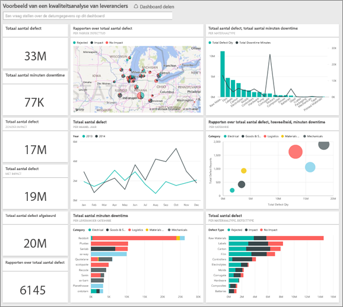

## Downtime die is veroorzaakt door defecte materialen
Laten we eens analyseren hoeveel downtime het gevolg is van defecte materialen en welke leveranciers hier verantwoordelijk voor zijn.  

1. Selecteer op het dashboard de numerieke tegel met informatie over het **Totale aantal defecten** of de **Totale downtime in minuten**.  
   
   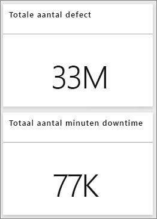  
   
   Het rapport Voorbeeld van kwaliteitsanalyse van leveranciers wordt geopend op de pagina Downtimeanalyse. Zoals u ziet, hebben we in totaal 33 miljoen defecte onderdelen en is de totale downtime die hierdoor wordt veroorzaakt 77.000 minuten. Bepaalde materialen hebben minder defecte onderdelen, maar kunnen wel voor enorme vertraging zorgen, wat resulteert in een hogere downtime. Laten we ze eens verkennen op de rapportpagina.  
2. Als we naar de lijn **Totale aantal minuten downtime** kijken in de combinatiegrafiek **Defecten en downtime (min.) per materiaaltype**, zien we dat golfkarton de meeste downtime veroorzaakt.  
3. Selecteer de kolom **Golfkarton** in dezelfde combinatiegrafiek om te zien welk fabrieken het meest worden beïnvloed door dit defect en welke leverancier hier verantwoordelijk voor is.  
   
     
4. Selecteer afzonderlijke fabrieken op de map om te zien welke leverancier of welk materiaal verantwoordelijk is voor de downtime voor die fabriek.

### Wie zij de slechtste leveranciers?
 We willen de acht slechtste leveranciers vinden en bepalen voor welk percentage van de downtime ze verantwoordelijk zijn. We kunnen dit doen door het vlakdiagram **Downtime (min.) per leverancier** te wijzigen in een treemap.  

1. Selecteer op pagina drie van het rapport, Downtimeanalyse, in de rechterbovenhoek de optie **Rapport bewerken**.  
2. Selecteer het vlakdiagram **Downtime (min.) per leverancier** en selecteer in het deelvenster Visualisaties de optie Treemap.  
   
   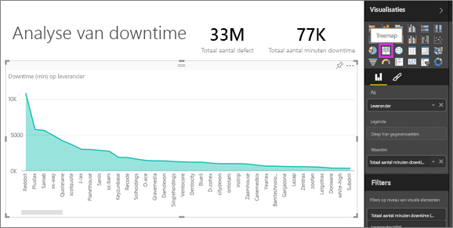  
   
    Het veld **Leverancier** wordt automatisch gebruikt als de **groep**.  
   
    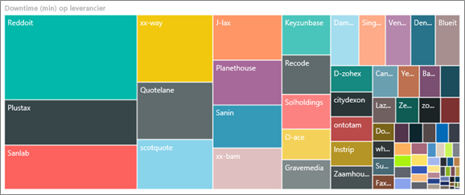  
   
   In deze treemap kunt u zien dat de acht leveranciers de acht blokken aan de linkerkant van de treemap zijn. We kunnen ook zien dat ze verantwoordelijk zijn voor 50% van alle downtimeminuten.  
3. Selecteer in de bovenste navigatiebalk de optie **Voorbeeld van kwaliteitsanalyse van leveranciers** om terug te keren naar de dashboards.

### Fabrieken vergelijken
Laten we nu eens kijken welke fabriek de defecte materialen het beste beheert en daardoor minder downtime heeft.  

1. Selecteer de tegel met de kaart voor het **Totaal aantal defectmeldingen per fabriek en type defect**.  
   
    Het rapport wordt geopend op de pagina Kwaliteit van leverancier.  
   
   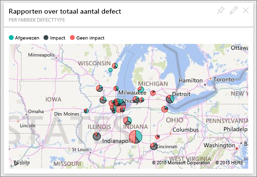  
2. Selecteer in de legenda de kaart van de cirkel **Impact**.  
   
    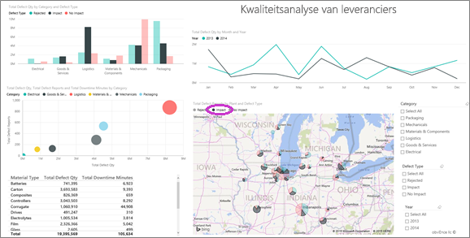  
   
    Zoals u in het bellendiagram kunt zien, vormt de categorie **Logistiek** het grootste probleem. Deze categorie is het grootst wat betreft het totale aantal defecten, het totale aantal defectmeldingen en de totale downtime in minuten. Laten we deze categorie eens nader bekijken.  
3. Selecteer in het bellendiagram de bel Logistiek en bekijk de fabrieken in Springfield, IL en Naperville, IL. Zo te zien worden de defecte goederen in Naperville veel beter beheerd dan in Springfield, aangezien het aantal afgekeurde goederen vrij hoog is, maar de impact hiervan in vergelijking met het grote aantal impacts in Springfield vrij beperkt is.  
   
   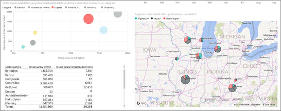  
4. Selecteer in de bovenste navigatiebalk de optie **Voorbeeld van kwaliteitsanalyse van leveranciers** om terug te keren naar uw actieve werkruimte.

## Welk type materiaal wordt het best beheerd?
Het beste beheerde type materiaal type is het materiaal met de laagste downtime of zonder impact, ongeacht het aantal defecten.

* Bekijk de dashboardtegel **Totaal aantal defecten per type materiaal en defect**.
  
  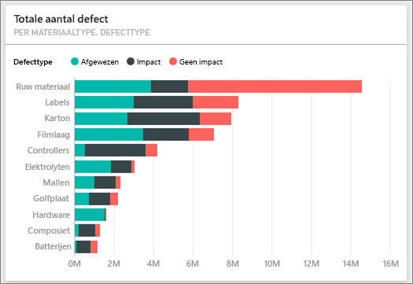

Zoals u kunt zien is het totale aantal defecten voor **Grondstoffen** vrij hoog. Dergelijke items worden echter meestal afgekeurd of ze hebben geen impact.

Laten we eens controleren of we kunnen zien dat ondanks het hoge aantal defecten de downtime voor grondstoffen maar beperkt is.

* Bekijk de tegel **Totaal aantal defecten, Totale downtime in minuten per materiaaltype** op het dashboard.
  
  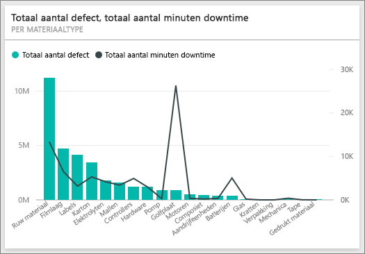

Blijkbaar worden de grondstoffen goed beheerd. Het aantal defecten is groter, maar de totale downtime in minuten is minder.

### Defecten vergelijken met de jaarlijkse downtime
1. Selecteer de kaarttegel **Totaal aantal defectmeldingen per fabriek, Type defect** om de eerste pagina van het rapport Kwaliteit van leverancier te openen.
2. Het blijkt dat het **Aantal defecten** in 2014 hoger is dan in 2013.  
   
    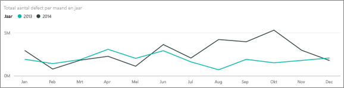  
3. Laat een groter aantal defecten zich vertalen in meer downtime? We kunnen dit achterhalen door vragen in het vak Q&A te stellen.  
4. Selecteer in de bovenste navigatiebalk de optie **Voorbeeld van kwaliteitsanalyse van leveranciers** om terug te keren naar de dashboards.  
5. Omdat we weten dat grondstoffen het hoogste aantal defecten hebben, typt u in het vragenvak 'typen materiaal, jaar en totaal aantal defecten weergeven'.  
   
    Het aantal defecte grondstoffen was in 2014 aanzienlijk hoger dan in 2013.  
   
    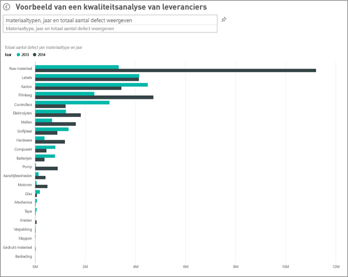  
6. Wijzig de vraag nu in 'typen materiaal, jaar en totale downtime in minuten weergegeven'.  
   
   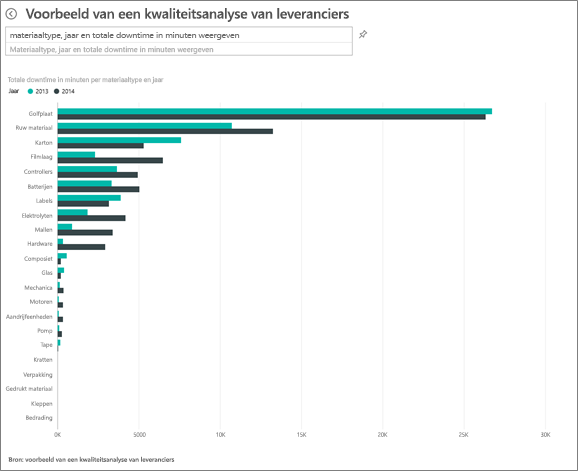

De downtime als gevolg van grondstoffen was in 2013 en 2014 ongeveer hetzelfde, hoewel er in 2014 veel meer grondstofdefecten waren.

Het blijkt dat ondanks het grotere aantal defecten in 2014 deze grondstoffen niet veel meer downtime hebben veroorzaakt in 2014.

### Defecten vergelijken met de maandelijkse downtime
Laten we nog een andere dashboardtegel bekijken die gerelateerd is aan het totale aantal defecten.  

1. Selecteer de pijl-terug  in de linkerbovenhoek van het vragenvak om terug te keren naar het dashboard.  
   
    Uit de tegel **Totaal aantal defecten per maand, jaar** blijkt dat het aantal defecten voor de eerste helft van 2014 vergelijkbaar is met het aantal defecten in 2013, maar dat het aantal defecten voor de tweede helft van 2014 aanzienlijk hoger uitvalt.  
   
    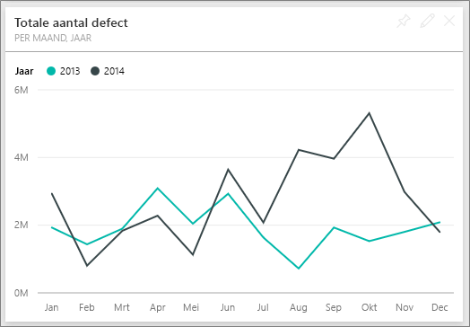  
   
    Laten we eens kijken of deze toename in het aantal defecten ook heeft geleid tot een hoger downtime in minuten.  
2. Typ in het vragenvak de vraag 'totale downtime in minuten per maand en jaar als lijndiagram'.  
   
   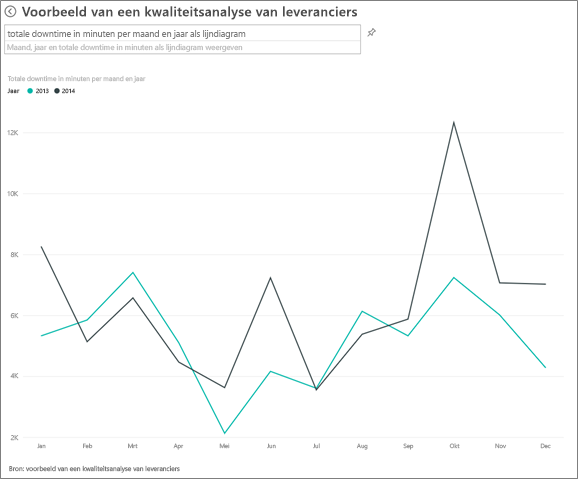
   
   We zien dat downtime in juni en oktober toeneemt, maar voor de overige maanden vertaalt het grotere aantal defecten zich niet in aanzienlijk meer downtime. Hieruit blijkt dat de defecten goed worden beheerd.  
3. Als u wilt dit diagram aan uw dashboard wilt vastmaken, selecteert u het speldpictogram  rechts van vragenvak.  
4. Als u de uitschieters, oftewel de maanden juni en oktober, wilt verkennen, kunt u de downtime in minuten voor oktober per materiaaltype, fabriekslocatie, categorie, enzovoort controleren door vragen te stellen als 'totale downtime in minuten voor oktober per fabriek'.    
5. Selecteer de pijl-terug  in de linkerbovenhoek van het vragenvak om terug te keren naar het dashboard.

Dit is een veilige omgeving om in te spelen. U kunt er altijd voor kiezen om de wijzigingen niet op te slaan. Als u deze wel opslaat, kunt u altijd naar **Gegevens ophalen** gaan voor een nieuwe kopie van dit voorbeeld.

## Volgende stappen: koppelen aan uw gegevens
We hopen dat deze rondleiding heeft laten zien hoe Power BI-dashboards, Q&A en rapporten inzicht kunnen geven in gegevens over de kwaliteit van leveranciers. Nu is het uw beurt om verbinding met uw eigen gegevens te maken. Met Power BI kunt u verbinding maken met een groot aantal gegevensbronnen. Zie [Aan de slag met Power BI](service-get-started.md) voor meer informatie.

