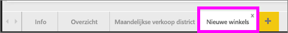
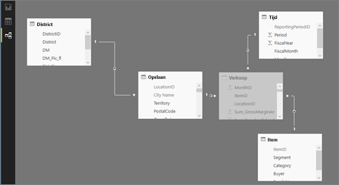

#  Verbinding maken met de voorbeelden in de Power BI-service

In deze zelfstudie leert u het volgende: 
- Een voorbeeldinhoudspakket importeren, het toevoegen aan de Power BI-service en de inhoud ervan openen. Een *inhoudspakket* is een type voorbeeld waarbij de gegevensset wordt geleverd met een dashboard en een rapport. 
- Een .pbix-voorbeeldbestand openen in Power BI Desktop.

Als u eerst meer achtergrondinformatie wilt, raden we u aan te beginnen met het artikel [Voorbeeldgegevenssets voor Power BI](sample-datasets.md). In dat artikel leest u alles over de voorbeelden: hoe u ze downloadt, waar u ze kunt opslaan, hoe u ze gebruikt en enkele verhalen die elk voorbeeld kan vertellen. Wanneer u de basisbeginselen begrijpt, keert u terug naar deze zelfstudie.   

## Vereisten
De voorbeelden zijn beschikbaar voor de Power BI-service en Power BI Desktop. Gebruik het voorbeeld van de retailanalyse als u mee wilt doen.

Het voorbeeldinhoudspakket *Retail Analysis* dat in deze zelfstudie wordt gebruikt, bestaat uit een dashboard, een rapport en een gegevensset.
Om vertrouwd te raken met dit type inhoudspakket en het bijbehorende scenario, kunt u [een rondleiding door het voorbeeld Retail Analysis bekijken](sample-retail-analysis.md) voordat u begint.

## Voorbeelden en de Power BI-service

1. Open de Power BI-service (app.powerbi.com) en meld u aan.
2. Selecteer **Gegevens ophalen** onder in het linkernavigatievenster. Als u **Gegevens ophalen** niet ziet, vouwt u het navigatievenster uit door het  te selecteren.
   
   
5. Selecteer **Voorbeelden**.  
   
   
6. Selecteer *Retail Analysis Sample* en kies **Verbinding maken**.   
   
   

## Wat is er precies geïmporteerd?
Wanneer u bij de voorbeeldinhoudspakketten **Verbinding maken** selecteert, haalt Power BI in werkelijkheid een kopie van dat inhoudspakket op en slaat dit voor u op in de cloud. Omdat de persoon die het inhoudspakket heeft gemaakt, een gegevensset, een rapport en een dashboard heeft opgenomen, krijgt u die wanneer u klikt op **Verbinding maken**. 

1. Power BI maakt het nieuwe dashboard en geeft dit weer op het tabblad **Dashboards**. Het gele sterretje geeft aan dat het nieuw is.
   
   
2. Open het tabblad **Rapporten**.  Hier ziet u een nieuw rapport met de naam *Retail Analysis Sample*.
   
   
   
   Bekijk ook het tabblad **Gegevenssets**.  Er is ook een nieuwe gegevensset.
   
   

## De nieuwe inhoud verkennen
Verken nu zelf het dashboard, de gegevensset en het rapport. Er zijn veel verschillende manieren om te navigeren naar uw dashboards, rapporten en gegevenssets en slechts een van die manieren wordt hieronder beschreven.  

> [!TIP]
> Wilt u eerst wat meer uitleg?  Bekijk dan de [rondleiding door het voorbeeld Retail Analysis](sample-retail-analysis.md) voor een stapsgewijze uitleg van dit voorbeeld.
> 
> 

1. Ga terug naar het tabblad **Dashboards** en selecteer het dashboard *Voorbeeld van retailanalyse* om dit te openen.    
   
   
2. Het dashboard wordt geopend.  Dit bevat diverse visualisatietegels.
   
   
3. Selecteer een van de tegels om het onderliggende rapport te openen.  In dit voorbeeld selecteren we het vlakdiagram (dat een roze kader heeft in de vorige afbeelding). Het rapport wordt geopend op de pagina die dat vlakdiagram bevat.
   
    
   
   > [!NOTE]
   > Als de tegel was gemaakt met [Power BI Q&A](consumer/end-user-q-and-a.md), zou in plaats daarvan de Q&A-pagina zijn geopend. Als de tegel [vanuit Excel was vastgemaakt](service-dashboard-pin-tile-from-excel.md) zou Excel Online het in Power BI hebben geopend.
   > 
   > 
1. Terug op het tabblad **Gegevenssets** hebt u verschillende mogelijkheden om de gegevensset te verkennen.  U kunt de set niet openen en alle rijen en kolommen bekijken (zoals wel kan in Power BI Desktop of Excel).  Als iemand een inhoudspakket deelt met collega's, wil hij of zij doorgaans alleen de inzichten delen en de collega's niet direct toegang geven tot de gegevens. Maar dat betekent niet dat u de gegevensset niet kunt verkennen.  
   
   
   
   * Eén manier om de gegevensset te verkennen, is door zelf uw eigen visualisaties en rapporten te maken.  Selecteer het diagrampictogram  om de gegevensset te openen in de rapportbewerkingsmodus.
     
       
   * Een andere manier om de gegevensset te verkennen, is door [Snelle inzichten](consumer/end-user-insights.md) uit te voeren. Selecteer de drie puntjes (...) en kies **Inzichten verkrijgen**. Wanneer de inzichten gereed zijn, selecteert u **Inzichten weergeven**.
     
       

## Voorbeelden en Power BI Desktop 
Wanneer u het PBIX-voorbeeldbestand voor het eerst opent, wordt het in de Rapportgave weergegeven en kunt u een oneindig aantal rapportpagina's met visualisaties verkennen, maken en bewerken. De rapportweergave kent vrijwel hetzelfde ontwerp als de bewerkingsweergave van een rapport in de Power BI-service. U kunt er visuele elementen verplaatsen, kopiëren en plakken, samenvoegen, enzovoort.

Het verschil is dat u in Power BI Desktop met uw query's kunt werken en gegevens kunt modelleren om ervoor te zorgen dat uw rapporten de beste inzichten geven in uw gegevens. U kunt uw Power BI Desktop-bestand vervolgens opslaan waar u wilt, bijvoorbeeld op de lokale harde schijf of in de cloud.

1. Open het [PBIX-voorbeeldbestand](http://download.microsoft.com/download/9/6/D/96DDC2FF-2568-491D-AAFA-AFDD6F763AE3/Retail%20Analysis%20Sample%20PBIX.pbix) van de retailanalyse in Power BI Desktop. 

    

1. Het bestand wordt geopend in de rapportweergave. Ziet u de 4 tabbladen onder in de rapporteditor? Dat betekent dat er 4 pagina's in dit rapport zijn en momenteel is de pagina 'New Stores' (nieuwe winkels) geselecteerd. 

    .

3. Zie voor een diepgaande uitleg van de rapporteditor [De rapporteditor... Een rondleiding](service-the-report-editor-take-a-tour.md)

## Wat is er precies geïmporteerd?
Wanneer u het PBIX-voorbeeldbestand in Desktop opent, haalt Power BI in werkelijkheid een kopie van die gegevens op en slaat deze voor u op in de cloud. Vanaf Desktop hebt u toegang tot het rapport ***en de onderliggende gegevensset***. Wanneer de gegevens geladen zijn, probeert Power BI Desktop voor u relaties te zoeken en te maken.  

1. Schakel over naar [gegevensweergave](desktop-data-view.md) door het tabelpictogram  te selecteren.
 
    

    De gegevensweergave helpt u bij het controleren, onderzoeken en begrijpen van gegevens in uw Power BI Desktop-model. Het verschilt van de manier waarop u tabellen, kolommen en gegevens in Query-editor bekijkt. In de gegevensweergave bekijkt u gegevens nadat deze in het model zijn geladen.

    Wanneer u een gegevensmodel maakt, wilt u soms zien wat een tabel of kolom nu echt bevat zonder een visueel element te maken op het rapportcanvas, vaak tot rijniveau aan toe. Dit is vooral van toepassing wanneer u metingen en berekende kolommen maakt of als u een gegevenstype of gegevenscategorie moet identificeren.

1. Schakel over naar [Relatieweergave](desktop-relationship-view.md) door het pictogram  te selecteren.
 
    

    In de relatieweergave worden alle tabellen, kolommen en relaties in uw model weergegeven. Hier kunt u relaties bekijken, wijzigen en maken.

## De nieuwe inhoud verkennen
Verken nu zelf de gegevensset, de relaties en het rapport. Voor een introductie gaat u naar [Aan de slag met Power BI Desktop](desktop-getting-started.md).    

## Volgende stappen
[Basisconcepten van Power BI](consumer/end-user-basic-concepts.md)

[Voorbeelden voor de Power BI-service](sample-datasets.md)

[Gegevensbronnen voor Power BI](service-get-data.md)

Hebt u nog vragen? [Misschien dat de Power BI-community het antwoord weet](http://community.powerbi.com/)

