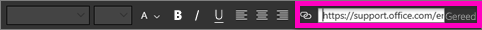
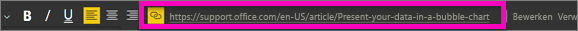
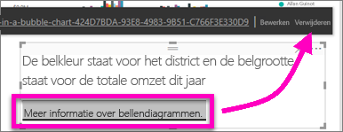

# Een hyperlink toevoegen aan een tekstvak in een rapport
U kunt tekstvakken toevoegen aan rapporten, vanuit rapporten vastmaken aan dashboards en rechtstreeks aan dashboards toevoegen. U kunt altijd hyperlinks aan een tekstvak toevoegen, ongeacht waar het tekstvak zich bevindt.  

> **Opmerking**: zie [Hyperlinks in tabellen](power-bi-hyperlinks-in-tables.md) voor meer informatie over hyperlinks in Power BI-tabellen en -matrices. Zie [Rechtstreeks een tegel vanaf het dashboard toevoegen](service-dashboard-add-widget.md) voor meer informatie over het toevoegen van de tekstvakken aan uw **dashboard**. 
> 
> 

<iframe width="560" height="315" src="https://www.youtube.com/embed/_3q6VEBhGew#t=0m55s" frameborder="0" allowfullscreen></iframe>

## Een hyperlink toevoegen aan een tekstvak in een rapport
1. [Maak een tekstvak en voeg tekst toe](power-bi-reports-add-text-and-shapes.md). 
2. Markeer de bestaande tekst of voeg nieuwe tekst toe die u wilt gebruiken als hyperlink.
   
   
3. Selecteer het hyperlinkpictogram .
4. Typ of plak de URL in het hyperlinkveld en selecteer **Gereed**.
   
   
5. Test de koppeling.  
   
   
   
   * Plaats de cursor op een willekeurige plek in de geselecteerde tekst om de URL weer te geven.  
     
      
   * Selecteer de URL om de pagina te openen in een nieuw browservenster.

## De hyperlink verwijderen maar de tekst behouden
1. Selecteer de hyperlink in het tekstvak om deze te markeren.
   
     
2. Kies **Verwijderen**. 

## Volgende stappen
[Tekstvakken in Power BI-rapporten](power-bi-reports-add-text-and-shapes.md)

Hebt u nog vragen? [Misschien dat de Power BI-community het antwoord weet](http://community.powerbi.com/)

