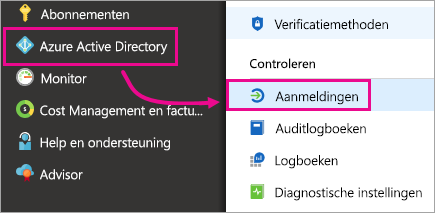
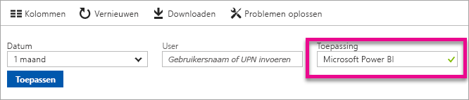

# Power Bi-gebruikers zoeken die zich hebben aangemeld
Als u tenantbeheerder bent en u wilt zien wie zich heeft aangemeld bij Power BI, kunt u met behulp van de toegangs- en gebruiksrapporten van Azure Active Directory meer zichtbaarheid krijgen.

<iframe width="640" height="360" src="https://www.youtube.com/embed/1AVgh9w9VM8?showinfo=0" frameborder="0" allowfullscreen></iframe>

U kunt het activiteitenrapport openen binnen de [nieuwe](https://docs.microsoft.com/azure/active-directory/active-directory-reporting-activity-sign-ins) en de [klassieke](https://docs.microsoft.com/azure/active-directory/active-directory-view-access-usage-reports) portals voor Azure Active Directory (Azure AD). Hoewel in de video hierboven de klassieke portal als voorbeeld wordt gebruikt, wordt de nieuwe portal in dit artikel belicht.

> [!NOTE]
> Dit activiteitenrapport betreft zowel Power BI- (gratis) als Pro-gebruikers, maar maakt geen onderscheid in de licentie waarover ze beschikken.
> 
> 

## Vereisten
Hier volgen de vereisten om het rapport van aanmeldingsactiviteiten weer te geven.

* Gebruikers in de rol globale beheerder, beveiligingsbeheerder of beveiligingslezer hebben toegang tot de gegevens.
* Elke gebruiker (niet-beheerders) hebben toegang tot hun eigen aanmeldingen.
* Uw tenant moet beschikken over een eraan gekoppelde Azure AD Premium-licentie om het complete rapport van aanmeldingsactiviteiten te kunnen zien.

## De Azure-portal gebruiken voor het weergeven van aanmeldingen
U kunt via de Azure Active Directory-portal aanmeldingsactiviteiten bekijken.

1. Blader naar de **Azure Portal** en selecteer **Azure Active Directory**.
2. Selecteer onder **Activiteit** **Aanmeldingen**.
   
    
3. Filter de app op **Microsoft Power BI** of **Power BI Gateway** en selecteer **Toepassen**.
   
    **Microsoft Power BI** is voor aanmeldingsactiviteiten met betrekking tot de service, terwijl **Power BI Gateway** specifieke aanmeldingen betreft voor de on-premises gegevensgateway.
   
    

## De gegevens exporteren
U hebt twee opties voor het exporteren van de aanmeldingsgegevens. U kunt dit doen door een CSV-bestand te downloaden of door PowerShell te gebruiken.

### CSV-bestand downloaden
U kunt in het scherm Activiteit **Downloaden** selecteren in de werkbalk. Hiermee downloadt u een CSV-bestand voor de momenteel gefilterde gegevens.

### PowerShell
U kunt PowerShell gebruiken om de aanmeldingsgegevens te exporteren. Een [voorbeeld](https://docs.microsoft.com/azure/active-directory/active-directory-reporting-api-sign-in-activity-samples#powershell-script) is beschikbaar in de documentatie van Azure Active Directory.

> [!NOTE]
> Om het PowerShell-voorbeeld te laten werken, moet u voldoen aan de [toegangsvereisten voor de API](https://docs.microsoft.com/en-us/azure/active-directory/active-directory-reporting-api-prerequisites) van Azure Active Directory-rapportage.
> 
> 

## Bewaartijd voor gegevens
Gegevens met betrekking tot aanmelden kunnen maximaal 30 dagen beschikbaar zijn. Zie [Bewaarbeleid Azure Active Directory-rapporten](https://docs.microsoft.com/azure/active-directory/active-directory-reporting-retention) voor meer informatie.

## Volgende stappen
[Rapporten van aanmeldingsactiviteiten in de Azure Active Directory-portal (nieuwe portal)](https://docs.microsoft.com/azure/active-directory/active-directory-reporting-activity-sign-ins)  
[Uw toegangs- en gebruiksrapporten weergeven (klassieke portal)](https://docs.microsoft.com/azure/active-directory/active-directory-view-access-usage-reports#view-or-download-a-report)  
[PowerShell-scriptvoorbeeld aanmelding](https://docs.microsoft.com/azure/active-directory/active-directory-reporting-api-sign-in-activity-samples#powershell-script)  
[Bewaarbeleid Azure Active Directory-rapporten](https://docs.microsoft.com/azure/active-directory/active-directory-reporting-retention)  
[Auditing gebruiken binnen uw organisatie](service-admin-auditing.md)  
[De verlengde Pro-proefversie activeren](service-extended-pro-trial.md)

Hebt u nog vragen? [Misschien dat de Power BI-community het antwoord weet](https://community.powerbi.com/)

