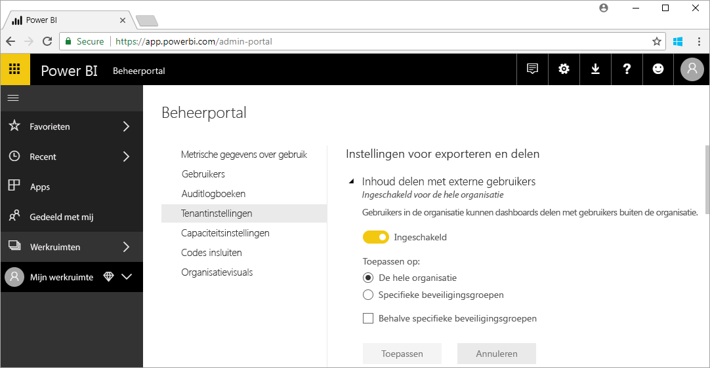

# Wat is Power BI-beheer?

Power BI-beheer is het beheer van een Power BI-tenant, met inbegrip van de configuratie van de governancebeleidsregels, de bewaking van het gebruik, en het inrichten van licenties, capaciteit en organisatieresources. In dit artikel vindt u een overzicht van de beheerrollen, -taken en -hulpprogramma's, en vindt u koppelingen naar artikelen met meer details.

Power BI is ontworpen voor selfservice business intelligence en de beheerder is de bewaker van gegevens, processen en beleidsregels in de Power BI-tenant. Een Power BI-beheerder neemt een belangrijke plaats in het team met BI-ontwikkelaars, -analisten en andere -rollen in. De beheerder kan een organisatie ondersteunen om ervoor te zorgen dat essentiële doelstellingen worden gehaald:

- Inzicht in de KPI's en metrische gegevens die gebruikers _daadwerkelijk_ nodig hebben
- Vermindering van de leveringstijd voor zakelijke rapportages door IT-medewerkers
- Snellere ingebruikname en een sneller rendement op investering van een Power BI-implementatie

Het doel is zakelijke gebruikers productief te maken en te zorgen voor beveiliging en naleving van wet- en regelgeving. Onder de verantwoordelijkheden kunnen hulp en ondersteuning vallen, en in veel gevallen het assisteren van zakelijke gebruikers om de juiste dingen te doen.

## Beheerdersrollen die betrekking hebben op Power BI

Er zijn diverse rollen die betrekking hebben op Power BI-beheer. Een overzicht van deze rollen vindt u in de volgende tabel.

| **Type beheerder** | **Beheerscope** | **Power BI-scope** |
| --- | --- | --- |
| Globale beheerder van Office 365 | Office 365 | Kan alle aspecten van een Power BI-tenant en andere services beheren. |
| Factureringsbeheerder van Office 365 | Office 365 | Kan Power BI-licenties aanschaffen via Office 365-abonnementen. |
| Power BI-servicebeheerder | Power BI-tenant | Heeft volledige controle over een Power BI-tenant en de beheerfuncties (met uitzondering van licentieverlening). |
| Power BI Premium-capaciteitsbeheerder | Eén Premium-capaciteit | Heeft volledige controle over een Premium-capaciteit en de bijbehorende beheerfuncties. |
| Power BI Embedded-capaciteitsbeheerder | Eén Embedded-capaciteit | Heeft volledige controle over een Embedded-capaciteit en de bijbehorende beheerfuncties. |

Globale beheerders in Office 365 of Azure Active Directory hebben beheerdersrechten in Power BI. Een globale beheerder van Office 365 kan andere gebruikers toewijzen aan de rol Power BI-servicebeheerder, waarmee alleen beheerdersrechten voor Power BI-functies wordt verleend.

Power BI-servicebeheerders hebben toegang tot het Power BI-beheerportal, waarin verschillende instellingen op tenantniveau te vinden zijn met betrekking tot de functionaliteit, beveiliging en controle. Servicebeheerders hebben volledige toegang tot alle resources van een Power BI-tenant. In de meeste gevallen stellen servicebeheerders problemen vast en nemen ze contact op met de resource-eigenaren om corrigerende acties te ondernemen.

Met de rol Power BI-servicebeheerder kunnen geen licenties aan gebruikers worden toegewezen of auditlogboeken worden weergegeven in Office 365. Om deze reden kan de taak voor het beheren van Power BI momenteel niet worden uitgevoerd door gebruikers die alleen lid van de rol Power BI-servicebeheerder zijn.

## Beheertaken

Beheerders voeren veel taken uit ter ondersteuning van de Power BI-tenant voor hun organisatie. In de volgende tabel vindt u een overzicht van deze taken.

| **Taakgebied** | **Veelvoorkomende taken** |
| --- | --- |
| De Power BI-tenant beheren |<ul><li>De belangrijkste functies van Power BI in- en uitschakelen <li>Rapporteren over gebruik en prestaties <li>Controle van gebeurtenissen bekijken en beheren</ul>|
| Power BI-licenties aanschaffen en toewijzen |<ul><li>Registratie van gebruikers beheren <li>Pro-licenties kopen en toewijzen <li>Toegang tot Power BI blokkeren voor gebruikers</ul>|
| Premium-capaciteit beheren |<ul><li>Premium-capaciteit aanschaffen en ermee werken <li>Kwaliteit van service waarborgen|
| Embedded-capaciteit beheren |<ul><li>Embedded-capaciteit aanschaffen ter vereenvoudiging van de manier waarop ISV's en ontwikkelaars de Power BI-mogelijkheden gebruiken</ul>|
| Zorgen voor naleving van interne beleidsregels, wetten en regelgeving | <ul><li>Classificatie van zakelijke gegevens beheren <li>Publiceren en delen van beleidsregels afdwingen</ul>|
| Power BI-resources beheren |<ul><li>Werkruimten beheren <li>Aangepaste visuals publiceren <li>Codes verifiëren die worden gebruikt voor het insluiten van Power BI in andere toepassingen|
| Help en ondersteuning bieden voor tenant-gebruikers |<ul><li>Oplossen van gegevens bij gegevenstoegang en andere problemen</ul>|
| Overige taken |<ul><li>Power BI Desktop implementeren, bijvoorbeeld met behulp van System Center Configuration Manager <li>Mobiele Power BI-app implementeren met Intune <li>Privacy en beveiliging van gegevens beheren, zoals de beveiliging van brongegevens</ul>|

## Hulpprogramma's voor systeembeheer

Er zijn diverse hulpprogramma's voor systeembeheer voor Power BI-beheer. Een overzicht van deze programma's vindt u in de volgende tabel. Beheerders besteden doorgaans de meeste tijd aan de Power BI-beheer-portal en andere hulpprogramma's.

| **Hulpprogramma** | **Veelvoorkomende taken** |
| --- | --- |
| Power BI-beheerportal |<ul><li>Toegang tot Power BI blokkeren voor gebruikers <li>Premium-capaciteit aanschaffen en ermee werken <li>Kwaliteit van service waarborgen <li>Classificatie van zakelijke gegevens beheren <li>Publiceren en delen van beleidsregels afdwingen <li>Werkruimten beheren <li>Aangepaste visuals publiceren <li>Codes verifiëren die worden gebruikt voor het insluiten van Power BI in andere toepassingen <li>Oplossen van gegevens bij gegevenstoegang en andere problemen</ul>|
| Office 365-beheercentrum |<ul><li>Registratie van gebruikers beheren <li>Pro-licenties kopen en toewijzen</ul>|
| Office 365-centrum voor beveiliging en naleving |<ul><li>Controle van gebeurtenissen bekijken en beheren</ul>|
| Azure Active Directory (AAD) in Azure Portal |<ul><li>Voorwaardelijke toegang tot Power BI-resources configureren via AAD <li>Power BI Embedded-capaciteit inrichten</ul>|
| PowerShell-cmdlets |<ul><li>Werkruimten en andere aspecten van Power BI beheren via scripts</ul>|
| API's voor beheer |<ul><li>U kunt aangepaste hulpprogramma's voor systeembeheer bouwen om het werk van een Power BI-beheerder te vereenvoudigen. In Power BI Desktop kunnen deze API's bijvoorbeeld worden gebruikt om rapporten te maken op basis van gegevens met betrekking tot beheer.</ul>|

## Volgende stappen

Hopelijk heeft dit artikel u inzicht gegevens in de taak van de Power BI-beheerder, en de specifieke rollen, taken en hulpprogramma's die hierbij zijn betrokken. U wordt aangeraden de twee onderstaande te lezen om uw kennis te verdiepen.

[De Power BI-beheerportal gebruiken](service-admin-portal.md)

[Veelgestelde vragen over Power BI-beheer](service-admin-faq.md)

Hebt u nog vragen? [Misschien dat de Power BI-community het antwoord weet](http://community.powerbi.com/)

