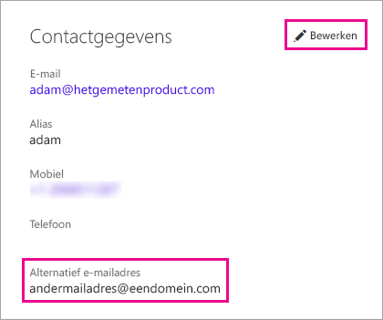

# <a name="using-an-alternate-email-address"></a>Een ander e-mailadres gebruiken

Wanneer u zich registreert voor Power BI, geeft u een e-mailadres op. Power BI gebruikt dit adres standaard voor het verzenden van updates over de activiteit in de service. Wanneer iemand u bijvoorbeeld een uitnodiging stuurt om iets te delen, wordt deze naar dit adres verzonden.

In sommige gevallen hebt u liever dat deze e-mailberichten naar een ander e-mailadres worden gestuurd dan het adres waarmee u zich hebt geregistreerd. In dit artikel wordt uitgelegd hoe u in Office 365 en PowerShell een ander adres opgeeft. In het artikel wordt ook uitgelegd hoe een e-mailadres wordt opgelost in Azure Active Directory (Azure AD).

> [!NOTE]
> Het opgeven van een ander adres heeft geen invloed op het e-mailadres dat door Power BI wordt gebruikt voor service-updates, nieuwsbrieven en andere commerciële berichten.  Deze berichten worden altijd verzonden naar het e-mailadres waarmee u zich hebt geregistreerd voor Power BI.

## <a name="use-office-365"></a>Office 365 gebruiken

Volg deze stappen als u een ander adres wilt opgeven in Office 365.

1. Open de [pagina Persoonlijke gegevens in Office 365](https://portal.office.com/account/#personalinfo). Als u wordt gevraagd u aan te melden, doet u dit met het e-mailadres en wachtwoord dat u voor Power BI gebruikt.

1. Selecteer in het menu links de optie **Persoonlijke gegevens**.

1. Selecteer in de sectie **Contactgegevens** de optie **Bewerken**.

    Als u uw gegevens niet kunt bewerken, betekent dit dat uw e-mailadres wordt beheerd door uw Office 365-beheerder. Neem contact op met uw beheerder om uw e-mailadres bij te werken.

    

1. Voer in het veld **Alternatief e-mailadres** het e-mailadres in waarnaar Power BI-updates voortaan moeten worden verzonden.

## <a name="use-powershell"></a>PowerShell gebruiken

Als u een ander adres in PowerShell wilt opgeven, gebruikt u de opdracht [Set-AzureADUser](/powershell/module/azuread/set-azureaduser/).

```powershell
Set-AzureADUser -ObjectId john@contoso.com -OtherMails "otheremail@somedomain.com"
```

## <a name="email-address-resolution-in-azure-ad"></a>E-adresomzetting in Azure AD

Wanneer u een insluittoken van Azure AD voor Power BI vastlegt, kunt u gebruikmaken van drie verschillende typen e-mailberichten:

* Het belangrijkste e-mailadres dat is gekoppeld aan een Azure AD-account van een gebruiker;

* Het e-mailadres UserPrincipalName (UPN);

* Het matrixkenmerk *ander e-mailadres*.

Power BI selecteert welk e-mailadres moet worden gebruikt op basis van deze volgorde:

1. Als het e-mailkenmerk in het Azure AD-gebruikersobject aanwezig is, gebruikt Power BI dat e-mailkenmerk als e-mailadres.

1. Als het UPN-e-mailadres *niet* behoort tot het domein **\*.onmicrosoft.com** (de gegevens na het symbool '@'), gebruikt Power BI dat e-mailkenmerk als e-mailadres.

1. Als het matrixkenmerk *ander e-mailadres* in het Azure AD-gebruikersobject aanwezig is, wordt het eerste e-mailadres in de lijst gebruikt (omdat dit kenmerk een lijst van e-mailadressen kan bevatten).

1. Als geen van de bovenstaande voorwaarden aanwezig zijn, wordt het UPN-adres gebruikt.

Hebt u nog vragen? [Misschien dat de Power BI-community het antwoord weet](http://community.powerbi.com/)

