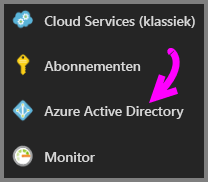
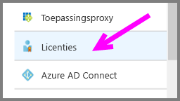
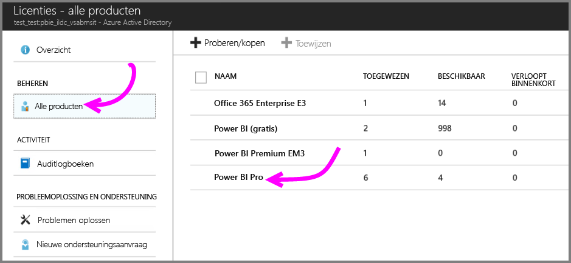
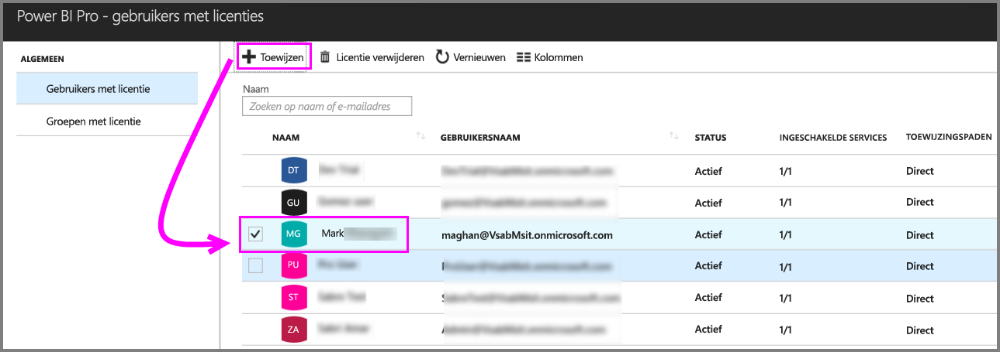

# Snelstart: Power BI Pro-licenties toewijzen in Azure

Power BI Pro is een afzonderlijke licentie waarmee toegang kan worden verkregen tot alle inhoud en mogelijkheden in de Power BI-service, inclusief de mogelijkheid voor het delen van inhoud en samenwerken met andere Pro-gebruikers. Alleen Pro-gebruikers kunnen inhoud naar app-werkruimten publiceren en deze inhoud gebruiken, dashboards delen en zich abonneren op dashboards en rapporten. In dit artikel wordt uitgelegd hoe u Power BI Pro-licenties in Azure kunt toewijzen. U kunt ook [licenties toewijzen in Office 365](service-admin-assigning-power-bi-pro-licenses.md).

## Vereisten

U moet eigenaar zijn van een Azure-abonnement dat in Power BI wordt gebruikt voor Active Directory-zoekacties.

U moet [ten minste één licentie kopen](service-admin-purchasing-power-bi-pro.md) voordat u begint.

## Licenties toewijzen aan afzonderlijke gebruikersaccounts

Voer de volgende stappen uit om Power BI Pro-licenties toe te wijzen aan afzonderlijke gebruikersaccounts:

1. Open [Azure Portal](https://ms.portal.azure.com/#@microsoft.onmicrosoft.com/dashboard/private/39bc3cf7-31a4-43f6-954c-f2d69ca2f0). 

2. Selecteer in de linkernavigatiebalk **Azure Active Directory**.

    

3. Selecteer onder **Azure Active Directory** de optie **Licenties**.

    

4. Selecteer onder **Licenties** de optie **Alle producten**. Selecteer vervolgens **Power BI Pro** om de lijst met gebruikers weer te geven die beschikken over een licentie.

    

5. Selecteer **Toewijzen** om een Power BI Pro-licentie toe te voegen aan een extra gebruikersaccount.

    

## Volgende stappen

Nu u licenties hebt toegewezen, kunt u meer te weten komen over Power BI Pro.

[Power BI Pro in uw organisatie](service-admin-power-bi-pro-in-your-organization.md)

[Power Bi-gebruikers zoeken die zich hebben aangemeld](service-admin-access-usage.md)

Nog vragen? [Misschien dat de Power BI-community het antwoord weet](https://community.powerbi.com/)