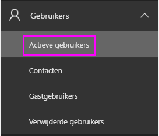
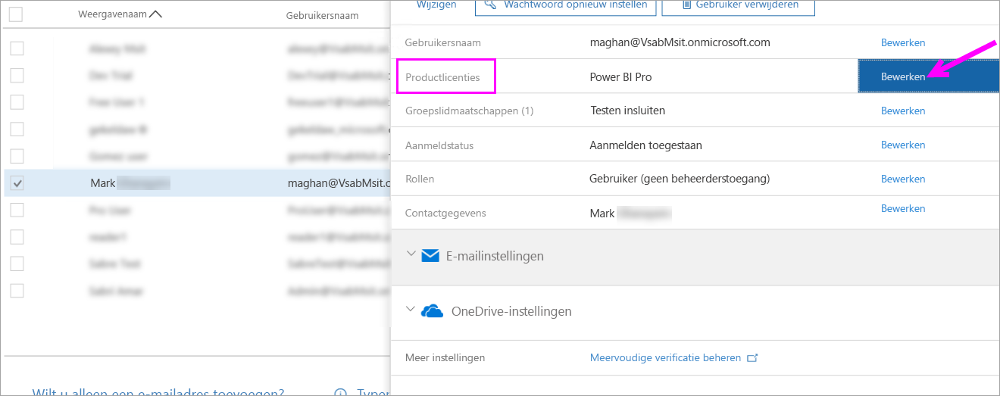
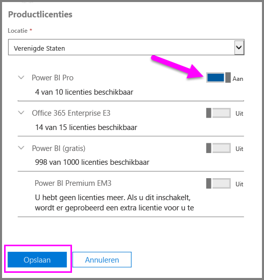
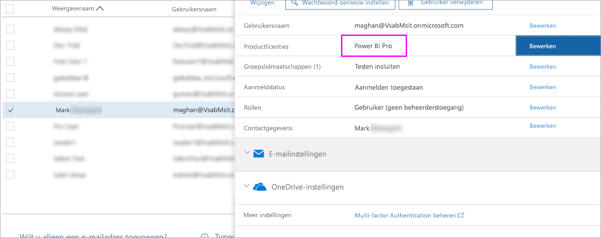

# Snelstart: Power BI Pro-licenties toewijzen in Office 365

Power BI Pro is een afzonderlijke licentie waarmee toegang kan worden verkregen tot alle inhoud en mogelijkheden in de Power BI-service, inclusief de mogelijkheid voor het delen van inhoud en samenwerken met andere Pro-gebruikers. Alleen Pro-gebruikers kunnen inhoud naar app-werkruimten publiceren en deze inhoud gebruiken, dashboards delen en zich abonneren op dashboards en rapporten. In dit artikel wordt uitgelegd hoe u Power BI Pro-licenties in Office 365 kunt toewijzen. U kunt ook [licenties toewijzen in Azure](service-admin-assigning-power-bi-pro-licenses-azure.md).

## Vereisten

U moet lid zijn van de rol [**Globale beheerder** of **Beheerder van gebruikersaccounts**](https://support.office.com/article/about-office-365-admin-roles-da585eea-f576-4f55-a1e0-87090b6aaa9d?ui=en-US&rs=en-US&ad=US) in Office 365.

U moet [ten minste één licentie kopen](service-admin-purchasing-power-bi-pro.md) voordat u begint.

## Licenties toewijzen aan afzonderlijke gebruikersaccounts

Voer de volgende stappen uit om Power BI Pro-licenties toe te wijzen aan afzonderlijke gebruikersaccounts:

1. Open het [Office 365-beheercentrum](https://portal.office.com/adminportal/home#/homepage).

2. Vouw **Gebruikers** uit in het linkernavigatiedeelvenster en selecteer **Actieve gebruikers**.

    

3. Selecteer een gebruiker en selecteer vervolgens **Bewerken** onder **Productlicenties**.

    

4. Zet de instelling onder **Power BI Pro** op **Aan** en selecteer vervolgens **Opslaan**.

    

5. Controleer onder **Status** voor het geselecteerde account of de Power BI Pro-licentie is toegewezen.

    

## Volgende stappen

Nu u licenties hebt toegewezen, kunt u meer te weten komen over Power BI Pro.

[Power BI Pro in uw organisatie](service-admin-power-bi-pro-in-your-organization.md)

[Power Bi-gebruikers zoeken die zich hebben aangemeld](service-admin-access-usage.md)

Nog vragen? [Misschien dat de Power BI-community het antwoord weet](https://community.powerbi.com/)