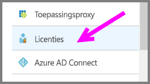
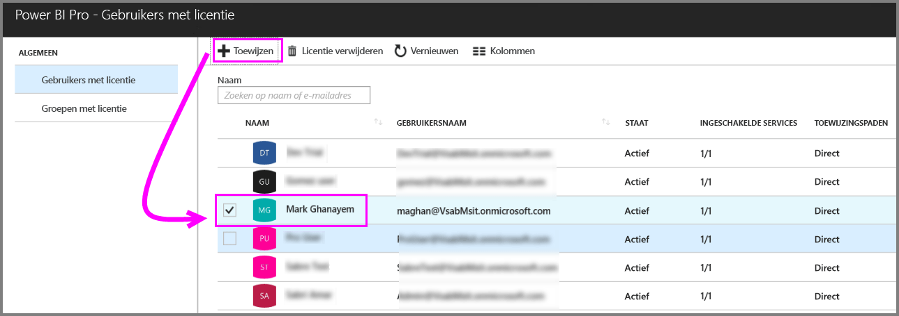
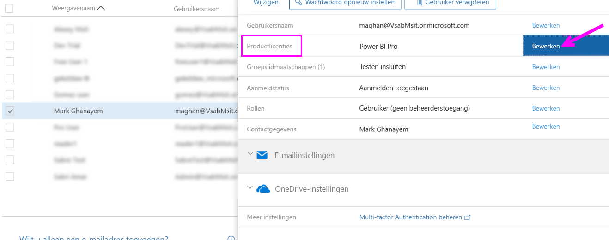
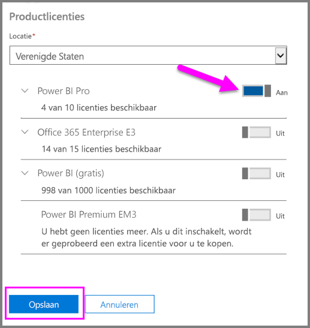
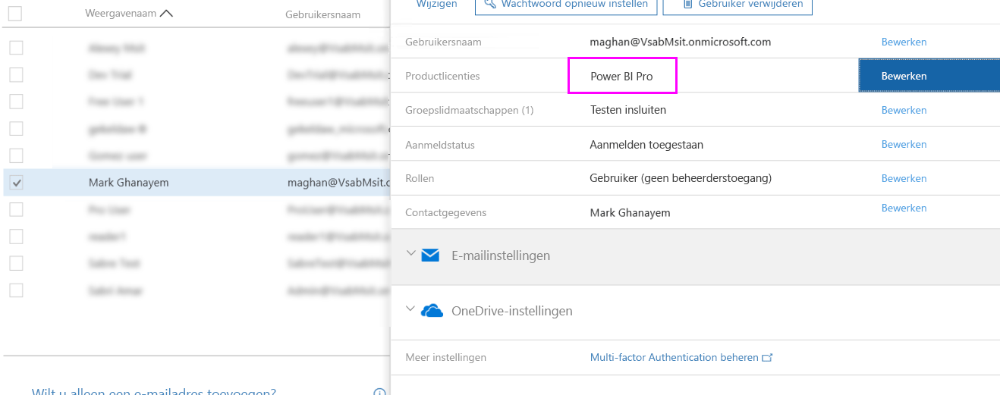

# Power BI Pro-licenties toewijzen

Beheerders kunnen kiezen uit diverse beheerportals en PowerShell-cmdlets om Power BI Pro-licenties aan gebruikers toe te wijzen. Power BI-licentiebeheer wordt ondersteund door Azure Active Directory (Azure AD).

* De eigenaren van een Azure-abonnement kunnen de Azure Active Directory-blade in [Azure Portal](https://ms.portal.azure.com/#@microsoft.onmicrosoft.com/dashboard/private/39bc3cf7-31a4-43f6-954c-f2d69ca2f0) gebruiken. 

* Globale beheerders en gebruikersaccountbeheerders kunnen gebruikmaken van het [Office 365-beheercentrum](https://portal.office.com/AdminPortal/Home#/homepage).

## Power BI Pro-licenties beheren in Azure Portal

Power BI maakt gebruik van Microsoft Azure Active Directory, dat als service een belangrijke rol speelt. Door Microsoft Azure Active Directory worden gebruikersaccounts en groepen opgeslagen, maar ook andere instellingen zoals informatie over aangeschafte producten.

### Licenties toewijzen aan afzonderlijke gebruikersaccounts

Voer de volgende stappen uit om Pro-licenties toe te wijzen aan afzonderlijke gebruikersaccounts als u eigenaar bent van een Azure-abonnement:

1. Navigeer naar [Azure Portal](https://ms.portal.azure.com/#@microsoft.onmicrosoft.com/dashboard/private/39bc3cf7-31a4-43f6-954c-f2d69ca2f0). 

2. Klik in de linkernavigatiebalk op Azure Active Directory.

    

3. Klik in de Azure Active Directory-blade op Licenties.

    

4. Klik in de blade Licenties op Alle producten en vervolgens op Power BI Pro om de lijst van gebruikers met een licentie weer te geven.

    

5. Klik op Toewijzen om een Power BI Pro-licentie toe te voegen aan een extra gebruikersaccount.

    

> [!NOTE]
> Hoewel de meeste aspecten van licenties kunnen worden beheerd, is het niet mogelijk om Power BI Pro-licenties aan te schaffen in Azure Portal. Gebruik het Office 365-beheercentrum om een Power BI Pro-abonnement te kopen. Zie [Purchasing Power BI Pro](https://docs.microsoft.com/en-us/power-bi/service-admin-purchasing-power-bi-pro) (Power BI Pro kopen) voor meer informatie.
>

## Power BI Pro-licenties beheren in het Office 365-beheercentrum

Als u een globale beheerder bent, kunt u in het Office 365-beheercentrum een Power BI Pro-abonnement aanschaffen en de bijbehorende licenties voor de organisatie beheren.

Voer de volgende stappen uit om Pro-licenties toe te wijzen aan afzonderlijke gebruikersaccounts als u een Office 365-beheerder bent:

1. Ga naar het Office 365-beheercentrum.

2. Vouw Gebruikers uit in het linkernavigatiedeelvenster en klik vervolgens op Actieve gebruikers.

    

3. Selecteer een of meerdere gebruikers en klik vervolgens op Productlicenties bewerken.

    

4. Zet de instelling onder Power BI Pro op Aan en klik vervolgens op Opslaan.

    

5. Controleer onder Status voor de geselecteerde accounts of de Power BI Pro-licentie is toegewezen.

    

> [!NOTE]
> Als uw abonnement geen licenties meer bevat, kunt u er meer toevoegen door Facturering uit te vouwen in het linkernavigatiedeelvenster en vervolgens op Abonnementen te klikken. Selecteer op de pagina Abonnementen het Power BI Pro-abonnement en klik vervolgens op Licenties toevoegen/verwijderen.
>

## Volgende stappen
[Power BI Pro in uw organisatie](service-admin-power-bi-pro-in-your-organization.md)
 
[De verlengde Pro-proefversie activeren](service-extended-pro-trial.md)
 
[Power BI-serviceovereenkomst voor afzonderlijke gebruikers](https://powerbi.microsoft.com/terms-of-service/)
 
[Aankondiging Power BI Premium](https://aka.ms/pbipremium-announcement)
 
[Power Bi-gebruikers zoeken die zich hebben aangemeld](service-admin-access-usage.md)

Nog vragen? [Misschien dat de Power BI-community het antwoord weet](https://community.powerbi.com/)